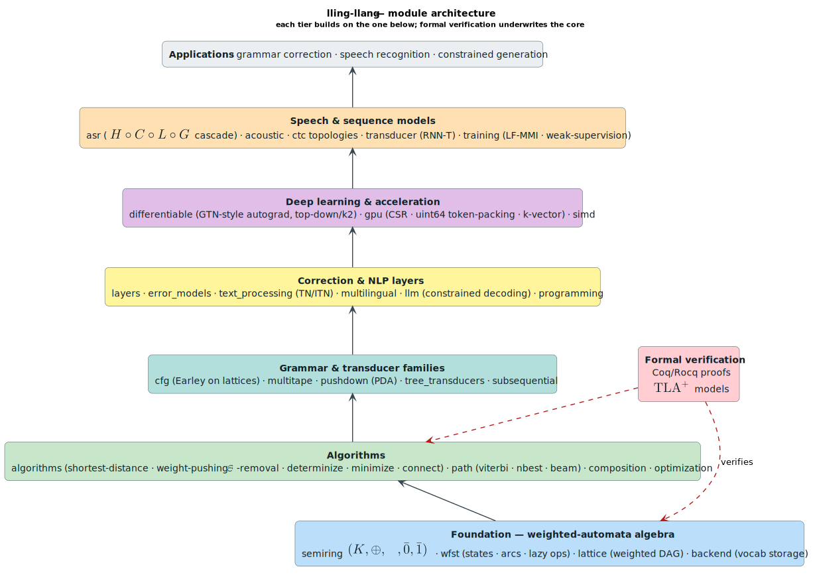

# Architecture

This is the **root entry point** to the architecture of **lling-llang**. It is a
map, not the territory: each tier below is summarized in one paragraph and links
into the in-depth guide. The full narrative — design principles, data flow,
performance characteristics, and worked examples — lives in
[`docs/architecture/overview.md`](docs/architecture/overview.md).

The organizing idea is a single algebraic abstraction. The library treats a
problem — spelling/grammar correction, speech decoding, text normalization,
constrained generation — as a search for the **best path through a weighted graph
of hypotheses**, and the **semiring** `(K, ⊕, ⊗, 0̄, 1̄)` lets the *same*
algorithm compute the shortest path, the most probable string, a reachability
set, or an expected gradient just by swapping the weight type. Symbols used here
are defined in [`docs/NOTATION.md`](docs/NOTATION.md).

Every tier is **generic over the semiring tier at the bottom**, and the
formal-verification suite underwrites the core. Data flows bottom-up.

*One color per tier (blue = foundation, green = algorithms, teal = transducer
families, amber = correction/NLP, purple = deep-learning/GPU, orange =
speech/ASR, red = verification); arrows show the bottom-up dependency.*

---

## Tiers

### Foundation — `semiring` · `wfst` · `lattice` · `backend`

The weight algebra and the automata/graph data structures everything else builds
on. `semiring` provides ~15 weight types (Tropical, Log, Probability, Boolean,
Expectation, Product, Lexicographic, `η`-power, String, …) behind one trait;
`wfst` is the general transducer with its rational operations (`A ∪ B`, `A · B`,
`A*`) and unary operations (invert, project, reverse); `lattice` is the weighted
DAG of hypotheses whose start→end paths are complete candidates; and `backend`
abstracts vocabulary storage (`HashMapBackend`, PathMap-backed).
→ [`docs/architecture/semirings.md`](docs/architecture/semirings.md),
[`docs/architecture/wfst-operations.md`](docs/architecture/wfst-operations.md),
[`docs/architecture/wfst-traits.md`](docs/architecture/wfst-traits.md),
[`docs/architecture/lattices.md`](docs/architecture/lattices.md),
[`docs/architecture/backends.md`](docs/architecture/backends.md).

### Algorithms — `algorithms` · `path` · `composition` · `optimization`

The generic WFST operations and path extraction. `path` extracts the best
path(s) — `viterbi`, `nbest` (top-`k`), `beam_search` — as special cases of the
**generalized single-source shortest-distance** algorithm; `algorithms` provides
weight pushing, `ε`-removal, `connect`, determinization, minimization, and
synchronization; `composition` lazily evaluates `A ∘ B` on demand to avoid
materializing the product; `optimization` prepares lattices for beam search
(log-pushing, look-ahead tables, n-gram builders). Complexity for acyclic
lattices is `O(∣V∣ + ∣E∣)`.
→ [`docs/algorithms/shortest-distance.md`](docs/algorithms/shortest-distance.md),
[`docs/algorithms/path-extraction.md`](docs/algorithms/path-extraction.md),
[`docs/algorithms/composition.md`](docs/algorithms/composition.md),
[`docs/advanced/beam-optimization.md`](docs/advanced/beam-optimization.md).

### Transducer families — `cfg` · `multitape` · `pushdown` · `tree_transducers` · `subsequential`

Beyond string-to-string transduction. `cfg` is an **Earley parser** run over a
*lattice* rather than a single string, intersecting a grammar with the hypothesis
space; `multitape` provides `k`-tape transducers with projection and
synchronization; `pushdown` provides weighted PDAs for context-free structure
(stack alphabet `Γ`, instantaneous descriptions `(q, w, γ)`); `tree_transducers`
provides ranked-alphabet tree-to-tree transduction; and `subsequential` provides
deterministic transducers with piecewise decomposition.
→ [`docs/algorithms/parsing.md`](docs/algorithms/parsing.md),
[`docs/transducers/multitape.md`](docs/transducers/multitape.md),
[`docs/transducers/pushdown.md`](docs/transducers/pushdown.md),
[`docs/transducers/tree-transducers.md`](docs/transducers/tree-transducers.md),
[`docs/advanced/subsequential-transducers.md`](docs/advanced/subsequential-transducers.md).

### Correction & NLP — `layers` · `error_models` · `text_processing` · `multilingual` · `llm` · `programming`

The application layers for correction, normalization, and generation. A
**correction layer** transforms a lattice (filtering paths or re-weighting arcs)
and layers compose into a pipeline; `error_models` provides edit-distance,
Damerau-Levenshtein, confusion-matrix (OCR/QWERTY), and homophone transducers;
`text_processing` performs text normalization (TN/ITN) over semiotic classes;
`multilingual` handles language-specific correction; `llm` performs
grammar-constrained decoding (token masking from a CFG/PDA/FSM); and
`programming` performs syntax-error repair and API-version migration.
→ [`docs/architecture/layers.md`](docs/architecture/layers.md),
[`docs/correction/error-models.md`](docs/correction/error-models.md),
[`docs/correction/text-normalization.md`](docs/correction/text-normalization.md),
[`docs/correction/multilingual.md`](docs/correction/multilingual.md),
[`docs/advanced/constrained-decoding.md`](docs/advanced/constrained-decoding.md),
[`docs/programming/syntax-repair.md`](docs/programming/syntax-repair.md).

### Deep learning & GPU — `differentiable` · `gpu` · `simd`

Gradients through WFSTs and acceleration-friendly layouts. `differentiable`
provides GTN-style automatic differentiation *through* WFST operations
(forward-score and Viterbi), WFST convolutional layers, and arc-posterior
gradients; `gpu` provides CPU-side data structures shaped for massively-parallel
decoding (CSR adjacency, lock-free uint64 token packing, k-vector atomic
reduction, mark-and-compact soft pruning) — these are GPU-**ready** layouts, with
CUDA/`wgpu` kernels a documented extension point; `simd` provides
vectorization-friendly structures.
→ [`docs/advanced/differentiable.md`](docs/advanced/differentiable.md),
[`docs/advanced/topdown-autograd.md`](docs/advanced/topdown-autograd.md),
[`docs/advanced/gpu-acceleration.md`](docs/advanced/gpu-acceleration.md),
[`docs/advanced/simd.md`](docs/advanced/simd.md),
[`docs/advanced/deep-learning.md`](docs/advanced/deep-learning.md).

### Speech & ASR — `asr` · `acoustic` · `ctc` · `transducer` · `training`

The speech-recognition stack. `asr` builds the canonical recognition network
`N = π(min(det(H ∘ C ∘ L ∘ G)))` (context-dependency builders, n-gram LMs with
back-off, subword lexicons, multi-pass rescoring); `acoustic` fuses neural
emission posteriors with the graph; `ctc` provides CTC topologies (`CorrectCtc`,
`CompactCtc`, `MinimalCtc`, `SelflessCtc`); `transducer` provides neural
transducers (RNN-T); and `training` provides sequence-discriminative objectives
(LF-MMI) and weak supervision from noisy transcripts.
→ [`docs/asr/cascade-construction.md`](docs/asr/cascade-construction.md),
[`docs/asr/subword-lexicon.md`](docs/asr/subword-lexicon.md),
[`docs/acoustic/overview.md`](docs/acoustic/overview.md),
[`docs/advanced/ctc-topologies.md`](docs/advanced/ctc-topologies.md),
[`docs/transducers/neural-transducer.md`](docs/transducers/neural-transducer.md),
[`docs/training/weak-supervision.md`](docs/training/weak-supervision.md).

### Verification — `proofs/` (Coq/Rocq + TLA⁺)

The machine-checked semantics and invariants that underwrite the foundation and
algorithm tiers. Every Coq/Rocq file builds with no `admit`/`Axiom`/`sorry`; the
TLA⁺ specs are model-checked with TLC and include deliberately-broken mutants
that must fail. Coq covers the semiring laws, WFST/path semantics, the weighted
language `L(A)` (with a full bidirectional accepting-path correspondence), and
partial-correctness specs for Viterbi / shortest-distance / determinization /
minimization. TLA⁺ covers `RRWM`, `LazyComposition` (cache/memory bounds), and
`CascadeOrder`. Run `make verify-proofs`.
→ [`proofs/README.md`](proofs/README.md),
[`proofs/doc/proof-status.md`](proofs/doc/proof-status.md).

---

## Cross-cutting concerns

- **Integration surfaces** — `liblevenshtein` / `libdictenstein` (fuzzy lexical
  correction; the `lattice` feature bridges `lling-llang` semirings into
  dictionary values), the F1R3FLY.io stack (PathMap/MORK), and external
  speech/NLP pipelines.
  → [`docs/integration/README.md`](docs/integration/README.md).
- **Feature flags** gate the optional integrations and layers; see the matrix in
  [`CONTRIBUTING.md`](CONTRIBUTING.md) and the authoritative list in
  [`Cargo.toml`](Cargo.toml).
- **Performance methodology** — the scientific optimization ledger lives in
  [`docs/optimization/journal.md`](docs/optimization/journal.md).

For the full architecture narrative — core design principles (algebraic
foundation, pluggable storage, layered processing, lazy evaluation), the
end-to-end data-flow walkthrough, and the performance-characteristics table —
read [`docs/architecture/overview.md`](docs/architecture/overview.md).
