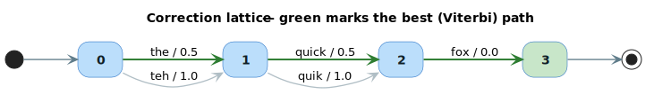
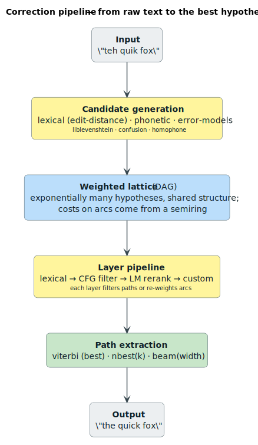
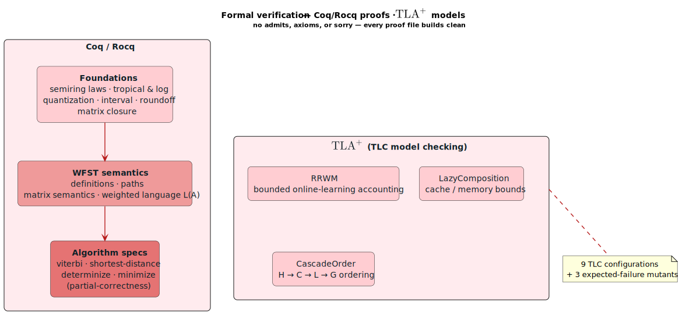

# lling-llang

[](LICENSE)
[](https://www.rust-lang.org)
[](proofs/)
[](#project-status)

> A pure-Rust, **semiring-generic** Weighted Finite-State Transducer (WFST) toolkit — spanning
> classical weighted-automata algorithms, automatic speech recognition, differentiable decoding,
> and constrained generation — built on a **machine-checked core** (Coq/Rocq proofs + TLA⁺ models).

`lling-llang` treats a problem — spelling/grammar correction, speech decoding, text normalization,
constrained LLM output — as a search for the **best path through a weighted graph of
hypotheses**. A single algebraic abstraction, the **semiring**, lets the *same* algorithm compute
the shortest path, the most probable string, a reachability set, or an expected gradient, just by
swapping the weight type. That is the idea the whole library is organized around.

---

## Highlights

- 🧮 **One algebra, many objectives.** ~15 semiring weight types (Tropical, Log, Probability,
  Boolean, Expectation, Product, Lexicographic, Power, …) drive shortest-path, probabilistic, and
  multi-objective search through identical code.
- 🔤 **Classical WFST algorithms** à la Mohri: composition, `ε`-removal, determinization,
  minimization, weight pushing, shortest-distance, synchronization — generic over the semiring.
- 🌳 **A transducer zoo:** lattices, multitape transducers, weighted pushdown automata (PDA), tree
  transducers, and subsequential transducers.
- 🎙️ **End-to-end speech recognition:** the `H ∘ C ∘ L ∘ G` cascade, CTC topologies, neural
  transducers (RNN-T), acoustic-model fusion, LF-MMI and weakly-supervised training.
- 🔬 **Differentiable & GPU-ready:** GTN-style autograd through WFST operations, and
  GPU-shaped data structures (CSR, lock-free token packing, k-vector reduction).
- ✍️ **Text & code tooling:** text normalization (TN/ITN), error models, grammar-constrained LLM
  decoding, and source-code syntax repair / API migration.
- ✅ **Formally verified foundations:** Coq/Rocq proofs of the semiring laws, WFST semantics, and
  algorithm specifications (no `admit`/`Axiom`), plus TLA⁺ models of the trickier protocols.

---

## Notation & glossary

These symbols and terms are used throughout; they are defined here once, before first use.

| Symbol / term                | Meaning                                                                                                                                                                       |
|------------------------------|-------------------------------------------------------------------------------------------------------------------------------------------------------------------------------|
| **WFST**                     | *Weighted Finite-State Transducer* — a finite automaton whose transitions carry an input label, an output label, and a weight.                                                |
| **WFSA**                     | *Weighted Finite-State Acceptor* — a WFST with `input = output` (no translation, just scoring).                                                                                 |
| **Semiring** `(K, ⊕, ⊗, 0̄, 1̄)` | A set `K` with two operations: `⊕` combines *alternative* paths, `⊗` combines *sequential* steps; `0̄` is the `⊕`-identity (“no path”), `1̄` the `⊗`-identity (“empty path”). |
| `ε` (epsilon)              | The empty label — a transition that consumes/emits nothing.                                                                                                                   |
| **DAG**                      | *Directed Acyclic Graph*.                                                                                                                                                     |
| **Lattice**                  | A weighted DAG whose start→end paths enumerate hypotheses (e.g. corrections of a sentence).                                                                                   |
| `∘`                        | *Composition* — chaining transducers so the output of one feeds the input of the next.                                                                                        |
| `H`, `C`, `L`, `G`               | The ASR cascade stages: **H**MM, **C**ontext-dependency, **L**exicon, **G**rammar/LM.                                                                                         |
| **Viterbi / N-best / beam**  | Path-extraction strategies: single best, top-*k*, and approximate top paths.                                                                                                  |
| **CTC**                      | *Connectionist Temporal Classification* — alignment-free sequence labeling.                                                                                                   |
| **RNN-T**                    | *Recurrent Neural-network Transducer* — streaming encoder–predictor–joiner model.                                                                                             |
| **LF-MMI**                   | *Lattice-Free Maximum Mutual Information* — a sequence-discriminative training objective.                                                                                     |
| **PDA**                      | *Pushdown Automaton* — a finite automaton with a stack (recognizes context-free languages).                                                                                   |
| **TN / ITN**                 | *Text Normalization* (“$5” → “five dollars”) and its **I**nverse (“five dollars” → “$5”).                                                                                     |

---

## Architecture at a glance

The library is layered: every tier is generic over the semiring tier at the bottom, and the
formal-verification suite underwrites the core.


| Tier                    | Modules                                                                                | Role                                                                       |
|-------------------------|----------------------------------------------------------------------------------------|----------------------------------------------------------------------------|
| **Foundation**          | `semiring` · `wfst` · `lattice` · `backend`                                            | The weight algebra and the automata/graph data structures.                 |
| **Algorithms**          | `algorithms` · `path` · `composition` · `optimization`                                 | Generic WFST operations and path extraction.                               |
| **Transducer families** | `cfg` · `multitape` · `pushdown` · `tree_transducers` · `subsequential`                | Beyond string-to-string: grammars, *k*-tape, stack, and tree transduction. |
| **Correction & NLP**    | `layers` · `error_models` · `text_processing` · `multilingual` · `llm` · `programming` | Application layers for correction, normalization, and generation.          |
| **Deep learning**       | `differentiable` · `gpu` · `simd`                                                      | Gradients through WFSTs and acceleration-friendly layouts.                 |
| **Speech**              | `asr` · `acoustic` · `ctc` · `transducer` · `training`                                 | The speech-recognition stack.                                              |
| **Verification**        | `proofs/` (Coq/Rocq + TLA⁺)                                                            | Machine-checked semantics and invariants.                                  |

---

## Core concepts

### Semirings — one algebra, many objectives

A **semiring** `(K, ⊕, ⊗, 0̄, 1̄)` equips a weight set `K` with two monoids that distribute. The trick
is that an algorithm written in terms of `⊕` and `⊗` computes a *different quantity* depending on which
semiring you instantiate it with:

| Semiring | `⊕` (combine alternatives) | `⊗` (combine in sequence) | `0̄` | `1̄` | Computes… |
|---|---|---|---|---|---|
| **Tropical** | `min` | `+` | `+∞` | `0` | shortest path (e.g. edit distance) |
| **Log** | `⊕ₗₒg` | `+` | `+∞` | `0` | total probability mass (in −log space) |
| **Probability** | `+` | `×` | `0` | `1` | probabilities directly |
| **Boolean** | `∨` (OR) | `∧` (AND) | `false` | `true` | reachability (is there *any* path?) |
| **Expectation** | `+` | `product-rule` | `(0, 0)` | `(1, 0)` | expected values / gradients |
| **Product** | `(⊕₁, ⊕₂)` | `(⊗₁, ⊗₂)` | `(0̄₁, 0̄₂)` | `(1̄₁, 1̄₂)` | two objectives at once |
| **Lexicographic** | `lex-min` | `(⊗₁, ⊗₂)` | `(0̄, 0̄)` | `(1̄, 1̄)` | tie-broken priorities |
| **String** | `longest common prefix` | `concatenation` | `∞` | `ε` | label accumulation |

where the **log-add** operator is  `x ⊕ₗₒg y = −ln(e⁻ˣ + e⁻ʸ)`.  Additional weight types ship in
the same module — `Count`, `Power` (η-power, for online learning), `Gödel`, `SignedTropical`
(rewards as negative costs), and set/edit-valued weights — see
[`docs/architecture/semirings.md`](docs/architecture/semirings.md).

```rust
use lling_llang::semiring::{Semiring, TropicalWeight};

let a = TropicalWeight::new(2.0);
let b = TropicalWeight::new(3.0);

let alternatives = a.plus(&b);   // min(2, 3) = 2   ← pick the cheaper branch
let in_sequence  = a.times(&b);  //     2 + 3 = 5   ← pay both costs
```

> **Why semirings?** Goodman's *Semiring Parsing* [[5]](#references) showed that recognition,
> derivation forests, Viterbi, *n*-best, and inside/outside probabilities are all the *same*
> deductive computation over different semirings. Mohri's *Weighted Automata Algorithms*
> [[3]](#references) extends this to the full suite of transducer operations. `lling-llang` is a
> direct, statically-typed embodiment of that insight.

### Lattices — weighted DAGs of hypotheses

A **lattice** is a weighted DAG whose nodes are positions in the input and whose arcs are scored
token alternatives. Each start→end path is one complete hypothesis. Lattices compactly represent
*exponentially many* alternatives through shared structure.



<details><summary>Plain-text view</summary>

```text
  (0) ──► (1) ──► (2) ──► (3)        (start = 0, final = 3)

  0 → 1 :  the / 0.5   |  teh / 1.0
  1 → 2 :  quick / 0.5 |  quik / 1.0
  2 → 3 :  fox / 0.0
```
</details>

```text
Total cost of a path  =  ⊗ of its arc weights  (Tropical ⊗ = +):
  the  quick fox  = 0.5 + 0.5 + 0.0 = 1.0   ← best  (Viterbi ⊕ = min)
  the  quik  fox  = 0.5 + 1.0 + 0.0 = 1.5
  teh  quick fox  = 1.0 + 0.5 + 0.0 = 1.5
  teh  quik  fox  = 1.0 + 1.0 + 0.0 = 2.0   (the uncorrected input)
```

Weights are **costs**: lower is better, and a dictionary/language model makes a plausible
correction cheaper than leaving an unlikely token in place.

### WFSTs & rational operations

The `wfst` module provides the general transducer with its **rational operations** — *union*
(`A ∪ B`), *concatenation* (`A · B`), and *Kleene closure* (`A*`) — and **unary operations** —
*invert*, *project* (keep input or output tape), and *reverse*. Larger systems are assembled by
lazily **composing** transducers (`A ∘ B`), evaluated on the fly to avoid materializing the full
product. See [[1]](#references), [[3]](#references) and
[`docs/architecture/wfst-operations.md`](docs/architecture/wfst-operations.md).

### Correction layers

A **correction layer** transforms a lattice — filtering paths or re-weighting arcs — and layers
compose into a pipeline. This is how spelling, grammar, and language-model knowledge stack up.



---

## Quick start

Add the crate (path or version) to your `Cargo.toml`:

```toml
[dependencies]
lling-llang = "0.1"
```

### A worked example

Build the lattice from the diagram above, then extract the best correction. *(This is the real API
— `add_correction`, `EdgeMetadata::{original, correction}`, `viterbi` returning `ViterbiResult`.)*

```rust
use lling_llang::lattice::{LatticeBuilder, EdgeMetadata};
use lling_llang::backend::HashMapBackend;
use lling_llang::semiring::TropicalWeight;
use lling_llang::path::viterbi;

let mut builder = LatticeBuilder::new(HashMapBackend::new());

// Position 0 → 1: the original token "teh" costs more than its correction "the".
builder.add_correction(0, 1, "teh", TropicalWeight::new(1.0), EdgeMetadata::original());
builder.add_correction(0, 1, "the", TropicalWeight::new(0.5), EdgeMetadata::correction(1));

// Position 1 → 2: likewise for "quik" vs. "quick".
builder.add_correction(1, 2, "quik",  TropicalWeight::new(1.0), EdgeMetadata::original());
builder.add_correction(1, 2, "quick", TropicalWeight::new(0.5), EdgeMetadata::correction(1));

// Position 2 → 3: "fox" is already correct (zero cost).
builder.add_correction(2, 3, "fox", TropicalWeight::new(0.0), EdgeMetadata::original());

let mut lattice = builder.build(3);          // 3 = final position
let result = viterbi(&mut lattice);

assert!(result.success);
assert_eq!(result.path.to_words(&lattice), vec!["the", "quick", "fox"]);
assert_eq!(result.path.weight.value(), 1.0); // 0.5 + 0.5 + 0.0
```

For alternatives, swap `viterbi` for `nbest(&mut lattice, k)` (top-*k*) or
`beam_search(&mut lattice, width)` (approximate, for large lattices).

### The one algorithm behind it

`viterbi` is a special case of the **generalized single-source shortest-distance** algorithm
(Mohri [[3]](#references)). Presented in literate style — the same loop computes *any* of the
objectives in the semiring table, because `⊕` and `⊗` are abstract:

We want, for every node `q`, the value `d[q]` = the `⊕`-combination over **all** start→`q` paths of
the `⊗`-product of their arc weights. Initialize the source to the empty-path weight `1̄` and everything
else to “no path yet”, `0̄`:

```text
d[start] ← 1̄
d[q]     ← 0̄          for every q ≠ start
```

Because a lattice is acyclic, visiting nodes in **topological order** guarantees that when we reach
`q`, `d[q]` is already final. We then *relax* each outgoing arc, pushing `q`'s value forward:

```text
for q in topological_order(G):
    for each arc  q ─[w]→ r:
        d[r] ← d[r] ⊕ (d[q] ⊗ w)          # combine this path in
```

The result `d[end]` is the answer; choosing the semiring chooses the question:

```text
Tropical (⊕ = min, ⊗ = +)   →  cost of the cheapest path        (Viterbi)
Log      (⊕ = log-add)       →  total probability mass of all paths (forward score)
Boolean  (⊕ = ∨, ⊗ = ∧)      →  is the end reachable at all?
```

To recover the *path* (not just its score), Viterbi additionally stores a back-pointer at each
relaxation and walks them back from `end`. Complexity is `O(∣V∣ + ∣E∣)` for acyclic lattices;
general (cyclic) inputs use a queue discipline and semiring-specific closure
(see [`docs/algorithms/shortest-distance.md`](docs/algorithms/shortest-distance.md)).

---

## What's inside — a capability tour

Each area links to its in-depth guide under [`docs/`](docs/).

### Classical WFST algorithms
Generic over the semiring, following Mohri [[3]](#references):
shortest-distance, **weight pushing**, **`ε`-removal**, **determinization**, **minimization**,
`connect` (trimming), and **synchronization** of label delay.
→ [`docs/algorithms/`](docs/algorithms/)

### Transducer families
- **`multitape`** — *k*-tape transducers with projection & synchronization.
- **`pushdown`** — weighted PDAs for context-free structure.
- **`tree_transducers`** — ranked-alphabet tree-to-tree transduction.
- **`subsequential`** — deterministic transducers with piecewise decomposition (Mohri [[2]](#references)).
- **`cfg`** — an **Earley parser** (Earley [[4]](#references)) adapted to run over a *lattice*
  rather than a single string, intersecting a grammar with the hypothesis space.
→ [`docs/architecture/`](docs/architecture/), [`docs/algorithms/parsing.md`](docs/algorithms/parsing.md)

### Automatic speech recognition
The canonical recognition network is the composed, optimized cascade
`N = π(min(det(H ∘ C ∘ L ∘ G)))` (Mohri, Pereira & Riley [[1]](#references)):


The stack also includes context-dependency builders (triphone/tetraphone), n-gram LMs with
back-off, subword (BPE) lexicons, dysfluency handling, pronunciation variants, and multi-pass
lattice rescoring. Acoustic integration (`acoustic`) fuses neural emission posteriors with the
graph. End-to-end front-ends include **CTC** (`ctc`) — the objective of Graves et al.
[[6]](#references), the WFST-based decoding of Miao et al. [[8]](#references), and the compact
topologies of Laptev et al. [[9]](#references) — and **neural transducers** (`transducer`, RNN-T,
Graves [[7]](#references)).
→ [`docs/advanced/asr-pipeline.md`](docs/advanced/asr-pipeline.md), [`docs/acoustic/overview.md`](docs/acoustic/overview.md)

### Training objectives
- **LF-MMI** sequence-discriminative training (Povey et al. [[11]](#references); Tian et al. [[14]](#references)).
- **Weak supervision** from noisy transcripts via bypass arcs (Gao et al. [[15]](#references)).
- **Pruned** composition for memory-bounded training.
→ [`docs/training/weak-supervision.md`](docs/training/weak-supervision.md)

### Differentiable & GPU-ready
- **`differentiable`** — automatic differentiation *through* WFST operations (forward-score and
  Viterbi), WFST convolutional layers, token-graph CTC variants, lexicon marginalization, and
  top-down (k2-style) arc-posterior gradients, following the GTN framework of Hannun et al.
  [[10]](#references).
- **`gpu`** — CPU-side data structures shaped for massively-parallel decoding: **CSR** adjacency,
  lock-free **uint64 token packing**, **k-vector** atomic reduction, and mark-and-compact soft
  pruning, following Braun et al. [[12]](#references). *(These are GPU-ready layouts; CUDA/`wgpu`
  kernels are a documented extension point, not yet shipped.)*
→ [`docs/advanced/differentiable.md`](docs/advanced/differentiable.md), [`docs/advanced/gpu-acceleration.md`](docs/advanced/gpu-acceleration.md)

### Text & code
- **`text_processing`** — TN/ITN over semiotic classes (cardinals, money, dates, …; Zhang et al. [[16]](#references)).
- **`error_models`** — edit-distance, Damerau-Levenshtein, confusion-matrix (OCR/QWERTY), and homophone transducers.
- **`llm`** — grammar-constrained decoding (token masking from a CFG/PDA/FSM) for LLM output.
- **`programming`** — syntax-error repair and automated API-version migration.

### Online learning
**RRWM** (Randomized Weighted-Majority over path experts) and the **`η`-power semiring** for online
ensemble learning, after Cortes, Kuznetsov, Mohri & Warmuth [[13]](#references).
→ [`docs/algorithms/rrwm.md`](docs/algorithms/rrwm.md), [`docs/architecture/power-semiring.md`](docs/architecture/power-semiring.md)

---

## Formal verification

The semantics that matter are **machine-checked**. Every Coq/Rocq file builds with *no* `admit`,
`Axiom`, or `sorry`; the TLA⁺ specs are model-checked with TLC and include deliberately-broken
mutants to prove the checks have teeth.



| Layer                     | What is proven                                                                                                                                                        |
|---------------------------|-----------------------------------------------------------------------------------------------------------------------------------------------------------------------|
| **Coq — foundations**     | Semiring laws; tropical & log weights; quantization, interval, and roundoff contracts; finite semiring matrix closure.                                                |
| **Coq — WFST semantics**  | WFST/state/transition definitions; accepting-path connectivity; adjacency-matrix semantics; the weighted language `L(A)` via duplicate-free path enumerations.          |
| **Coq — algorithm specs** | Partial-correctness specifications and Bellman-update lemmas for Viterbi, shortest-distance, determinization, and minimization.                                       |
| **TLA⁺ models**           | `RRWM` (bounded online-learning accounting), `LazyComposition` (cache/memory bounds), `CascadeOrder` (`H → C → L → G` ordering) — 9 TLC configs + 3 expected-failure mutants. |

Run everything from the repository root:

```bash
make verify-proofs            # all Rocq proofs + all TLC configurations + mutant checks
```

For the memory-intensive Rocq build, a resource-limited invocation is recommended:

```bash
systemd-run --user --scope -p MemoryMax=126G -p CPUQuota=1800% \
  -p IOWeight=30 -p TasksMax=200 make -C proofs/coq -j1
```

See [`proofs/README.md`](proofs/README.md) and [`proofs/doc/proof-status.md`](proofs/doc/proof-status.md).

---

## Installation & feature flags

The default build is a **standalone WFST framework with no external dependencies**. Optional
features pull in integrations and extra layers:

| Feature                                                | Enables                                                    |
|--------------------------------------------------------|------------------------------------------------------------|
| `levenshtein`                                          | Fuzzy lexical correction via `liblevenshtein`.             |
| `pcfg`                                                 | Probabilistic CFG support.                                 |
| `phonetic-rescore`                                     | Phonetic lattice rescoring (Zompist-style rules).          |
| `code-correction` / `latex-syntax` / `mathml-semantic` | Domain-specific correction layers.                         |
| `pos-tagging` / `lm-rerank`                            | POS-tagging and language-model reranking layers.           |
| `f1r3fly`                                              | Full F1R3FLY.io stack (PathMap, MORK, MeTTaIL, MeTTaTron). |
| `pathmap-backend` / `sexpr`                            | PathMap-backed storage; S-expression path format.          |
| `serde` / `bincode-ser`                                | Serialization.                                             |
| `test-utils`                                           | Property-test strategies & fixtures for downstream crates. |

```toml
[dependencies]
lling-llang = { version = "0.1", features = ["levenshtein", "serde"] }
```

See [`Cargo.toml`](Cargo.toml) for the complete, authoritative list.

---

## Documentation

Comprehensive guides live in [`docs/`](docs/) (start at [`docs/README.md`](docs/README.md)):

| Section                            | Contents                                                                                                                             |
|------------------------------------|--------------------------------------------------------------------------------------------------------------------------------------|
| [Architecture](docs/architecture/) | Semirings, lattices, WFST traits & operations, backends, layers.                                                                     |
| [Algorithms](docs/algorithms/)     | Path extraction, shortest-distance, pushing, `ε`-removal, determinization, minimization, composition, parsing, sampling, RRWM.         |
| [Advanced](docs/advanced/)         | CTC topologies, subsequential transducers, differentiable ops, top-down autograd, ASR pipeline, beam optimization, GPU acceleration. |
| [ASR & Acoustic](docs/asr/)        | Cascade construction, subword lexicons, acoustic-model integration.                                                                  |
| [Training](docs/training/)         | Weak supervision and discriminative objectives.                                                                                      |
| [Integration](docs/integration/)   | F1R3FLY.io ecosystem, liblevenshtein, external speech/NLP & text-correction pipelines.                                               |
| [API Reference](docs/api/)         | Per-trait reference for semirings, WFSTs, lattices, backends, paths, layers.                                                         |

---

## Benchmarking

A [Criterion](https://github.com/bheisler/criterion.rs) harness in
[`benches/core_benchmarks.rs`](benches/core_benchmarks.rs) measures semiring operations, lattice
algorithms, path extraction (Viterbi / N-best / beam), Earley parsing on lattices, CTC topologies,
and differentiable scoring:

```bash
cargo bench
```

---

## Project status

**Version 0.2.0 — early development.** The core (`semiring`, `wfst`, `lattice`, `algorithms`,
`path`, `cfg`, `composition`, `layers`) is stable and exercised by property tests and the formal
proofs. Several higher tiers are best understood as **library scaffolding** that you wire into your
own models rather than turnkey systems — notably `gpu` (GPU-ready data structures, no kernels yet),
`acoustic`, and `transducer` (integration surfaces for neural front-ends). Breaking changes may
occur before 1.0.

---

## References

*Every citation below has been checked; DOIs and arXiv identifiers resolve to the stated work.*

**Weighted automata & parsing foundations**
- **[1]** Mohri, M., Pereira, F., & Riley, M. (2002). *Weighted Finite-State Transducers in Speech Recognition.* Computer Speech & Language 16(1):69–88. [doi:10.1006/csla.2001.0184](https://doi.org/10.1006/csla.2001.0184)
- **[2]** Mohri, M. (1997). *Finite-State Transducers in Language and Speech Processing.* Computational Linguistics 23(2):269–311. [ACL J97-2003](https://aclanthology.org/J97-2003/)
- **[3]** Mohri, M. (2009). *Weighted Automata Algorithms.* In *Handbook of Weighted Automata*, pp. 213–254. Springer. [doi:10.1007/978-3-642-01492-5_6](https://doi.org/10.1007/978-3-642-01492-5_6)
- **[4]** Earley, J. (1970). *An Efficient Context-Free Parsing Algorithm.* Communications of the ACM 13(2):94–102. [doi:10.1145/362007.362035](https://doi.org/10.1145/362007.362035)
- **[5]** Goodman, J. (1999). *Semiring Parsing.* Computational Linguistics 25(4):573–605. [ACL J99-4004](https://aclanthology.org/J99-4004/)

**Speech & sequence models**
- **[6]** Graves, A., Fernández, S., Gomez, F., & Schmidhuber, J. (2006). *Connectionist Temporal Classification.* ICML '06:369–376. [doi:10.1145/1143844.1143891](https://doi.org/10.1145/1143844.1143891)
- **[7]** Graves, A. (2012). *Sequence Transduction with Recurrent Neural Networks.* [arXiv:1211.3711](https://arxiv.org/abs/1211.3711)
- **[8]** Miao, Y., Gowayyed, M., & Metze, F. (2015). *EESEN: End-to-End Speech Recognition using Deep RNN Models and WFST-based Decoding.* ASRU 2015. [doi:10.1109/ASRU.2015.7404790](https://doi.org/10.1109/ASRU.2015.7404790)
- **[9]** Laptev, A., Majumdar, S., & Ginsburg, B. (2022). *CTC Variations Through New WFST Topologies.* Interspeech 2022:1041–1045. [doi:10.21437/Interspeech.2022-10854](https://doi.org/10.21437/Interspeech.2022-10854)
- **[11]** Povey, D., Peddinti, V., Galvez, D., et al. (2016). *Purely Sequence-Trained Neural Networks for ASR Based on Lattice-Free MMI.* Interspeech 2016:2751–2755. [doi:10.21437/Interspeech.2016-595](https://doi.org/10.21437/Interspeech.2016-595)
- **[14]** Tian, J., Yu, J., Weng, C., Zou, Y., & Yu, D. (2022). *Integrating Lattice-Free MMI into End-to-End Speech Recognition.* [arXiv:2203.15614](https://arxiv.org/abs/2203.15614)
- **[15]** Gao, D., Liao, C., Liu, C., et al. (2025). *WST: Weakly Supervised Transducer for Automatic Speech Recognition.* [arXiv:2511.04035](https://arxiv.org/abs/2511.04035)

**Differentiable & GPU decoding**
- **[10]** Hannun, A., Pratap, V., Kahn, J., & Hsu, W.-N. (2020). *Differentiable Weighted Finite-State Transducers.* ICML 2020 (PMLR 119). [arXiv:2010.01003](https://arxiv.org/abs/2010.01003)
- **[12]** Braun, H., Luitjens, J., Leary, R., Kaldewey, T., & Galvez, D. (2020). *GPU-Accelerated Viterbi Exact Lattice Decoder for Batched Online and Offline Speech Recognition.* ICASSP 2020:7874–7878. [doi:10.1109/ICASSP40776.2020.9054099](https://doi.org/10.1109/ICASSP40776.2020.9054099)

**Online learning & text normalization**
- **[13]** Cortes, C., Kuznetsov, V., Mohri, M., & Warmuth, M. K. (2015). *On-Line Learning Algorithms for Path Experts with Non-Additive Losses.* COLT 2015, PMLR 40:424–447. [proceedings.mlr.press/v40/Cortes15](https://proceedings.mlr.press/v40/Cortes15.html)
- **[16]** Zhang, Y., Bakhturina, E., Gorman, K., & Ginsburg, B. (2021). *NeMo Inverse Text Normalization: From Development to Production.* [arXiv:2104.05055](https://arxiv.org/abs/2104.05055)

---

## License

Licensed under the **Apache License 2.0** — see [`LICENSE`](LICENSE), matching the
`license = "Apache-2.0"` field in [`Cargo.toml`](Cargo.toml).

## Contributing

Contributions are welcome. Please read the relevant [`docs/`](docs/) design notes before opening a
PR, keep new algorithms generic over the `Semiring` trait, and — for changes touching verified
semantics — run `make verify-proofs` so the proofs stay green.
