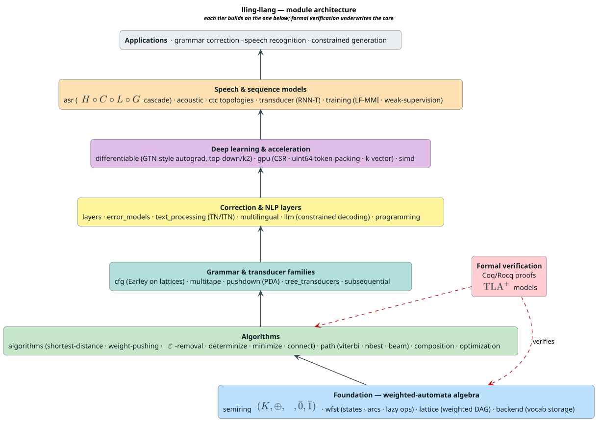

# lling-llang Documentation

Welcome to the documentation for **lling-llang**, a semiring-generic Weighted
Finite-State Transducer (WFST) framework for text normalization, grammar/code
correction, speech recognition, differentiable decoding, and constrained
generation.

## Quick Start

```rust
use lling_llang::prelude::*;

// Build a correction lattice
let backend = HashMapBackend::new();
let mut builder = LatticeBuilder::<TropicalWeight, _>::new(backend);

builder.add_correction(0, 1, "the", TropicalWeight::new(0.5), EdgeMetadata::original());
builder.add_correction(0, 1, "teh", TropicalWeight::new(0.0), EdgeMetadata::correction(1));

let mut lattice = builder.build(1);

// Find the best correction
let result = viterbi(&mut lattice);
if result.success {
    println!("Best: {:?}", result.path.to_words(&lattice));
}
```

## Conventions & reference

Read these first — they govern every doc and are the canonical references:

| Document | Description |
|----------|-------------|
| [Style guide](STYLE.md) | Authoring rules: MathJax-LaTeX math in GitHub `` $`…`$ ``/`math` delimiters, define-before-use, literate pseudocode, diagram embedding, citations |
| [Notation & glossary](NOTATION.md) | Every symbol ($`\oplus`$, $`\otimes`$, $`\bar{0}`$, $`\bar{1}`$, $`\circ`$, $`\pi`$, $`\eta`$, $`\infty`$, $`\varepsilon`$) and acronym (WFST, CTC, RNN-T, PDA, …), defined once — with the canonical Unicode → LaTeX map |
| [Bibliography](BIBLIOGRAPHY.md) | Citation-checked references with verified DOIs |
| [Diagramming conventions](diagrams/README.md) | Tool-per-concept matrix, color palette, and the `make diagrams` render pipeline |
| [Architecture](../ARCHITECTURE.md) · [Changelog](../CHANGELOG.md) · [Contributing](../CONTRIBUTING.md) | Repository-level entry points |

## Documentation sections

### Architecture

Core concepts and design of the framework:

| Document | Description |
|----------|-------------|
| [Overview](architecture/overview.md) | High-level architecture and component relationships |
| [Semirings](architecture/semirings.md) | Algebraic weight structures (Tropical, Log, Probability, String, Expectation, …) |
| [Dynamic Semirings](architecture/dynamic-semirings.md) | Safe host-defined weight algebras: capability negotiation, token ownership, lock-free callback admission, batching, and law validation |
| [Dynamic Lattices](architecture/dynamic-lattices.md) | Safe host-defined join/meet values: retained ownership, domain validation, nonblocking callback admission, bounded folds, and law probes |
| [Arctic / max-plus](architecture/semirings.md#arcticweight) | Maximum-score paths with gains, penalties, and explicit positive-cycle behavior |
| [Signed Tropical Semiring](architecture/signed-tropical-semiring.md) | Extended tropical semiring with negative weights (rewards) |
| [Power Semiring](architecture/power-semiring.md) | $`\eta`$-power semiring for soft path selection and online learning |
| [WFST Operations](architecture/wfst-operations.md) | Rational (union, concat, closure) and unary (invert, project, reverse) operations |
| [Lattices](architecture/lattices.md) | Weighted DAGs representing correction alternatives |
| [WFST Traits](architecture/wfst-traits.md) | Trait hierarchy for finite-state transducers |
| [Lazy WFST Lifecycle](architecture/lazy-wfst-lifecycle.md) | Exact expansion, retry, cancellation, snapshot, concurrency, and stack-safety semantics |
| [Backends](architecture/backends.md) | Storage abstraction and implementations |
| [Resource ABI](architecture/resource-abi.md) | The scalar-WFST binding layer: providers, capture-once snapshots, the lazy composition product, the registry, and the raw-u32 status wire |
| [Foreign-language bindings](bindings/README.md) | C, C++, JavaScript, TypeScript, and ClojureScript package guides, executable evidence, ownership laws, and documentation governance |
| [Layers](architecture/layers.md) | Correction-layer pipeline architecture |
| [Lattice Bridge](architecture/lattice-bridge.md) | Semiring↔lattice bridge: semirings as `libdictenstein` dictionary values |

### Algorithms

Core WFST algorithms (presented in literate-programming pseudocode):

| Document | Description |
|----------|-------------|
| [Path Extraction](algorithms/path-extraction.md) | Viterbi, N-best, and beam search |
| [Shortest Distance](algorithms/shortest-distance.md) | Single-source / all-pairs shortest distance with queue disciplines |
| [Weight Pushing](algorithms/weight-pushing.md) | Weight normalization for beam-search optimization |
| [Epsilon Removal](algorithms/epsilon-removal.md) | Remove $`\varepsilon`$-transitions from WFSTs |
| [Determinization](algorithms/determinization.md) | Non-deterministic → deterministic WFSTs |
| [Minimization](algorithms/minimization.md) | Minimize WFST states and transitions |
| [Synchronization](algorithms/synchronization.md) | Normalize input/output label delay |
| [Parsing](algorithms/parsing.md) | Earley parser over lattice input |
| [Composition](algorithms/composition.md) | Lazy FST and CFG composition operators |
| [Topological Sort](algorithms/topological-sort.md) | Kahn's algorithm for DAG ordering |
| [Path Sampling](algorithms/path-sampling.md) | Random path sampling for Monte-Carlo methods |
| [RRWM](algorithms/rrwm.md) | Rational Randomized Weighted-Majority for online ensemble learning |

### Transducer families

Automata beyond the basic WFST:

| Document | Description |
|----------|-------------|
| [Overview](transducers/README.md) | Comparison of the transducer families |
| [Multitape Transducers](transducers/multitape.md) | $`k`$-tape WFSTs $`T = (Q, \Sigma_1, \dots, \Sigma_k, q_0, F, E, \rho)`$ |
| [Pushdown Automata](transducers/pushdown.md) | Weighted PDAs $`P = (Q, \Sigma, \Gamma, q_0, Z_0, F, \Delta, \rho)`$ |
| [Tree Transducers](transducers/tree-transducers.md) | Weighted tree transducers $`T = (Q, \Sigma, \Delta, q_0, F, R, \rho)`$ |
| [Neural Transducer (RNN-T)](transducers/neural-transducer.md) | Encoder–predictor–joiner; the $`T \times U`$ alignment lattice |
| [Subsequential Transducers](advanced/subsequential-transducers.md) | Deterministic transducers with piecewise decomposition |

### Correction & NLP

WFST-based correction and natural-language tooling:

| Document | Description |
|----------|-------------|
| [Error Models](correction/error-models.md) | Edit-distance, confusion-matrix, and homophone transducers |
| [Multilingual](correction/multilingual.md) | Code-switching transducers and language identification |
| [Text Normalization (TN/ITN)](correction/text-normalization.md) | Semiotic-class normalization and its inverse |
| [Constrained Decoding](advanced/constrained-decoding.md) | Grammar-constrained LLM decoding (CFG→PDA→token mask) |
| [API Migration](programming/api-migration.md) | Automated code migration between API versions |
| [Syntax Repair](programming/syntax-repair.md) | WFST syntax-error recovery via a `ParserBackend` |

### Advanced features

Speech recognition, deep learning, and acceleration:

| Document | Description |
|----------|-------------|
| [CTC Topologies](advanced/ctc-topologies.md) | CTC graph structures (Correct, Compact, Minimal, Selfless) |
| [Differentiable Operations](advanced/differentiable.md) | Gradients through WFST operations |
| [Top-Down Autograd](advanced/topdown-autograd.md) | k2-style efficient gradients via arc posteriors |
| [Deep Learning Integration](advanced/deep-learning.md) | WFST layers, token graphs, lexicon marginalization |
| [ASR Pipeline](advanced/asr-pipeline.md) | Speech-recognition cascade $`H \circ C \circ L \circ G`$ |
| [Beam Optimization](advanced/beam-optimization.md) | Log-semiring pushing, lookahead, token grouping |
| [GPU Acceleration](advanced/gpu-acceleration.md) | CSR format, atomic recombination, batched streaming |
| [SIMD](advanced/simd.md) | Vectorized weight operations (AVX-512/AVX2/SSE/NEON) |

### Speech & acoustic

| Document | Description |
|----------|-------------|
| [Acoustic Overview](acoustic/overview.md) | `AcousticModel` trait, transition matrices, score fusion |
| [Cascade Construction](asr/cascade-construction.md) | Full ASR cascade $`N = \pi(\min(\det(H \circ C \circ L \circ G)))`$ |
| [Subword Lexicon](asr/subword-lexicon.md) | BPE/subword lexicon builder for ASR |

### Training

| Document | Description |
|----------|-------------|
| [Weak Supervision](training/weak-supervision.md) | Training with noisy transcripts (bypass arcs) and LF-MMI |

### Optimization

Specialized WFST optimizations. *(The scientific benchmark journal and the
phase-by-phase implementation ledger are frozen historical records — see
[Archive](#archive) below.)*

| Document | Description |
|----------|-------------|
| [Lookahead Tables](optimization/lookahead.md) | Pushing reachable weight to a pruning frontier |
| [N-gram Back-off](optimization/ngram-backoff.md) | Back-off $`P(w \mid h) = \lambda \cdot \hat{P}(w \mid h) + (1 - \lambda) \cdot P(w \mid h')`$ |
| [Token Grouping](optimization/token-grouping.md) | LET-Decoder lazy-evaluation token grouping |
| [Categorical Optimizer Contract](optimization/categorical-optimizer-contract.md) | Typed morphisms, exact rewrite witnesses, fibers, local monoids, ownership boundaries, and performance consequences |
| [Plan, Concurrency, and Provenance](optimization/plan-and-provenance.md) | Rank-certified DAG syntax, stack-safe wavefront execution, budgets, cancellation, ordered commit, and publication |
| [Formal Verification](optimization/formal-verification.md) | Rocq, TLA+/TLC, Z3, and Kani evidence with finite bounds, negative controls, and reproduction |
| [Certified Strong Bisimulation](optimization/certified-strong-bisimulation-contract.md) | Validated labelled semantics, Valmari refinement, replay certificates, modal witnesses, canonical output, stack safety, resource bounds, and 83 traced obligations |
| [libcpg Dataflow, Graph, and Assurance Contract](optimization/libcpg-assurance-contract.md) | Lawful llattice v2 migration, exact libvgraph quotient semantics, stack/work bounds, and independently bound assurance evidence |
| [libcpg Manifest and Durable-Fact Contract](optimization/libcpg-manifest-fact-contract.md) | Exact extractor manifests, durable fact identities, dense-index correspondence, source evidence, deterministic exports, cache invalidation, and adapter ownership |
| [Provider-Neutral Boundary Contract](optimization/provider-boundary-contract.md) | Canonical artifact identity, non-promoting provider results, limitation propagation, independent guarantees, native ownership, and the optional one-way libcpg-to-lling-llang public-API boundary |
| [Neutral Vinary Foundation Contract](optimization/neutral-vinary-foundation-contract.md) | RegresSpec-driven ownership, canonical/schema/content identity, neutral graphs, runtime and assurance gates, stack-safe concurrency, and 77 formally traced pre-implementation obligations |

### Archive

Frozen, dated scientific records preserved in their original notation — see
[`archive/README.md`](archive/README.md):

| Document | Description |
|----------|-------------|
| [Optimization Journal](archive/journal.md) | Scientific benchmark ledger (hypotheses, results, post-mortems) |
| [Implementation Ledger](archive/implementation-ledger/index.md) | Phase-by-phase implementation record (phases 1–7) |
| [Industry-Standard & SOTA Review](archive/industry-standard-and-sota-review.md) | Point-in-time optimization / state-of-the-art review |

### Layers

Correction-layer implementations:

| Document | Description |
|----------|-------------|
| [Code Correction: Overview](layers/code-correction/overview.md) · [Syntax Recovery](layers/code-correction/syntax-recovery.md) · [Pattern-Aware](layers/code-correction/pattern-aware.md) · [Configuration](layers/code-correction/configuration.md) | Pattern-aware code correction for Python, Rust, Rholang, MeTTa |
| [LaTeX: Overview](layers/latex/overview.md) · [Grammar](layers/latex/grammar.md) · [Repair](layers/latex/repair.md) · [Validator](layers/latex/validator.md) | LaTeX syntax correction (CFG filtering, brace/math-mode validation) |
| [MathML: Overview](layers/mathml/overview.md) · [Checker](layers/mathml/checker.md) · [Homoglyph](layers/mathml/homoglyph.md) · [Types](layers/mathml/types.md) | Content-MathML semantic type checking and homoglyph disambiguation |

### Integration guides

| Document | Description |
|----------|-------------|
| [Integration Overview](integration/README.md) | Index + the external-repository link convention |
| [liblevenshtein: Overview](integration/liblevenshtein/overview.md) · [Dictionaries](integration/liblevenshtein/dictionaries.md) · [Fuzzy Collections](integration/liblevenshtein/fuzzy-collections.md) · [Transducers](integration/liblevenshtein/transducers.md) · [Integration](integration/liblevenshtein/lling-llang-integration.md) | Levenshtein automata and fuzzy lookup |
| [libgrammstein: Phonetic Rescoring](integration/libgrammstein/phonetic-rescore.md) | Phonetic lattice rescoring with Zompist rules |
| [F1R3FLY.io: Vision](integration/f1r3fly/vision.md) · [PathMap](integration/f1r3fly/pathmap-backend.md) · [MeTTaIL](integration/f1r3fly/mettail-layer.md) · [MORK](integration/f1r3fly/mork-layer.md) · [MeTTaTron](integration/f1r3fly/mettatron-layer.md) · [Rholang](integration/f1r3fly/rholang-layer.md) | Distributed correction over the F1R3FLY stack |
| [External: Speech/NLP](integration/external/speech-nlp.md) · [Text Correction](integration/external/text-correction.md) · [Library Usage](integration/external/library-usage.md) | Integrating lling-llang into external systems |
| [libcpg Integration and Migration](integration/external/libcpg.md) | Formal-first migration sequence, trait compatibility, graph adoption, assurance-ready reports, concurrency, and required-red properties |

### Security

| Document | Description |
|----------|-------------|
| [ABI Trust Model](security/abi-trust-model.md) | Foreign scalar-WFST providers as untrusted input: validation duties, the F1 case study, panic containment, threading trust, residual assumptions |
| [Optimizer and ABI Contracts](security/optimizer-abi-contracts.md) | Threat model for tape compatibility, exactness claims, plan cycles, deterministic commit, budgets, cancellation, retains, and opaque ABI v1 layout |
| [libcpg Evidence Trust Model](security/libcpg-evidence-trust-model.md) | Five-coordinate freshness, result-digest framing, trust/independence, rejection semantics, resource safety, and audit evidence |
| [libcpg Manifest and Fact-Identity Trust Model](security/libcpg-manifest-trust-model.md) | Identity substitution, tombstone and dense-index integrity, exact source evidence, cache non-promotion, deterministic publication, and bounded decoding controls |
| [Provider Boundary Trust Model](security/provider-boundary-trust-model.md) | Provider-neutral exactness authority, control-domain independence, stale identity rejection, cache isolation, ownership, and dependency threats |

### Release engineering

| Document | Description |
|----------|-------------|
| [Release operations](releasing.md) | Immutable release-branch tagging, exact dependency graph, validate-only evidence, single-registry dispatch, npm promotion, and failure recovery |

### API reference

| Document | Description |
|----------|-------------|
| [C ABI Reference](api/c-abi-reference.md) | The 61-function `lling_*` C ABI: dynamic algebra consumers, WFST/resource operations, typed metadata, cancellation, statuses, ownership, threading, and complexity |
| [Semiring Reference](api/semiring-reference.md) | `Semiring`, `DivisibleSemiring`, `StarSemiring` |
| [WFST Reference](api/wfst-reference.md) | `Wfst`, `MutableWfst`, `LazyWfst` |
| [Lattice Reference](api/lattice-reference.md) | `Lattice`, `LatticeBuilder`, `EdgeMetadata` |
| [Backend Reference](api/backend-reference.md) | `LatticeBackend`, `HashMapBackend` |
| [Path Reference](api/path-reference.md) | `viterbi`, `nbest`, `beam_search` |
| [Layer Reference](api/layer-reference.md) | `CorrectionLayer`, `LayerPipeline` |

## Feature flags

| Feature | Description |
|---------|-------------|
| `default` | Standalone WFST framework, no external dependencies |
| `levenshtein` | Integration with liblevenshtein for lexical correction |
| `lattice` | Semiring↔lattice bridge (`lling-llang` semirings as `libdictenstein` dictionary values) |
| `lattice-persistent` | serde-bounded dictionary values for disk-backed (`persistent-artrie`) dictionaries |
| `pcfg` | *(reserved — no effect yet)* Probabilistic context-free grammar support |
| `error-grammar` | *(reserved — no effect yet)* Predefined error grammars |
| `pos-tagging` | POS-tagging correction layer |
| `lm-rerank` | Language-model reranking layer |
| `phonetic-rescore` | Phonetic rescoring layer (requires `levenshtein`) |
| `code-correction` | Pattern-aware code syntax-recovery layer |
| `latex-syntax` | LaTeX syntax-correction layer |
| `mathml-semantic` | MathML semantic / homoglyph layer |
| `f1r3fly` | F1R3FLY.io integration surface: PathMap backend + MeTTaIL type layer (MORK/MeTTaTron are roadmap — see [integration/f1r3fly](integration/f1r3fly/vision.md)) |
| `sexpr` | *(reserved — no effect yet)* S-expression path format for MORK compatibility |
| `pathmap-backend` | PathMap-optimized lattice backend |
| `serde` | Serialization support |
| `test-utils` | Expose the `test_utils` module (proptest strategies, fixtures) downstream |

## Architecture overview



<details><summary>Text view</summary>

```text
┌─────────────────────────────────────────────────────────────────────────┐
│                        Correction Layer Stack                           │
├─────────────────────────────────────────────────────────────────────────┤
│  Layer N: [User-Defined]           ← Implement CorrectionLayer trait    │
│     ↑                                                                   │
│  Layer 3: CFG Grammar              ← Syntactic filtering                │
│     ↑                                                                   │
│  Layer 1: Lexical Correction       ← Levenshtein + phonetic candidates  │
│     ↑                                                                   │
│  [Input Lattice]                                                        │
└─────────────────────────────────────────────────────────────────────────┘
```

</details>

## Learning path

**New to WFSTs?**
1. [Semirings](architecture/semirings.md) — the algebraic foundation
2. [Lattices](architecture/lattices.md) — weighted DAGs
3. [Path Extraction](algorithms/path-extraction.md) — finding optimal paths
4. [Layers](architecture/layers.md) — building correction pipelines

**Working with WFST algorithms?**
1. [WFST Operations](architecture/wfst-operations.md) → 2. [Shortest Distance](algorithms/shortest-distance.md) → 3. [Weight Pushing](algorithms/weight-pushing.md) → 4. [Determinization](algorithms/determinization.md) → 5. [Minimization](algorithms/minimization.md)

**Building speech recognition?**
1. [CTC Topologies](advanced/ctc-topologies.md) → 2. [ASR Pipeline](advanced/asr-pipeline.md) → 3. [Cascade Construction](asr/cascade-construction.md) → 4. [Acoustic Overview](acoustic/overview.md) → 5. [Subword Lexicon](asr/subword-lexicon.md) → 6. [Beam Optimization](advanced/beam-optimization.md) → 7. [GPU Acceleration](advanced/gpu-acceleration.md)

**Integrating with deep learning?**
1. [Differentiable Operations](advanced/differentiable.md) → 2. [Top-Down Autograd](advanced/topdown-autograd.md) → 3. [Deep Learning Integration](advanced/deep-learning.md) → 4. [Weak Supervision](training/weak-supervision.md)

**Exploring transducer families?**
1. [Overview](transducers/README.md) → 2. [Multitape](transducers/multitape.md) → 3. [Pushdown](transducers/pushdown.md) → 4. [Tree Transducers](transducers/tree-transducers.md) → 5. [Neural Transducer](transducers/neural-transducer.md)

**Building code-correction systems?**
1. [Code Correction Overview](layers/code-correction/overview.md) → 2. [Syntax Recovery](layers/code-correction/syntax-recovery.md) → 3. [Pattern-Aware](layers/code-correction/pattern-aware.md) → 4. [Configuration](layers/code-correction/configuration.md)
