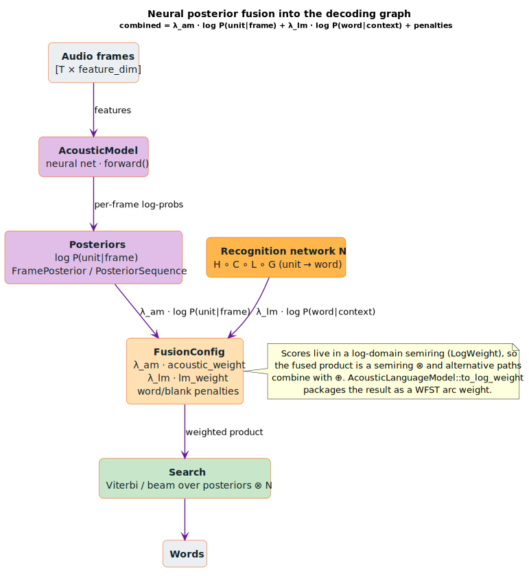

# Acoustic Model Integration

Integrating neural acoustic models with **WFST** (Weighted Finite-State
Transducer)-based speech recognition. **ASR** = Automatic Speech Recognition;
**HMM** = Hidden Markov Model; **CTC** = Connectionist Temporal Classification;
**MFCC** = Mel-Frequency Cepstral Coefficients.

## What is an Acoustic Model?

An acoustic model maps audio features to probability distributions over speech
units (phonemes, characters, or subwords). In the ASR cascade
$`H \circ C \circ L \circ G`$, the acoustic model supplies the **emission** probabilities
$`P(\text{unit} \mid \text{frame})`$ that drive decoding; `FusionConfig` weights them against the
language-model score and the weighted product is searched for the best word
sequence.



*Purple = the neural acoustic stage (`AcousticModel::forward` → `FramePosterior` / `PosteriorSequence`); orange = the recognition network $`N`$ and `FusionConfig`; green = search. The fused arc weight is $`\text{combined} = \lambda_{am} \cdot \log P(\text{unit} \mid \text{frame}) + \lambda_{lm} \cdot \log P(\text{word} \mid \text{context}) + \text{penalties}`$.*

<details><summary>Text view</summary>

```text
┌─────────────────────────────────────────────────────────────────────────────┐
│                      Acoustic Model in ASR Cascade                           │
├─────────────────────────────────────────────────────────────────────────────┤
│                                                                             │
│   Audio → Features → Acoustic Model → Posteriors → Decoder → Text          │
│                                                                             │
│   ┌────────┐  ┌──────────┐  ┌────────────┐  ┌──────────┐  ┌──────────┐    │
│   │        │  │ MFCC /   │  │  Neural    │  │ log P(u) │  │ Compose  │    │
│   │ Audio  │──│Filterbank│──│  Network   │──│ per frame│──│  H∘C∘L∘G │    │
│   │        │  │          │  │            │  │          │  │          │    │
│   └────────┘  └──────────┘  └────────────┘  └──────────┘  └──────────┘    │
│                                                                             │
│   Components:                                                               │
│     H = HMM transducer (acoustic model topology)                           │
│     C = Context-dependency (triphone/tetraphone)                           │
│     L = Pronunciation lexicon (word → phones)                              │
│     G = Grammar (n-gram language model)                                    │
│                                                                             │
└─────────────────────────────────────────────────────────────────────────────┘
```

</details>

## AcousticModel Trait

The core interface for acoustic models in lling-llang.

```rust
pub trait AcousticModel: Send + Sync {
    /// Input feature dimension (e.g., 40 for filterbank)
    fn feature_dim(&self) -> usize;

    /// Number of output units (phonemes, characters, senones)
    fn num_units(&self) -> usize;

    /// Compute log posteriors for input frames
    /// Input: [T, feature_dim]
    /// Output: [T, num_units]
    fn forward(&self, frames: &[Vec<f32>]) -> Vec<Vec<f32>>;

    /// Process sequence (default: same as forward)
    fn forward_sequence(&self, frames: &[Vec<f32>]) -> Vec<Vec<f32>> {
        self.forward(frames)
    }

    /// HMM topology (optional)
    fn transition_matrix(&self) -> Option<&TransitionMatrix> { None }

    /// CTC blank token ID (optional)
    fn blank_id(&self) -> Option<UnitId> { None }

    /// Unit name for debugging (optional)
    fn unit_name(&self, unit: UnitId) -> Option<String> { None }
}
```

## Output Unit Types

| Model Type | Output Units | Description |
|------------|--------------|-------------|
| **Hybrid HMM-DNN** | Senones | Tied HMM states (~4000-8000) |
| **CTC** | Characters + blank | Alphabet + blank token |
| **Attention** | Subwords | BPE or SentencePiece tokens |

## TransitionMatrix

Defines HMM state transitions for hybrid models.

### Structure

```rust
pub struct TransitionMatrix {
    transitions: Vec<Vec<(HmmStateId, f32)>>,  // From state → [(to, log_prob)]
    initial_probs: Vec<f32>,                   // log P(start in state)
    final_states: HashSet<HmmStateId>,         // Accepting states
}
```

### Common Topologies

```
┌─────────────────────────────────────────────────────────────────────────────┐
│                           HMM Topologies                                     │
├─────────────────────────────────────────────────────────────────────────────┤
│                                                                             │
│   Left-to-Right (standard):                                                 │
│                                                                             │
│      ┌──┐    ┌──┐    ┌──┐                                                  │
│   ──►│S0│───►│S1│───►│S2│───►                                              │
│      └┬─┘    └┬─┘    └┬─┘                                                  │
│       │       │       │                                                     │
│       └───────┴───────┴── (self-loops)                                     │
│                                                                             │
│   Bakis (with skip):                                                        │
│                                                                             │
│      ┌──┐    ┌──┐    ┌──┐                                                  │
│   ──►│S0│───►│S1│───►│S2│───►                                              │
│      └┬─┘    └┬─┘    └┬─┘                                                  │
│       │  ╲    │  ╲    │                                                    │
│       │   ╲   │   ╲   │                                                    │
│       │    ►──┴────►──┘  (skip transitions)                                │
│       └───────┴───────┴── (self-loops)                                     │
│                                                                             │
└─────────────────────────────────────────────────────────────────────────────┘
```

### Creating Transitions

```rust
use lling_llang::acoustic::TransitionMatrix;

// Simple 3-state left-to-right HMM
let transitions = TransitionMatrix::left_to_right(3, 0.5);
// self_loop_prob = 0.5, forward_prob = 0.5

// Bakis model with skip transitions
let transitions = TransitionMatrix::bakis(
    5,    // num_states
    0.6,  // self_prob
    0.3,  // forward_prob (skip = 1 - self - forward)
);

// Manual construction
let mut transitions = TransitionMatrix::new(3);
transitions.set_initial(0, 0.0);  // log(1.0) = 0
transitions.add_transition(0, 0, (-0.5_f32).ln());  // self-loop
transitions.add_transition(0, 1, (-0.5_f32).ln());  // forward
transitions.add_transition(1, 1, (-0.5_f32).ln());
transitions.add_transition(1, 2, (-0.5_f32).ln());
transitions.set_final(2, true);
```

### Querying Transitions

```rust
// Get transitions from state 0
let from_0 = transitions.transitions_from(0);
for (to_state, log_prob) in from_0 {
    println!("0 → {}: log_prob = {}", to_state, log_prob);
}

// Check initial/final states
let initials = transitions.initial_states();  // [0]
let finals = transitions.final_states();      // [2]
```

## FusionConfig

Configures how acoustic and language model scores are combined.

```rust
pub struct FusionConfig {
    /// Weight for acoustic model scores (default: 1.0)
    pub acoustic_weight: f64,

    /// Weight for language model scores (default: 0.5)
    pub lm_weight: f64,

    /// Penalty for word insertions (default: 0.0)
    pub word_insertion_penalty: f64,

    /// Penalty for CTC blank emissions (default: 0.0)
    pub blank_penalty: f64,
}
```

### Score Combination

The fused score combines the weighted acoustic and language-model log-probabilities
with penalties — where $`\lambda_{am}`$ is `acoustic_weight`, $`\lambda_{lm}`$ is
`lm_weight`, and the penalties are the `word_insertion_penalty` and `blank_penalty`
fields of `FusionConfig`:

```math
\text{combined\_score} = \lambda_{am} \times \log P(\text{obs} \mid \text{state}) + \lambda_{lm} \times \log P(\text{word} \mid \text{context}) + \text{penalties}
```

### Configuration

```rust
use lling_llang::acoustic::FusionConfig;

let config = FusionConfig {
    acoustic_weight: 1.0,           // Full AM contribution
    lm_weight: 0.5,                 // Half LM contribution
    word_insertion_penalty: -0.5,   // Penalize short hypotheses
    blank_penalty: 0.0,             // No blank penalty (CTC)
};

// Or use defaults
let config = FusionConfig::default();
```

## AcousticLanguageModel

Wrapper that combines acoustic and language models with configured fusion.

```rust
use lling_llang::acoustic::{AcousticModel, AcousticLanguageModel, FusionConfig};
use std::sync::Arc;

// Create combined model
let acoustic: Arc<dyn AcousticModel> = load_acoustic_model();
let language: Arc<dyn LanguageModel> = load_language_model();

let config = FusionConfig {
    acoustic_weight: 1.0,
    lm_weight: 0.5,
    ..Default::default()
};

let combined = AcousticLanguageModel::new(acoustic, language, config);

// Access components
let am = combined.acoustic();
let lm = combined.language();
let cfg = combined.config();

// Forward through acoustic model
let posteriors = combined.acoustic_forward(&features);

// Weight scores
let weighted_am = combined.weight_acoustic(-2.0);    // 1.0 × -2.0 = -2.0
let weighted_lm = combined.weight_lm(-1.0);          // 0.5 × -1.0 = -0.5

// Combine scores
let combined_score = combined.combine_scores(-2.0, -1.0);  // -2.5

// Convert to WFST weight
let weight: LogWeight = combined.to_log_weight(-2.0, -1.0);
```

## Frame Posteriors

### FramePosterior

Represents log posteriors for a single frame.

```rust
use lling_llang::acoustic::FramePosterior;

// Create from raw posteriors
let posteriors = vec![-1.0, -0.5, -2.0, -1.5];
let mut frame = FramePosterior::new(0, posteriors);

// Access probabilities
let log_p_blank = frame.log_prob(0);  // -1.0
let log_p_unit1 = frame.log_prob(1);  // -0.5

// Find best unit
let (best_unit, best_log_prob) = frame.best_unit();
println!("Best: unit {} with log_prob {}", best_unit, best_log_prob);

// Sparse representation (top-k)
frame.compute_top_k(3);
for (unit, log_prob) in frame.top_k() {
    println!("unit {}: {}", unit, log_prob);
}
```

### PosteriorSequence

Sequence of frame posteriors for decoding.

```rust
use lling_llang::acoustic::PosteriorSequence;

// Create from raw posteriors
let posteriors = vec![
    vec![-1.0, -0.5, -2.0],  // Frame 0
    vec![-0.1, -0.8, -1.5],  // Frame 1
    vec![-2.0, -0.3, -0.4],  // Frame 2
];
let mut seq = PosteriorSequence::from_raw(posteriors);

// Access frames
let frame_1 = seq.frame(1);
println!("Frame 1 best: {:?}", frame_1.best_unit());

// Greedy decoding (CTC-style)
let greedy_path: Vec<UnitId> = seq.greedy_path();
println!("Greedy: {:?}", greedy_path);  // [1, 0, 1] (best per frame)

// Compute top-k for all frames
seq.compute_all_top_k(5);
```

## Implementing AcousticModel

### Basic Implementation

```rust
use lling_llang::acoustic::{AcousticModel, TransitionMatrix};

pub struct MyAcousticModel {
    feature_dim: usize,
    num_units: usize,
    weights: Vec<Vec<f32>>,  // Simple linear projection
}

impl AcousticModel for MyAcousticModel {
    fn feature_dim(&self) -> usize {
        self.feature_dim
    }

    fn num_units(&self) -> usize {
        self.num_units
    }

    fn forward(&self, frames: &[Vec<f32>]) -> Vec<Vec<f32>> {
        frames.iter().map(|frame| {
            // Linear projection + log softmax
            let logits: Vec<f32> = self.linear(frame);
            log_softmax(&logits)
        }).collect()
    }

    fn transition_matrix(&self) -> Option<&TransitionMatrix> {
        None  // CTC model, no HMM
    }
}
```

### Using libgrammstein Models

```rust
use libgrammstein::acoustic::{TransformerAcousticModel, AcousticModelConfig};
use lling_llang::acoustic::AcousticModel;
use candle_core::Device;

// Create libgrammstein model
let config = AcousticModelConfig::default().with_num_units(4096);
let device = Device::cuda_if_available(0).unwrap();
let model = TransformerAcousticModel::new(config, &device).unwrap();

// Works directly with lling-llang (same trait)
let posteriors = model.forward(&features);
```

## Integration with CTC

```rust
use lling_llang::acoustic::{AcousticModel, PosteriorSequence};
use lling_llang::ctc::CtcTopology;

// Get posteriors from acoustic model
let posteriors = acoustic_model.forward(&features);
let seq = PosteriorSequence::from_raw(posteriors);

// Greedy CTC decode
let blank_id = acoustic_model.blank_id().unwrap_or(0);
let mut prev = blank_id;
let mut decoded = Vec::new();

for unit in seq.greedy_path() {
    if unit != blank_id && unit != prev {
        decoded.push(unit);
    }
    prev = unit;
}

// Or use CTC topology for beam search
let ctc = CtcTopology::compact(acoustic_model.num_units());
// Compose with language model WFST...
```

## Integration with Semirings

Acoustic scores naturally fit log-domain semirings:

```rust
use lling_llang::semiring::{LogWeight, ProductWeight};
use lling_llang::acoustic::FusionConfig;

// LogWeight for pure acoustic scores
let acoustic_weight = LogWeight::new(-2.5);

// ProductWeight for AM + LM fusion
type AcousticLmWeight = ProductWeight<LogWeight, LogWeight>;
let combined = AcousticLmWeight::new(
    LogWeight::new(-2.0),  // Acoustic
    LogWeight::new(-0.5),  // LM
);
```

## Complete Example: ASR Pipeline

```rust
use libgrammstein::acoustic::{FeatureExtractor, FeatureConfig, TransformerAcousticModel, AcousticModelConfig};
use lling_llang::acoustic::{AcousticLanguageModel, FusionConfig, PosteriorSequence};
use lling_llang::asr::NgramTransducer;
use std::sync::Arc;

fn asr_pipeline(audio_path: &str) -> String {
    // Feature extraction
    let feature_config = FeatureConfig::default();
    let extractor = FeatureExtractor::new(feature_config);
    let audio = load_audio_16khz(audio_path);
    let features = extractor.extract_filterbank(&audio);

    // Acoustic model
    let am_config = AcousticModelConfig::default().with_ctc(0);
    let device = candle_core::Device::cuda_if_available(0).unwrap();
    let acoustic = Arc::new(
        TransformerAcousticModel::load("am.safetensors", am_config, &device).unwrap()
    );

    // Language model
    let language: Arc<dyn LanguageModel> = Arc::new(
        NgramTransducer::load("lm.wfst").unwrap()
    );

    // Fusion
    let fusion = FusionConfig {
        acoustic_weight: 1.0,
        lm_weight: 0.3,
        word_insertion_penalty: -0.5,
        blank_penalty: 0.0,
    };
    let combined = AcousticLanguageModel::new(acoustic, language, fusion);

    // Decode
    let posteriors = combined.acoustic_forward(&features);
    let seq = PosteriorSequence::from_raw(posteriors);

    // Greedy decode (or beam search)
    let decoded = decode_ctc(&seq, combined.acoustic().blank_id());

    units_to_text(&decoded)
}
```

## Related Documentation

- [libgrammstein Acoustic Models](../../libgrammstein/docs/components/acoustic/models.md)
- [ASR Cascade Construction](../asr/cascade-construction.md) - the $`H \circ C \circ L \circ G`$ network
- [CTC Topologies](../advanced/ctc-topologies.md)
- [Semirings](../architecture/semirings.md)

## References

- [Mohri 2002](../BIBLIOGRAPHY.md#ref-mohri2002) — *Weighted Finite-State
  Transducers in Speech Recognition.* The $`H \circ C \circ L \circ G`$ cascade into which the
  acoustic emission scores $`P(\text{unit} \mid \text{frame})`$ are fused.
- [Graves 2006](../BIBLIOGRAPHY.md#ref-graves2006) — *Connectionist Temporal
  Classification.* The alignment-free CTC objective behind character/subword
  acoustic models with a `blank` unit (`blank_id`, `FusionConfig::blank_penalty`).
- [Miao 2015](../BIBLIOGRAPHY.md#ref-miao2015) — *EESEN: End-to-End Speech
  Recognition using Deep RNN Models and WFST-based Decoding.* The hybrid pattern
  of feeding neural posteriors into a WFST decoding graph realized by
  `AcousticLanguageModel`.
