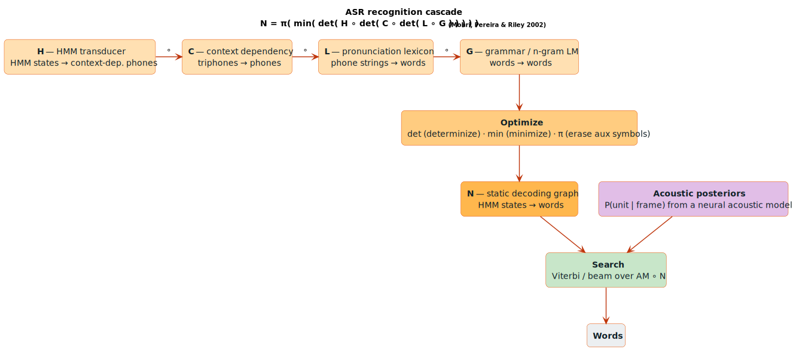

# ASR Pipeline

This module provides WFST-based components for building speech recognition systems, following the architecture described in Mohri et al.'s foundational work on WFSTs in speech recognition.

## Overview

The standard ASR pipeline constructs a recognition network as
`N = π(min(det(H̃ ∘ det(C̃ ∘ det(L̃ ∘ G)))))`:

```text
N = π(min(det(H̃ ∘ det(C̃ ∘ det(L̃ ∘ G)))))
```

Where:
- **G**: Word-level grammar (n-gram language model)
- **L̃**: Pronunciation lexicon with auxiliary symbols
- **C̃**: Context-dependency transducer (triphone/tetraphone)
- **H̃**: HMM transducer with auxiliary distribution symbols
- **`π`**: Erasing operation (auxiliary symbols → `ε`)
- **`∘`**: WFST composition; **`det`**: determinization; **`min`**: minimization



*The `H ∘ C ∘ L ∘ G` cascade: acoustic features `x(t)` enter the HMM transducer `H̃` (→ context-dependent phones), the context-dependency transducer `C̃` (CI → CD triphones), the lexicon `L̃` (phones → words), and the grammar `G` (n-gram LM over words).*

<details><summary>Text view</summary>

```text
┌─────────────────────────────────────────────────────────────┐
│                    ASR Transducer Cascade                    │
├─────────────────────────────────────────────────────────────┤
│                                                              │
│   Acoustic      HMM        Context-     Lexicon   Grammar   │
│   Features   Transducer   Dependency   Transducer   (LM)    │
│                                                              │
│     x(t)  ──► H̃ ──────► C̃ ─────────► L̃ ──────► G         │
│              │          │              │          │         │
│           phones    triphones       phones     words        │
│           (CD)      (CI→CD)       (p→word)   (n-gram)      │
│                                                              │
└─────────────────────────────────────────────────────────────┘
```

</details>

## Context-Dependency Transducers

Context-dependency transducers map context-independent phone sequences to context-dependent phone sequences.

### Triphone Construction

A triphone considers one phone of left and right context:
- **States**: `O(n²)` for `n` phones — representing (previous, current) pairs
- **Arcs**: `O(n³)` — one arc per (previous, current, next) triple

```rust
use lling_llang::asr::{TriphoneBuilder, ContextDependencyConfig, PhoneId};
use lling_llang::semiring::LogWeight;

// Build triphone transducer for 40 phones
let builder = TriphoneBuilder::<LogWeight>::new(40);
let triphone_fst = builder.build();

println!("Expected states: {}", builder.expected_states()); // 1 + 40 = 41
println!("Expected arcs: {}", builder.expected_arcs());     // 41 * 40 = 1640
```

### Tetraphone Construction

A tetraphone extends context to two phones on each side:
- **States**: `O(n³)`
- **Arcs**: `O(n⁴)`

```rust
use lling_llang::asr::TetraploneBuilder;

let builder = TetraploneBuilder::<LogWeight>::new(40);
let tetraphone_fst = builder.build();

println!("Expected states: {}", builder.expected_states()); // 1 + 40 + 1600 = 1641
println!("Expected arcs: {}", builder.expected_arcs());     // 1641 * 40 = 65640
```

### Deterministic vs Non-Deterministic

| Type | Input Label | Advantages |
|------|------------|------------|
| Non-deterministic | Center phone | Simpler construction |
| Deterministic | Right phone | No matching delay |

```rust
// Deterministic construction with boundary symbol
let config = ContextDependencyConfig {
    deterministic: true,
    boundary_symbol: Some(255), // $ symbol for padding
    ..Default::default()
};

let builder = TriphoneBuilder::<LogWeight>::new(40)
    .config(config);
let deterministic_fst = builder.build();
```

### Auxiliary Symbol Self-loops

For proper cascade composition, auxiliary symbols need self-loops:

```rust
let builder = TriphoneBuilder::<LogWeight>::new(40)
    .with_auxiliary_symbols(100..110); // Aux symbols #100-#109

let fst = builder.build();
// Each state has self-loops for auxiliary symbols
```

### Context State Representation

```rust
use lling_llang::asr::ContextState;

// Initial state (empty context)
let initial = ContextState::initial();

// After seeing phone 5
let after_5 = initial.extend(5, 1); // max_context=1
assert_eq!(after_5.left_context, vec![5]);

// After seeing phone 7 (context trimmed to max size)
let after_7 = after_5.extend(7, 1);
assert_eq!(after_7.left_context, vec![7]); // [5] dropped
```

## N-gram Language Model Transducers

Efficient WFST representation of n-gram LMs using backoff structure.

### Backoff Architecture

Instead of `O(∣V∣²)` transitions for bigrams, we use:
- **Seen n-gram**: Direct transition with probability weight
- **Unseen n-gram**: ε-transition to backoff state, then unigram probability

A seen bigram `w₁→w₂` is a direct arc weighted `P(w₂∣w₁)`; an unseen bigram `w₁→w₃` routes
through the back-off state with weight `β(w₁)` then the unigram `P(w₃)`:

```text
Seen bigram w₁→w₂:     Direct transition
                       ●───w₂:w₂ / P(w₂∣w₁)───►●

Unseen bigram w₁→w₃:   Via backoff
                       ●───ε:ε / β(w₁)───►○───w₃:w₃ / P(w₃)───►●
                       (state w₁)      (backoff)          (state w₃)
```

### API

```rust
use lling_llang::asr::{NgramBuilder, NgramConfig, NgramTransducer};
use lling_llang::semiring::LogWeight;

// Build a trigram language model
let mut builder = NgramBuilder::<LogWeight>::new(3); // order=3 (trigram)

// Add unigram probabilities
builder.add_unigram(1, LogWeight::new(5.0));  // P(word_1) = e^{-5}
builder.add_unigram(2, LogWeight::new(4.0));
builder.add_unigram(3, LogWeight::new(6.0));

// Add bigram probabilities
builder.add_bigram(&[1], 2, LogWeight::new(2.0)); // P(2|1)
builder.add_bigram(&[1], 3, LogWeight::new(3.0)); // P(3|1)
builder.add_bigram(&[2], 1, LogWeight::new(2.5)); // P(1|2)

// Add trigram probabilities
builder.add_ngram(&[1, 2], 3, LogWeight::new(1.5)); // P(3|1,2)

// Set backoff weights
builder.set_backoff(&[1], LogWeight::new(0.5)); // β(1)
builder.set_backoff(&[2], LogWeight::new(0.6)); // β(2)

// Build the transducer
let lm: NgramTransducer<LogWeight> = builder.build();

println!("Order: {}", lm.order());
println!("Vocabulary: {}", lm.vocabulary_size());
println!("States: {}", lm.as_fst().num_states());
```

### Weight Format

Weights are stored in negative log probability format:
- `Weight = -log(P(word|history))`
- Lower weights = higher probability
- Uses the log semiring (`⊕` = log-sum-exp, `⊗` = addition)

### N-gram State Structure

```rust
use lling_llang::asr::{NgramState, BackoffState};

// Regular state with history
let state = NgramState::with_history(vec![1, 2]); // history = [word_1, word_2]
assert!(!state.is_backoff);

// Backoff state
let backoff = NgramState::backoff(vec![2]); // shortened history
assert!(backoff.is_backoff);

// State after seeing new word (history trimmed to max)
let extended = state.extend(3, 2); // max_history=2
assert_eq!(extended.history, vec![2, 3]); // [1] dropped
```

## ASR Transducer Cascade

Build the full recognition network by composing all components.

### Cascade Construction

```rust
use lling_llang::asr::{
    CascadeBuilder, CascadeConfig, LexiconEntry, AsrCascade,
    TriphoneBuilder, NgramBuilder, AuxiliarySymbol,
};
use lling_llang::semiring::LogWeight;

// Build components
let context = TriphoneBuilder::<LogWeight>::new(40).build();
let lm = NgramBuilder::<LogWeight>::new(2).build();

// Build cascade
let mut builder = CascadeBuilder::<LogWeight>::new();

// Add lexicon entries
builder.add_lexicon_entry(LexiconEntry::new(
    1, // word_id = "hello"
    vec![10, 11, 12], // phones: /h/, /e/, /l/
    LogWeight::new(0.0),
));

builder.add_lexicon_entry(LexiconEntry::new(
    2, // word_id = "world"
    vec![20, 21, 22, 23], // phones: /w/, /o/, /r/, /ld/
    LogWeight::new(0.0),
));

// Compose with grammar
let cascade: AsrCascade<LogWeight> = builder
    .grammar(lm.fst)
    .context_dependency(context)
    .config(CascadeConfig::default())
    .build();

// Check statistics
let stats = cascade.statistics();
println!("G states: {}", stats.g_states);
println!("L∘G states: {}", stats.lg_states);
println!("det(L∘G) states: {}", stats.det_lg_states);
println!("Final states: {}", stats.final_states);
println!("Final arcs: {}", stats.final_arcs);
```

### Lexicon Entry with Disambiguation

For homophones (words with same pronunciation), use auxiliary symbols:

```rust
// Two words with same pronunciation need disambiguation
let entry1 = LexiconEntry::new(1, vec![10, 11], LogWeight::new(0.0))
    .with_auxiliaries(vec![
        AuxiliarySymbol::WordBoundary,
        AuxiliarySymbol::Disambiguation(0),
    ]);

let entry2 = LexiconEntry::new(2, vec![10, 11], LogWeight::new(0.0))
    .with_auxiliaries(vec![
        AuxiliarySymbol::WordBoundary,
        AuxiliarySymbol::Disambiguation(1),
    ]);

// Max P auxiliary symbols needed where P = max degree of homophony
```

### Cascade Configuration

```rust
let config = CascadeConfig {
    incremental_det: true,  // Determinize after each composition
    minimize: true,         // Minimize final result
    lazy: false,            // Materialize full graph
    max_homophony: 10,      // Maximum disambiguation symbols
    word_boundaries: true,  // Add word boundary markers
};
```

### Incremental Optimization

Apply determinization after each composition to control graph size:

```text
1. det(L̃ ∘ G)       - Compose lexicon with grammar, determinize
2. det(C̃ ∘ result)  - Add context-dependency, determinize
3. det(H̃ ∘ result)  - Add HMM structure, determinize
4. min(result)       - Minimize final graph
5. π(result)         - Erase auxiliary symbols
```

## Chain Factoring

Reduce transducer size by factoring linear chains.

### Chain Definition

A chain is a path where all internal states have exactly one incoming and one outgoing transition:

```
Chain (can be factored):

    ●───a───►●───b───►●───c───►●
    0        1        2        3

    States 1 and 2 are "internal" (one in, one out)
```

### Gain Function

A chain is only factored when the gain is positive — `G(σ) = ∣σ∣ − ∣o∣ − 1`:

```text
G(σ) = ∣σ∣ − ∣o∣ − 1

Where:
  σ = input sequence (e.g., phones)
  o = output sequence (e.g., word labels)
  ∣·∣ = sequence length
```

```rust
use lling_llang::asr::{
    chain_factor, ChainFactorConfig, Chain, compute_chain_gain,
};

// Example: Chain with 3 inputs, 1 output
let mut chain = Chain::<u32, LogWeight>::new(0);
chain.input_labels = vec![Some(1), Some(2), Some(3)];  // 3 phones
chain.output_labels = vec![Some(10)];                   // 1 word label

let gain = compute_chain_gain(&chain);
// G = 3 - 1 - 1 = 1 (positive → should factor)

// Negative gain example
let mut chain2 = Chain::<u32, LogWeight>::new(1);
chain2.input_labels = vec![Some(1)];                   // 1 phone
chain2.output_labels = vec![Some(10), Some(20), Some(30)]; // 3 labels

let gain2 = compute_chain_gain(&chain2);
// G = 1 - 3 - 1 = -3 (negative → don't factor)
```

### Chain Factoring API

```rust
use lling_llang::asr::{chain_factor, ChainFactorConfig, ChainFactorResult};

let config = ChainFactorConfig {
    min_chain_length: 2,        // Minimum chain length to factor
    factor_epsilon_chains: true, // Factor chains with ε transitions
    max_chains: Some(10000),     // Maximum number of chains
};

let result: ChainFactorResult<u32, LogWeight> = chain_factor(&fst, &config);

// Statistics
println!("Chains found: {}", result.stats.chains_found);
println!("Chains factored: {}", result.stats.chains_factored);
println!("States removed: {}", result.stats.states_removed);
println!("Total gain: {}", result.stats.total_gain);

// Access factored FST
let factored_fst = result.fst;
```

### Result

The factored transducer typically has ~1.4× the transitions of the word grammar alone, a significant reduction from the full `H ∘ C ∘ L ∘ G` cascade.

## Lattice Rescoring

Multi-pass recognition with lattice rescoring.

### Multi-Pass Recognition

```text
First Pass:  Generate word lattices with simpler models (e.g., bigram LM)
             Speed: 12.5× RT → 1.2× RT (with det(L ∘ G))

Second Pass: Use lattice as "grammar" G for rescoring
             Speed: 0.18× RT → 0.02× RT (with optimization)
```

### Rescoring API

```rust
use lling_llang::asr::{
    rescore_lattice, RescoreConfig, RescoreResult,
    LatticeGrammar, RescorePass, multi_pass_rescore,
};

// Create lattice from first pass
let lattice = LatticeGrammar::new(first_pass_fst, RescorePass::FirstPass)
    .with_density(5.0); // arcs per frame

// Configure rescoring
let config = RescoreConfig {
    determinize: true,           // Apply det() before rescoring
    minimize: true,              // Apply min() before rescoring
    pruning_threshold: Some(5.0), // Prune paths with score > best + 5
    max_states: Some(100000),    // Limit lattice size
    interpolation_alpha: 1.0,    // Full replacement of scores
};

// Rescore with better language model
let result: RescoreResult<u32, LogWeight> = rescore_lattice(
    &lattice,
    &better_lm_fst,
    &config,
);

// Check reduction
println!("Input states: {}", result.stats.input_states);
println!("Output states: {}", result.stats.output_states);
println!("State reduction: {:.1}%", result.stats.state_reduction * 100.0);
println!("Arc reduction: {:.1}%", result.stats.arc_reduction * 100.0);
```

### Multi-Pass Rescoring

```rust
// Sequence of progressively better LMs
let lm_sequence = vec![
    trigram_lm,   // Pass 2: trigram
    fourgram_lm,  // Pass 3: 4-gram
    rnn_lm,       // Pass 4: RNN LM scores
];

let results = multi_pass_rescore(&first_pass_lattice, &lm_sequence, &config);

for (i, result) in results.iter().enumerate() {
    println!("Pass {}: {} states", i + 2, result.stats.output_states);
}
```

### Score Interpolation

Blend old and new scores:

```rust
let config = RescoreConfig {
    // new_score = (1 - alpha) * old_score + alpha * new_score
    interpolation_alpha: 0.7, // 70% new LM, 30% old
    ..Default::default()
};
```

## Performance Characteristics

### Experimental Results (NAB 40K Vocabulary)

| Transducer | States | Transitions |
|------------|--------|-------------|
| `G` | 1,339,664 | 3,926,010 |
| `L ∘ G` | 8,606,729 | 11,406,721 |
| `det(L ∘ G)` | 7,082,404 | 9,836,629 |
| `C ∘ det(L ∘ G)` | 7,273,035 | 10,201,269 |
| `min(F)` | 2,616,948 | 5,497,952 |

### Recognition Speed

| Configuration | Speed (× real-time) |
|---------------|---------------------|
| `C ∘ L ∘ G` | 12.5 |
| `C ∘ det(L ∘ G)` | 1.2 |
| `det(H ∘ C ∘ L ∘ G)` | 1.0 |
| `min(F)` (factored) | **0.7** |

### Rescoring Speed (Second Pass)

| Configuration | Speed (× real-time) |
|---------------|---------------------|
| `C ∘ L ∘ G` | 0.18 |
| `C ∘ det(L ∘ G)` | 0.13 |
| `C ∘ min(det(L ∘ G))` | **0.02** (9× speedup) |

## Best Practices

### 1. Incremental Determinization

Always determinize after each composition:
```rust
let config = CascadeConfig {
    incremental_det: true,
    ..Default::default()
};
```

### 2. Word Label Placement

Place word labels on initial transitions of lexicon entries to avoid composition matching delays.

### 3. Auxiliary Symbol Self-loops

Add self-loops at each state for auxiliary symbols to ensure they pass through the cascade.

### 4. Log Semiring for Beam Search

Use log semiring weight pushing (not tropical!) for beam search optimization. See [Beam Optimization](beam-optimization.md).

### 5. Chain Factoring for Large Models

Apply chain factoring to reduce memory footprint:
```rust
let factored = chain_factor(&hclg, &ChainFactorConfig::default());
// Typically ~1.4× transitions of G alone
```

## References

- [Mohri et al. 2002](../BIBLIOGRAPHY.md#ref-mohri2002) — Mohri, M., Pereira, F., & Riley, M.
  *Weighted Finite-State Transducers in Speech Recognition.* Computer Speech & Language
  16(1):69–88. The `N = π(min(det(H̃ ∘ C̃ ∘ L̃ ∘ G)))` recognition cascade, context-dependency
  and lexicon transducers, n-gram back-off, chain factoring, and the NAB-40K experimental
  figures reproduced above.
- [Mohri 2009](../BIBLIOGRAPHY.md#ref-mohri2009) — Mohri, M. *Weighted Automata Algorithms*
  (Handbook of Weighted Automata) — determinization, minimization, and weight pushing for
  the cascade stages.
- [Allauzen et al. 2007](../BIBLIOGRAPHY.md#ref-allauzen2007) — Allauzen, C., Riley, M.,
  Schalkwyk, J., Skut, W., & Mohri, M. *OpenFst: A General and Efficient Weighted
  Finite-State Transducer Library.* The reference implementation of the composition,
  determinization, and minimization operators used throughout the cascade.

## Next Steps

- [Beam Optimization](beam-optimization.md): Efficient pruned search
- [CTC Topologies](ctc-topologies.md): CTC graph construction
- [N-gram Pruning](deep-learning.md#n-gram-pruning-with-back-off): Scalable training
- [GPU Acceleration](gpu-acceleration.md): High-throughput decoding
