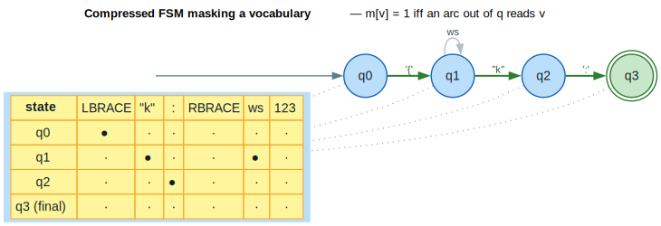

# Grammar-Constrained Decoding

**Thesis.** The `llm` module forces a language model's output to obey a formal
language by intersecting every decoding step with an automaton: at each step it
computes a **token mask** $`m`$ with $`m[v] = 1 \iff v \in \text{allowed}`$ and
overwrites the logits of disallowed tokens with $`-\infty`$, so the sampled
sequence is guaranteed to lie in the target language $`L`$.

**Grammar-Constrained Decoding (GCD)** compiles a context-free grammar (CFG)
into a pushdown automaton (PDA), compresses the reachable behavior into a
finite-state machine (FSM) with precomputed valid-token sets, and consults that
FSM as a *constraint oracle* during beam search. Source:
[`src/llm/mod.rs`](../../src/llm/mod.rs).

---

## Terms & symbols

| Term | Meaning |
|---|---|
| **GCD** | Grammar-Constrained Decoding — restrict LLM output to a formal language. |
| **CFG / CFL** | Context-Free Grammar / Language $`G = (V, \Sigma, R, S)`$. ([NOTATION](../NOTATION.md)) |
| **PDA** | Pushdown Automaton — finite automaton with a stack $`\Gamma`$; recognizes CFLs. ([NOTATION](../NOTATION.md)) |
| **FSM** | Finite-State Machine (no stack) — the compressed, stackless constraint. |
| $`V`$ | The LLM vocabulary; a *token* is $`v \in V`$ with id `TokenId = u32`. |
| $`m`$ | Token mask: bit-vector with $`m[v] = 1`$ iff token $`v`$ is allowed. |
| $`\ell`$ | Logits — the LLM's per-token scores before masking. |
| $`L`$ | The constraint language (the set of accepted token sequences). |
| $`\lvert V\rvert`$ | Vocabulary size (cardinality); typeset `\lvert V\rvert`. |
| **lookahead** | Precomputed valid continuations cached per state (`valid_token_cache`). |

WFST = Weighted Finite-State Transducer
([`architecture/wfst-traits.md`](../architecture/wfst-traits.md)).

---

## Formal model

A constraint is an automaton $`A`$ over the vocabulary alphabet. Decoding
maintains a `DecoderState` $`s = (q, \gamma)`$ — an automaton state $`q`$ and
a PDA stack $`\gamma`$ ($`\gamma`$ is empty for a pure FSM). The **mask function** reads
the arcs leaving $`q`$:

```math
m[v] = \begin{cases}
1 & \text{if } \exists \text{ an arc } q \xrightarrow{\,v\,} q' \text{ in } A \quad (v \in V) \\
0 & \text{otherwise}
\end{cases}
```

Masked decoding replaces the logit vector $`\ell`$ by $`\ell'`$ where

```math
\ell'[v] = \begin{cases}
\ell[v] & \text{if } m[v] = 1 \\
-\infty & \text{if } m[v] = 0
\end{cases}
```

so any token the grammar forbids has zero probability after the softmax. The
guarantee is that **every prefix the decoder emits is extensible to a string in
$`L`$**, and on reaching a final state the emitted sequence is in $`L`$
([Park 2025](../BIBLIOGRAPHY.md#ref-park2025)). Advancing the state with the
chosen token, `s' = advance(s, v)`, performs the PDA push/pop (or the FSM
transition); `is_accepting(s)` tests whether $`q \in F`$.

| Component | Type | Role |
|---|---|---|
| $`q`$ | `StateId` (`automaton_state`) | Current automaton state. |
| $`\gamma`$ | `Vec<u32>` (`stack`) | PDA stack; empty for an FSM. |
| $`m`$ | `TokenMask` | Allowed-token bit-vector for the current state. |
| $`A`$ | `VectorWfst<TokenId, W>` | The constraint automaton. |

---

## Intuition — masking a three-token grammar

Take the trivial language $`L = \{\, 1\ 2 \,\}`$ (token 1 then token 2). The
automaton is $`q_0 \xrightarrow{1} q_1 \xrightarrow{2} q_2`$ with $`q_2`$ final. The mask is
fully determined by which state we are in:

```text
state q0 :  m[1] = 1, everything else 0   →  only token 1 may be sampled
state q1 :  m[2] = 1, everything else 0   →  only token 2 may be sampled
state q2 :  accepting                     →  sequence "1 2" ∈ L
```

This is exactly `test_wfst_constraint` in the module: at the initial state
`valid_tokens` reports token 1 valid and token 2 invalid; after `advance(_, 1)`
the roles swap; after `advance(_, 2)` the state `is_accepting`.

---

## Architecture & API

### The `ConstrainedDecoder` trait

Every constraint backend implements one trait, so beam search is agnostic to
whether the oracle is a WFST, a compressed FSM, or a PDA:

```rust
pub trait ConstrainedDecoder {
    fn valid_tokens(&self, state: &DecoderState) -> TokenMask;
    fn advance(&self, state: &DecoderState, token: TokenId) -> Option<DecoderState>;
    fn is_accepting(&self, state: &DecoderState) -> bool;
    fn initial_state(&self) -> DecoderState;
    fn vocab_size(&self) -> usize;
}
```

| Method | Returns | Meaning |
|---|---|---|
| `valid_tokens` | `TokenMask` | The mask $`m`$ for the current state. |
| `advance` | `Option<DecoderState>` | Next state, or `None` if the token is forbidden. |
| `is_accepting` | `bool` | Whether the current state is final ($`q \in F`$). |
| `initial_state` | `DecoderState` | The automaton start configuration. |
| `vocab_size` | `usize` | $`\lvert V\rvert`$. |

### `TokenMask` — the bit-vector that is the mask

`TokenMask` packs $`\lvert V\rvert`$ bits into $`\lceil \lvert V\rvert / 64\rceil`$ `u64` words.
`set`/`unset`/`is_valid` are $`O(1)`$ bit operations; `union` (`|`) and
`intersection` (`&`) combine masks word-by-word — the building blocks for
*intersecting* several constraints (e.g. a grammar **and** a JSON schema).
`all_valid(vocab_size)` returns the "no constraint" mask with the bits beyond
$`\lvert V\rvert`$ cleared.

```rust
use lling_llang::llm::TokenMask;

let mut mask = TokenMask::new(100);     // all invalid
mask.set(5);
mask.set(10);
assert!(mask.is_valid(5));
assert!(!mask.is_valid(7));
assert_eq!(mask.count_valid(), 2);
```

### Three constraint backends

| Backend | Stack? | Construction | When to use |
|---|---|---|---|
| `WfstConstraint<W>` | no (FSM-like) | `WfstConstraint::new(automaton, vocab_size)` | A constraint already expressed as a `VectorWfst`. |
| `CompressedFsmConstraint` | no | `CompressedFsmConstraint::from_wfst(&wfst, vocab_size)` | Hot-path decoding — flat $`(\text{state}, \text{token}) \to \text{state}`$ map. |
| (PDA via `DecoderState.stack`) | yes | grammar compilation | CFG nesting that an FSM cannot capture. |

`WfstConstraint::new` eagerly builds a `valid_token_cache: HashMap<StateId, TokenMask>`
by scanning each state's transitions once — this is the **lookahead table** that
makes `valid_tokens` an $`O(1)`$ cache hit instead of an arc rescan.
`CompressedFsmConstraint` goes further, flattening transitions into a
`HashMap<(StateId, TokenId), StateId>` so `advance` is also a single lookup; this
is the "compressed FSM" stage of the pipeline.

A convenience compiler `from_regex::<W>(pattern, vocab_size)` builds a
`WfstConstraint` from a small regex subset (`.`, `*`, escapes, literals) for
quick patterns; `VocabMapper` translates between LLM token ids and WFST labels
when they differ; and `JsonSchemaConstraint` carries field/type requirements for
structured output.

### `ConstrainedBeamSearch` — putting the mask in the loop

`ConstrainedBeamSearch::new(constraint, beam_width, max_length)` runs beam search
where **only masked tokens are ever expanded**. Its `search` takes a closure
`get_log_probs: &[TokenId] -> Vec<f64>` (the LLM) and, for each beam,
expands only `valid_mask.iter_valid()`, adds the per-token log-prob, keeps the
top `beam_width`, and stops once all beams are accepting — finally
returning only hypotheses in $`L`$.

---

## Algorithms

### ⟨ masked decoding step ⟩

The per-step intent is to *intersect the LLM distribution with the constraint
and never leave the language*. The loop invariant is: **after every step the
beam contains only states reachable by a grammar-valid prefix.**

```text
⟨ masked decoding step ⟩ ≡
  given decoder state s = (q, γ):
    m ← valid_tokens(s)                      ⟨ mask from automaton arcs ⟩
    ℓ ← LLM.logits(prefix)                   ⟨ raw model scores ⟩
    for v in V:                              ⟨ apply mask m[v] = 1 iff v ∈ allowed ⟩
        ℓ′[v] ← ℓ[v]   if m[v] = 1
        ℓ′[v] ← −∞     if m[v] = 0
    v* ← sample / argmax over ℓ′             (guaranteed m[v*] = 1)
    s  ← advance(s, v*)                      ⟨ PDA push/pop or FSM step ⟩
  repeat until is_accepting(s) or length cap
```

Per step the cost is $`O(\lvert \text{arcs}(q)\rvert)`$ to build the mask (or $`O(1)`$ on
a cache hit) plus $`O(\lvert V\rvert)`$ to apply it to the logits, i.e. $`O(\lvert V\rvert)`$
overall — the mask never dominates the LLM forward pass it guards. The
**compressed FSM** removes the per-step arc scan by precomputing
`valid_token_cache`; the **lookahead** is precisely that cache.


*Blue = compile-once automaton artifacts (CFG, PDA, FSM); amber = the per-step decode loop (`llm` correction tier); purple = the LLM logit stage; green = the accepted sequence in $`L(G)`$.*

<details><summary>Text view</summary>

```text
compile (once):
  CFG G = (V, Σ, R, S)
    → PDA (Q, Σ, Γ, δ, q0, Z0)        stack Γ recognizes CFL nesting
    → compress to FSM (precompute valid-token sets + batch transitions)
    → cache valid_tokens[q] : TokenMask

decode (per step):
  s = (automaton_state, stack)
  m ← valid_tokens(s)              m[v] = 1 iff v ∈ allowed
  logits ℓ ← LLM(prefix)
  ℓ′[v] ← ℓ[v] if m[v]=1 else −∞
  token t ← sample/argmax ℓ′       (m[t] = 1)
  s ← advance(s, t)                PDA push/pop or FSM step
  loop while (more tokens ∧ ¬is_accepting(s))
  → accepted sequence ∈ L(G)
```

</details>

### Why a compressed FSM masks a vocabulary efficiently

A grammar over a 50k-token vocabulary allows only a handful of tokens at most
states. Materializing the mask per state once and caching it turns the per-step
question "which tokens are legal here?" into an array lookup. The figure shows a
JSON-ish fragment and the $`m[v]`$ each state induces over a six-token
vocabulary; the decoder follows the green path, and at $`q_1`$ both `"k"` and
whitespace are legal, so $`m[\text{"k"}] = m[\text{ws}] = 1`$.



*Blue = FSM states; green/bold = the path the decoder follows; double ring = accepting; the amber table gives $`m[v] = 1`$ (●) / $`0`$ (·) per state.*

<details><summary>Text view</summary>

```text
q0 --'{'--> q1 --"k"--> q2 --':'--> q3 (final)
q1 --ws--> q1   (allowed alternative)

token mask m[v] per state    V = { '{', "k", :, '}', ws, 123 }
  state        '{'  "k"   :   '}'  ws  123
  q0            ●    ·    ·    ·    ·    ·
  q1            ·    ●    ·    ·    ●    ·
  q2            ·    ·    ●    ·    ·    ·
  q3 (final)    ·    ·    ·    ·    ·    ·
```

</details>

---

## Examples

Both snippets are from `#[cfg(test)]` in [`src/llm/mod.rs`](../../src/llm/mod.rs).

### A WFST constraint masks each step

```rust
use lling_llang::llm::{WfstConstraint, ConstrainedDecoder};
use lling_llang::semiring::{Semiring, TropicalWeight};
use lling_llang::wfst::{MutableWfst, VectorWfst, WeightedTransition};

let mut fst: VectorWfst<u32, TropicalWeight> = VectorWfst::new();
let s0 = fst.add_state();
let s1 = fst.add_state();
let s2 = fst.add_state();
fst.set_start(s0);
fst.set_final(s2, TropicalWeight::one());
fst.add_transition(WeightedTransition { from: s0, input: Some(1), output: Some(1), to: s1, weight: TropicalWeight::one() });
fst.add_transition(WeightedTransition { from: s1, input: Some(2), output: Some(2), to: s2, weight: TropicalWeight::one() });

let constraint = WfstConstraint::new(fst, 10);
let s = constraint.initial_state();

let m0 = constraint.valid_tokens(&s);        // mask at q0
assert!(m0.is_valid(1) && !m0.is_valid(2));

let s = constraint.advance(&s, 1).expect("token 1 allowed");
let m1 = constraint.valid_tokens(&s);        // mask at q1
assert!(!m1.is_valid(1) && m1.is_valid(2));

let s = constraint.advance(&s, 2).expect("token 2 allowed");
assert!(constraint.is_accepting(&s));        // "1 2" ∈ L
```

### Intersecting masks (grammar AND schema)

```rust
use lling_llang::llm::TokenMask;

let mut grammar = TokenMask::all_valid(8);
grammar.unset(7);                 // grammar forbids token 7

let mut schema = TokenMask::new(8);
schema.set(2);
schema.set(5);
schema.set(7);

grammar.intersection(&schema);    // m = grammar ∧ schema
assert!(grammar.is_valid(2) && grammar.is_valid(5));
assert!(!grammar.is_valid(7));    // forbidden by the grammar
```

---

## Relation to the library

- **WFST core.** A constraint is a `VectorWfst<TokenId, W>`; the mask is read
  from `transitions(state)` ([`architecture/wfst-operations.md`](../architecture/wfst-operations.md)).
- **Compression mirrors determinization.** `CompressedFsmConstraint` is a flat,
  deterministic transition table — the decode-time analogue of
  [`algorithms/determinization.md`](../algorithms/determinization.md).
- **Lookahead.** The `valid_token_cache` is a per-state lookahead table, the same
  idea applied to pruning in
  [`optimization/lookahead.md`](../optimization/lookahead.md).
- **PDA backing.** The stack in `DecoderState` is the pushdown machinery
  documented in [`transducers/pushdown.md`](../transducers/pushdown.md), required
  whenever the grammar nests beyond a regular language.
- **Beam search.** `ConstrainedBeamSearch` is the masked variant of the beam
  decoder in [`advanced/beam-optimization.md`](beam-optimization.md).

---

## References

- [Park 2025](../BIBLIOGRAPHY.md#ref-park2025) — *Flexible and Efficient
  Grammar-Constrained Decoding.* The CFG→PDA→token-mask formulation, the
  compressed-FSM/lookahead optimizations, and the correctness guarantee that the
  emitted sequence lies in $`L(G)`$.
- [Mohri 2009](../BIBLIOGRAPHY.md#ref-mohri2009) — *Weighted Automata Algorithms.*
  The automaton operations (intersection, determinization) underlying the
  constraint backends.
