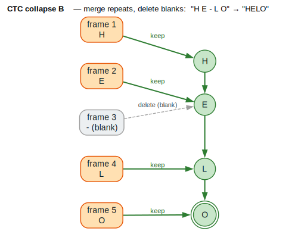
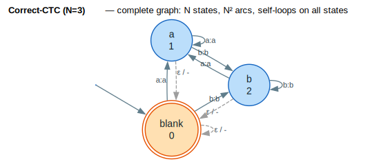
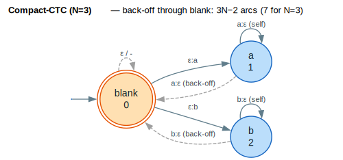
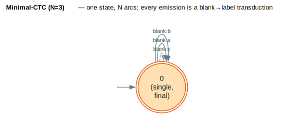
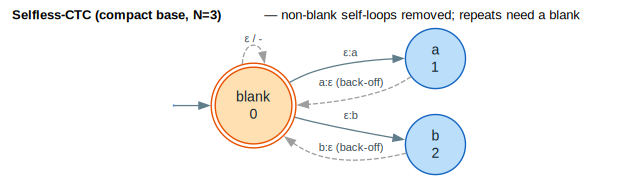

# CTC Topologies

Connectionist Temporal Classification (CTC) topologies define the structure of WFSTs used for aligning sequences of different lengths—critical for speech recognition, handwriting recognition, and other sequence-to-sequence tasks where input and output lengths differ.

## Concepts

### What is CTC?

CTC allows training on unsegmented sequence data by introducing a **blank token** that
absorbs timing variations ([Graves et al. 2006](../BIBLIOGRAPHY.md#ref-graves2006)). The
model outputs a probability distribution over the vocabulary plus blank at each time step,
and CTC marginalizes over all valid alignments. The collapse operator `B` merges runs of
identical labels then deletes blanks: $`B(\texttt{"H E - L O"}) = \texttt{"HELO"}`$.



*Orange = a kept frame emission; grey dashed = a blank (`-`) frame that is deleted; green double-ring = the final collapsed output `"HELO"`.*

<details><summary>Text view</summary>

```text
Input:  [frame1] [frame2] [frame3] [frame4] [frame5]
Output:    H        E        -        L        O
           ↓        ↓        ↓        ↓        ↓
Collapse:  H ────── E ────────────── L ────── O = "HELO"

The blank token (-) and repeated labels are collapsed.
```

</details>

### The WFST Perspective

CTC can be viewed as composition with a **topology transducer** $`T`$ — the loss is:

```math
\text{CTC Loss} = \operatorname{forward\_score}(E \circ T \circ Y)
```

where $`E`$ is the emissions graph (neural network outputs), $`T`$ the CTC topology (defines valid alignments), and $`Y`$ the target label graph.

The topology $`T`$ determines which label sequences are valid alignments for a given target
($`\circ`$ is WFST composition; see [Mohri et al. 2002](../BIBLIOGRAPHY.md#ref-mohri2002)).

### Why Multiple Topologies?

Different topologies trade off:

| Concern | Correct-CTC | Compact-CTC | Minimal-CTC |
|---------|-------------|-------------|-------------|
| Graph size | $`O(N^2)`$ | $`O(N)`$ | $`O(N)`$ |
| Memory usage | High | Medium | Low |
| Accuracy | Baseline | Same | Slightly lower |
| Training speed | Slower | Faster | Fastest |

Where $`N`$ = vocabulary size (number of distinct labels), and the topology variants follow
[Laptev et al. 2022](../BIBLIOGRAPHY.md#ref-laptev2022).

## Core API

### Types

```rust
/// A CTC label (vocabulary unit or blank)
#[derive(Clone, Copy, Debug, PartialEq, Eq, Hash)]
pub enum CtcLabel {
    Blank,
    Label(usize),
}

/// Information about a CTC topology
pub struct CtcTopologyInfo {
    pub num_states: usize,
    pub num_arcs: usize,
    pub num_labels: usize,
    pub topology_type: CtcTopologyType,
}

/// The type of CTC topology
pub enum CtcTopologyType {
    Correct,
    Compact,
    Minimal,
    SelflessCorrect,
    SelflessCompact,
}

/// A CTC topology as a WFST
pub struct CtcTopology<W: Semiring> {
    // Internal WFST representation
}
```

### Functions

```rust
/// Build standard CTC topology (N states, N² arcs)
pub fn correct_ctc<W: Semiring>(
    num_labels: usize,
) -> CtcTopology<W>;

/// Build compact CTC topology (N states, 3N-2 arcs)
pub fn compact_ctc<W: Semiring>(
    num_labels: usize,
) -> CtcTopology<W>;

/// Build minimal CTC topology (1 state, N arcs)
pub fn minimal_ctc<W: Semiring>(
    num_labels: usize,
) -> CtcTopology<W>;

/// Correct CTC without non-blank self-loops
pub fn selfless_correct_ctc<W: Semiring>(
    num_labels: usize,
) -> CtcTopology<W>;

/// Compact CTC without non-blank self-loops
pub fn selfless_compact_ctc<W: Semiring>(
    num_labels: usize,
) -> CtcTopology<W>;

/// Get topology statistics
pub fn topology_info<W: Semiring>(
    topology: &CtcTopology<W>,
) -> CtcTopologyInfo;
```

## Topology Variants

### Correct-CTC (Standard)

The standard CTC topology is a **complete directed graph** with self-loops: $`N`$ states and
$`N^2`$ arcs (a self-loop on every state, plus an arc between every ordered pair).



*`circo` layout exposes the all-to-all symmetry. Orange double-ring = the blank state (state 0), which is both start and final; blue = label states; grey dashed = $`\varepsilon`$-output arcs (blank emits $`\varepsilon`$). Every state has a self-loop (label repetition).*

<details><summary>Text view</summary>

```text
Structure:
  - N states (one per vocabulary unit + blank)
  - N² arcs (transitions between all pairs + self-loops)
  - Blank state (state 0) is start and final

Graph for N=3 (blank + 2 labels):
                    ┌───┐
         ┌─────────►│ 1 │◄─────────┐
         │   a:a    └─┬─┘   a:a    │
         │            │            │
    ┌────┴────┐       │       ┌────┴────┐
    │    0    │◄──────┴──────►│    2    │
    │ (blank) │    various    │         │
    └────┬────┘               └────┬────┘
         │                         │
         └─────────────────────────┘
              (all-to-all transitions)
```

</details>

**Properties**:
- States: $`N`$
- Arcs: $`N^2`$
- Allows any label at any time
- Self-loops allow label repetition

**Usage**:
```rust
use lling_llang::ctc::correct_ctc;
use lling_llang::semiring::LogWeight;

// Vocabulary of 1000 word pieces
let topology: CtcTopology<LogWeight> = correct_ctc(1000);

let info = topology_info(&topology);
assert_eq!(info.num_states, 1000);
assert_eq!(info.num_arcs, 1_000_000);  // 1000²
```

### Compact-CTC

Compact-CTC uses a **back-off structure** instead of explicit all-to-all transitions:
$`N`$ states and $`3N-2`$ arcs ($`N`$ self-loops + $`N-1`$ blank→label entries + $`N-1`$ label→blank
back-offs).



*Orange double-ring = blank (start and final); solid blue = `ε:label` entry arcs and non-blank self-loops; grey dashed = `label:ε` back-off arcs through blank. For $`N=3`$ this is $`3 \cdot 3 - 2 = 7`$ arcs.*

<details><summary>Text view</summary>

```text
Structure:
  - N states (one per vocabulary unit + blank)
  - 3N-2 arcs
  - Blank state has transitions to/from all labels
  - Non-blank states only have self-loops and back-off to blank

Graph for N=3:
              ε:a
         ┌──────────► 1 ◄──┐
         │            │    │ a:ε (self-loop)
         │            │    │
    ┌────┴────┐  a:ε  │    │
    │    0    │◄──────┘    │
    │ (blank) │            │
    └────┬────┘            │
         │            ┌────┴────┐
         └──────────►│    2    │
              ε:b    └─────────┘
                      b:ε (self-loop)

Back-off: Non-blank labels go through blank to transition
```

</details>

**Properties**:
- States: $`N`$
- Arcs: $`3N - 2`$
- **1.5× smaller** than Correct-CTC
- Same accuracy as Correct-CTC
- Requires frame interleaving for training

**Usage**:
```rust
use lling_llang::ctc::compact_ctc;

let topology: CtcTopology<LogWeight> = compact_ctc(1000);

let info = topology_info(&topology);
assert_eq!(info.num_states, 1000);
assert_eq!(info.num_arcs, 2998);  // 3×1000 - 2
```

### Minimal-CTC

Minimal-CTC uses a **single state** with only blank-to-label transductions: $`1`$ state and
$`N`$ arcs (one `blank:label` per label, plus the `blank:ε` self-loop).



*Orange double-ring = the lone state (start and final); solid blue = `blank:label` transductions returning to the state; grey dashed = the `blank:ε` self-loop. Every emission is a blank→label transduction.*

<details><summary>Text view</summary>

```text
Structure:
  - 1 state
  - N arcs (blank→label transductions)
  - No self-loops for non-blank labels
  - No direct transitions between non-blank labels

Graph:
         ┌──────────────────────┐
         │                      │
         │  blank:a   blank:b   │
         ▼    │           │     │
    ┌─────────┴───────────┴─────┴───┐
    │              0                 │
    │     (single state, final)      │
    └────────────────────────────────┘
              blank:blank (self-loop)

All non-blank emissions are blank→label transductions
```

</details>

**Properties**:
- States: $`1`$
- Arcs: $`N`$
- **2× smaller** than Correct-CTC
- Slightly lower accuracy (~0.2% WER increase)
- Encourages "peaky" CTC behavior (blank-dominant)
- **4× memory reduction** for LF-MMI training

**Usage**:
```rust
use lling_llang::ctc::minimal_ctc;

let topology: CtcTopology<LogWeight> = minimal_ctc(1000);

let info = topology_info(&topology);
assert_eq!(info.num_states, 1);
assert_eq!(info.num_arcs, 1000);
```

### Selfless Variants

Selfless variants remove **non-blank self-loops**, forcing the model to use blank tokens
between repeated labels (so `"aaa"` must be written `"a-a-a"`).



*Same Compact-CTC skeleton, but the $`a`$/$`b`$ self-loops are intentionally absent — only the blank $`\varepsilon`$ self-loop (grey dashed) remains. A repeated label must be separated by a blank. Arc budget drops to $`2N-1`$ for the compact base ($`5`$ for $`N=3`$).*

<details><summary>Text view</summary>

```text
Standard:          Selfless:
  a                  a
  ↺                  (no self-loop)
  1                  1

With self-loop:    Without self-loop:
  "aaa" → "a"        "aaa" → invalid (must use blank)
                     "a-a-a" → "aaa" → "a"
```

</details>

**When to use selfless**:

| Context Window | Recommended |
|----------------|-------------|
| Short ($`\gamma=0.25`$, ~11 frames) | Standard (with self-loops) |
| Long ($`\gamma=1.0`$) | Selfless |
| Unlimited (Conformer) | Selfless |

**Intuition**: Wide context models can "see" the full sequence, making explicit blank tokens more informative than self-loops.

**Usage**:
```rust
use lling_llang::ctc::{selfless_correct_ctc, selfless_compact_ctc};

// For Conformer or other wide-context models
let topology: CtcTopology<LogWeight> = selfless_compact_ctc(1000);
```

## Examples

### Building a CTC Training Graph

```rust
use lling_llang::prelude::*;
use lling_llang::ctc::{compact_ctc, CtcLabel};
use lling_llang::composition::compose;

// Neural network emissions (frame × vocabulary)
let emissions: VectorWfst<CtcLabel, LogWeight> = build_emissions_graph(&logits);

// CTC topology
let ctc_topology = compact_ctc::<LogWeight>(vocab_size);

// Target sequence
let target: VectorWfst<CtcLabel, LogWeight> = build_target_graph(&labels);

// Constrained graph: valid alignments for this target
let constrained = compose(&compose(&emissions, &ctc_topology), &target);

// Normalization graph: all possible alignments
let normalization = compose(&emissions, &ctc_topology);

// CTC loss
let constrained_score = forward_score(&constrained);
let normalization_score = forward_score(&normalization);
let loss = normalization_score - constrained_score;
```

### Memory-Constrained Training

For large vocabularies, use minimal or compact topologies:

```rust
use lling_llang::ctc::{correct_ctc, compact_ctc, minimal_ctc, topology_info};

let vocab_size = 5000;  // Large word piece vocabulary

// Compare memory requirements
let correct = correct_ctc::<LogWeight>(vocab_size);
let compact = compact_ctc::<LogWeight>(vocab_size);
let minimal = minimal_ctc::<LogWeight>(vocab_size);

println!("Correct: {} arcs", topology_info(&correct).num_arcs);  // 25,000,000
println!("Compact: {} arcs", topology_info(&compact).num_arcs);  // 14,998
println!("Minimal: {} arcs", topology_info(&minimal).num_arcs);  // 5,000
```

### Choosing Based on Model Architecture

```rust
use lling_llang::ctc::*;

fn choose_topology<W: Semiring>(
    vocab_size: usize,
    context_window: ContextWindow,
    memory_budget: MemoryBudget,
) -> CtcTopology<W> {
    match (context_window, memory_budget) {
        (ContextWindow::Unlimited, _) => {
            // Conformer or similar: use selfless
            selfless_compact_ctc(vocab_size)
        }
        (ContextWindow::Wide, MemoryBudget::Constrained) => {
            // Long context, limited memory
            minimal_ctc(vocab_size)
        }
        (ContextWindow::Wide, _) => {
            selfless_compact_ctc(vocab_size)
        }
        (ContextWindow::Short, MemoryBudget::Constrained) => {
            compact_ctc(vocab_size)
        }
        (ContextWindow::Short, _) => {
            correct_ctc(vocab_size)
        }
    }
}
```

## Frame Interleaving for Compact-CTC

Compact-CTC requires **frame interleaving** for training because back-off transitions use epsilon labels that don't consume frames:

```
Original frames:     [f0]  [f1]  [f2]  [f3]
                      ↓     ↓     ↓     ↓
Interleaved:        [f0] [dummy] [f1] [dummy] [f2] [dummy] [f3] [dummy]

Dummy frame: probability 1 for blank→label transition
```

**Implementation**:

```rust
use lling_llang::ctc::interleave_frames;

// Original emissions: T × N  (T frames × N vocabulary units)
let emissions: Vec<Vec<f32>> = neural_network_output();

// Interleaved: 2T × (N+1), where +1 is the dummy unit
let interleaved = interleave_frames(&emissions);

// Now compatible with compact_ctc topology
```

Here $`T`$ is the number of frames and $`N`$ the vocabulary size; interleaving doubles the
frame axis ($`2T`$) and adds one dummy unit ($`N+1`$) so the $`\varepsilon`$-output back-off arcs of
Compact-CTC have a frame to consume.

## Complexity

### Graph Size Comparison

| Topology | States | Arcs | Relative Size |
|----------|--------|------|---------------|
| Correct-CTC | $`N`$ | $`N^2`$ | 1.00× |
| Compact-CTC | $`N`$ | $`3N-2`$ | ~0.003× for $`N=1000`$ |
| Minimal-CTC | $`1`$ | $`N`$ | ~0.001× for $`N=1000`$ |

### Memory Usage for LF-MMI Training

| Topology | Batch Size Increase |
|----------|---------------------|
| Correct-CTC | 1× (baseline) |
| Compact-CTC | 2× |
| Minimal-CTC | 4× |

### Decoding Graph Size

When composed with language models ($`T \circ L \circ G`$):

| Topology | Relative TLG Size |
|----------|-------------------|
| $`T_{\text{correct}} \circ LG`$ | 1.00× |
| $`T_{\text{compact}} \circ LG`$ | ~0.75× |
| $`T_{\text{minimal}} \circ LG`$ | ~0.50× |

## Counter-Intuitive Finding

**Larger language models can be faster to decode**:

| LM | HCLG Size | WER | Decode Speed |
|----|-----------|-----|--------------|
| 3-gram pruned | 192 MB | 5.51% | 9031× RT |
| 3-gram unpruned | 8.7 GB | 4.02% | 9162× RT |

**Why?** Larger LMs have lower perplexity → more aggressive pruning → faster decode despite larger graph.

## Common Patterns

### Accuracy vs Memory Trade-off

```rust
fn select_topology_for_training<W: Semiring>(
    vocab_size: usize,
    available_memory_gb: f32,
    wer_priority: bool,
) -> CtcTopology<W> {
    // Estimate memory for correct topology
    let correct_memory_gb = (vocab_size * vocab_size * 8) as f32 / 1e9;

    if wer_priority && available_memory_gb > correct_memory_gb * 2.0 {
        correct_ctc(vocab_size)
    } else if available_memory_gb > correct_memory_gb * 0.5 {
        compact_ctc(vocab_size)  // No accuracy loss!
    } else {
        minimal_ctc(vocab_size)  // ~0.2% WER increase
    }
}
```

### Warmup for LF-MMI Training

LF-MMI with whole-utterance training can cause OOM during initial epochs:

```rust
pub struct LfMmiConfig {
    pub warmup_epochs: usize,     // 2-4 epochs
    pub warmup_batch_scale: f32,  // Reduced batch size during warmup
    pub gradient_accumulation: usize,  // Accumulate to maintain effective batch
}

impl LfMmiConfig {
    pub fn standard() -> Self {
        Self {
            warmup_epochs: 3,
            warmup_batch_scale: 0.25,
            gradient_accumulation: 4,
        }
    }
}
```

## Visualization

The rendered $`N=3`$ automata for each topology are embedded under
[Topology Variants](#topology-variants) above (Correct, Compact, Minimal, Selfless). The
`N=4` ASCII restatements below are kept as an accessible text fallback and to show how the
arc counts scale ($`N^2`$, $`3N-2`$, $`N`$).

<details><summary>Correct-CTC (N=4) — text view</summary>

```text
     ┌─────────────────────────────────────────┐
     │              All-to-all                 │
     ▼                                         │
  ┌──────┐    ┌──────┐    ┌──────┐    ┌──────┐ │
  │blank │◄──►│  a   │◄──►│  b   │◄──►│  c   │─┘
  │  0   │    │  1   │    │  2   │    │  3   │
  └──┬───┘    └──┬───┘    └──┬───┘    └──┬───┘
     │           │           │           │
     ▼           ▼           ▼           ▼
   (self)      (self)      (self)      (self)

States: 4, Arcs: 16 (4²)
```

</details>

<details><summary>Compact-CTC (N=4) — text view</summary>

```text
              ┌──────────────────────────┐
              │      Back-off to blank   │
              ▼                          │
  ┌──────┐    ┌──────┐    ┌──────┐    ┌──────┐
  │blank │───►│  a   │    │  b   │    │  c   │
  │  0   │◄───│  1   │    │  2   │    │  3   │
  └──┬───┘    └──┬───┘    └──┬───┘    └──┬───┘
     │  ▲        │  ▲        │  ▲        │
     │  └────────┘  └────────┘  └────────┘
     ▼       (back-off ε transitions)
   (self)

States: 4, Arcs: 10 (3×4 − 2)
```

</details>

<details><summary>Minimal-CTC (N=4) — text view</summary>

```text
                    ┌───────────────┐
                    │               │
            blank:a │  blank:b      │ blank:c
                    ▼               ▼
               ┌────────────────────────┐
               │           0            │
               │    (single state)      │
               │       (final)          │
               └────────────────────────┘
                        │
                        ▼
                  blank:blank (self-loop)

States: 1, Arcs: 4
```

</details>

## Performance Tips

1. **Use Compact-CTC by default**: Same accuracy as Correct, 1.5× smaller
2. **Use Minimal-CTC for large vocabularies**: 4× memory savings, small WER impact
3. **Use Selfless variants for Conformer**: Improves accuracy for wide context
4. **Enable warmup for LF-MMI**: Prevents OOM in early training epochs
5. **Compose incrementally**: $`\det(T \circ \det(L \circ G))`$ is more efficient than $`\det(T \circ L \circ G)`$

## Theoretical Notes

### Relationship to Other Losses

| Loss | Topology | Transitions |
|------|----------|-------------|
| CTC | Correct-CTC | All blank + label transitions |
| ASG | No blank | Bigram transitions only |
| Transducer (RNN-T) | Different per-step | Separate predictor network |

### Why Blank Matters

The blank token serves multiple purposes:
1. **Timing flexibility**: Absorbs variable input lengths
2. **Repetition handling**: Distinguishes "aa" from "a"
3. **Uncertainty encoding**: High blank = low confidence

### Selfless Intuition

Wide context models can "see" adjacent frames, so:
- Self-loops become redundant (model knows next frame)
- Explicit blanks provide clearer segmentation signal
- Forces model to use blank for actual silence/uncertainty

## References

- [Graves et al. 2006](../BIBLIOGRAPHY.md#ref-graves2006) — Graves, A., Fernández, S.,
  Gomez, F., & Schmidhuber, J. *Connectionist Temporal Classification: Labelling
  Unsegmented Sequence Data with Recurrent Neural Networks.* The original CTC loss, blank
  token, and collapse operator $`B`$.
- [Laptev et al. 2022](../BIBLIOGRAPHY.md#ref-laptev2022) — Laptev, A., Majumdar, S., &
  Ginsburg, B. *CTC Variations Through New WFST Topologies.* The Compact, Minimal, and
  Selfless topologies and their accuracy/size trade-offs.
- [Mohri et al. 2002](../BIBLIOGRAPHY.md#ref-mohri2002) — Mohri, M., Pereira, F., & Riley, M.
  *Weighted Finite-State Transducers in Speech Recognition.* WFST composition $`\circ`$ and the
  $`T \circ L \circ G`$ decoding cascade.
- [Miao et al. 2015](../BIBLIOGRAPHY.md#ref-miao2015) — Miao, Y., Gowayyed, M., & Metze, F.
  *EESEN: End-to-End Speech Recognition using Deep RNN Models and WFST-based Decoding.*
  CTC emissions decoded through a WFST $`T \circ L \circ G`$.

## Related Topics

- [Differentiable WFSTs](differentiable.md): Gradient computation through CTC
- [Deep Learning Integration](deep-learning.md): Using CTC with neural networks
- [Weight Pushing](../algorithms/weight-pushing.md): Optimizing CTC graphs for beam search
- [ASR Pipeline](asr-pipeline.md): Full speech recognition system
