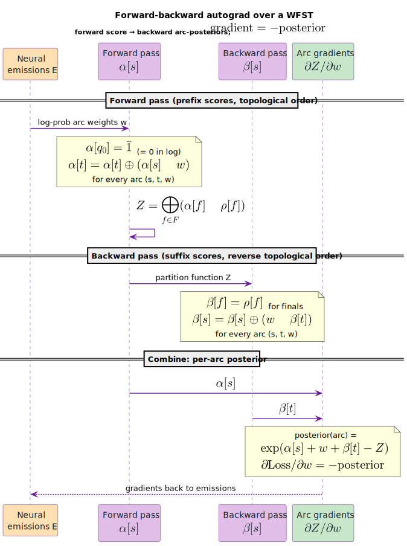

# Differentiable WFSTs

Differentiable WFSTs enable automatic differentiation through WFST operations, allowing gradient-based training with WFST-based loss functions. This bridges the gap between traditional WFST algorithms and modern deep learning frameworks.

## Concepts

### What is Differentiable WFST?

A differentiable WFST extends the standard WFST with the ability to compute gradients with respect to arc weights. This enables:

1. **End-to-end training**: Backpropagation through WFST operations
2. **Sequence-level losses**: CTC, ASG, and other alignment-based losses
3. **Integration with neural networks**: WFSTs as trainable layers

```
Neural Network          WFST Operations          Loss
     │                       │                     │
     ▼                       ▼                     ▼
  logits ───────────► forward_score ─────────► -log p(y|x)
     ▲                       │                     │
     │                       ▼                     │
gradients ◄─────────── backward ◄────────────────┘
```

### The Gradient Graph

Every WFST operation returns a graph where gradients can be computed. The key insight is
that **the gradient of a WFST is also a WFST** — it has the same topology but with gradient
values (posteriors $`g`$) instead of weights $`w`$. This is illustrated end-to-end by the
[top-down autograd diagram](topdown-autograd.md#top-down-automatic-differentiation).

```text
Original WFST:                 Gradient WFST:
    w₁=1.0                        g₁=0.73
  0 ────────► 1                 0 ────────► 1
  │           │                 │           │
  │ w₂=2.0    │ (final)         │ g₂=0.27   │ (final)
  └──────────►│                 └──────────►│

Weights are path probabilities    Gradients are path posteriors
```

### Forward and Backward Passes

The differentiation follows the forward-backward algorithm: a forward pass accumulates
$`\alpha`$, a backward pass accumulates $`\beta`$, and the arc gradient
$`\partial Z/\partial w = \exp(\alpha[s] + w + \beta[t] - Z)`$ falls out of the two.



*Two-pass sequence: the forward pass ($`\alpha`$) sums over prefixes in topological order and yields the partition function $`Z`$; the backward pass ($`\beta`$) sums over suffixes in reverse; combining them gives each arc's posterior $`\exp(\alpha[s] + w + \beta[t] - Z)`$, whose negation is the gradient flowing back to the neural emissions (orange).*

<details><summary>Text view</summary>

```text
Forward Pass (α):
  α[start] = 1̄   (log-semiring one = 0.0)
  α[t] = α[t] ⊕ (α[s] ⊗ w)   for each arc (s, t, w)
  Z = ⊕_{f ∈ F} (α[f] ⊗ ρ[f])

Backward Pass (β):
  β[f] = ρ[f]   for final states
  β[s] = β[s] ⊕ (w ⊗ β[t])   for each arc (s, t, w)

Arc gradient:
  ∂Z/∂w = exp(α[s] + w + β[t] − Z)   (the posterior of arc (s,t))
```

</details>

**Forward Pass ($`\alpha`$)**:
- $`\alpha[\text{start}] = \bar{1}`$ (log-semiring one $`= 0.0`$)
- $`\alpha[t] = \alpha[t] \oplus (\alpha[s] \otimes w)`$ for each arc $`(s, t, w)`$
- Total score $`Z = \bigoplus_{f \in F} (\alpha[f] \otimes \rho[f])`$

**Backward Pass ($`\beta`$)**:
- $`\beta[f] = \rho[f]`$ for final states
- $`\beta[s] = \beta[s] \oplus (w \otimes \beta[t])`$ for each arc $`(s, t, w)`$

**Arc Gradients** — the per-arc posterior:

```math
\frac{\partial Z}{\partial w} = \exp(\alpha[s] + w + \beta[t] - Z)
```

This is the **posterior probability** that the arc is used in a random path.

## Core API

### Types

```rust
/// Index identifying an arc in a WFST.
pub struct ArcIndex {
    pub from: StateId,
    pub arc_idx: usize,
}

/// Gradient associated with a single arc.
pub struct ArcGradient {
    pub arc: ArcIndex,
    pub gradient: f64,
}

/// Accumulated gradients for all arcs in a WFST.
pub struct GradientAccumulator {
    pub arc_gradients: Vec<ArcGradient>,
    pub num_arcs: usize,
}

/// A WFST with gradient tracking for automatic differentiation.
pub struct GradientWfst<L: Clone> {
    fst: VectorWfst<L, LogWeight>,
    forward_scores: Vec<LogWeight>,   // α values
    backward_scores: Vec<LogWeight>,  // β values
    // ...
}

/// Result of Viterbi path computation with gradients.
pub struct ViterbiGradResult {
    pub score: LogWeight,
    pub path: Vec<ArcIndex>,
    pub gradients: GradientAccumulator,
}
```

### Functions

```rust
/// Compute forward score (log-sum-exp over all paths)
pub fn forward_score<L>(grad_fst: &GradientWfst<L>) -> LogWeight;

/// Alias for forward_score emphasizing the operation
pub fn log_sum_exp_paths<L>(grad_fst: &GradientWfst<L>) -> LogWeight;

/// Compute Viterbi (best path) score
pub fn viterbi_score<L>(grad_fst: &GradientWfst<L>) -> LogWeight;

/// Compute Viterbi path with gradients
pub fn viterbi_path_with_grad<L>(grad_fst: &GradientWfst<L>) -> ViterbiGradResult;

/// Compute backward pass gradients
pub fn backward<L>(grad_fst: &GradientWfst<L>) -> GradientAccumulator;
```

## Examples

### Basic Forward Score and Gradients

```rust
use lling_llang::differentiable::{forward_score, backward, GradientWfst};
use lling_llang::wfst::{VectorWfst, MutableWfst};
use lling_llang::semiring::{LogWeight, Semiring};

// Create a WFST with two parallel paths
let mut fst = VectorWfst::<char, LogWeight>::new();
let s0 = fst.add_state();
let s1 = fst.add_state();
fst.set_start(s0);
fst.set_final(s1, LogWeight::one());
fst.add_arc(s0, Some('a'), Some('a'), s1, LogWeight::new(1.0)); // prob e⁻¹
fst.add_arc(s0, Some('b'), Some('b'), s1, LogWeight::new(2.0)); // prob e⁻²

// Wrap in gradient-tracking structure
let grad_fst = GradientWfst::from_wfst(&fst);

// Compute forward score (log of total probability)
let score = forward_score(&grad_fst);
// score ≈ 0.687 = -log(e⁻¹ + e⁻²)

// Compute gradients via backward pass
let gradients = backward(&grad_fst);

// Gradient for arc 0: exp(-1) / (exp(-1) + exp(-2)) ≈ 0.73
// Gradient for arc 1: exp(-2) / (exp(-1) + exp(-2)) ≈ 0.27
```

### Viterbi Score with Path

```rust
use lling_llang::differentiable::{viterbi_score, viterbi_path_with_grad, GradientWfst};

// WFST with two paths of different weights
let mut fst = VectorWfst::<char, LogWeight>::new();
// ... build fst ...

let grad_fst = GradientWfst::from_wfst(&fst);

// Get just the best score
let best_score = viterbi_score(&grad_fst);

// Get score, path, and gradients
let result = viterbi_path_with_grad(&grad_fst);
println!("Best score: {}", result.score.value());
println!("Best path length: {}", result.path.len());

// Gradients are 1.0 for arcs on best path, 0.0 otherwise
for arc in &result.path {
    let grad = result.gradients.get_gradient(*arc);
    assert!((grad - 1.0).abs() < 1e-6);
}
```

### CTC Loss Computation

```rust
use lling_llang::differentiable::{forward_score, backward, GradientWfst};
use lling_llang::ctc::compact_ctc;
use lling_llang::composition::compose;

// Neural network emissions (T frames × V vocabulary)
let emissions = build_emissions_graph(&logits);

// CTC topology (defines valid alignments)
let ctc = compact_ctc::<LogWeight>(vocab_size);

// Target sequence
let target = build_target_graph(&labels);

// Constrained graph: valid alignments for this target
let constrained = compose(&compose(&emissions, &ctc), &target);

// Normalization graph: all possible alignments
let normalization = compose(&emissions, &ctc);

// Wrap for differentiation
let constrained_grad = GradientWfst::from_wfst(&constrained);
let normalization_grad = GradientWfst::from_wfst(&normalization);

// CTC loss = log Z_norm - log Z_constrained
let norm_score = forward_score(&normalization_grad);
let constrained_score = forward_score(&constrained_grad);
let loss = norm_score.value() - constrained_score.value();

// Backward pass for gradients
let constrained_grads = backward(&constrained_grad);
let normalization_grads = backward(&normalization_grad);

// Gradient for each arc: grad_norm - grad_constrained
```

### Sequence-Level Training

```rust
use lling_llang::differentiable::{GradientWfst, forward_score, backward};

// General form of sequence-level loss:
// loss = -log p(y|X) = Z_norm - Z_constrained

fn sequence_loss<L: Clone + Send + Sync>(
    emissions: &VectorWfst<L, LogWeight>,
    transitions: &VectorWfst<L, LogWeight>,
    target: &VectorWfst<L, LogWeight>,
) -> (f64, GradientAccumulator) {
    // Constrained: valid alignments for target
    let constrained = compose(&compose(emissions, transitions), target);
    let constrained_grad = GradientWfst::from_wfst(&constrained);

    // Normalization: all alignments
    let normalization = compose(emissions, transitions);
    let normalization_grad = GradientWfst::from_wfst(&normalization);

    // Scores
    let z_constrained = forward_score(&constrained_grad);
    let z_norm = forward_score(&normalization_grad);

    // Loss
    let loss = z_norm.value() - z_constrained.value();

    // Gradients (difference of posteriors)
    let grad_constrained = backward(&constrained_grad);
    let grad_norm = backward(&normalization_grad);

    // Combine gradients: ∂loss/∂w = p(arc|all) - p(arc|target)
    let mut combined = grad_norm.clone();
    for g in &grad_constrained.arc_gradients {
        combined.add_gradient(g.arc, -g.gradient);
    }

    (loss, combined)
}
```

## Algorithm Details

### Forward Score Computation

```text
Algorithm: FORWARD_SCORE(fst)
  1. Initialize α[start] = 0.0 (log one), α[other] = −∞ (log zero)
  2. topo_order = topological_sort(fst)
  3. For each state s in topo_order:
       For each arc (s, t, w):
         α[t] = logadd(α[t], α[s] + w)
  4. Z = logadd_{f ∈ finals}(α[f] + ρ[f])
  5. Return Z
```

Where $`\operatorname{logadd}(a, b) = \log(\exp(a) + \exp(b))`$.

### Backward Pass

```text
Algorithm: BACKWARD(fst, Z)
  1. Initialize β[f] = ρ[f] for finals, β[other] = −∞
  2. topo_order = topological_sort(fst)
  3. For each state s in reverse(topo_order):
       For each arc (s, t, w):
         β[s] = logadd(β[s], w + β[t])
  4. For each arc (s, t, w):
       gradient[arc] = exp(α[s] + w + β[t] − Z)
  5. Return gradients
```

### Gradient Interpretation

The gradient $`\partial Z/\partial w = \exp(\alpha[s] + w + \beta[t] - Z)`$ equals the **posterior probability** that arc (s,t) is used when a path is sampled proportionally to its weight.

```
                α[s]                β[t]
Paths to s ─────────► s ──w──► t ─────────► Final

Gradient = P(path uses arc (s,t) | all paths)
         = (paths through arc) / (all paths)
         = exp(α[s] + w + β[t]) / exp(Z)
```

## Complexity

| Operation | Time | Space |
|-----------|------|-------|
| Forward score (acyclic) | $`O(\lvert Q\rvert + \lvert E\rvert)`$ | $`O(\lvert Q\rvert)`$ |
| Forward score (cyclic) | $`O(\lvert Q\rvert^2)`$ | $`O(\lvert Q\rvert)`$ |
| Backward pass | $`O(\lvert Q\rvert + \lvert E\rvert)`$ | $`O(\lvert Q\rvert + \lvert E\rvert)`$ |
| Viterbi score | $`O(\lvert Q\rvert + \lvert E\rvert)`$ | $`O(\lvert Q\rvert)`$ |
| Viterbi path | $`O(\lvert Q\rvert + \lvert E\rvert)`$ | $`O(\lvert Q\rvert)`$ |

## Semiring Considerations

### Log Semiring for Forward Score

The log semiring is used for computing total path weight ($`\oplus = \operatorname{logadd}`$, $`\otimes = +`$,
$`\bar{0} = -\infty`$, $`\bar{1} = 0`$):

```math
\begin{aligned}
\oplus &= \operatorname{logadd} && \text{(log of sum)} \\
\otimes &= {+} && \text{(log of product)} \\
\bar{0} &= -\infty && \text{(log of 0)} \\
\bar{1} &= 0 && \text{(log of 1)}
\end{aligned}
```

This gives the **total probability** when weights are log-probabilities.

### Tropical Semiring for Viterbi

The tropical semiring gives the best single path ($`\oplus = \min`$, $`\otimes = +`$, $`\bar{0} = +\infty`$, $`\bar{1} = 0`$):

```math
\begin{aligned}
\oplus &= \min \\
\otimes &= {+} \\
\bar{0} &= +\infty \\
\bar{1} &= 0
\end{aligned}
```

**Critical difference**: Forward score sums over paths; Viterbi takes the best.

## Common Patterns

### Loss Function Template

```rust
fn differentiable_loss<L>(
    constrained: &VectorWfst<L, LogWeight>,
    normalization: &VectorWfst<L, LogWeight>,
) -> (f64, Vec<ArcGradient>) {
    let c = GradientWfst::from_wfst(constrained);
    let n = GradientWfst::from_wfst(normalization);

    let loss = forward_score(&n).value() - forward_score(&c).value();

    let grad_n = backward(&n);
    let grad_c = backward(&c);

    // Subtract constrained gradients from normalization gradients
    let combined = combine_gradients(&grad_n, &grad_c, -1.0);

    (loss, combined.arc_gradients)
}
```

### Gradient Accumulation

```rust
use lling_llang::differentiable::GradientAccumulator;

// Accumulate gradients across batches
let mut total_grads = GradientAccumulator::new();

for batch in &batches {
    let (loss, grads) = compute_batch_loss(batch);
    total_grads.merge(&grads);
    total_loss += loss;
}

// Average gradients
for g in &mut total_grads.arc_gradients {
    g.gradient /= batches.len() as f64;
}
```

### Gradient Clipping

```rust
fn clip_gradients(grads: &mut GradientAccumulator, max_norm: f64) {
    // Compute gradient norm
    let norm: f64 = grads.arc_gradients
        .iter()
        .map(|g| g.gradient * g.gradient)
        .sum::<f64>()
        .sqrt();

    // Clip if exceeds max
    if norm > max_norm {
        let scale = max_norm / norm;
        for g in &mut grads.arc_gradients {
            g.gradient *= scale;
        }
    }
}
```

## Numerical Stability

### Log-Space Computation

All operations are performed in log space to avoid underflow:

```rust
// Instead of: prob = prob1 * prob2
// We compute: log_prob = log_prob1 + log_prob2

// Instead of: prob = prob1 + prob2
// We compute: log_prob = logadd(log_prob1, log_prob2)
```

### LogAdd Implementation

```rust
fn logadd(a: f64, b: f64) -> f64 {
    if a == f64::NEG_INFINITY {
        b
    } else if b == f64::NEG_INFINITY {
        a
    } else if a > b {
        a + (b - a).exp().ln_1p()
    } else {
        b + (a - b).exp().ln_1p()
    }
}
```

The `ln_1p` function computes $`\ln(1 + x)`$ more accurately for small $`x`$.

## Visualization

### Forward-Backward on a Diamond

This worked diamond ($`Z = 1.35`$) is the same example rendered as the gradient-WFST diagram
in [Top-Down Automatic Differentiation](topdown-autograd.md#top-down-automatic-differentiation):
the forward scores $`\alpha`$, backward scores $`\beta`$, and arc posteriors
$`g(\text{arc}) = \exp(\alpha[s] + w + \beta[t] - Z)`$.

```text
           α=0.0
             ↓
            [0]
           /   \
     w=1.0       w=2.0
         ↓         ↓
        (1)       (2)
         │         │
    w=0.5     w=0.3
         ↓         ↓
            [3]
             ↓
          β=0.0

Forward (α):                    Backward (β):
  α[0] = 0.0                      β[3] = 0.0
  α[1] = 0.0 + 1.0 = 1.0          β[1] = 0.5 + 0.0 = 0.5
  α[2] = 0.0 + 2.0 = 2.0          β[2] = 0.3 + 0.0 = 0.3
  α[3] = logadd(1.5, 2.3)         β[0] = logadd(1.0+0.5, 2.0+0.3)
       = 1.35                          = 1.35

Z = 1.35

Gradients:
  g(0→1) = exp(0 + 1.0 + 0.5 − 1.35) = 0.86
  g(0→2) = exp(0 + 2.0 + 0.3 − 1.35) = 0.39
  g(1→3) = exp(1.0 + 0.5 + 0 − 1.35) = 0.86
  g(2→3) = exp(2.0 + 0.3 + 0 − 1.35) = 0.39

Note: g(0→1) + g(0→2) > 1 because paths share arcs
```

## Error Handling

```rust
use lling_llang::differentiable::{forward_score, GradientWfst};

let grad_fst = GradientWfst::from_wfst(&fst);
let score = forward_score(&grad_fst);

if score.is_zero() {
    // No paths from start to final states
    // This can happen with:
    // - Empty WFST
    // - Disconnected start/final
    // - Empty intersection
    println!("Warning: No valid paths in WFST");
}

// Check for numerical issues
if score.value().is_nan() || score.value().is_infinite() {
    println!("Warning: Numerical instability detected");
}
```

## Performance Tips

1. **Use topological order**: For acyclic graphs, topological sort gives $`O(\lvert E\rvert)`$ complexity
2. **Batch operations**: Compute multiple forward scores before backward passes
3. **Cache forward scores**: The backward pass reuses $`\alpha`$ values
4. **Consider Viterbi**: For max-margin training, Viterbi gradients are sparse (`1.0` or `0.0`)
5. **Reset between uses**: Call `grad_fst.reset()` when reusing with different inputs

## References

- [Hannun et al. 2020](../BIBLIOGRAPHY.md#ref-hannun2020) — Hannun, A., Pratap, V., Kahn, J.,
  & Hsu, W.-N. *Differentiable Weighted Finite-State Transducers.* **ICML 2020 (PMLR 119),
  [arXiv:2010.01003](https://arxiv.org/abs/2010.01003)** — the GTN framework: WFST operations
  as differentiable layers, with log-semiring forward/backward yielding arc-posterior
  gradients. *(Earlier drafts miscited this as "ICLR 2021"; the correct venue is ICML 2020.)*
- [Graves et al. 2006](../BIBLIOGRAPHY.md#ref-graves2006) — Graves, A., Fernández, S.,
  Gomez, F., & Schmidhuber, J. *Connectionist Temporal Classification.* The CTC/forward-backward
  loss this framework differentiates.
- [Mohri 2009](../BIBLIOGRAPHY.md#ref-mohri2009) — Mohri, M. *Weighted Automata Algorithms.*
  Shortest-distance and forward/backward over semirings.

## Related Topics

- [Deep Learning Integration](deep-learning.md): Using differentiable WFSTs with neural networks
- [CTC Topologies](ctc-topologies.md): Building CTC loss functions
- [Weight Pushing](../algorithms/weight-pushing.md): Optimizing WFSTs for differentiable ops
- [ASR Pipeline](asr-pipeline.md): End-to-end speech recognition training
