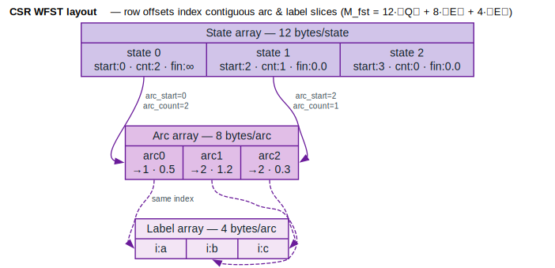
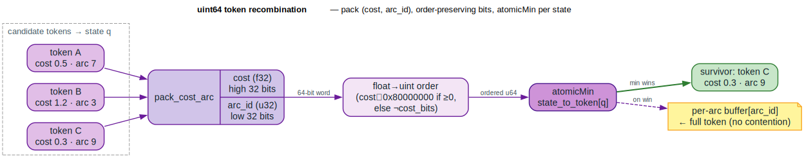

# GPU Acceleration

GPU acceleration provides large speedups for WFST decoding by exploiting parallel computation. This module provides CPU-side data structures and algorithms shaped for GPU execution patterns. The techniques follow [Braun et al. 2020](../BIBLIOGRAPHY.md#ref-braun2020), who report up to a **240× speedup** over single-core CPU decoding for their GPU Viterbi exact-lattice decoder; those figures are from the literature, **not** an independent benchmark of this crate.

## Concepts

### Why GPU Acceleration?

WFST decoding is computationally intensive:
- Expanding thousands of tokens per frame
- Each token may have many outgoing arcs
- Recombination requires finding best paths to each state

GPUs excel at this because:
1. **Massive parallelism**: Thousands of cores for parallel arc expansion
2. **High memory bandwidth**: Fast access to WFST structure
3. **Atomic operations**: Lock-free token recombination

### Key Challenges

| Challenge | Solution |
|-----------|----------|
| Precision loss in atomic ops | uint64 packing (cost + arc_id) |
| Load imbalance | Cooperative groups with dispatcher |
| Atomic contention | K-vector reduction |
| Memory deallocation cost | Soft pruning (mark, don't delete) |
| Batch processing | Channels/Lanes abstraction |

### Performance Results

| Configuration | xRTF (Speed) |
|--------------|--------------|
| CPU Single Core | 3.8 - 57 |
| CPU Socket (20 cores) | 30 - 615 |
| Prior GPU Work | 71 - 220 |
| **This Approach** | **650 - 9,031** |

## Core Components

### 1. CSR Representation

Compressed Sparse Row (CSR) format provides an efficient GPU memory layout. Each state's
`(arc_start, arc_count)` slices contiguous arc and label arrays, so the total footprint is
`M_fst = 12·∣Q∣ + 8·∣E∣ + 4·∣E∣` bytes:

```rust
use lling_llang::gpu::{CsrWfst, CsrBuilder};

// Build CSR from VectorWfst
let builder = CsrBuilder::new();
let csr: CsrWfst<char, TropicalWeight> = builder.from_wfst(&vector_wfst);

// Memory-efficient layout
// M_fst = 12·∣Q∣ + 8·∣E∣ + 4·∣E∣
let memory_bytes = csr.memory_size();
```



*Purple records = the three parallel arrays. The state array (12 bytes/state: `row_offset` · `final_weight` · `state_flags`) points at the first arc of each state's slice; the arc array (8 bytes/arc: `next_state` · `weight`) and label array (4 bytes/arc: `ilabel`) are indexed in lock-step (dashed = "same index").*

<details><summary>Text view</summary>

```text
State Array (12 bytes per state):
┌────────────┬────────────┬────────────┐
│ arc_start  │ arc_count  │ final_wt   │
│ (u32)      │ (u32)      │ (f32)      │
└────────────┴────────────┴────────────┘

Arc Array (8 bytes per arc):
┌────────────┬────────────┐
│ next_state │ weight     │
│ (u32)      │ (f32)      │
└────────────┴────────────┘

Label Array (4 bytes per arc):
┌────────────┐
│ ilabel     │ (+ olabel for transducers)
└────────────┘
```

</details>

**Benefits**:
- GPU FST ≈ **1/3 size** of disk FST
- Contiguous memory for coalesced access
- Direct indexing for efficient traversal

### 2. Token Recombination with uint64 Packing

Pack cost and arc ID into a single 64-bit value for atomic operations — cost in the high
32 bits, `arc_id` in the low 32 bits, so a single integer `atomicMin` selects the lowest
cost:

```rust
use lling_llang::gpu::{PackedToken, RecombinationBuffer, pack_cost_arc};

// Create recombination buffer
let buffer = RecombinationBuffer::new(num_states, num_arcs);

// Recombine token at state (atomic min operation)
let won = buffer.recombine(state, cost, arc_id);

if won {
    // This token is now the best path to this state
}

// Collect all surviving tokens
let survivors = buffer.collect_survivors();
```



*Candidate tokens for a destination state are packed into a 64-bit word (cost in the high bits); an order-preserving float→uint transform makes integer `atomicMin` agree with float ordering; the lowest-cost token wins (green) and its full payload lands in a per-arc buffer (amber) with no write contention.*

<details><summary>Text view</summary>

```text
|<------ 32 bits ------>|<------ 32 bits ------>|
|     cost (f32)        |      arc_id (u32)     |
        ▲                        ▲
        │                        │
    High bits (for comparison)   Low bits
```

</details>

The cost is placed in the high bits so `atomicMin` naturally selects lower costs.

**Float Ordering Transformation** — `ordered = (cost_bits ≥ 0) ? cost_bits ⊕ 0x80000000 : ¬cost_bits`,
which makes integer comparison agree with IEEE-754 float comparison:
```rust
// Positive floats: XOR with 0x80000000
// Negative floats: XOR with 0xFFFFFFFF (bitwise NOT)
// This preserves ordering under integer comparison

let ordered_bits = if (cost_bits as i32) >= 0 {
    cost_bits ^ 0x8000_0000  // Make positive > negative
} else {
    !cost_bits              // Flip ordering for negatives
};
```

**Benefits**:
- **No precision loss**: Full 32-bit float precision preserved
- **Lock-free**: Uses atomic min operation
- **No write conflicts**: Per-arc buffer eliminates contention

### 3. Dynamic Load Balancing

Cooperative groups pattern for balanced work distribution:

```rust
use lling_llang::gpu::{LoadBalancer, WorkGroup, WorkItem, WorkQueue};

// Create load balancer with work group size 32 (CUDA warp size)
let balancer = LoadBalancer::new(32);

// Add work items (tokens with their arc counts)
let mut queue = WorkQueue::new();
for token in tokens {
    queue.push(WorkItem::new(token.id, token.arc_count));
}

// Execute with balanced distribution
balancer.execute(&queue, |work_group, work_item, arc_offset| {
    // Each thread in work_group processes one arc
    let arc_id = work_item.start_arc + arc_offset;
    process_arc(arc_id);
});
```

**Architecture**:
```text
Work Queue        Work Groups (32 threads each)
┌─────────┐      ┌─────────────────────────────────┐
│ Token A │──────│ T0  T1  T2  ... T31            │
│ (5 arcs)│      │  ▼   ▼   ▼       ▼              │
├─────────┤      │ Arc Arc Arc ... Arc            │
│ Token B │      └─────────────────────────────────┘
│ (100 arcs)│─┐        ▲
├─────────┤  │        │
│ Token C │  │   ┌────┴────────────────────────────┐
│ (3 arcs)│  └───│ Thread 0 dispatches via atomicAdd│
└─────────┘      └─────────────────────────────────┘
```

**Key Pattern**:
```rust
// Thread 0 is the dispatcher
if work_group.thread_rank() == 0 {
    work_index = atomic_add(&global_counter, 1);
}
// Broadcast to all threads via shuffle
work_index = work_group.shuffle(work_index, 0);
```

### 4. K-Vector Atomic Reduction

Reduce contention by distributing atomic operations across K vectors:

```rust
use lling_llang::gpu::{KVector, KVectorConfig, reduce_with_k_vectors};

// Create K-vector with 32 partitions (10× speedup)
let config = KVectorConfig::default();  // K=32
let k_vector: KVector<PackedToken> = KVector::new(num_elements, config);

// Parallel reduction across K vectors
let result = reduce_with_k_vectors(&k_vector, items, |a, b| {
    if a.cost() < b.cost() { a } else { b }
});
```

**Problem & Solution**:
```text
Without K-vectors (high contention):
  Thread 1 ─┐
  Thread 2 ─┼──▶ [Single Vector] ◀── Atomic contention!
  Thread 3 ─┘

With K-vectors (K=32):
  Thread 1 ──▶ [Vector 0]  ─┐
  Thread 2 ──▶ [Vector 1]   │
  Thread 3 ──▶ [Vector 2]   ├──▶ Final Merge
  ...                       │
  Thread K ──▶ [Vector 31] ─┘
```

**Performance**:
- K=32 provides **10× speedup** for lattice arc accumulation
- Random distribution balances load across vectors
- Final merge is `O(K)` with no contention

### 5. Channels/Lanes for Batched Streaming

Process thousands of audio streams in parallel:

```rust
use lling_llang::gpu::{BatchedDecoder, DecoderConfig, ChannelState};

// Configure for datacenter (5000 streams, 500 concurrent)
let config = DecoderConfig::datacenter();
let mut decoder = BatchedDecoder::new(config);

// Start utterances on channels
let ch1 = decoder.start_utterance(audio_1, Some(100))?;
let ch2 = decoder.start_utterance(audio_2, Some(150))?;

// Schedule ready channels to lanes
let assignments = decoder.schedule();

// Process frame for all active lanes
let completed = decoder.process_frame(|lane_id, channel_id| {
    // Decode one frame
    let token_count = decode_frame(lane_id);
    let is_complete = is_utterance_done(channel_id);
    (token_count, is_complete)
});

// Collect results from completed utterances
let results = decoder.complete_utterances(&completed);
```

**Architecture**:
```text
Channels (n_c = 5000)          Lanes (n_l = 500)
┌─────────┐                   ┌─────────┐
│ Chan 0  │───────────────────│ Lane 0  │ (active)
├─────────┤                   ├─────────┤
│ Chan 1  │ (waiting)         │ Lane 1  │ (active)
├─────────┤                   ├─────────┤
│ Chan 2  │───────────────────│ Lane 2  │ (active)
├─────────┤                   ├─────────┤
│ Chan 3  │ (waiting)         │   ...   │
│   ...   │                   └─────────┘
└─────────┘
```

**Memory Model** — `M_state = 64α·n_c + 544α·n_l + 1024·n_l`:
```text
M_state = 64α·n_c + 544α·n_l + 1024·n_l

Where:
  α   = max active tokens after pruning
  n_c = maximum number of channels
  n_l = maximum number of lanes
```

**Configuration Presets**:

| Preset | Channels | Lanes | Max Tokens | Memory |
|--------|----------|-------|------------|--------|
| Edge Device | 10 | 1 | 10,000 | ~6 MB |
| Default | 1,000 | 32 | 10,000 | ~200 MB |
| Datacenter | 5,000 | 500 | 10,000 | ~5.5 GB |

### 6. Soft Pruning

Avoid expensive memory deallocation by marking tokens as pruned:

```rust
use lling_llang::gpu::{SoftPruneManager, SoftPruneConfig, SoftToken};

// Configure soft pruning
let config = SoftPruneConfig::new(16.0, 10000);  // beam=16, max_active=10000
let mut manager = SoftPruneManager::new(config);

// Add tokens (automatically pruned if above beam threshold)
manager.add_token(token_data, out_degree, cost);

// Apply beam pruning
let pruned_count = manager.apply_pruning();

// Advance to next frame (compacts if needed)
manager.advance_frame();

// Get surviving tokens
let survivors = manager.survivors();
```

**How Soft Pruning Works**:
```text
Instead of:              Do this:
┌─────┐                  ┌─────┐
│Token│──▶ DELETE        │Token│──▶ out_degree = 0
└─────┘    (expensive)   └─────┘    (cheap, ignored by load balancer)
```

**Adaptive Beam with Histogram**:
```rust
use lling_llang::gpu::AdaptiveBeam;

// Create histogram with 100 buckets targeting 10000 tokens
let mut beam = AdaptiveBeam::new(100, 10000);

// Add costs to histogram
beam.set_range(min_cost, max_cost);
for token in tokens {
    beam.add_with_range(token.cost, min_cost, max_cost);
}

// Compute threshold that keeps ~10000 tokens
let threshold = beam.compute_threshold();
```

**Compaction Strategy**:
- Tokens marked as pruned stay in memory
- Periodically compact to reclaim space (when >50% pruned)
- Compaction is batched for efficiency

## Complete Example

```rust
use lling_llang::gpu::{
    CsrBuilder, CsrWfst,
    RecombinationBuffer, PackedToken,
    LoadBalancer, WorkQueue, WorkItem,
    BatchedDecoder, DecoderConfig,
    SoftPruneManager, SoftPruneConfig,
};

// 1. Convert WFST to CSR format
let csr: CsrWfst<char, TropicalWeight> = CsrBuilder::new().from_wfst(&wfst);

// 2. Set up batched decoder
let decoder_config = DecoderConfig::datacenter();
let mut decoder = BatchedDecoder::new(decoder_config);

// 3. Set up soft pruning
let prune_config = SoftPruneConfig::new(16.0, 10000);
let mut pruner = SoftPruneManager::new(prune_config);

// 4. Set up recombination buffer
let recombo = RecombinationBuffer::new(csr.num_states(), csr.num_arcs());

// 5. Set up load balancer
let balancer = LoadBalancer::new(32);

// Start utterances
for audio in audio_streams {
    decoder.start_utterance(audio, None);
}

// Decode loop
while decoder.stats().active_channels > 0 {
    decoder.schedule();

    // Process each active lane
    let completed = decoder.process_frame(|lane_id, channel_id| {
        // Reset for new frame
        recombo.reset();
        pruner.current_mut().clear();

        // Get tokens from previous frame
        let tokens = get_tokens_for_lane(lane_id);

        // Build work queue
        let mut queue = WorkQueue::new();
        for token in &tokens {
            let state = token.state;
            let arc_count = csr.arc_count(state);
            queue.push(WorkItem::new(token.id, arc_count));
        }

        // Parallel arc expansion with load balancing
        balancer.execute(&queue, |_group, item, offset| {
            let arc = csr.arc(item.state, offset);
            let new_cost = item.cost + arc.weight;

            // Atomic recombination
            if recombo.recombine(arc.next_state, new_cost, arc.id) {
                pruner.add_token(arc.next_state, csr.arc_count(arc.next_state), new_cost);
            }
        });

        // Apply beam pruning
        pruner.apply_pruning();

        let token_count = pruner.current().active_count();
        let is_complete = is_final_frame(channel_id);

        (token_count, is_complete)
    });

    // Handle completed utterances
    let results = decoder.complete_utterances(&completed);
    for (channel_id, user_data) in results {
        process_result(channel_id, user_data);
    }

    decoder.continue_decoding();
    pruner.advance_frame();
}
```

## Memory Formulas

### WFST Storage (CSR)

The CSR footprint is `M_fst = 12·∣Q∣ + 8·∣E∣ + 4·∣E_E∣` bytes:

```text
M_fst = 12·∣Q∣ + 8·∣E∣ + 4·∣E_E∣

Where:
  ∣Q∣   = number of states         (12 bytes each: row_offset · final_wt · flags)
  ∣E∣   = number of arcs           (8 bytes each: next_state · weight)
  ∣E_E∣ = number of emitting arcs  (4 bytes each: label)
```

### Decoder State

The per-decode state is `M_state = 64α·n_c + 544α·n_l + 1024·n_l` bytes:

```text
M_state = 64α·n_c + 544α·n_l + 1024·n_l

Where:
  α   = max active tokens after pruning
  n_c = maximum number of channels
  n_l = maximum number of lanes
```

### Memory Examples

| Use Case | α | n_c | n_l | Memory |
|----------|---|-----|-----|--------|
| Edge device | 10,000 | 1 | 1 | 5.8 MB |
| Desktop | 10,000 | 100 | 10 | 120 MB |
| Server | 10,000 | 1,000 | 100 | 1.2 GB |
| Datacenter | 10,000 | 5,000 | 500 | 5.5 GB |

## Performance Characteristics

> The device-throughput, WER, and xRTF figures in this section are reproduced from the GPU
> decoding literature — chiefly Braun et al. (2020) — for the techniques this module models.
> They are **not** independent benchmarks of this crate.

### Scalability Across GPUs

| GPU | Class | Streams (beam=10) | Streams (beam=15) | TDP |
|-----|-------|------------------|------------------|-----|
| Jetson Nano | Embedded | 11 | 7 | 5W |
| AGX Xavier | Embedded | 502 | 399 | 30W |
| Tesla T4 | Datacenter | 2,024 | 1,561 | 70W |
| Tesla V100 | Datacenter | 4,117 | 3,150 | 250W |

### Counter-Intuitive Insight

**Larger language models can be faster**:

| LM | HCLG Size | WER | xRTF |
|----|-----------|-----|------|
| 3-gram, heavy pruning | 193 MB | 5.51% | 9,031 |
| 3-gram, light pruning | 467 MB | 4.92% | 9,065 |
| 3-gram, unpruned | 8,724 MB | 4.02% | 9,162 |

Why? Larger LM → reduced perplexity → more aggressive beam pruning → fewer active tokens → faster decode.

## API Reference

### CSR Types

| Type | Description |
|------|-------------|
| `CsrWfst<L, W>` | CSR-formatted WFST |
| `CsrBuilder` | Builder for CSR WFSTs |
| `CsrArc` | Individual arc in CSR format |
| `CsrState` | State with arc range |

### Token Recombination Types

| Type | Description |
|------|-------------|
| `PackedToken` | 64-bit packed cost + arc_id |
| `TokenPacker` | Utility for packing/unpacking |
| `RecombinationBuffer` | Atomic recombination buffer |
| `RecombinationStats` | Statistics about recombination |

### Load Balancing Types

| Type | Description |
|------|-------------|
| `WorkGroup` | Group of cooperating threads |
| `WorkDispatcher` | Token dispatcher for groups |
| `LoadBalancer` | Manages work distribution |
| `WorkItem` | Unit of work (token + arc count) |
| `WorkQueue` | Queue of work items |

### K-Vector Types

| Type | Description |
|------|-------------|
| `KVector<T>` | K parallel vectors for reduction |
| `KVectorConfig` | Configuration (default K=32) |
| `KVectorStats` | Reduction statistics |

### Channels/Lanes Types

| Type | Description |
|------|-------------|
| `Channel<T>` | Audio stream state |
| `Lane` | Active decoding slot |
| `BatchedDecoder<T>` | Manages channels and lanes |
| `DecoderConfig` | Decoder configuration |
| `DecoderStats` | Runtime statistics |
| `ChannelState` | Idle/Waiting/Ready/Active/Complete/Error |
| `LaneState` | Available/Active/FrameComplete/UtteranceComplete |

### Soft Pruning Types

| Type | Description |
|------|-------------|
| `SoftToken<T>` | Soft-prunable token |
| `SoftPruneBuffer<T>` | Buffer with automatic compaction |
| `SoftPruneManager<T>` | Multi-frame pruning manager |
| `SoftPruneConfig` | Pruning configuration |
| `SoftPruneStats` | Pruning statistics |
| `AdaptiveBeam` | Histogram-based adaptive beam |

## Best Practices

1. **Use CSR representation**: 1/3 memory of standard formats
2. **Configure channels/lanes appropriately**: Match your hardware
3. **Set reasonable beam widths**: Larger beams = more memory
4. **Monitor soft pruning stats**: Adjust compaction threshold if needed
5. **Use K-vectors for reduction**: 10× speedup with K=32

## GPU Backend Extension

The current implementation is CPU-compatible. For actual GPU execution:

```rust
// Future: CUDA backend via cudarc
#[cfg(feature = "cuda")]
use lling_llang::gpu::cuda::{CudaRecombinationBuffer, CudaLoadBalancer};

// Future: Portable compute via wgpu
#[cfg(feature = "wgpu")]
use lling_llang::gpu::wgpu::{WgpuRecombinationBuffer, WgpuLoadBalancer};
```

## References

- [Braun et al. 2020](../BIBLIOGRAPHY.md#ref-braun2020) — Braun, H., Luitjens, J., Leary, R.,
  Kaldewey, T., & Galvez, D. *GPU-Accelerated Viterbi Exact Lattice Decoder for Batched
  Online and Offline Speech Recognition.* ICASSP 2020. The source of the CSR layout,
  uint64 token recombination, K-vector reduction, channels/lanes batching, soft pruning,
  and all xRTF/WER figures reproduced above.
- [Mohri et al. 2002](../BIBLIOGRAPHY.md#ref-mohri2002) — Mohri, M., Pereira, F., & Riley, M.
  *Weighted Finite-State Transducers in Speech Recognition.* The `H ∘ C ∘ L ∘ G` decoding
  graph these kernels traverse, and the log-semiring pushing that feeds beam pruning.

## Related Topics

- [Beam Optimization](beam-optimization.md): Log-semiring weight pushing
- [Token Recombination](../algorithms/shortest-distance.md): Path algorithms
- [ASR Pipeline](asr-pipeline.md): Speech recognition system
- [Deep Learning Integration](deep-learning.md): Neural network integration
