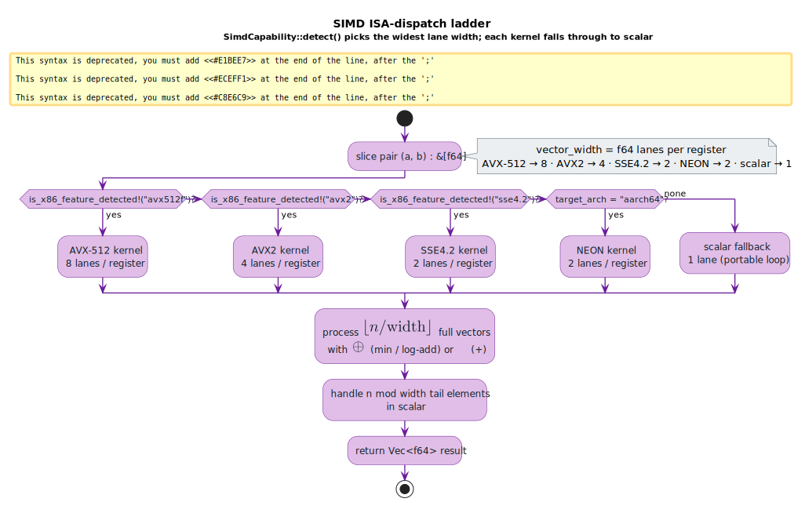
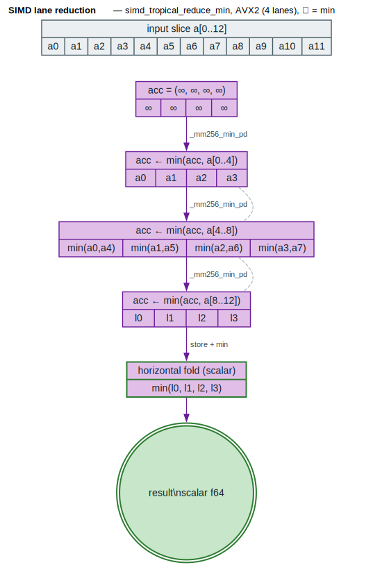

# SIMD-Accelerated Semiring Operations

**Thesis.** The `simd` module vectorizes the two semiring primitives — $`\oplus`$
(combine alternatives) and $`\otimes`$ (combine sequential steps) — across many
weight *lanes* at once, so that the inner loops of shortest-distance, forward
scoring, and beam pruning run 2–8× faster than the scalar fallback while
returning bit-identical results.

A *lane* is one `f64` slot of a SIMD register; a 256-bit AVX2 register
holds 4 lanes, a 512-bit AVX-512 register holds 8. The module probes the CPU
once, picks the widest instruction set available, and falls through a fixed
ladder — **AVX-512 → AVX2 → SSE4.2 → NEON → scalar** — so the same source runs
on any target. Source: [`src/simd/mod.rs`](../../src/simd/mod.rs).

---

## Terms & symbols

| Term | Meaning |
|---|---|
| $`\oplus`$ | Semiring *plus* — combines alternative paths. Tropical: $`\min`$; Log: $`\oplus_{\log}`$. ([NOTATION](../NOTATION.md)) |
| $`\otimes`$ | Semiring *times* — combines sequential steps. Tropical/Log: $`+`$. ([NOTATION](../NOTATION.md)) |
| $`\bar{0}`$ | Additive identity ($`\oplus`$-identity). Tropical/Log: $`\infty`$ / $`-\infty`$. |
| $`\oplus_{\log}`$ | Log-add: $`x \oplus_{\log} y = -\ln(e^{-x} + e^{-y})`$. |
| **lane** | One `f64` slot of a SIMD vector register. |
| **vector width** $`w`$ | Lanes per register: AVX-512 → 8, AVX2 → 4, SSE4.2/NEON → 2, scalar → 1. |
| **ISA** | Instruction-Set Architecture (here, an x86/ARM SIMD extension). |
| **horizontal reduction** | Folding the $`w`$ lanes of one register down to a single scalar. |
| **log-sum-exp** | $`\log \sum e^{x_i} = m + \log \sum e^{x_i - m}`$ with $`m = \max x_i`$ for numerical stability. |
| $`\lvert a\rvert`$ | Length (cardinality) of slice $`a`$. |

WFST = Weighted Finite-State Transducer (see
[`architecture/wfst-traits.md`](../architecture/wfst-traits.md)).

---

## Formal model

A SIMD kernel computes a *pointwise* or *reduction* image of the semiring
operation over two equal-length weight slices. For element-wise $`\otimes`$ over
the tropical/log semiring (where $`\otimes = +`$):

```math
\operatorname{simd\_add}(a, b)[i] = a[i] + b[i] \qquad \text{for } i \in [0, \lvert a\rvert), \quad \lvert a\rvert = \lvert b\rvert
```

For the tropical $`\oplus = \min`$ reduction (the additive collapse of many
alternatives into one):

```math
\begin{aligned}
\operatorname{simd\_tropical\_reduce\_min}(a) &= \bigoplus_i a[i] = \min\{\, a[0], \dots, a[\lvert a\rvert - 1] \,\}, \quad \oplus = \min \\
&= \infty = \bar{0} \qquad \text{when } \lvert a\rvert = 0
\end{aligned}
```

The key relation for the log semiring is the numerically stable identity
$`\log \sum e^{-a_i} = \max(a) + \log \sum e^{-(a_i - \max a)}`$, which
`simd_log_sum_exp` evaluates so that no intermediate $`e^{-a_i}`$ overflows.

Every kernel is **lane-decomposable**: the slice splits into $`\lfloor \lvert a\rvert / w\rfloor`$
full vectors processed with one SIMD instruction each, plus a scalar *tail* of
$`\lvert a\rvert \bmod w`$ elements. Because $`\oplus`$ and $`\otimes`$ are associative and
commutative ([Mohri 2009](../BIBLIOGRAPHY.md#ref-mohri2009)), regrouping the
sum across lanes leaves the result unchanged — vectorization is *exact*, not an
approximation.

| Component | Type | Role |
|---|---|---|
| $`a, b`$ | `&[f64]` | Input weight lanes (raw semiring values). |
| $`w`$ | `usize` | Vector width from `SimdCapability::vector_width`. |
| result | `Vec<f64>` (pointwise) or `f64` (reduction) | Image under the kernel. |

---

## Intuition — one register, four costs at once

Take the tropical $`\oplus = \min`$ of two cost vectors. Scalar code touches one
pair per loop iteration; an AVX2 kernel loads 4 costs from $`a`$ and 4 from
$`b`$ into two registers and emits a single `_mm256_min_pd` that
produces all 4 minima simultaneously:

```text
a = [1, 5, 3, 7]      b = [8, 4, 6, 2]
                  _mm256_min_pd
result            = [1, 4, 3, 2]      (one instruction, 4 lanes)
```

This is exactly the first test in the module
(`test_tropical_min`): `simd_tropical_min(&a, &b)` over 8 elements returns
`[1, 4, 3, 2, 2, 3, 4, 1]`, computed as two AVX2 chunks.

---

## Architecture & API

### Capability detection — `SimdCapability`

`SimdCapability::detect()` runs **once** and returns the widest supported tier.
On x86-64 it consults `is_x86_feature_detected!`; on AArch64 it returns `Neon`
unconditionally (NEON is mandatory there); elsewhere it returns `Scalar`.
`vector_width()` maps the tier to its lane count.

```rust
use lling_llang::simd::SimdCapability;

let cap = SimdCapability::detect();
assert!(cap.vector_width() >= 1);          // 8 / 4 / 2 / 1 depending on CPU
```

### The four documented kernels

| Function | Semiring role | Signature (abridged) |
|---|---|---|
| `simd_tropical_min` | element-wise tropical $`\oplus = \min`$ | `(a: &[f64], b: &[f64]) -> Vec<f64>` |
| `simd_log_add` | element-wise log $`\oplus = \oplus_{\log}`$ | `(a: &[f64], b: &[f64]) -> Vec<f64>` |
| `simd_add` | element-wise $`\otimes = +`$ (tropical/log) | `(a: &[f64], b: &[f64]) -> Vec<f64>` |
| `simd_forward_scores` (`BatchForwardScores`) | batched forward $`\oplus`$ + pruning | `add` / `prune` / `merge_duplicates_*` |

`simd_tropical_min` and `simd_add` dispatch to a `#[target_feature(enable = "avx2")]`
kernel when AVX2 is present, else a portable scalar loop. `simd_log_add` is
intentionally **scalar-per-lane**: vectorized $`\exp`$/$`\ln`$ need a
polynomial approximation that would perturb the last bits, so the module keeps
the stable closed form $`x + \ln(1 + e^{y-x})`$ (with $`x = \max(a_i, b_i)`$)
and lets autovectorization handle what it safely can.

`simd_forward_scores` is realized by the **`BatchForwardScores`** sparse vector:
`add(state, score)` appends a hypothesis and tracks `best_score` via
$`\min`$; `prune(beam)` drops every state whose score exceeds
`best_score + beam` (a tropical threshold); and the two `merge_duplicates_*`
methods fold scores for repeated states using either log-add ($`\oplus_{\log}`$) or
tropical $`\min`$. `merge_duplicates_log` is where `simd_tropical_reduce_min`
recomputes `best_score` after the merge.

### Supporting reductions and maps

`simd_reduce_sum`, `simd_reduce_max`, `simd_tropical_reduce_min`, and
`simd_log_sum_exp` collapse a slice to one scalar; `simd_scale` / `simd_shift`
apply an affine map in place; and `simd_min_plus_update` does a Floyd-Warshall
min-plus relaxation row over a dense $`n \times n`$ distance matrix — the
all-pairs shortest-distance kernel.

---

## Algorithms

### ⟨ ISA-dispatch ladder ⟩

The dispatch decision is the spine of every public kernel. In Knuth literate
style: the intent is to *select the widest lane width the CPU supports and route
to its kernel*, with a scalar terminus that is always correct. The invariant is
that **every branch computes the same mathematical result**; only throughput
differs.

```text
⟨ ISA-dispatch ladder ⟩ ≡
  detect once:
    if  cpu has avx512f  →  width ← 8 ;  use AVX-512 kernel
    elif cpu has avx2    →  width ← 4 ;  use AVX2 kernel
    elif cpu has sse4.2  →  width ← 2 ;  use SSE4.2 kernel
    elif arch = aarch64  →  width ← 2 ;  use NEON kernel
    else                 →  width ← 1 ;  use scalar loop
  run kernel(a, b, width):
    for chunk in 0 .. ⌊∣a∣ / width⌋:        ⟨ vector body ⟩
        load width lanes of a and b
        apply ⊕ or ⊗ across all lanes in one instruction
        store width lanes of result
    for i in (⌊∣a∣ / width⌋ · width) .. ∣a∣:  ⟨ scalar tail ⟩
        result[i] ← a[i] ∘ b[i]
```

Complexity is $`O(\lvert a\rvert / w)`$ SIMD instructions plus $`O(w)`$ tail steps,
i.e. $`O(\lvert a\rvert)`$ work with a $`w`$-fold constant-factor speedup. The
current build wires AVX2 ($`w = 4`$) on x86-64 and scalar elsewhere; the
ladder is the contract that lets wider tiers drop in without touching callers.



*Purple = SIMD kernels (deep-learning/GPU tier); grey = the scalar fallback and IO; green = the returned result. Diamonds are the `is_x86_feature_detected!` probes.*

<details><summary>Text view</summary>

```text
slice pair (a, b): &[f64]
        │
   avx512f? ──yes──▶ AVX-512 kernel (8 lanes)
        │no
   avx2?    ──yes──▶ AVX2 kernel (4 lanes)
        │no
   sse4.2?  ──yes──▶ SSE4.2 kernel (2 lanes)
        │no
   aarch64? ──yes──▶ NEON kernel (2 lanes)
        │none
        ▼
   scalar fallback (1 lane)
        │
   process ⌊n/width⌋ full vectors with ⊕ (min/log-add) or ⊗ (+)
   handle n mod width tail elements in scalar
        ▼
   return Vec<f64> result
```

</details>

### ⟨ horizontal lane reduction ⟩

A reduction such as `simd_tropical_reduce_min` keeps a *vector accumulator* of
$`w`$ running partials and absorbs the slice $`w`$ elements at a time
(`acc ← min(acc, chunk)`), then performs one **horizontal fold** to
collapse the $`w`$ lanes into the final scalar, and finishes the tail in
scalar. The accumulator starts at the identity $`\bar{0} = \infty`$ so empty input
yields $`\infty`$ and short input is handled by the tail alone.



*Purple = the vector accumulator lanes; grey dashed = lane lineage held independent until the fold; green = the horizontal fold and scalar result.*

<details><summary>Text view</summary>

```text
input a[0..12]
acc = (∞, ∞, ∞, ∞)
  acc ← min(acc, a[0..4])    (_mm256_min_pd)
  acc ← min(acc, a[4..8])    (_mm256_min_pd)
  acc ← min(acc, a[8..12])   (_mm256_min_pd)   → (l0, l1, l2, l3)
horizontal fold (scalar): min(l0, l1, l2, l3)
  → result: scalar f64
```

</details>

---

## Examples

All snippets below are lifted from the module's compiler-checked doctest and
`#[cfg(test)]` tests in [`src/simd/mod.rs`](../../src/simd/mod.rs).

### Element-wise $`\oplus`$ (min) and $`\otimes`$ (+)

```rust
use lling_llang::simd::{simd_tropical_min, simd_add};

let a = vec![1.0, 2.0, 3.0, 4.0, 5.0, 6.0, 7.0, 8.0];
let b = vec![8.0, 7.0, 6.0, 5.0, 4.0, 3.0, 2.0, 1.0];

// Element-wise tropical ⊕ = min
let min_result = simd_tropical_min(&a, &b);
assert_eq!(min_result, vec![1.0, 2.0, 3.0, 4.0, 4.0, 3.0, 2.0, 1.0]);

// Element-wise ⊗ = + (tropical/log times)
let sum_result = simd_add(&a, &b);
assert_eq!(sum_result, vec![9.0, 9.0, 9.0, 9.0, 9.0, 9.0, 9.0, 9.0]);
```

### Stable log $`\oplus`$ and log-sum-exp

```rust
use lling_llang::simd::{simd_log_add, simd_log_sum_exp};

// log(exp(0) + exp(0)) = log 2 elementwise
let a = vec![0.0, -1.0, -2.0];
let b = vec![0.0, -1.0, -3.0];
let r = simd_log_add(&a, &b);
assert!((r[0] - 2.0_f64.ln()).abs() < 1e-10);

// Numerically stable even with large magnitudes:
let big = vec![1000.0, 1000.0];
assert!((simd_log_sum_exp(&big) - (1000.0 + 2.0_f64.ln())).abs() < 1e-10);
```

### Batched forward scores (`simd_forward_scores`)

```rust
use lling_llang::simd::BatchForwardScores;

let mut scores = BatchForwardScores::with_capacity(5);
scores.add(0, 1.0);
scores.add(1, 5.0);
scores.add(2, 2.0);
scores.add(3, 10.0);
scores.add(4, 1.5);

// beam = 3.0, best = 1.0  ⇒  threshold = best + beam = 4.0
scores.prune(3.0);
assert_eq!(scores.len(), 3);                       // states 0, 2, 4 survive
assert!(scores.scores.iter().all(|&s| s <= 4.0));
```

---

## Relation to the library

- **Shortest distance & forward scoring.** `BatchForwardScores` mirrors the
  pruned forward pass in
  [`algorithms/shortest-distance.md`](../algorithms/shortest-distance.md); its
  `merge_duplicates_log` is the per-state $`\oplus_{\log}`$ accumulation used by the
  differentiable forward score
  ([`advanced/differentiable.md`](differentiable.md)).
- **Beam search.** `prune` implements the tropical `best + beam` cutoff
  that [`advanced/beam-optimization.md`](beam-optimization.md) and the
  lookahead table ([`optimization/lookahead.md`](../optimization/lookahead.md))
  rely on; `simd_tropical_reduce_min` is the `best_score` recomputation.
- **All-pairs distances.** `simd_min_plus_update` is the vectorized Floyd-Warshall
  relaxation backing dense distance queries.
- **Feature flags.** The doc comment lists `simd-avx512`, `simd-avx2`, and
  `simd-neon`; AVX-512 requires nightly. With no feature and no detected ISA the
  scalar path is always compiled, so results are portable.
- **Semirings.** The kernels operate on raw `f64` lanes that correspond to
  `TropicalWeight::value()` / `LogWeight::value()` from
  [`architecture/semirings.md`](../architecture/semirings.md); the algebra they
  implement is the $`\oplus`$/$`\otimes`$ of those weights.

---

## References

- [Mohri 2009](../BIBLIOGRAPHY.md#ref-mohri2009) — *Weighted Automata Algorithms.*
  Associativity/commutativity of $`\oplus`$ and $`\otimes`$ justify the
  lane-regrouping that makes vectorized reductions exact.
- [Mohri 2002](../BIBLIOGRAPHY.md#ref-mohri2002) — *Weighted Finite-State
  Transducers in Speech Recognition.* The forward/beam computations these kernels
  accelerate.
