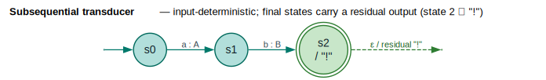

# Subsequential and Piecewise Subsequential Transducers

This document explains subsequential transducers—deterministic transducers that process input in linear time—and the piecewise decomposition technique for handling non-deterministic transducers.

## Concepts

### What is a Subsequential Transducer?

A **subsequential transducer** is a weighted finite state transducer (WFST) with two key
properties ([Mohri 2000](../BIBLIOGRAPHY.md#ref-mohri2000)):

1. **Input-deterministic**: Each state has at most one outgoing transition per input symbol
2. **Unique final outputs**: Each final state has a unique output string (a *residual*) to append



*Teal = states; one transition per input symbol at each state (`a:A`, then `b:B`); green double-ring = the final state, which carries a residual output (`"!"`) emitted on acceptance, so `apply("ab") = "AB!"`.*

<details><summary>Text view</summary>

```text
                    Deterministic              Non-deterministic
                    (Subsequential)            (Not Subsequential)

                         a:A                        a:X
                    ┌──────────┐               ┌──────────┐
                    │          ▼               │          ▼
                  ──●──  s0   ──●──          ──●──  s0   ──●──
                         │     s1                  │\    s1
                         │                         │ \a:Y
                         b:B                       │  \──●──
                         │                         │     s2
                         ▼                         ▼
                       ──●──                     ──●──
                         s2                        s3

     At s0: Only ONE transition on 'a'    At s0: TWO transitions on 'a' ✗
```

</details>

### Why Subsequentiality Matters

| Property | Subsequential | Non-subsequential |
|----------|---------------|-------------------|
| Processing time | `O(n)` for input length `n` | Potentially exponential |
| Memory usage | `O(1)` active states | `O(∣Q∣)` active states |
| Backtracking | Never | May be required |
| Streaming | Yes | Limited |
| Composition | Efficient | Can explode in size |

Subsequential transducers are ideal for:
- **Tokenization**: Convert character stream to tokens
- **Normalization**: Unicode normalization, case folding
- **Transliteration**: Script-to-script conversion
- **Simple morphology**: Regular inflection patterns

### The Non-Subsequential Problem

Many useful linguistic functions are **not** subsequential:

```
Morphological analysis: "running" → {run + -ing, runn + -ing}
                                      ↑ Multiple valid parses

Phonological rules:     "tion" → /ʃən/ or /tɪən/
                                  ↑ Context-dependent

G2P conversion:         "read" → /riːd/ or /rɛd/
                                  ↑ Ambiguous without context
```

### Piecewise Subsequential Decomposition

**Schützenberger's Theorem** (1977): Any finite-state function can be decomposed into a
finite union of subsequential functions — `T = T₁ ∪ T₂ ∪ … ∪ Tₖ`:

```text
T = T₁ ∪ T₂ ∪ … ∪ Tₖ
```

where each `Tᵢ` is subsequential. The minimum `k` is the **degree of ambiguity**.

```
Non-subsequential T              Piecewise Decomposition

     a:X                              Piece 1 (T₁)
   ┌─────→ s1
   │           \b:B                      a:X
   │            ↘                   ┌─────→ s1
 s0              s3                 │         \b:B
   │            ↗                 s0           ↘
   │           /c:C                             s3
   └─────→ s2
     a:Y                              Piece 2 (T₂)

                                         a:Y
                                    ┌─────→ s2
                                    │         \c:C
                                  s0           ↘
                                                s3
```

Each piece handles one "disambiguation choice" at ambiguous states.

## Core API

### SubsequentialTransducer

A single subsequential (deterministic) transducer:

```rust
use lling_llang::subsequential::SubsequentialTransducer;
use lling_llang::semiring::TropicalWeight;
use lling_llang::wfst::{VectorWfst, WeightedTransition, MutableWfst};

// Build a simple subsequential WFST
let mut wfst = VectorWfst::new();
let s0 = wfst.add_state();
let s1 = wfst.add_state();
let s2 = wfst.add_state();

wfst.set_start(s0);
wfst.set_final(s2, TropicalWeight::one());

// Input-deterministic: one transition per input at each state
wfst.add_transition(WeightedTransition::new(
    s0, Some('a'), Some('A'), s1, TropicalWeight::one()
));
wfst.add_transition(WeightedTransition::new(
    s1, Some('b'), Some('B'), s2, TropicalWeight::one()
));

// Convert to SubsequentialTransducer (returns None if not subsequential)
let subseq = SubsequentialTransducer::from_wfst(wfst)
    .expect("WFST should be subsequential");

// Apply to input
let result = subseq.apply(&['a', 'b']);
assert!(result.is_some());

let (output, weight) = result.unwrap();
assert_eq!(output, vec!['A', 'B']);
```

### Checking Subsequentiality

```rust
use lling_llang::subsequential::SubsequentialTransducer;
use lling_llang::semiring::TropicalWeight;

// Returns None for non-subsequential WFSTs
let non_det_wfst = make_ambiguous_wfst();
let result = SubsequentialTransducer::<char, TropicalWeight>::from_wfst(non_det_wfst);
assert!(result.is_none());  // Not subsequential!
```

### PiecewiseSubsequential

Union of subsequential pieces for non-deterministic transducers:

```rust
use lling_llang::subsequential::PiecewiseSubsequential;
use lling_llang::semiring::TropicalWeight;

// A non-subsequential WFST (ambiguous)
let ambiguous_wfst = make_ambiguous_wfst();

// Decompose into subsequential pieces
let piecewise = PiecewiseSubsequential::decompose(&ambiguous_wfst);

// Check decomposition
println!("Degree of ambiguity: {}", piecewise.degree());
println!("Number of pieces: {}", piecewise.num_pieces());

// Apply to input - returns results from ALL pieces
let results = piecewise.apply(&['a', 'b']);

for (output, weight) in results {
    println!("Output: {:?}, Weight: {:?}", output, weight);
}
```

### DecompositionStats

Statistics about the decomposition:

```rust
use lling_llang::subsequential::{PiecewiseSubsequential, DecompositionStats};

let piecewise = PiecewiseSubsequential::decompose(&wfst);
let stats = piecewise.stats();

println!("Number of pieces: {}", stats.num_pieces);
println!("Total states: {}", stats.total_states);
println!("Total transitions: {}", stats.total_transitions);
println!("Is exact: {}", stats.is_exact);
```

### Final Outputs

Subsequential transducers can have final outputs (strings appended when accepting):

```rust
use lling_llang::subsequential::SubsequentialTransducer;
use lling_llang::wfst::StateId;

let mut subseq = SubsequentialTransducer::from_wfst(wfst)
    .expect("Should be subsequential");

// Set final output for state 2: append "!" when accepting at s2
subseq.set_final_output(2, vec!['!']);

// Now applying will append the final output
let result = subseq.apply(&['a', 'b']);
let (output, _) = result.unwrap();
assert_eq!(output, vec!['A', 'B', '!']);  // Final output appended
```

### PiecewiseBuilder

Fluent builder for creating piecewise transducers:

```rust
use lling_llang::subsequential::{PiecewiseBuilder, SubsequentialTransducer};
use lling_llang::semiring::TropicalWeight;

// Build from existing subsequential pieces
let piece1 = SubsequentialTransducer::from_wfst(wfst1).unwrap();
let piece2 = SubsequentialTransducer::from_wfst(wfst2).unwrap();

let piecewise = PiecewiseBuilder::new()
    .add_piece(piece1)
    .add_piece(piece2)
    .build();

// Or try to add WFSTs directly (fails if not subsequential)
let builder = PiecewiseBuilder::<char, TropicalWeight>::new()
    .add_wfst(wfst1);  // Returns Option<Self>

if let Some(builder) = builder {
    let piecewise = builder.build();
}
```

## Examples

### Building a Simple Subsequential Transducer

A transducer that converts lowercase to uppercase:

```rust
use lling_llang::subsequential::SubsequentialTransducer;
use lling_llang::semiring::TropicalWeight;
use lling_llang::wfst::{VectorWfst, WeightedTransition, MutableWfst};

fn build_uppercase_transducer() -> SubsequentialTransducer<char, TropicalWeight> {
    let mut wfst = VectorWfst::new();
    let s0 = wfst.add_state();
    wfst.set_start(s0);
    wfst.set_final(s0, TropicalWeight::one());  // Accept at any point

    // Add transitions for each lowercase letter
    for c in 'a'..='z' {
        let upper = c.to_ascii_uppercase();
        wfst.add_transition(WeightedTransition::new(
            s0, Some(c), Some(upper), s0, TropicalWeight::one()
        ));
    }

    SubsequentialTransducer::from_wfst(wfst)
        .expect("Should be subsequential")
}

let transducer = build_uppercase_transducer();
let result = transducer.apply(&['h', 'e', 'l', 'l', 'o']);
assert_eq!(result.unwrap().0, vec!['H', 'E', 'L', 'L', 'O']);
```

### Handling Ambiguous Transducers

When a WFST has multiple outputs for the same input:

```rust
use lling_llang::subsequential::PiecewiseSubsequential;
use lling_llang::semiring::TropicalWeight;
use lling_llang::wfst::{VectorWfst, WeightedTransition, MutableWfst};

// Build ambiguous WFST: 'a' can produce 'X' or 'Y'
fn build_ambiguous_wfst() -> VectorWfst<char, TropicalWeight> {
    let mut wfst = VectorWfst::new();
    let s0 = wfst.add_state();
    let s1 = wfst.add_state();
    let s2 = wfst.add_state();

    wfst.set_start(s0);
    wfst.set_final(s2, TropicalWeight::one());

    // Two transitions on 'a' from s0 - NOT subsequential!
    wfst.add_transition(WeightedTransition::new(
        s0, Some('a'), Some('X'), s1, TropicalWeight::new(1.0)
    ));
    wfst.add_transition(WeightedTransition::new(
        s0, Some('a'), Some('Y'), s1, TropicalWeight::new(2.0)
    ));

    // Continue to final state
    wfst.add_transition(WeightedTransition::new(
        s1, Some('b'), Some('B'), s2, TropicalWeight::one()
    ));

    wfst
}

let wfst = build_ambiguous_wfst();

// Decompose into subsequential pieces
let piecewise = PiecewiseSubsequential::decompose(&wfst);

// Each piece handles one disambiguation choice
assert!(piecewise.num_pieces() >= 1);

// Apply returns results from all pieces
let results = piecewise.apply(&['a', 'b']);

// May get multiple outputs: ['X', 'B'] and/or ['Y', 'B']
for (output, weight) in &results {
    println!("Output: {:?}, Cost: {:?}", output, weight.value());
}
```

### Deduplicating Results

When pieces may produce the same output:

```rust
use lling_llang::subsequential::PiecewiseSubsequential;

let piecewise = PiecewiseSubsequential::decompose(&wfst);

// apply_unique removes duplicate outputs
let unique_results = piecewise.apply_unique(&['a', 'b']);

// Each output appears only once
let outputs: Vec<_> = unique_results.iter().map(|(o, _)| o).collect();
// No duplicates in outputs
```

### Morphological Analysis Use Case

Conceptual example of morphological analysis:

```rust
use lling_llang::subsequential::PiecewiseSubsequential;

// Morphology WFST: "running" → [("run", "-ing"), ("runn", "-ing")]
// This is non-subsequential because the same input
// can produce different morphological parses

let morphology_wfst = build_morphology_wfst();

// Decompose into pieces
let piecewise = PiecewiseSubsequential::decompose(&morphology_wfst);

// Get all valid analyses
let analyses = piecewise.apply(&word_chars);

// Each analysis represents a valid morphological parse
for (parse, weight) in analyses {
    // parse contains morpheme boundaries
    // weight indicates confidence/preference
}
```

## Decomposition Algorithm

The decomposition algorithm works by:

1. **Find ambiguity points**: States with multiple transitions on the same input
2. **Enumerate alternatives**: For each ambiguity point, count the alternatives
3. **Create pieces**: One piece per "disambiguation path"
4. **Copy with selection**: Each piece takes the i-th alternative at ambiguous states

```
Algorithm: build_pieces(wfst)
━━━━━━━━━━━━━━━━━━━━━━━━━━━━━

Input: Non-subsequential WFST
Output: List of subsequential pieces

1. ambiguity_points ← find_ambiguity_points(wfst)
   // Returns [(state_id, count)] for states with count > 1 transitions per input

2. IF ambiguity_points is empty THEN
      RETURN [wfst]  // Already subsequential

3. max_ambiguity ← max(count for (_, count) in ambiguity_points)

4. pieces ← []
5. FOR i = 0 TO max_ambiguity - 1 DO
      piece_wfst ← new VectorWfst
      copy_with_disambiguation(wfst, piece_wfst, ambiguity_points, i)
      // At each ambiguous state, pick the i-th alternative
      pieces.append(piece_wfst)

6. RETURN pieces
```

### Finding Ambiguity Points

```rust
// Internal function to find non-deterministic states
fn find_ambiguity_points(wfst: &VectorWfst<L, W>) -> Vec<(StateId, usize)> {
    let mut ambiguous = Vec::new();

    for state_id in 0..wfst.num_states() {
        // Count transitions per input symbol
        let mut input_counts: HashMap<Option<&L>, usize> = HashMap::new();

        for trans in wfst.transitions(state_id) {
            *input_counts.entry(trans.input.as_ref()).or_insert(0) += 1;
        }

        let max_count = input_counts.values().max().copied().unwrap_or(1);
        if max_count > 1 {
            ambiguous.push((state_id, max_count));
        }
    }

    ambiguous
}
```

## Performance Characteristics

### Time Complexity

| Operation | Subsequential | Piecewise (`k` pieces) |
|-----------|---------------|----------------------|
| `apply(input)` | `O(n)` | `O(k × n)` |
| `apply_unique(input)` | `O(n)` | `O(k × n + m log m)`* |
| `decompose(wfst)` | `O(∣Q∣ + ∣E∣)` | `O(∣Q∣ + ∣E∣)` |

*where `m` = number of results before deduplication

### Space Complexity

| Structure | Space |
|-----------|-------|
| SubsequentialTransducer | `O(∣Q∣ + ∣E∣)` |
| PiecewiseSubsequential | `O(k × (∣Q∣ + ∣E∣))` |
| DecompositionStats | `O(1)` |

### Degree of Ambiguity

The degree `k` affects:
- **Memory**: `k` copies of the structure
- **Time**: `k` applications per input
- **Output size**: Up to `k` results per input

For practical applications:
- `k = 1`: Subsequential (optimal)
- `k ≤ 5`: Efficient for most uses
- `k > 100`: Consider alternative approaches

## When to Use

### Use SubsequentialTransducer When:

- Your function is naturally deterministic
- You need streaming/online processing
- Memory efficiency is critical
- Input processing is latency-sensitive

### Use PiecewiseSubsequential When:

- Your function has bounded ambiguity
- You need all valid outputs (not just one)
- The source WFST is non-deterministic
- You want linear-time processing per piece

### Consider Alternatives When:

- Ambiguity is unbounded
- You only need the best output (use composition + shortest path)
- The WFST is already determinized (just use it directly)

## Related Topics

- [WFST Determinization](../algorithms/determinization.md): Making WFSTs input-deterministic
- [WFST Minimization](../algorithms/minimization.md): Reducing WFST size
- [Composition](../algorithms/composition.md): Combining transducers
- [Shortest Distance](../algorithms/shortest-distance.md): Finding optimal paths
- [Semirings](../architecture/semirings.md): Weight algebras for transducers

## References

- [Mohri 2000](../BIBLIOGRAPHY.md#ref-mohri2000) — Mohri, M. *Minimization Algorithms for
  Sequential Transducers.* Theoretical Computer Science 234(1–2):177–201.
  [doi:10.1016/S0304-3975(98)00115-7](https://doi.org/10.1016/S0304-3975(98)00115-7) —
  the canonical treatment of (sub)sequential transducers, residual outputs, and their
  minimization.
- [Mohri et al. 2002](../BIBLIOGRAPHY.md#ref-mohri2002) — Mohri, M., Pereira, F., & Riley, M.
  *Weighted Finite-State Transducers in Speech Recognition.* Determinization and composition
  `∘` of weighted transducers, the operations that turn a non-subsequential WFST into a
  usable decoding graph.
- Schützenberger, M. P. (1977). *Sur une variante des fonctions séquentielles.* Theoretical
  Computer Science 4(1):47–57.
  [doi:10.1016/0304-3975(77)90055-X](https://doi.org/10.1016/0304-3975(77)90055-X) — the
  decomposition theorem `T = T₁ ∪ … ∪ Tₖ` underlying piecewise-subsequential transducers.
- Roche, E., & Schabes, Y. (1997). *Deterministic Part-of-Speech Tagging with Finite-State
  Transducers.* Computational Linguistics 21(2):227–253.
  [ACL J95-2004](https://aclanthology.org/J95-2004/) — a classic application of
  subsequential transducers in NLP.
