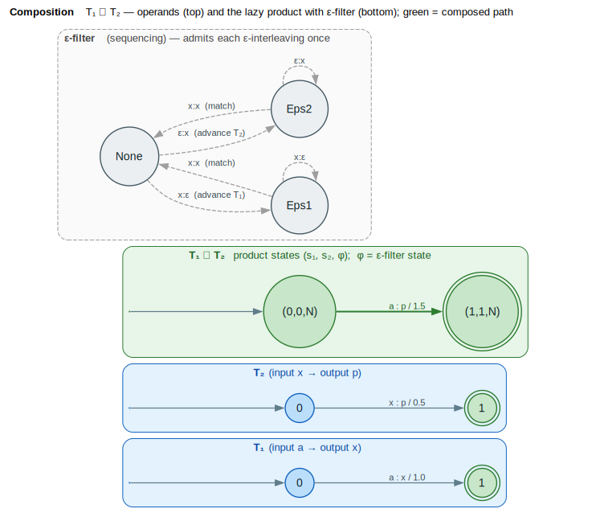

# Lazy Composition

lling-llang provides lazy composition operators for combining WFSTs with other WFSTs or context-free grammars. Product states are computed on-demand during traversal, avoiding the $`O(n \times m)`$ state explosion of eager composition. (WFST = **W**eighted **F**inite-**S**tate **T**ransducer; CFG = **C**ontext-**F**ree **G**rammar.)

## Terms & symbols

Defined centrally in [`../NOTATION.md`](../NOTATION.md); repeated locally for the terms this doc uses.

| Symbol | Meaning |
|---|---|
| $`\circ`$ | composition — $`A \circ B`$ chains transducers: $`A`$'s output tape feeds $`B`$'s input tape. |
| $`\oplus`$ / $`\otimes`$ | semiring *plus* (combine alternatives) / *times* (combine arcs). |
| $`\bar{0}`$ / $`\bar{1}`$ | $`\oplus`$-identity / $`\otimes`$-identity. |
| $`\varepsilon`$ | the empty label (consumes/emits nothing); the $`\varepsilon`$-filter sequences these. |
| $`\rho(q)`$ | final-weight function $`\rho : F \to K`$. |
| $`\lvert Q\rvert`$, $`\lvert E\rvert`$, $`\lvert V\rvert`$, $`\lvert G\rvert`$ | states / transitions / lattice nodes / grammar size (cardinality bar $`\lvert\cdot\rvert`$). |

## Concepts

### What is Composition?

**Composition** combines two transducers into one, chaining their transformations. If $`\mathrm{FST}_1`$ maps $`A \to B`$ and $`\mathrm{FST}_2`$ maps $`B \to C`$, their composition $`\mathrm{FST}_1 \circ \mathrm{FST}_2`$ maps $`A \to C`$. The product is built lazily: a state is a triple $`(s_1, s_2, \varphi)`$ pairing one state from each operand with an $`\varepsilon`$-filter state $`\varphi`$, and an arc exists when $`\mathrm{FST}_1`$'s output label matches $`\mathrm{FST}_2`$'s input label.



*Blue panels = operands $`T_1`$, $`T_2`$; green panel = the lazy product (states $`(s_1, s_2, \varphi)`$, composed arc $`a{:}p / 1.0 \otimes 0.5`$); grey-dashed inset = the sequencing $`\varepsilon`$-filter that admits each $`\varepsilon`$-interleaving exactly once.*

<details><summary>Text view</summary>

```text
FST₁: a:x ──► b:y ──► c:z
FST₂: x:p ──► y:q ──► z:r

Composed: a:p ──► b:q ──► c:r
```

</details>

The key insight: $`\mathrm{FST}_1`$'s output symbols must match $`\mathrm{FST}_2`$'s input symbols for transitions to synchronize.

### Composition Types

| Operator | Description | Use Case |
|----------|-------------|----------|
| $`\mathrm{FST} \circ \mathrm{FST}`$ | WFST composition | Cascaded transducers |
| $`\mathrm{NFA} \cap \mathrm{FST}`$ | NFA intersection | Phonetic matching |
| $`\mathrm{CFG} \times \mathrm{FST}`$ | CFG filtering | Grammar constraints |

### Why Lazy Evaluation?

Eager composition computes all product states upfront. For FSTs with $`n`$ and $`m`$ states, this produces up to $`n \times m`$ states - problematic for large transducers.

Lazy composition defers computation:
- States computed only when visited
- Many states are never reachable
- Path extraction explores only a subset
- Memory bounded by actual traversal

### Core Types

| Type | Description |
|------|-------------|
| `LazyComposition` | Lazy FST $`\circ`$ FST composition |
| `LazyCfgComposition` | Lazy CFG $`\times`$ Lattice composition |
| `ProductStateId` | State in composed transducer |
| `FilterState` | Epsilon filter state |
| `EpsilonFilter` | Epsilon transition handler |
| `FilteredLattice` | View of grammatically valid edges |

## FST $`\circ`$ FST Composition

### Basic Usage

```rust
use lling_llang::composition::compose;
use lling_llang::wfst::VectorWfstBuilder;
use lling_llang::semiring::TropicalWeight;

// FST1: a → x (with weight 1.0)
let fst1 = VectorWfstBuilder::new()
    .add_states(2)
    .start(0)
    .final_state(1, TropicalWeight::one())
    .arc(0, Some('a'), Some('x'), 1, TropicalWeight::new(1.0))
    .build();

// FST2: x → p (with weight 0.5)
let fst2 = VectorWfstBuilder::new()
    .add_states(2)
    .start(0)
    .final_state(1, TropicalWeight::one())
    .arc(0, Some('x'), Some('p'), 1, TropicalWeight::new(0.5))
    .build();

// Compose: a → p (weight = 1.0 + 0.5 = 1.5 for tropical)
let mut composed = compose(fst1, fst2);

// Enumerate accepting paths
for path in composed.accepting_paths() {
    println!("Input: {:?}, Output: {:?}, Weight: {:?}",
        path.inputs, path.outputs, path.weight.value());
}
```

### Product States

The composed FST has states that are pairs from the component FSTs:

```rust
pub struct ProductStateId {
    pub s1: StateId,       // State from FST1
    pub s2: StateId,       // State from FST2
    pub filter: FilterState, // Epsilon filter state
}
```

A transition exists in the composed FST when:
- $`\mathrm{FST}_1`$ outputs label $`x`$
- $`\mathrm{FST}_2`$ inputs label $`x`$ (same label)
- Weights combine via semiring multiplication $`\otimes`$

### LazyComposition API

```rust
pub struct LazyComposition<F1, F2, L, W> { ... }

impl<F1, F2, L, W> LazyComposition<F1, F2, L, W>
where
    F1: Wfst<L, W>,
    F2: Wfst<L, W>,
    L: Clone + Eq + Hash,
    W: Semiring,
{
    /// Create lazy composition.
    pub fn new(fst1: F1, fst2: F2) -> Self;

    /// Create with specific epsilon filter.
    pub fn with_filter(fst1: F1, fst2: F2, filter_type: EpsilonFilterType) -> Self;

    /// Set cache policy.
    pub fn with_cache_policy(self, policy: CachePolicy) -> Self;

    /// Get start product state.
    pub fn start(&self) -> ProductStateId;

    /// Check if product state is final.
    pub fn is_final(&mut self, state: ProductStateId) -> bool;

    /// Get transitions from product state.
    pub fn transitions(&mut self, state: ProductStateId)
        -> SmallVec<[ComposedTransition<L, W>; 4]>;

    /// Iterate over accepting paths lazily.
    pub fn accepting_paths(&mut self) -> AcceptingPathIterator<...>;

    /// Get number of computed states.
    pub fn computed_states(&self) -> usize;

    /// Clear state cache.
    pub fn clear_cache(&mut self);
}
```

### Composed Transitions

```rust
pub struct ComposedTransition<L, W: Semiring> {
    pub input: Option<L>,      // From FST1 input
    pub output: Option<L>,     // From FST2 output
    pub target: ProductStateId, // Target product state
    pub weight: W,             // Combined weight
}
```

### Composed Paths

```rust
pub struct ComposedPath<L: Clone, W: Semiring> {
    pub inputs: Vec<L>,   // Input sequence
    pub outputs: Vec<L>,  // Output sequence
    pub weight: W,        // Total path weight
}
```

## Epsilon Handling

### The Epsilon Problem

Epsilon ($`\varepsilon`$) transitions complicate composition. If $`\mathrm{FST}_1`$ outputs $`\varepsilon`$ and $`\mathrm{FST}_2`$ inputs $`\varepsilon`$ at the same time, we could:
1. Advance $`\mathrm{FST}_1`$ only
2. Advance $`\mathrm{FST}_2`$ only
3. Advance both

Uncontrolled advancement leads to duplicate or missed paths.

### Epsilon Filter

The epsilon filter (based on [Mohri 2009](../BIBLIOGRAPHY.md#ref-mohri2009)) ensures correct path enumeration. It is the grey-dashed inset of the [composition product diagram](#what-is-composition): the filter state $`\varphi \in \{\mathrm{None}, \mathrm{Eps1}, \mathrm{Eps2}\}`$ records whether an $`\varepsilon`$ run is in progress on $`T_1`$ or $`T_2`$, admitting each interleaving exactly once.

```rust
pub enum FilterState {
    None,  // No epsilon in progress
    Eps1,  // FST1 outputting epsilon
    Eps2,  // FST2 consuming epsilon
}

pub enum EpsilonFilterType {
    None,       // No filtering (epsilon-free FSTs only)
    Sequencing, // Default - ensures ordered epsilon processing
    Matching,   // Epsilons must match between FSTs
}
```

### Filter Behavior

**Sequencing filter** (default):

| State | FST1 $`\varepsilon`$ output | FST2 $`\varepsilon`$ input | Match |
|-------|---------------|--------------|-------|
| None  | ✓ → Eps1 | ✓ → Eps2 | ✓ → None |
| Eps1  | ✓ → Eps1 | ✗ | ✓ → None |
| Eps2  | ✗ | ✓ → Eps2 | ✓ → None |

The sequencing filter prevents interleaved epsilon sequences, ensuring each epsilon path is enumerated exactly once.

### Using Custom Filters

```rust
use lling_llang::composition::{LazyComposition, EpsilonFilterType};

// For epsilon-free FSTs (faster)
let composed = LazyComposition::with_filter(fst1, fst2, EpsilonFilterType::None);

// For FSTs with epsilons (default)
let composed = LazyComposition::with_filter(fst1, fst2, EpsilonFilterType::Sequencing);

// For matching semantics
let composed = LazyComposition::with_filter(fst1, fst2, EpsilonFilterType::Matching);
```

## CFG $`\times`$ Lattice Composition

### Motivation

Grammar filtering removes lattice paths that don't parse according to a context-free grammar. This is composition between a CFG and an FST (lattice).

### LazyCfgComposition

```rust
use lling_llang::composition::LazyCfgComposition;
use lling_llang::cfg::GrammarBuilder;

// Build grammar
let grammar = GrammarBuilder::new()
    .start("S")
    .rule("S", &["NP", "VP"])
    .rule("NP", &["Det", "N"])
    .rule("VP", &["V", "NP"])
    .rule("VP", &["V"])
    .rule("Det", &["the", "a"])
    .rule("N", &["dog", "cat"])
    .rule("V", &["saw", "chased"])
    .build()?;

// Build lattice (see Parsing documentation)
let lattice = build_lattice(&["the", "dog", "saw"], &grammar);

// Create lazy composition
let mut composition = LazyCfgComposition::new(&grammar, &lattice);

// Check if any valid parse exists
if composition.has_valid_parse() {
    // Get the best parse tree
    if let Some(tree) = composition.best_parse() {
        println!("Parse tree depth: {}", tree.depth());
    }
}
```

### Filtering Lattices

```rust
// Filter to keep only grammatically valid edges
let filtered = composition.filter()?;

println!("Valid edges: {} / {}",
    filtered.num_valid_edges(),
    filtered.total_edges());

println!("Reduction ratio: {:.1}%",
    filtered.reduction_ratio() * 100.0);

// Materialize into a new lattice
let new_lattice = filtered.materialize();
```

### Valid Path Iteration

```rust
// Iterate over paths that have valid parses
for path in composition.valid_paths() {
    let words = path.to_words(&lattice);
    println!("Valid path: {:?}", words);
}
```

### LazyCfgComposition API

```rust
impl<'g, 'l, W, B> LazyCfgComposition<'g, 'l, W, B> {
    /// Create composition.
    pub fn new(grammar: &'g Grammar, lattice: &'l Lattice<W, B>) -> Self;

    /// Check for valid parse.
    pub fn has_valid_parse(&mut self) -> bool;

    /// Parse lattice, return forest.
    pub fn parse(&mut self) -> Result<&ParseForest, ParseError>;

    /// Get best parse tree.
    pub fn best_parse(&mut self) -> Option<ParseTree>;

    /// Get multiple parse trees.
    pub fn all_parses(&mut self, limit: usize) -> Vec<ParseTree>;

    /// Filter to valid edges.
    pub fn filter(&mut self) -> Result<FilteredLattice<...>, ParseError>;

    /// Iterate valid paths.
    pub fn valid_paths(&mut self) -> ValidPathIterator<...>;

    /// Get statistics.
    pub fn stats(&mut self) -> CompositionStats;

    /// Clear cache.
    pub fn clear_cache(&mut self);
}
```

### FilteredLattice

```rust
pub struct FilteredLattice<'l, W, B> {
    lattice: &'l Lattice<W, B>,
    valid_edges: FxHashSet<EdgeId>,
}

impl<'l, W, B> FilteredLattice<'l, W, B> {
    /// Get original lattice.
    pub fn original(&self) -> &Lattice<W, B>;

    /// Get valid edge IDs.
    pub fn valid_edge_ids(&self) -> &FxHashSet<EdgeId>;

    /// Check if edge is valid.
    pub fn is_edge_valid(&self, edge_id: EdgeId) -> bool;

    /// Count valid edges.
    pub fn num_valid_edges(&self) -> usize;

    /// Count total edges.
    pub fn total_edges(&self) -> usize;

    /// Compute reduction ratio.
    pub fn reduction_ratio(&self) -> f64;

    /// Iterate valid edges.
    pub fn valid_edges(&self) -> impl Iterator<Item = &Edge<W>>;

    /// Create new lattice with only valid edges.
    pub fn materialize(&self) -> Lattice<W, B>;
}
```

## Cache Policies

### Available Policies

```rust
pub enum CachePolicy {
    CacheAll,              // Cache all visited states (default)
    Lru { max_states: usize }, // LRU with max size
    NoCache,               // No caching (recompute each time)
}
```

### Policy Selection

| Policy | Memory | Speed | Use Case |
|--------|--------|-------|----------|
| `CacheAll` | Unbounded | Fastest | Small-medium compositions |
| `Lru { max_states }` | Bounded | Medium | Large compositions |
| `NoCache` | Minimal | Slowest | One-time traversal |

### Setting Cache Policy

```rust
use lling_llang::wfst::CachePolicy;

let composed = compose(fst1, fst2)
    .with_cache_policy(CachePolicy::Lru { max_states: 10000 });

// Later: check efficiency
println!("Computed {} states", composed.computed_states());
```

## Details

### Algorithm: FST Composition

The product is enumerated lazily from the start triple; each visited state expands its
matching arcs and $`\varepsilon`$-moves under the filter. The invariant is that a triple
$`(s_1, s_2, \varphi)`$ is reachable in the product iff there is a label-consistent pair of
prefixes reaching $`s_1`$ in $`\mathrm{FST}_1`$ and $`s_2`$ in $`\mathrm{FST}_2`$ with filter history $`\varphi`$.

```text
⟨ composition start state ⟩ ≡
    (fst1.start(), fst2.start(), FilterState::None)
```

```text
⟨ matched move (label x shared) ⟩ ≡
    // FST₁ arc s₁ --a:x/w₁--> t₁  and  FST₂ arc s₂ --x:b/w₂--> t₂
    emit arc  a:b / (w₁ ⊗ w₂)  →  (t₁, t₂, None)
```

```text
⟨ epsilon move (filter-gated) ⟩ ≡
    if FST₁ arc s₁ --a:ε/w₁--> t₁  and φ admits Eps1:
        emit arc  a:ε / w₁  →  (t₁, s₂, Eps1)        // advance FST₁ only
    if FST₂ arc s₂ --ε:b/w₂--> t₂  and φ admits Eps2:
        emit arc  ε:b / w₂  →  (s₁, t₂, Eps2)        // advance FST₂ only
```

```text
⟨ expand a product state (s₁, s₂, φ) ⟩ ≡
    for every label-matched arc pair:   ⟨ matched move (label x shared) ⟩
    for every ε on either side:         ⟨ epsilon move (filter-gated) ⟩
```

```text
⟨ product is final at (s₁, s₂, φ) ⟩ ≡
    s₁ ∈ F₁  and  s₂ ∈ F₂   with   ρ'(s₁,s₂) = ρ₁(s₁) ⊗ ρ₂(s₂)
```

The sequencing filter (the inset in the [product diagram](#what-is-composition)) is what
makes `⟨ epsilon move (filter-gated) ⟩` enumerate each $`\varepsilon`$-interleaving exactly
once, so no path is duplicated or dropped.

### Algorithm: CFG $`\times`$ Lattice

The $`\mathrm{CFG} \times \mathrm{Lattice}`$ composition uses Earley parsing internally
([Earley 1970](../BIBLIOGRAPHY.md#ref-earley1970)):

1. Run Earley parser on lattice (modified for lattice input)
2. Build parse forest of all valid derivations
3. Collect edges that participate in valid parses
4. Filter lattice to valid edges only

This is more efficient than explicit product construction because:
- Earley parsing is $`O(\lvert V\rvert^3)`$ in lattice size
- Product construction would be exponential in grammar size

### Time Complexity

**$`\mathrm{FST} \circ \mathrm{FST}`$**:
- Worst case: $`O(\lvert Q_1\rvert \times \lvert Q_2\rvert)`$ where $`\lvert Q_1\rvert`$, $`\lvert Q_2\rvert`$ are state counts
- With lazy evaluation: $`O(k)`$ where $`k`$ is the number of visited states
- In practice, $`k \ll \lvert Q_1\rvert \times \lvert Q_2\rvert`$ for most traversals

**$`\mathrm{CFG} \times \mathrm{Lattice}`$**:
- Parsing: $`O(\lvert V\rvert^3 \times \lvert G\rvert)`$ where $`\lvert V\rvert`$ = nodes, $`\lvert G\rvert`$ = grammar size
- Filtering: $`O(\lvert E\rvert)`$ where $`\lvert E\rvert`$ = edges

### Memory Complexity

- **With `CacheAll`**: $`O(\text{visited states})`$
- **With `Lru`**: $`O(\text{max\_states})`$
- **With `NoCache`**: $`O(\text{current path depth})`$

## Common Patterns

### Cascaded Transducers

Apply multiple transformations in sequence:

```rust
// Phonetic normalization → spelling correction → case normalization
let normalized = compose(
    compose(phonetic_fst, spelling_fst),
    case_fst
);

for path in normalized.accepting_paths().take(10) {
    println!("{:?} → {:?}", path.inputs, path.outputs);
}
```

### Grammar-Constrained Correction

Filter spelling corrections by grammar:

```rust
// 1. Build spelling lattice
let spelling_lattice = build_spelling_candidates(input);

// 2. Filter by grammar
let mut composition = LazyCfgComposition::new(&grammar, &spelling_lattice);
let filtered = composition.filter()?;

// 3. Extract best path
let result_lattice = filtered.materialize();
let best = viterbi(&mut result_lattice);
```

### Composition Statistics

Monitor composition efficiency:

```rust
let mut composition = LazyCfgComposition::new(&grammar, &lattice);
let stats = composition.stats();

println!("Forest nodes: {}", stats.forest_nodes);
println!("Complete parses: {}", stats.complete_parses);
println!("Valid edges: {} / {}", stats.valid_edges, stats.lattice_edges);
```

### Memory-Bounded Exploration

For large compositions:

```rust
let mut composed = compose(large_fst1, large_fst2)
    .with_cache_policy(CachePolicy::Lru { max_states: 5000 });

// Explore until memory bound is hit
let mut path_count = 0;
for path in composed.accepting_paths() {
    path_count += 1;
    if path_count >= 100 {
        break;
    }
}

println!("Found {} paths, computed {} states",
    path_count, composed.computed_states());
```

## References

- [Mohri 2009](../BIBLIOGRAPHY.md#ref-mohri2009) — *Weighted Automata Algorithms*: the composition algorithm and the $`\varepsilon`$-filter (sequencing) construction that makes $`\varepsilon`$-interleavings unambiguous.
- [Mohri 2002](../BIBLIOGRAPHY.md#ref-mohri2002) — *Weighted Finite-State Transducers in Speech Recognition*: cascaded composition $`H \circ C \circ L \circ G`$ and the $`\otimes`$-combination of arc weights.
- [Earley 1970](../BIBLIOGRAPHY.md#ref-earley1970) — *An Efficient Context-Free Parsing Algorithm*: the $`O(\lvert V\rvert^3)`$ parser underlying $`\mathrm{CFG} \times \mathrm{Lattice}`$ composition (see [parsing.md](parsing.md)).
- [Allauzen 2007](../BIBLIOGRAPHY.md#ref-allauzen2007) — *OpenFst*: the reference `Compose` operation and lazy/on-the-fly composition model this implementation follows.

## Related Topics

- [Parsing](parsing.md): Earley parser for lattice input
- [Path Extraction](path-extraction.md): Find paths through composed structures
- [WFST Traits](../architecture/wfst-traits.md): WFST trait hierarchy
- [Layers](../architecture/layers.md): CfgFilterLayer uses CFG composition internally
