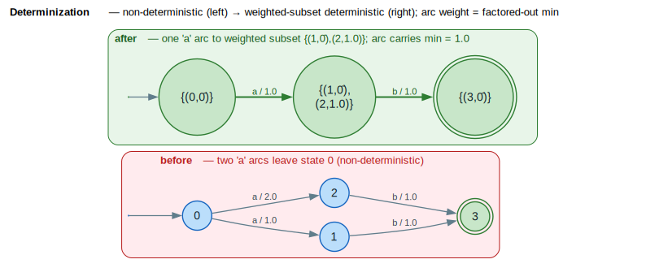

# Determinization

Determinization transforms a non-deterministic WFST into an equivalent deterministic one, where each state has at most one outgoing transition per input label. This enables efficient single-pass recognition and is often a prerequisite for minimization.

## Terms & symbols

Defined centrally in [`../NOTATION.md`](../NOTATION.md); repeated locally for the terms this doc uses.

| Symbol | Meaning |
|---|---|
| `⊕` / `⊗` | semiring *plus* (combine alternatives; tropical `min`) / *times* (combine arcs). |
| `⊘` | semiring divide (`divide` on a `DivisibleSemiring`); residual `` `w ⊘ min` ``. |
| `0̄` / `1̄` | `⊕`-identity ("no path") / `⊗`-identity ("empty path", zero cost). |
| `ρ(q)` | final-weight function `ρ : F → K`. |
| `F` | set of final states. |
| `∣Q∣`, `∣E∣` | number of states / transitions (cardinality bar `∣` = U+2223). |

## Concepts

### What is a Deterministic WFST?

A WFST (**W**eighted **F**inite-**S**tate **T**ransducer) is **deterministic** if:
1. It has exactly one start state
2. For each state, all outgoing transitions have distinct input labels
3. There are no epsilon (`ε`) transitions on the input

```text
Non-deterministic:              Deterministic:

       a/1.0                          a/1.0
   ┌──────────► 1                 ┌──────────► 1
   │                              │
   0                              0
   │                              │
   └──────────► 2                 └──────────► 2
       a/2.0                          b/2.0

   (Two 'a' arcs)                 (Distinct labels)
```

### Why Determinize?

1. **Efficient recognition**: Single path per input string—no backtracking needed
2. **Prerequisite for minimization**: Weighted minimization requires deterministic input
3. **Unique path property**: Simplifies lattice generation and scoring
4. **Composition optimization**: Deterministic components compose more efficiently

### The Weighted Powerset Construction

Unlike classical automata theory where determinization uses simple state sets, **weighted determinization** uses **weighted subsets**—sets of `(state, residual_weight)` pairs ([Mohri 2009](../BIBLIOGRAPHY.md#ref-mohri2009)):

```text
Non-deterministic state set:  {1, 2}

Weighted subset:  {(1, 0.5), (2, 1.5)}
                    │    │     │    │
                    │    │     │    └─ residual weight for state 2
                    │    │     └─ state 2
                    │    └─ residual weight for state 1
                    └─ state 1
```

The residual weight tracks "how much extra weight" each original state carries compared to the minimum. The figure below shows the construction collapsing two `a`-arcs into one: the arc carries the factored-out minimum `` `min(1.0, 2.0) = 1.0` `` and the loser's surplus rides inside the destination subset as a residual.



*Red panel = non-deterministic input (two `a`-arcs share a label); green panel = deterministic output. The arc weight is the factored-out `` `min` ``; residuals `` `(state, w ⊘ min)` `` live inside the subset state; double rings are final.*

<details><summary>Text view</summary>

```text
before (non-deterministic):           after (deterministic):

      a/1.0                                a/1.0
   ┌────────► 1 ──b/1.0──► (3)         0 ─────────► {(1,0̄),(2,1.0)} ─b/1.0─► {(3,0̄)}
   0                        ▲
   └────────► 2 ──b/1.0─────┘          arc carries min = 1.0;
      a/2.0                            residual 1.0 of state 2 rides in the subset
```

</details>

## Core API

### Types

```rust
/// Configuration for determinization
pub struct DeterminizeConfig {
    /// Maximum number of states in output (prevents runaway)
    pub max_states: Option<usize>,
    /// Whether to epsilon-remove first (recommended)
    pub remove_epsilon_first: bool,
    /// Whether to connect (trim) after determinization
    pub connect_after: bool,
}

/// Errors during determinization
pub enum DeterminizeError {
    NoStartState,
    StateLimitExceeded { limit: usize },
    NotDeterminizable { reason: String },
}
```

### Functions

```rust
/// Determinize a WFST using weighted powerset construction
pub fn determinize<L, W, F>(
    fst: &F,
    config: DeterminizeConfig,
) -> Result<F, DeterminizeError>;

/// Check if a WFST is deterministic
pub fn is_deterministic<L, W, F>(fst: &F) -> bool;

/// Count degree of non-determinism (max same-label arcs from one state)
pub fn non_determinism_degree<L, W, F>(fst: &F) -> usize;
```

## Examples

### Basic Usage

```rust
use lling_llang::prelude::*;
use lling_llang::algorithms::{determinize, is_deterministic, DeterminizeConfig};

// Build a non-deterministic WFST
// Two 'a' transitions from state 0:
//   0 --a/1.0--> 1 --b--> 3 (final)
//   0 --a/2.0--> 2 --c--> 3 (final)
let mut fst = VectorWfst::<char, TropicalWeight>::new();
fst.add_states(4);
fst.set_start(0);
fst.add_arc(0, Some('a'), Some('a'), 1, TropicalWeight::new(1.0));
fst.add_arc(0, Some('a'), Some('a'), 2, TropicalWeight::new(2.0));
fst.add_arc(1, Some('b'), Some('b'), 3, TropicalWeight::new(1.0));
fst.add_arc(2, Some('c'), Some('c'), 3, TropicalWeight::new(1.0));
fst.set_final(3, TropicalWeight::one());

// Check: not deterministic
assert!(!is_deterministic(&fst));
assert_eq!(non_determinism_degree(&fst), 2);

// Determinize
let det_fst = determinize(&fst, DeterminizeConfig::standard())?;

// Verify: now deterministic
assert!(is_deterministic(&det_fst));
```

### Diamond Pattern (Merging Paths)

```rust
// Diamond: two paths with same label sequence
//   0 --a/1--> 1 --b--> 3 (final)
//   0 --a/2--> 2 --b--> 3 (final)
let mut fst = VectorWfst::<char, TropicalWeight>::new();
fst.add_states(4);
fst.set_start(0);
fst.add_arc(0, Some('a'), Some('a'), 1, TropicalWeight::new(1.0));
fst.add_arc(0, Some('a'), Some('a'), 2, TropicalWeight::new(2.0));
fst.add_arc(1, Some('b'), Some('b'), 3, TropicalWeight::new(1.0));
fst.add_arc(2, Some('b'), Some('b'), 3, TropicalWeight::new(1.0));
fst.set_final(3, TropicalWeight::one());

let det_fst = determinize(&fst, DeterminizeConfig::standard())?;

// Diamond collapses to linear chain
// Result: 0 --a/1--> {1,2} --b/1--> {3}
// Fewer states than original
assert!(det_fst.num_states() <= fst.num_states());
```

### Weight Preservation

```rust
// Non-deterministic with two paths to final states
//   0 --a/1--> 1 (final, w=0)
//   0 --a/3--> 2 (final, w=0)
let mut fst = VectorWfst::<char, TropicalWeight>::new();
fst.add_states(3);
fst.set_start(0);
fst.add_arc(0, Some('a'), Some('a'), 1, TropicalWeight::new(1.0));
fst.add_arc(0, Some('a'), Some('a'), 2, TropicalWeight::new(3.0));
fst.set_final(1, TropicalWeight::one());
fst.set_final(2, TropicalWeight::one());

let det_fst = determinize(&fst, DeterminizeConfig::standard())?;

// After determinization:
// - 'a' transition has weight 1.0 (minimum of 1.0 and 3.0)
// - Final state merges both original finals
// - Residual weights incorporated into final weight
```

## Algorithm Details

### Weighted Subset Construction

The algorithm maintains a mapping from weighted subsets to deterministic output
states, expanding one subset at a time ([Mohri 2009](../BIBLIOGRAPHY.md#ref-mohri2009)).
The invariant is that each output state names a unique *normalized* weighted subset:
for every input label leaving that subset, all destination states are gathered, their
common weight factor `` `⊕`-`min` `` is factored onto the arc, and the per-state
surplus `` `w ⊘ min` `` is retained as a residual so that **total path weight is
preserved**. The literate chunks below name the three phases.

<details><summary>Text view</summary>

```text
procedure DETERMINIZE(fst):
    result ← new WFST
    initial_subset ← {(fst.start, 1̄)}                 // residual 1̄ at the start
    result.start ← new_state(initial_subset)
    queue.push(result.start, initial_subset)
    while queue not empty:
        (output_state, subset) ← queue.pop()
        for (state, residual) in subset:               // final weights
            if fst.is_final(state):
                result.final[output_state] ⊕= residual ⊗ fst.final_weight(state)
        for label in input_labels(subset):             // one arc per label
            target_subset ← compute_target_subset(subset, label)
            min_w ← ⊕-min{ w : (s, w) ∈ target_subset }
            normalized ← {(s, w ⊘ min_w) : (s, w) ∈ target_subset}
            target_state ← get_or_create(normalized)
            result.add_arc(output_state, label, min_w, target_state)
    return result
```

</details>

```text
⟨ seed the start subset ⟩ ≡
    initial_subset ← {(fst.start, 1̄)}
    result.start ← new_state(initial_subset)
    queue.push(result.start, initial_subset)
```

```text
⟨ accumulate the final weight of a subset ⟩ ≡
    for (state, residual) in subset:
        if fst.is_final(state):
            result.final[output_state] ⊕= residual ⊗ fst.final_weight(state)
```

```text
⟨ build one deterministic arc per label ⟩ ≡
    for label in input_labels(subset):
        target_subset ← compute_target_subset(subset, label)   // ⟨ move + multiply residuals ⟩
        min_w ← ⊕-min{ w : (s, w) ∈ target_subset }            // common factor
        normalized ← {(s, w ⊘ min_w) : (s, w) ∈ target_subset} // residuals
        target_state ← get_or_create(normalized)               // dedupe via subset cache
        result.add_arc(output_state, label, min_w, target_state)
```

```text
⟨ weighted subset determinization ⟩ ≡
    ⟨ seed the start subset ⟩
    while queue not empty:
        (output_state, subset) ← queue.pop()
        ⟨ accumulate the final weight of a subset ⟩
        ⟨ build one deterministic arc per label ⟩
    return result
```

The `` `get_or_create` `` cache is what bounds the construction: two states reached by
label sequences with identical *normalized* residual profiles map to the same output
state, so the determinized automaton stays finite whenever the input is determinizable.

### Weight Normalization

The key insight is **weight normalization** using the semiring's divide operation `` `⊘` `` (`` `divide` `` on a `DivisibleSemiring`):

```text
Before normalization:
  target_subset = {(1, 2.0), (2, 5.0), (3, 3.0)}

Compute minimum:
  min_w = ⊕-min(2.0, 5.0, 3.0) = 2.0

Normalized (each weight divided by min, w ⊘ min_w):
  normalized = {(1, 0.0), (2, 3.0), (3, 1.0)}

Transition weight = min_w = 2.0
```

This ensures:
- The arc carries the "common" weight factor
- Residuals track the "extra" weight per original state
- Total path weight is preserved

### Handling Final Weights

When a weighted subset contains final states, the deterministic state's final weight combines all contributions, i.e. `` `ρ'(subset) = ⊕ᵢ { rᵢ ⊗ ρ(qᵢ) : qᵢ ∈ F }` ``:

```text
subset = {(q₁, r₁), (q₂, r₂), ...}

final_weight = ⊕ᵢ { rᵢ ⊗ ρ(qᵢ) : qᵢ is final }

where ρ(q) is the final weight of state q
```

## Complexity

### Time Complexity

| Case | Complexity |
|------|------------|
| Worst case | `` `O(2^∣Q∣)` `` — exponential (powerset) |
| Unambiguous input | `` `O(∣Q∣ + ∣E∣)` `` — linear |
| Practical | Often near-linear for speech/NLP |

### Space Complexity

| Structure | Size |
|-----------|------|
| Subset cache | `O(#unique_subsets)` |
| Queue | `O(#active_subsets)` |
| Output WFST | `` `O(∣Q'∣ + ∣E'∣)` `` |

### Why Exponential Worst Case?

The powerset construction can create `` `2^∣Q∣` `` subsets in pathological cases:

```text
Exponential blowup example:

  0 → 1 → 2 → ... → n  (with alternating a/b choices)
      ↓   ↓         ↓
      1'  2'        n'

  Each state can be in or out of the subset → 2ⁿ possibilities
```

The `max_states` configuration prevents runaway:

```rust
let config = DeterminizeConfig {
    max_states: Some(1_000_000),  // Limit output size
    ..Default::default()
};
```

## Special Cases

### Epsilon Transitions

Epsilon transitions on the input make determinization more complex:

```rust
// Recommended: remove epsilon first
let config = DeterminizeConfig {
    remove_epsilon_first: true,  // Default
    ..Default::default()
};
```

If `remove_epsilon_first` is true, the algorithm handles ε-removal internally.

### Already Deterministic Input

If the input is already deterministic, the algorithm essentially copies it:

```rust
let fst = build_deterministic_fst();
assert!(is_deterministic(&fst));

let det = determinize(&fst, DeterminizeConfig::standard())?;
// det has same structure as fst
```

### Empty WFST

```rust
let fst: VectorWfst<char, TropicalWeight> = VectorWfst::new();
let det = determinize(&fst, DeterminizeConfig::standard())?;
assert_eq!(det.num_states(), 0);
```

## Semiring Requirements

Determinization requires a **divisible semiring**:

```rust
pub trait DivisibleSemiring: Semiring {
    fn divide(&self, other: &Self) -> Option<Self>;
}
```

| Semiring | Divisible | Division Operation |
|----------|-----------|-------------------|
| Tropical | Yes | `` `a ⊘ b = a − b` `` |
| Log | Yes | `` `a ⊘ b = a − b` `` |
| Probability | Yes | `` `a ⊘ b = a ∕ b` `` |
| Boolean | No | N/A |
| String | No | N/A |

**Why division?** Weight normalization requires dividing each weight by the minimum (`` `w ⊘ min` ``) to compute residuals.

## Common Patterns

### Pre-Minimization Pipeline

```rust
use lling_llang::algorithms::{
    remove_epsilon, determinize, minimize,
    EpsilonRemovalConfig, DeterminizeConfig, MinimizeConfig,
};

// Standard optimization pipeline:
// 1. Remove epsilon transitions
remove_epsilon(&mut fst, EpsilonRemovalConfig::default())?;

// 2. Determinize
let det = determinize(&fst, DeterminizeConfig::standard())?;

// 3. Minimize (requires deterministic input)
let min = minimize(&det, MinimizeConfig::default())?;
```

### Checking Before Determinizing

```rust
if !is_deterministic(&fst) {
    let det = determinize(&fst, DeterminizeConfig::standard())?;
    // Use det...
} else {
    // Already deterministic, skip
}
```

### Measuring Non-Determinism

```rust
let degree = non_determinism_degree(&fst);

match degree {
    0 => println!("Empty WFST"),
    1 => println!("Already deterministic"),
    d => println!("Non-determinism degree: {} (max same-label arcs)", d),
}
```

## Visualization

The [before/after diagram](#the-weighted-powerset-construction) above renders this construction; the ASCII views are kept here for reference.

### Before Determinization

```text
          a/1.0                    b/1.0
    [0] ─────────► 1 ─────────────────────► (3)
      │                                      ▲
      │                                      │
      └─────────► 2 ─────────────────────────┘
          a/2.0              c/1.0

Non-deterministic: two 'a' arcs from state 0
```

### After Determinization

```text
          a/1.0                    b/1.0
    [0] ─────────► {1,2} ─────────────────► ({3}, final)
                     │                       ▲
                     │                       │
                     └───────────────────────┘
                              c/1.0

Deterministic: single 'a' arc to merged state {1,2}
Arc weight = ⊕-min(1.0, 2.0) = 1.0
```

### Weight Flow Example

```text
Original paths for input "ab":
  Path 1: 0 --a/1--> 1 --b/2--> 3 (final)  Total: 3
  Path 2: 0 --a/3--> 2 --b/2--> 3 (final)  Total: 5

Determinized (tropical ⊕ = min):
  0 --a/1--> {1:0, 2:2} --b/2--> (final)

  After 'a': weight=1, residuals={1:0, 2:2}
  After 'b': weight=1 ⊗ 2 = 3, final with residual combination

Best path weight preserved: 3
```

## Error Handling

```rust
use lling_llang::algorithms::DeterminizeError;

match determinize(&fst, config) {
    Ok(det) => {
        // Success - use determinized WFST
    }
    Err(DeterminizeError::NoStartState) => {
        // Input WFST has no start state
    }
    Err(DeterminizeError::StateLimitExceeded { limit }) => {
        // Output grew too large, increase max_states or simplify input
    }
    Err(DeterminizeError::NotDeterminizable { reason }) => {
        // WFST cannot be determinized (cycle issues)
    }
}
```

## Performance Tips

1. **Remove epsilon first**: Epsilon-free WFSTs determinize faster
2. **Set reasonable limits**: Use `max_states` to catch blowup early
3. **Check first**: Use `is_deterministic()` to skip unnecessary work
4. **Measure degree**: High `non_determinism_degree` suggests potential blowup

## References

- [Mohri 2009](../BIBLIOGRAPHY.md#ref-mohri2009) — *Weighted Automata Algorithms*: weighted determinization via the weighted-subset construction, residual normalization, and the determinizability condition (twins property).
- [Mohri 2002](../BIBLIOGRAPHY.md#ref-mohri2002) — *Weighted Finite-State Transducers in Speech Recognition*: determinization as a stage of the standard recognition-cascade optimization pipeline.
- [Allauzen 2007](../BIBLIOGRAPHY.md#ref-allauzen2007) — *OpenFst*: the reference library whose `Determinize` operation and `DivisibleSemiring`-style weight API this implementation mirrors.

## Next Steps

- [Epsilon Removal](epsilon-removal.md): Required before determinization
- [Minimization](minimization.md): Uses determinization as prerequisite
- [Weight Pushing](weight-pushing.md): Often combined with determinization
- [Semirings](../architecture/semirings.md): Understanding divisible semirings
