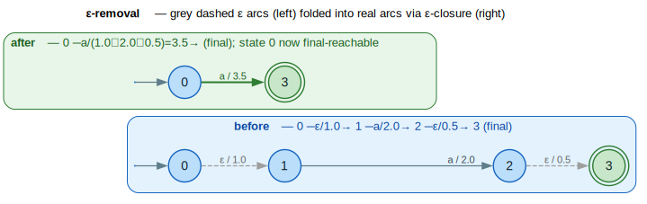

# Epsilon Removal

Epsilon removal eliminates `ε` (epsilon) transitions from a WFST while preserving the weighted language. Epsilon transitions are arcs with no input and no output labels—they allow the automaton to change state without consuming or producing any symbols. (WFST = **W**eighted **F**inite-**S**tate **T**ransducer.)

## Terms & symbols

Defined centrally in [`../NOTATION.md`](../NOTATION.md); repeated locally for the terms this doc uses.

| Symbol | Meaning |
|---|---|
| `ε` | the empty label — a transition that consumes and emits nothing. |
| `⊕` / `⊗` | semiring *plus* (combine alternatives) / *times* (combine arcs). |
| `0̄` / `1̄` | `⊕`-identity ("no path") / `⊗`-identity ("empty path", zero cost). |
| `a*` | star/closure `a* = 1̄ ⊕ a ⊕ a² ⊕ …` (for `ε`-cycles). |
| `→ε*` | reaches via zero or more `ε` arcs. |
| `∣Q∣`, `∣E∣` | number of states / transitions (cardinality bar `∣` = U+2223). |

## Concepts

### What are Epsilon Transitions?

An epsilon (`ε`) transition is an arc where both input and output labels are absent:

```text
State 0 --ε/w--> State 1    (no label consumed or produced)

vs.

State 0 --a:b/w--> State 1  (consumes 'a', produces 'b')
```

Epsilon transitions are useful for:
- **Building complex automata compositionally** (union, concatenation, closure operations add ε-transitions)
- **Modeling optional elements** (skip via ε)
- **Synchronizing** different parts of an automaton

### Why Remove Epsilon Transitions?

1. **Determinization requirement**: Most determinization algorithms require ε-free input
2. **Simpler composition**: Without ε, no epsilon filter needed
3. **Direct decoding**: Labels can be matched directly without ε-handling
4. **Smaller automata**: Often reduces total transitions

## Core API

### Types

```rust
// Configuration for epsilon removal
pub struct EpsilonRemovalConfig {
    pub connect: bool,                    // Remove unreachable states afterward
    pub distance_config: ShortestDistanceConfig, // For ε-closure computation
}

// Errors during epsilon removal
pub enum EpsilonRemovalError {
    NoStartState,           // WFST has no start state
    NonConvergentCycle,     // ε-cycle with divergent weight
}
```

### Functions

```rust
// Remove epsilon transitions
pub fn remove_epsilon<L, W, F>(
    fst: &mut F,
    config: EpsilonRemovalConfig,
) -> Result<(), EpsilonRemovalError>;

// Remove epsilon with star semiring (for ε-cycles)
pub fn remove_epsilon_star<L, W, F>(
    fst: &mut F,
    config: EpsilonRemovalConfig,
) -> Result<(), EpsilonRemovalError>;

// Check if WFST has any epsilon transitions
pub fn has_epsilon_transitions<L, W, F>(fst: &F) -> bool;
```

## Examples

### Basic Usage

```rust
use lling_llang::prelude::*;
use lling_llang::algorithms::{remove_epsilon, has_epsilon_transitions, EpsilonRemovalConfig};

// Build a WFST with epsilon transitions
let mut fst: VectorWfst<char, TropicalWeight> = VectorWfst::new();
let s0 = fst.add_state();
let s1 = fst.add_state();
let s2 = fst.add_state();
fst.set_start(s0);
fst.add_epsilon(s0, s1, TropicalWeight::new(1.0));  // ε-transition
fst.add_arc(s1, Some('a'), Some('a'), s2, TropicalWeight::new(2.0));
fst.set_final(s2, TropicalWeight::one());

// Check for epsilon transitions
assert!(has_epsilon_transitions(&fst));

// Remove epsilon transitions
remove_epsilon(&mut fst, EpsilonRemovalConfig::default())?;

// Verify removal
assert!(!has_epsilon_transitions(&fst));

// Original: 0 --ε/1.0--> 1 --a/2.0--> 2
// After:    0 --a/3.0--> 2 (weights combined)
```

### Epsilon to Final State

```rust
// 0 --a/1.0--> 1 --ε/0.5--> 2 (final)
let mut fst: VectorWfst<char, TropicalWeight> = VectorWfst::new();
let s0 = fst.add_state();
let s1 = fst.add_state();
let s2 = fst.add_state();
fst.set_start(s0);
fst.add_arc(s0, Some('a'), Some('a'), s1, TropicalWeight::new(1.0));
fst.add_epsilon(s1, s2, TropicalWeight::new(0.5));
fst.set_final(s2, TropicalWeight::one());

remove_epsilon(&mut fst, EpsilonRemovalConfig::default())?;

// After removal, state 1 becomes final:
// - Path: 0 --a/1.0--> 1 (final, weight 0.5)
// - The ε-weight is absorbed into state 1's final weight
assert!(fst.is_final(1));
```

### Acyclic Optimization

```rust
// For acyclic graphs, use the optimized configuration
let config = EpsilonRemovalConfig::acyclic();
remove_epsilon(&mut fst, config)?;
```

## Algorithm Details

The figure below shows the whole transform end-to-end: a chain with two `ε` arcs (grey dashed) is folded into a single labelled arc whose weight is the `⊗`-product across the `ε`-closure, and the start state becomes final-reachable.



*Grey dashed = `ε` arcs (removed); the surviving `a`-arc absorbs the `ε`-weights via `⊗`; the green double-ring final state's weight absorbs any `ε`-reachable final.*

<details><summary>Text view</summary>

```text
        ε/1.0         a/2.0         ε/0.5
  [0] --------> 1 --------> 2 --------> (3)      ⟹      [0] --a/3.5--> (3 final)
```

</details>

### Epsilon Closure

The key concept is the **epsilon closure** of a state—all states reachable via `ε`-transitions with accumulated weights, i.e. `` `ε-closure(q) = { (s, w) : q →ε* s, total weight w }` ``:

```text
ε-closure(q) = { (s, w) : q →ε* s with total weight w }
```

For example:

```text
      ε/1.0       ε/0.5
  0 --------> 1 --------> 2

ε-closure(0) = { (0, 1̄), (1, 1.0), (2, 1.5) }
             = { (0, 0), (1, 1.0), (2, 1.5) } in tropical
```

The closure is itself a single-source shortest-distance over the `ε`-subgraph: the weight on `(s, w)` is `` `⊕` `` over every `ε`-path `q →ε* s`. For acyclic `ε`-subgraphs a topological pass suffices; for `ε`-cycles the closure needs the star `` `a*` `` (see [Epsilon Cycles](#epsilon-cycles)).

### Removal Algorithm

The removal invariant is *every weighted `ε`-path is replaced by an equivalent
real arc or final-weight contribution, and no `ε` arc survives*. For each non-`ε`
transition `` `p --a:b/w--> q` ``, the destination's closure is expanded and the
arc retargeted across it; finals reachable by `ε` donate their weight to `p`'s
final weight.

```text
⟨ ε-closure of a state ⟩ ≡
    // single-source shortest-distance over the ε-subgraph from q
    closure ← { (q, 1̄) }
    relax ε-arcs: for q →ε(w)→ s,  closure[s] ⊕= (closure-weight-of q) ⊗ w
    return closure     // { (s, w) : q →ε* s }
```

```text
⟨ retarget one real arc across the closure ⟩ ≡
    for (s, w') in ε-closure(q):
        add arc  p --a:b/(w ⊗ w')--> s        // ⊗ folds the ε-weight in
```

```text
⟨ absorb ε-reachable finals ⟩ ≡
    for (s, w') in ε-closure(p):
        if s is final:  ρ'(p) ⊕= w' ⊗ ρ(s)    // p may become final
```

```text
⟨ remove epsilon transitions ⟩ ≡
    for each non-ε arc  p --a:b/w--> q:
        ⟨ retarget one real arc across the closure ⟩
    for each state p:
        ⟨ absorb ε-reachable finals ⟩
    delete every ε arc
    (optionally) connect: drop now-unreachable states
```

For example:

```text
Before:                     After:

  0 --a/1.0--> 1 --ε/0.5--> 2 (final)

       │
       ▼

  0 --a/1.5--> 2 (final)    // Combined: 1.0 ⊗ 0.5 = 1.5
```

**Complexity.** Computing one `ε`-closure costs up to `` `O(∣Q∣ + ∣E∣)` `` and there
are up to `` `∣Q∣` `` of them, giving the `` `O(∣Q∣² + ∣Q∣∣E∣)` `` figure below for
`k`-closed semirings; a complete semiring with `ε`-cycles needs the star and rises to
`` `O(∣Q∣³ + ∣Q∣∣E∣)` ``.

### Handling Start State

If the start state has `ε`-transitions, those must also be processed:

```text
Before:
       ε/1.0       a/2.0
  [0] -------> 1 --------> 2

After:
       a/3.0
  [0] --------> 2          // Weight: 1.0 ⊗ 2.0 = 3.0
```

### Transition Deduplication

When multiple paths lead to the same `(from, to, input, output)` tuple, weights are combined using `` `⊕` ``:

```text
Before:
  0 --a/1.0--> 1 --ε/0.5--> 2
  0 --a/2.0--> 3 --ε/0.3--> 2

After (tropical semiring, ⊕ = min):
  0 --a/(1.5 ⊕ 2.3)--> 2
  0 --a/1.5--> 2
```

## Complexity

| Graph Type | Semiring | Time Complexity |
|------------|----------|-----------------|
| Acyclic | Any | `` `O(∣Q∣² + ∣Q∣∣E∣)` `` |
| General | k-closed | `` `O(∣Q∣² + ∣Q∣∣E∣)` `` |
| General | Complete | `` `O(∣Q∣³ + ∣Q∣∣E∣)` `` |

Where:
- `` `∣Q∣` `` = number of states
- `` `∣E∣` `` = number of transitions

The `` `∣Q∣²` `` term comes from computing `ε`-closures for all states.

## Special Cases

### Epsilon Cycles

Epsilon cycles require special handling:

```text
    ε/0.1
  ┌───────┐
  │       │
  ▼       │
  0 ──────┘
```

For the tropical semiring, the closure of this cycle is `0̄`'s neighbour `0` — the `` `⊕`-`min` `` of `` `0, 0.1, 0.2, …` `` is `0`.

For the log semiring, the closure uses the star operation: `` `a* = −log(1 − e⁻ᵃ)` `` for `` `a > 0` ``.

Use `remove_epsilon_star()` for graphs with `ε`-cycles when using a `StarSemiring`.

### Input-Only or Output-Only Epsilon

An arc with only input `ε` or only output `ε` is **not** considered an epsilon transition:

```text
0 --ε:a/w--> 1    // NOT epsilon (has output 'a')
0 --a:ε/w--> 1    // NOT epsilon (has input 'a')
0 --ε:ε/w--> 1    // IS epsilon (both absent)
```

## Common Patterns

### Pre-Determinization

```rust
use lling_llang::algorithms::{remove_epsilon, determinize};

// Determinization typically requires ε-free input
remove_epsilon(&mut fst, EpsilonRemovalConfig::default())?;
let det = determinize(&fst, DeterminizeConfig::default())?;
```

### After Union/Concatenation

Rational operations often introduce ε-transitions:

```rust
use lling_llang::wfst::{union, concat};

let combined = union(&fst_a, &fst_b);  // Adds ε-transitions from super-start

// Remove ε for further processing
let mut combined_mut = combined.to_vector_wfst();
remove_epsilon(&mut combined_mut, EpsilonRemovalConfig::default())?;
```

### Checking Before Processing

```rust
if has_epsilon_transitions(&fst) {
    remove_epsilon(&mut fst, EpsilonRemovalConfig::default())?;
}
// Now safe to determinize
```

## Visualization

The [before/after diagram](#algorithm-details) above renders the linear case; these ASCII views add a branch to a second `ε`-reachable final.

### Before Epsilon Removal

```text
        ε/1.0         a/2.0         ε/0.5
  [0] --------> 1 --------> 2 --------> (3)
                            │
                            └── ε/0.3 ──> (4)
```

### After Epsilon Removal

```text
        a/3.0                a/3.3
  [0] --------> (3)    [0] --------> (4)
        │
        └── a/3.5 ──> (4)     (via path 0→1→2→4)

  Final weights adjusted for ε-reachable finals
```

## Error Handling

```rust
use lling_llang::algorithms::EpsilonRemovalError;

match remove_epsilon(&mut fst, config) {
    Ok(()) => { /* success */ }
    Err(EpsilonRemovalError::NoStartState) => {
        // WFST has no start state set
    }
    Err(EpsilonRemovalError::NonConvergentCycle) => {
        // ε-cycle with weight that doesn't converge
        // (e.g., tropical with negative weight)
    }
}
```

## References

- [Mohri 2009](../BIBLIOGRAPHY.md#ref-mohri2009) — *Weighted Automata Algorithms*: `ε`-removal as `ε`-closure shortest-distance, the star treatment of `ε`-cycles, and the complexity bounds used here.
- [Mohri 2002](../BIBLIOGRAPHY.md#ref-mohri2002) — *Weighted Finite-State Transducers in Speech Recognition*: `ε`-removal as a normalization step preceding determinization in the recognition cascade.

## Next Steps

- [Determinization](determinization.md): Often requires `ε`-free input
- [WFST Operations](../architecture/wfst-operations.md): Operations that create `ε`-transitions
- [Shortest-Distance](shortest-distance.md): Used for `ε`-closure computation
- [Semirings](../architecture/semirings.md): Understanding star operation for cycles
