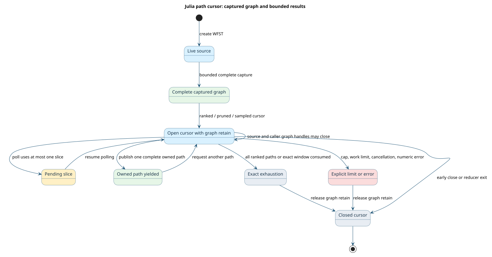

# Julia path cursor formal contract

The Julia facade exposes bounded traversal, ranked and cost-pruned paths,
forward and backward distances, and seeded sampling. This document connects
the public cursor behavior in [LlingLlang.jl](../../bindings/julia/LlingLlang/README.md)
to an executable finite-state model. Algorithm definitions and semiring
background remain in [path extraction](path-extraction.md),
[path sampling](path-sampling.md), and [weighted automata algorithms](../BIBLIOGRAPHY.md#ref-mohri2009).



## Resources and outcomes

A **source** is a live WFST resource. A **captured graph** is an immutable,
complete reachable graph with its own lifetime. A **cursor** retains that
graph after either the source or the caller's graph handle closes. A
**polling slice** is one call bounded by `work_per_call`; it may return
`Pending` without publishing a path. A path is an owned Julia value after
the native result is copied. A reducer closes its cursor on ordinary return
and on callback failure.

The [TLA+ model](../../proofs/tla/JuliaPathSearchLifecycle.tla) checks these
resource and outcome laws over three ranked accepting paths. Its costs are
nondecreasing; the first two tie, so the model can check stable tie order.
Every result requires two abstract work decisions, which makes `Pending`
reachable when one call allows one decision. This abstraction tests cursor
scheduling and publication. Native Dijkstra/Viterbi frontier behavior,
semiring arithmetic, cyclic convergence, posterior mass, and sampling
distribution are checked by the existing Rust, ABI, and Julia tests; the
finite scheduler model does not claim those algorithms have been proved for
arbitrary WFSTs.

For each positive model configuration, TLC explores the **complete reachable
state graph** within the declared bounds. Ranked, exact cost-window pruning,
seeded sampling, and numeric rejection use distinct configurations. The
model keeps work, slice size, output count, and the sample trace finite.
In particular, the following safety bounds hold at every state:

```math
w \leq W,\qquad s \leq S,\qquad n_{\mathrm{out}} \leq N.
```

Here $`w`$ is total work, $`W`$ its limit, $`s`$ work in the current poll,
$`S`$ the per-call limit, $`n_{\mathrm{out}}`$ the number of published paths,
and $`N`$ the result limit. The model's sample selector is a small
deterministic stand-in for native seeded randomness. It proves trace
stability under the same abstract seed; the generated Julia property
compares two actual native runs with the same seed.

## Invariant-to-property correspondence

The [machine-readable ledger](../../proofs/doc/julia-path-invariants.json)
defines all eleven rows. The generator checks exact TLA+ invariant names and
emits sixteen cases per row into
[Julia property tests](../../bindings/julia/LlingLlang/test/generated_path_properties.jl).
The cases call the public Julia facade with complete graphs, bounded cursors,
owned paths, reducers, and cancellation. The formal gate also mutates one
transition or initial-state field per row and requires the associated
invariant to fail. A mutation that passes is a gate failure.

| Invariant | Julia property | Fault caught by the model |
| --- | --- | --- |
| `TypeOK` | `type_ok` | invalid cursor state value |
| `GraphPinned` | `graph_pinned` | dropped graph retain |
| `WorkBounded` | `work_bounded` | work-counter overrun |
| `OutputBounded` | `output_bounded` | excess published paths |
| `RankedOrder` | `ranked_order` | skipped rank or tie |
| `PruneSound` | `prune_sound` | out-of-window path |
| `SeedStable` | `seed_stable` | draw ignoring its index |
| `TerminalDistinct` | `terminal_distinct` | sample cap reported as exhaustion |
| `CancelSticky` | `cancel_sticky` | output after cancellation |
| `NumericFailureNoOutput` | `numeric_failure_no_output` | path published on numeric failure |
| `ReducerSettles` | `reducer_settles` | graph retained after reducer exit |

`Exhausted` means the ranked stream is provably complete or its exact cost
window ended. `Truncated` means the requested path or sample cap stopped a
stream that could continue. `WorkLimit`, cancellation, and numeric failure
remain distinct errors. The public tests assert that none of these error
conditions is silently converted to exact exhaustion.

## Reproduce the checks

```sh
python3 scripts/generate-julia-path-properties.py --check
python3 scripts/verify-julia-path-formal.py
bash proofs/verify.sh --tla-only
julia --project=bindings/julia/LlingLlang bindings/julia/LlingLlang/test/runtests.jl
```

The TLA+ commands need TLC or the checksum-pinned `TLA2TOOLS_JAR` used in
CI. The Julia command needs the local sibling packages and the built native
library, as in the Julia CI job. The formal gate stores per-case state counts
and mutant counterexamples in `target/formal-verification/julia-path`.
These artifacts prove the finite scheduler laws and their API correspondence
at the tested bounds; they do not replace the native algorithm or semiring
conformance gates.
