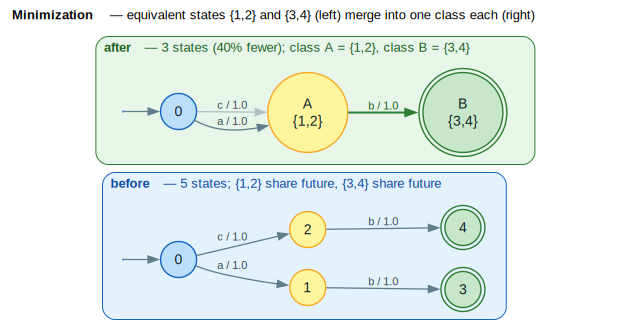

# Minimization

Minimization produces a WFST with the minimum number of states that accepts the same weighted language. This is the final optimization step in the standard WFST pipeline, reducing both states and transitions. (WFST = **W**eighted **F**inite-**S**tate **T**ransducer.)

## Terms & symbols

Defined centrally in [`../NOTATION.md`](../NOTATION.md); repeated locally for the terms this doc uses.

| Symbol | Meaning |
|---|---|
| $`\oplus`$ / $`\otimes`$ | semiring *plus* (combine alternatives) / *times* (combine arcs). |
| $`\bar{0}`$ / $`\bar{1}`$ | $`\oplus`$-identity / $`\otimes`$-identity. |
| $`\rho(q)`$ | final-weight function $`\rho : F \to K`$. |
| $`\equiv`$ | state-equivalence (Myhill-Nerode): same weighted future. |
| $`\Sigma^*`$ | all finite strings over the input alphabet $`\Sigma`$. |
| $`\lvert Q\rvert`$, $`\lvert E\rvert`$ | number of states / transitions. |

## Concepts

### What is Minimization?

Minimization identifies and merges **equivalent states**—states that behave identically for all possible continuations. In the example below, states 1 and 2 share a future (both read $`b`$ into a final class), as do 3 and 4 (both final with the same weight), so each pair collapses to a single class.



*Amber states = equivalence class A $`\{1,2\}`$; green double-ring states = final class B $`\{3,4\}`$. Left panel is the input; right panel is the minimal automaton (one state per class); the green bold arc is the shared $`b`$-transition.*

<details><summary>Text view</summary>

```text
Before minimization:              After minimization:

    0 ──a──► 1 ──b──► 3 (final)       0 ──a──► 1 ──b──► 2 (final)
      │                                 │
      └──c──► 2 ──b──► 4 (final)        └──c──┘

States 3 and 4 are equivalent (same outgoing transitions, same final weight)
States 1 and 2 are also equivalent → merge them
```

</details>

### Why Minimize?

1. **Smaller automata**: Fewer states and transitions
2. **Faster recognition**: Less memory traversal
3. **Canonical form**: Equivalent WFSTs produce identical minimized forms
4. **Memory efficiency**: Reduced storage requirements

### The Minimization Pipeline

Minimization combines two steps:

```text
┌─────────────────┐    ┌─────────────────────┐    ┌─────────────────┐
│  Weight Push    │ ─► │ Partition Refinement│ ─► │  Build Minimal  │
│ (normalize)     │    │   (find equiv.)     │    │     WFST        │
└─────────────────┘    └─────────────────────┘    └─────────────────┘
```

1. **Weight pushing**: Normalize weight distribution to canonical form
2. **Partition refinement**: Find equivalence classes of states
3. **Build minimal WFST**: One state per equivalence class

## Core API

### Types

```rust
/// Configuration for minimization
pub struct MinimizeConfig {
    /// Push weights before minimizing (recommended)
    pub push_weights: bool,
    /// Direction for weight pushing
    pub push_direction: PushDirection,
    /// Whether to connect (trim) before minimization
    pub connect_first: bool,
}

/// Errors during minimization
pub enum MinimizeError {
    NoStartState,
    NotDeterministic,
    PushError(String),
}
```

### Functions

```rust
/// Minimize a deterministic WFST
pub fn minimize<L, W, F>(
    fst: &F,
    config: MinimizeConfig,
) -> Result<F, MinimizeError>;

/// Estimate how many states can be removed
pub fn estimate_reduction<L, W, F>(fst: &F) -> usize;
```

## Examples

### Basic Usage

```rust
use lling_llang::prelude::*;
use lling_llang::algorithms::{
    determinize, minimize,
    DeterminizeConfig, MinimizeConfig,
};

// Build a WFST with redundant states
let mut fst = VectorWfst::<char, TropicalWeight>::new();
fst.add_states(5);
fst.set_start(0);
fst.add_arc(0, Some('a'), Some('a'), 1, TropicalWeight::new(1.0));
fst.add_arc(0, Some('c'), Some('c'), 2, TropicalWeight::new(1.0));
fst.add_arc(1, Some('b'), Some('b'), 3, TropicalWeight::new(1.0));
fst.add_arc(2, Some('b'), Some('b'), 4, TropicalWeight::new(1.0));
fst.set_final(3, TropicalWeight::one());
fst.set_final(4, TropicalWeight::one());

// States 3 and 4 are equivalent (same final weight, same transitions)
// States 1 and 2 are equivalent (same outgoing, target same equivalence class)

let initial_states = fst.num_states();

// Minimize
let min_fst = minimize(&fst, MinimizeConfig::standard())?;

// Fewer states after minimization
assert!(min_fst.num_states() < initial_states);
```

### Full Optimization Pipeline

```rust
use lling_llang::algorithms::{
    remove_epsilon, determinize, minimize,
    EpsilonRemovalConfig, DeterminizeConfig, MinimizeConfig,
};

// Standard WFST optimization pipeline:
// 1. Remove epsilon transitions
remove_epsilon(&mut fst, EpsilonRemovalConfig::default())?;

// 2. Determinize (required for minimization)
let det = determinize(&fst, DeterminizeConfig::standard())?;

// 3. Minimize
let min = minimize(&det, MinimizeConfig::standard())?;

println!("Original: {} states", fst.num_states());
println!("Minimized: {} states", min.num_states());
```

### Estimating Reduction

```rust
use lling_llang::algorithms::estimate_reduction;

// Before expensive minimization, check if it's worthwhile
let reduction = estimate_reduction(&fst);

if reduction > 0 {
    println!("Can remove {} states via minimization", reduction);
    let min_fst = minimize(&fst, MinimizeConfig::standard())?;
} else {
    println!("Already minimal");
}
```

### Without Weight Pushing

```rust
// If input is already pushed, skip pushing step
let config = MinimizeConfig {
    push_weights: false,  // Skip pushing
    connect_first: true,
    ..Default::default()
};

let min_fst = minimize(&pushed_fst, config)?;
```

## Algorithm Details

### Partition Refinement

The algorithm uses **Hopcroft-style partition refinement** ([Mohri 2009](../BIBLIOGRAPHY.md#ref-mohri2009)). The invariant is that two states sharing a block could still be equivalent; each refinement round splits a block whenever two of its states are *distinguished* by their signature — their final weight or the block-labelled profile of their outgoing arcs. The partition only ever gets finer, so the fixpoint is the coarsest stable partition: exactly the equivalence classes.

<details><summary>Text view</summary>

```text
procedure PARTITION_REFINEMENT(fst):
    partition ← separate states by final_weight        // initial split
    repeat:
        for each state q:
            signature[q] ← (final_weight(q), {(label, weight, partition[target])})
        new_partition ← group states by signature
    until partition == new_partition
    return partition
```

</details>

```text
⟨ initial partition by final weight ⟩ ≡
    partition ← { states with the same ρ(q) value go in one block }
    // non-final states (ρ = 0̄) form one block; each distinct final weight its own
```

```text
⟨ compute a state signature ⟩ ≡
    signature[q] ← ( ρ(q),  multiset{ (in, out, w, partition[target]) : arc q→target } )
    // two states distinguishable ⟺ different signatures under the CURRENT partition
```

```text
⟨ refine until stable ⟩ ≡
    repeat:
        for each state q:  ⟨ compute a state signature ⟩
        new_partition ← group states by equal signature
        swap(partition, new_partition)
    until partition unchanged
```

```text
⟨ partition refinement ⟩ ≡
    ⟨ initial partition by final weight ⟩
    ⟨ refine until stable ⟩
    return partition
```

The refinement terminates because each round either splits at least one block (strictly
increasing the block count, bounded by $`\lvert Q\rvert`$) or changes nothing and stops. A
worklist implementation of this scheme attains Hopcroft's $`O(\lvert E\rvert \log \lvert Q\rvert)`$ bound.

### State Signatures

A state's **signature** captures everything needed to distinguish it:

```rust
struct StateSignature<L, W> {
    final_weight: Option<W>,
    transitions: Vec<(input_label, output_label, weight, target_partition)>,
}
```

Two states are equivalent if and only if they have identical signatures.

### Building the Minimal WFST

Once partitions are computed:

```text
1. Create one state per partition
2. Choose representative from each partition
3. Copy transitions from representative to new state
4. Map target states to their partition numbers
```

```text
Partitions:                    Minimal WFST:

  [0]: {0}                        0' (start)
  [1]: {1, 2}                     1' (merged from 1,2)
  [2]: {3, 4}                     2' (merged from 3,4, final)
```

### Why Weight Pushing First?

Weight pushing ensures a **canonical weight distribution**:

```text
Before pushing:                    After pushing:
  0 --a/2--> 1 --b/3--> (F)         0 --a/5--> 1 --b/0--> (F)
  0 --a/2--> 2 --b/3--> (F)         0 --a/5--> 2 --b/0--> (F)

  States 1,2 have same             States 1,2 now have
  transitions but different         identical signatures
  weight distributions              → Can be merged!
```

Without pushing, equivalent states might have different weight distributions, preventing their identification.

## Complexity

### Time Complexity

| Case | Complexity |
|------|------------|
| Acyclic | $`O(\lvert Q\rvert + \lvert E\rvert)`$ |
| General | $`O(\lvert E\rvert \log \lvert Q\rvert)`$ |

The $`O(\lvert E\rvert \log \lvert Q\rvert)`$ bound comes from Hopcroft's algorithm for partition refinement.

### Space Complexity

| Structure | Size |
|-----------|------|
| Partition array | $`O(\lvert Q\rvert)`$ |
| Signatures | $`O(\lvert Q\rvert \times \text{avg\_out\_degree})`$ |
| Output WFST | $`O(\lvert Q'\rvert + \lvert E'\rvert)`$ where $`\lvert Q'\rvert \le \lvert Q\rvert`$ |

## Requirements

### Deterministic Input

Minimization **requires deterministic input**:

```rust
let result = minimize(&non_det_fst, config);
// Returns Err(MinimizeError::NotDeterministic)

// Solution: determinize first
let det = determinize(&fst, DeterminizeConfig::standard())?;
let min = minimize(&det, MinimizeConfig::standard())?;
```

### Divisible Semiring

Weight pushing (part of minimization) requires a divisible semiring:

| Semiring | Divisible | Minimizable |
|----------|-----------|-------------|
| Tropical | Yes | Yes |
| Log | Yes | Yes |
| Probability | Yes | Yes |
| Boolean | No | No |
| String | No | No |

## Common Patterns

### ASR Transducer Optimization

In speech recognition, the full cascade is minimized:

```rust
// Build recognition transducer
let cascade = compose(&h, &compose(&c, &compose(&l, &g)));

// Standard optimization pipeline
remove_epsilon(&mut cascade, EpsilonRemovalConfig::default())?;
let det = determinize(&cascade, DeterminizeConfig::standard())?;
let min = minimize(&det, MinimizeConfig::standard())?;

// Typically: 30-50% state reduction
```

### Equivalence Testing

Minimized WFSTs provide a canonical form for equivalence testing:

```rust
let min1 = minimize(&fst1, MinimizeConfig::standard())?;
let min2 = minimize(&fst2, MinimizeConfig::standard())?;

// If minimal forms are isomorphic, WFSTs are equivalent
let equivalent = are_isomorphic(&min1, &min2);
```

### Incremental Minimization

For large WFSTs, check if minimization is worthwhile:

```rust
let reduction = estimate_reduction(&fst);
let ratio = reduction as f64 / fst.num_states() as f64;

if ratio > 0.1 {  // >10% reduction
    let min = minimize(&fst, MinimizeConfig::standard())?;
    // Use minimized version
} else {
    // Reduction too small, skip minimization
}
```

## Visualization

The [before/after diagram](#what-is-minimization) above renders this reduction; the ASCII views are kept here for reference.

### Before Minimization

```text
                 a/1.0         b/1.0
          [0] ─────────► 1 ─────────► (3)
            │
            │ c/1.0         b/1.0
            └─────────► 2 ─────────► (4)

States: 5
Transitions: 4

Equivalent pairs: {1,2}, {3,4}
```

### After Minimization

```text
                 a/1.0
          [0] ─────────► 1 ─────────► (2)
            │             ▲
            │ c/1.0       │ b/1.0
            └─────────────┘

States: 3 (40% reduction)
Transitions: 3
```

### Partition Evolution

```text
Iteration 0: Initial partition by final weight
  P0 = {0, 1, 2}     (non-final)
  P1 = {3, 4}        (final, weight=0̄... here ρ=0)

Iteration 1: Refine by transitions
  P0 = {0}           (start, has a/c arcs)
  P1 = {1, 2}        (has b arc to P2)
  P2 = {3, 4}        (final, no arcs)

Iteration 2: Stable (no change)
  Final partitions: {0}, {1,2}, {3,4}
```

## Error Handling

```rust
use lling_llang::algorithms::MinimizeError;

match minimize(&fst, config) {
    Ok(min) => {
        println!("Minimized: {} -> {} states",
                 fst.num_states(), min.num_states());
    }
    Err(MinimizeError::NoStartState) => {
        // WFST has no start state
    }
    Err(MinimizeError::NotDeterministic) => {
        // Must determinize first
        let det = determinize(&fst, DeterminizeConfig::standard())?;
        let min = minimize(&det, config)?;
    }
    Err(MinimizeError::PushError(msg)) => {
        // Weight pushing failed (e.g., no path to final)
        println!("Push failed: {}", msg);
    }
}
```

## Performance Tips

1. **Determinize first**: Minimization requires deterministic input
2. **Connect before minimizing**: Removes unreachable states early
3. **Estimate first**: Use `estimate_reduction()` for large WFSTs
4. **Skip if already minimal**: Simple chains are often already minimal
5. **Choose push direction**: Forward vs backward may affect intermediate size

## Theoretical Notes

### Myhill-Nerode Theorem

The minimal WFST corresponds to the Myhill-Nerode equivalence relation:

```math
q_1 \equiv q_2 \iff \forall w \in \Sigma^* : \operatorname{weight}(q_1, w) = \operatorname{weight}(q_2, w)
```

Two states are equivalent if they produce identical weights for all continuations.

### Uniqueness

The minimal WFST is **unique up to isomorphism**—all minimal WFSTs for the same language have identical structure (modulo state renaming and weight distribution).

### States vs Transitions

**Theorem** ([Mohri 2009](../BIBLIOGRAPHY.md#ref-mohri2009)): Minimizing states also minimizes transitions.

This means the minimal WFST is optimal in both metrics simultaneously.

## References

- [Mohri 2009](../BIBLIOGRAPHY.md#ref-mohri2009) — *Weighted Automata Algorithms*: weighted minimization, the push-then-partition-refine pipeline, the Hopcroft $`O(\lvert E\rvert \log \lvert Q\rvert)`$ bound, and the states-also-minimizes-transitions theorem.
- [Mohri 2002](../BIBLIOGRAPHY.md#ref-mohri2002) — *Weighted Finite-State Transducers in Speech Recognition*: minimization as the final stage of the recognition-cascade optimization, with reported state reductions.
- [Allauzen 2007](../BIBLIOGRAPHY.md#ref-allauzen2007) — *OpenFst*: the `Minimize` operation and equivalence-by-isomorphism testing this implementation mirrors.

## Related Topics

- [Determinization](determinization.md): Required before minimization
- [Weight Pushing](weight-pushing.md): Part of minimization pipeline
- [Epsilon Removal](epsilon-removal.md): Often precedes determinization
- [WFST Operations](../architecture/wfst-operations.md): Building WFSTs to minimize
