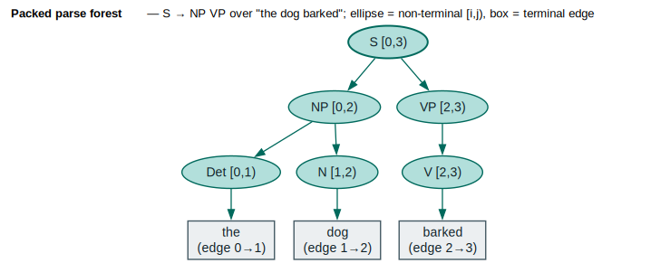

# Earley Parsing for Lattices

lling-llang includes an Earley parser ([Earley 1970](../BIBLIOGRAPHY.md#ref-earley1970)) modified to work with lattice input, enabling syntactic filtering of correction candidates based on context-free grammars.

## Terms & symbols

Defined centrally in [`../NOTATION.md`](../NOTATION.md); repeated locally for the terms this doc uses.

| Symbol | Meaning |
|---|---|
| `CFG` / `CFL` | **C**ontext-**F**ree **G**rammar / **L**anguage. |
| $`\bullet`$ | the Earley dot — how much of a production has been matched, e.g. $`S \to NP \bullet VP`$. |
| $`\varepsilon`$ | the empty label / empty production (nullable non-terminal). |
| $`[A \to \alpha \bullet \beta, i)`$ | an Earley item: rule $`A \to \alpha\beta`$, dot after $`\alpha`$, started at lattice node $`i`$. |
| $`\lvert V\rvert`$, $`\lvert G\rvert`$ | number of lattice nodes / grammar size. |
| $`\Sigma^*`$ | all finite strings over the input alphabet. |

## Concepts

### What is Earley Parsing?

The **Earley algorithm** is a general-purpose parser that handles any context-free grammar (CFG). Unlike specialized parsers (LL, LR), Earley can parse:

- Ambiguous grammars (multiple valid parses)
- Left-recursive grammars
- Arbitrary CFGs without transformation

The algorithm uses **dynamic programming** to track all possible parses simultaneously.

### Earley on Lattices

Traditional Earley parsing works on strings (sequences of tokens). lling-llang extends this to **lattices**:

- **Scanner** follows lattice edges instead of string positions
- Multiple edges at a position are handled naturally
- Chart positions correspond to lattice nodes
- Result is a parse **forest** containing all valid parses

```text
Traditional:  "the dog saw" → Parser → Parse tree

Lattice:      ┌─the─┐
              │     ├─quick─┐
              └─teh─┘       │     → Parser → Parse forest
                            │
                            └───►end
```

### Core Types

| Type | Description |
|------|-------------|
| `Grammar` | Context-free grammar representation |
| `GrammarBuilder` | Fluent API for grammar construction |
| `EarleyParser` | Parser for lattice input |
| `EarleyChart` | Chart data structure (positions → items) |
| `EarleyState` | A partially-matched production |
| `ParseForest` | Compact representation of all parses |
| `ParseTree` | Single parse tree extraction |

## Building Grammars

### GrammarBuilder

Use `GrammarBuilder` for a fluent grammar construction API:

```rust
use lling_llang::cfg::GrammarBuilder;

let grammar = GrammarBuilder::new()
    .start("S")                           // Set start symbol
    .rule("S", &["NP", "VP"])             // S → NP VP
    .rule("NP", &["Det", "N"])            // NP → Det N
    .rule("VP", &["V", "NP"])             // VP → V NP
    .rule("VP", &["V"])                   // VP → V (intransitive)
    .rule("Det", &["the"])                // Det → "the"
    .rule("Det", &["a"])                  // Det → "a"
    .rule("N", &["dog"])                  // N → "dog"
    .rule("N", &["cat"])                  // N → "cat"
    .rule("V", &["saw"])                  // V → "saw"
    .rule("V", &["chased"])               // V → "chased"
    .build()
    .expect("valid grammar");
```

### Naming Convention

The builder uses a naming convention to distinguish non-terminals from terminals:

- **Uppercase start** → Non-terminal (`S`, `NP`, `VP`)
- **Lowercase start** → Terminal (`the`, `dog`, `saw`)

```rust
// "S" and "NP" are non-terminals, "the" is a terminal
.rule("S", &["NP"])
.rule("NP", &["the"])
```

### Epsilon Productions

For nullable non-terminals (can derive empty string):

```rust
let grammar = GrammarBuilder::new()
    .start("S")
    .rule("S", &["A", "B"])
    .epsilon_rule("A")           // A → ε
    .rule("A", &["a"])           // A → "a"
    .rule("B", &["b"])           // B → "b"
    .build()?;
```

### Probabilities

Attach log-probabilities for PCFG-style parsing:

```rust
let grammar = GrammarBuilder::new()
    .start("S")
    .rule_with_prob("S", &["NP", "VP"], -1.0)    // log(p) = -1.0
    .rule_with_prob("S", &["VP"], -2.0)          // log(p) = -2.0
    .build()?;
```

## Parsing Lattices

### Basic Usage

```rust
use lling_llang::cfg::{GrammarBuilder, EarleyParser};
use lling_llang::lattice::{LatticeBuilder, EdgeMetadata};
use lling_llang::backend::HashMapBackend;
use lling_llang::semiring::TropicalWeight;

// Build grammar
let grammar = GrammarBuilder::new()
    .start("S")
    .rule("S", &["NP", "VP"])
    .rule("NP", &["Det", "N"])
    .rule("VP", &["V"])
    .rule("Det", &["the"])
    .rule("N", &["dog"])
    .rule("V", &["barked"])
    .build()?;

// Build lattice matching grammar's terminal IDs
let mut backend = HashMapBackend::new();
let the_id = grammar.terminal_by_name("the").unwrap().vocab_id();
let dog_id = grammar.terminal_by_name("dog").unwrap().vocab_id();
let barked_id = grammar.terminal_by_name("barked").unwrap().vocab_id();

// Also intern for lookup purposes
backend.intern("the");
backend.intern("dog");
backend.intern("barked");

let mut builder = LatticeBuilder::new(backend);
builder.add_correction_by_id(0, 1, the_id, TropicalWeight::one(), EdgeMetadata::default());
builder.add_correction_by_id(1, 2, dog_id, TropicalWeight::one(), EdgeMetadata::default());
builder.add_correction_by_id(2, 3, barked_id, TropicalWeight::one(), EdgeMetadata::default());
let lattice = builder.build(3);

// Parse
let parser = EarleyParser::new(&grammar);
let result = parser.parse_lattice(&lattice);

match result {
    Ok(forest) => println!("Found {} parse(s)", forest.num_roots()),
    Err(e) => println!("Parse failed: {}", e),
}
```

### Accept/Reject

For simple grammaticality checking:

```rust
let parser = EarleyParser::new(&grammar);

if parser.accepts(&lattice) {
    println!("Lattice contains at least one grammatical path");
} else {
    println!("No grammatical paths found");
}
```

### Parse Errors

```rust
pub enum ParseError {
    /// No complete parse found.
    NoParse,
    /// Empty lattice.
    EmptyLattice,
    /// Grammar error.
    GrammarError(String),
}
```

## Parse Forest

The parser returns a `ParseForest` that compactly represents all valid parses — a shared-packed parse forest (SPPF). Non-terminal nodes span a half-open lattice interval $`[i, j)`$; terminal leaves are lattice edges shared across derivations. The example below parses "the dog barked" under $`S \to NP\ VP`$, $`NP \to Det\ N`$, $`VP \to V`$ into a single-rooted forest.



*Teal ellipses = non-terminal forest nodes labelled with their span $`[i, j)`$; neutral boxes = terminal leaves (the lattice edges); the bold $`S`$ is the forest root. Packing lets shared sub-derivations be reused across parses.*

<details><summary>Text view</summary>

```text
S [0,3)
├─ NP [0,2)
│  ├─ Det [0,1) ─ "the"    (edge 0→1)
│  └─ N   [1,2) ─ "dog"    (edge 1→2)
└─ VP [2,3)
   └─ V  [2,3) ─ "barked"  (edge 2→3)
```

</details>

### Structure

```rust
pub struct ParseForest {
    nodes: Vec<ForestNode>,        // All forest nodes
    roots: FxHashSet<ForestNodeId>, // Complete parses
}

pub struct ForestNode {
    pub rule: RuleId,              // Production that created this
    pub start: NodeId,             // Start position in lattice
    pub end: NodeId,               // End position in lattice
    pub children: SmallVec<[ForestChild; 4]>,
}

pub enum ForestChild {
    Derivation(SmallVec<[ForestNodeId; 4]>),  // Non-terminal children
    Terminal(EdgeId),                          // Terminal (lattice edge)
}
```

### Operations

```rust
// Check if any parse exists
if forest.is_empty() {
    println!("No valid parses");
}

// Count parses
println!("Found {} parses", forest.num_roots());

// Extract best parse tree
if let Some(tree) = forest.best_parse() {
    println!("Parse tree depth: {}", tree.depth());
    println!("Parse tree size: {}", tree.size());
}

// Extract multiple parses
let trees = forest.all_parses(10);  // Up to 10 parses

// Get all lattice edges used in valid parses
let used_edges = forest.collect_used_edges();
```

### Lattice Filtering

Use `collect_used_edges()` to filter ungrammatical edges:

```rust
let forest = parser.parse_lattice(&lattice)?;
let used_edges = forest.collect_used_edges();

// Build new lattice with only grammatical edges
let mut new_builder = LatticeBuilder::new(lattice.backend().clone());

for edge in lattice.edges() {
    if used_edges.contains(&edge.id) {
        new_builder.add_correction_by_id(
            edge.source.0 as usize,
            edge.target.0 as usize,
            edge.label,
            edge.weight,
            edge.metadata.clone(),
        );
    }
}

let filtered_lattice = new_builder.build(lattice.end().0 as usize);
```

This is exactly what `CfgFilterLayer` does internally.

## Earley Algorithm Details

### Chart Items

An Earley item tracks a partially-matched production:

```rust
pub struct EarleyState {
    pub rule: RuleId,      // Which production
    pub dot: usize,        // Position of the dot (how much matched)
    pub start: NodeId,     // Where this rule started
    // ... plus forest tracking fields
}
```

For example, with rule $`S \to NP \bullet VP`$:
- `rule` = the $`S \to NP\ VP`$ production
- `dot` = 1 (after $`NP`$, before $`VP`$)
- `start` = the lattice node where we started matching $`S`$

### Three Operations

The chart at each lattice node holds a set of Earley items; the three operations close
each chart under prediction, scanning, and completion until no new item appears
([Earley 1970](../BIBLIOGRAPHY.md#ref-earley1970)). The invariant is that
$`[A \to \alpha \bullet \beta, i)`$ sits in the chart at node $`j`$ iff $`\alpha`$ derives the lattice
fragment from $`i`$ to $`j`$.

```text
⟨ predict at node j ⟩ ≡
    // dot sits before a non-terminal B
    for item [A → α • B β, i) in chart[j]:
        for each production B → γ:
            add [B → • γ, j) to chart[j]      // start B here
            if B is nullable: also advance the dot past B  // ε-completion
```

```text
⟨ scan from node j ⟩ ≡
    // dot sits before a terminal t
    for item [A → α • t β, i) in chart[j]:
        for each lattice edge j --t--> k labelled t:
            add [A → α t • β, i) to chart[k]  // follow the edge (not a fixed +1)
```

```text
⟨ complete at node j ⟩ ≡
    // a production finished: dot at the end
    for item [B → γ •, i) in chart[j]:
        for waiting item [A → α • B β, h) in chart[i]:
            add [A → α B • β, h) to chart[j]  // advance the parent, record forest edge
```

```text
⟨ Earley recognise over a lattice ⟩ ≡
    seed chart[start] with [S → • γ, start] for every start production
    for each lattice node j in topological order:
        repeat ⟨ predict at node j ⟩, ⟨ scan from node j ⟩, ⟨ complete at node j ⟩
        until chart[j] reaches a fixpoint
    accept iff [S → γ •, start) ∈ chart[end]
```

Worked one-step traces:

```text
predict:   [S → • NP VP, 0]            ⇒ [NP → • Det N, 0]
scan:      [Det → • "the", 0]  ·"the"  ⇒ [Det → "the" •, 0]
complete:  [Det → "the" •, 0] + [NP → • Det N, 0]
                                       ⇒ [NP → Det • N, 0]
```

The only change from string Earley is in `⟨ scan from node j ⟩`: instead of
advancing one fixed position it follows *every* outgoing lattice edge with the matching
terminal, which is what lets a single chart sweep parse all paths of the lattice at once.

### Nullable Non-terminals

For grammars with $`\varepsilon`$-productions, the parser computes **nullable** non-terminals:

```rust
let parser = EarleyParser::new(&grammar);
// Internally computes which non-terminals can derive ε
```

This is used for:
- Epsilon completion (advance past nullable non-terminals)
- Parse forest correctness

### Time Complexity

| Grammar Type | Time |
|--------------|------|
| Unambiguous | $`O(\lvert V\rvert^3)`$ |
| Bounded ambiguity | $`O(\lvert V\rvert^2)`$ |
| General CFG | $`O(\lvert V\rvert^3)`$ |

Where $`\lvert V\rvert`$ = number of lattice nodes. In practice, most natural language grammars are closer to $`O(\lvert V\rvert^2)`$ ([Earley 1970](../BIBLIOGRAPHY.md#ref-earley1970)).

## Common Patterns

### Grammar from File (Future)

```rust
// Planned: load grammar from BNF file
let grammar = Grammar::from_file("grammar.bnf")?;
```

### Cascaded Grammars

Apply multiple grammars in sequence:

```rust
// First: morphological constraints
let morph_grammar = build_morphological_grammar();
let morph_parser = EarleyParser::new(&morph_grammar);
let morph_forest = morph_parser.parse_lattice(&lattice)?;
let morph_edges = morph_forest.collect_used_edges();

// Build intermediate lattice
let intermediate = filter_lattice(&lattice, &morph_edges);

// Second: syntactic constraints
let syntax_grammar = build_syntax_grammar();
let syntax_parser = EarleyParser::new(&syntax_grammar);
let final_forest = syntax_parser.parse_lattice(&intermediate)?;
```

### Grammar Debugging

Inspect grammar structure:

```rust
println!("Start symbol: {:?}", grammar.nt_name(grammar.start()));
println!("Number of productions: {}", grammar.num_productions());

// List all productions for a non-terminal
if let Some(nt) = grammar.terminal_by_name("NP") {
    // Note: this gets a terminal, use nt_by_name for non-terminals
}

// Get terminal by name
if let Some(term) = grammar.terminal_by_name("the") {
    println!("'the' has vocab_id: {}", term.vocab_id());
}
```

### Ambiguity Detection

Count number of parses to detect ambiguity:

```rust
let forest = parser.parse_lattice(&lattice)?;

match forest.num_roots() {
    0 => println!("No parse (shouldn't reach here - would be Err)"),
    1 => println!("Unambiguous parse"),
    n => println!("Ambiguous: {} parses", n),
}
```

## Integration with Layers

The `CfgFilterLayer` uses the Earley parser internally:

```rust
use lling_llang::layers::CfgFilterLayer;

let grammar = build_grammar();
let layer = CfgFilterLayer::new(&grammar);

// Apply to lattice
let filtered = layer.apply(&lattice)?;
```

See [Layers](../architecture/layers.md) for pipeline composition.

## References

- [Earley 1970](../BIBLIOGRAPHY.md#ref-earley1970) — *An Efficient Context-Free Parsing Algorithm*: the predict/scan/complete chart algorithm, its $`O(\lvert V\rvert^3)`$ / $`O(\lvert V\rvert^2)`$ bounds, and the dotted-item formulation used here (generalized to lattice edges in the scanner).
- [Goodman 1999](../BIBLIOGRAPHY.md#ref-goodman1999) — *Semiring Parsing*: the semiring view of chart parsing that underpins weighted/PCFG parse forests and `collect_used_edges`-style inside computations.

## Related Topics

- [Composition](composition.md): Lazy lattice-grammar composition
- [Layers](../architecture/layers.md): CFG filter layer
- [Path Extraction](path-extraction.md): Find paths through filtered lattices
