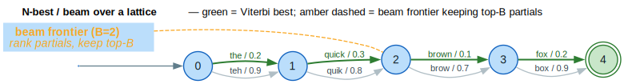

# Path Extraction Algorithms

Path extraction finds optimal paths through lattices. lling-llang provides three algorithms with different trade-offs between exactness, speed, and memory usage. (A lattice is a weighted DAG — **D**irected **A**cyclic **G**raph — whose start→end paths enumerate hypotheses.)

## Terms & symbols

Defined centrally in [`../NOTATION.md`](../NOTATION.md); repeated locally for the terms this doc uses.

| Symbol | Meaning |
|---|---|
| `⊕` / `⊗` | semiring *plus* (combine alternative scores) / *times* (accumulate a path's edges). |
| `0̄` / `1̄` | `⊕`-identity / `⊗`-identity. |
| `∣V∣`, `∣E∣` | number of lattice nodes / edges (cardinality bar `∣` = U+2223). |
| `L` | path length (edge count). |
| `k`, `B`, `D` | number of paths requested / beam width / average out-degree. |

## Concepts

### What is Path Extraction?

Given a lattice with weighted edges, path extraction finds the "best" paths from start to end. What "best" means depends on the semiring:

- **TropicalWeight**: Lowest total cost (`⊗` = sum of edge weights)
- **LogWeight**: Highest probability (`⊗` = product of probabilities)
- **BoolWeight**: Any valid path

```text
            ┌───the(0.5)───┐
   start ──►│              ├───quick(0.5)───►end
            └───teh(0.0)───┘

   Path 1: the ⊗ quick = 0.5 + 0.5 = 1.0 (tropical)
   Path 2: teh ⊗ quick = 0.0 + 0.5 = 0.5 (tropical)

   Best path (lowest weight): "teh quick" (0.5)
```

The frontier diagram below shows N-best/beam advancing left-to-right over a richer lattice: the green spine is the Viterbi best, grey are alternatives, and the amber cut is the beam frontier that keeps only the top-`B` partial hypotheses at a column.



*Green bold = Viterbi best path; grey = alternatives; amber dashed = the beam frontier (rank partials by accumulated weight, keep the best `B`); green double-ring = the end state.*

<details><summary>Text view</summary>

```text
        the(0.2)   quick(0.3)  brown(0.1)  fox(0.2)
  0 ──────────► 1 ─────────► 2 ─────────► 3 ─────────► (4)   ← Viterbi best
   └─ teh(0.9) ─┘ quik(0.8) ─┘ brow(0.7) ─┘ box(0.9) ─┘     ← alternatives
                    ↑
            beam frontier (B=2): keep top-B partials
```

</details>

### Algorithm Selection Guide

| Algorithm | Time | Space | Exact? | Use Case |
|-----------|------|-------|--------|----------|
| Viterbi | `` `O(∣V∣ + ∣E∣)` `` | `` `O(∣V∣)` `` | Yes | Single best path |
| N-best | `` `O(k log k)` `` * | `` `O(k × L)` `` | Yes | Top-k paths |
| Beam search | `` `O(∣V∣ × B × D)` `` | `` `O(B × L)` `` | No | Approximate top-k |

Where:
- `∣V∣` = nodes, `∣E∣` = edges, `L` = path length
- `k` = number of paths, `B` = beam width, `D` = average out-degree
- \* After an initial `` `O(∣V∣ + ∣E∣)` `` topological sort

### Core Types

| Type | Description |
|------|-------------|
| `LatticePath<W>` | A path through the lattice with edges and weight |
| `ViterbiResult<W>` | Result of Viterbi decoding |
| `NBestIterator<W, B>` | Lazy iterator for N-best paths |
| `BeamSearchConfig` | Configuration for beam search |

## Viterbi Algorithm

The **Viterbi algorithm** finds the single best path using dynamic programming. It's the go-to algorithm when you only need the optimal path.

### How It Works

The Viterbi algorithm is a forward dynamic-programming pass over the topological order
followed by a back-trace. The invariant is that when a node is processed, every
predecessor's best score is already final, so the node's best score is settled in one
visit. (`δ[v]` = best score to reach `v`; `bp[v]` = the edge it came in on.)

```text
⟨ viterbi forward pass ⟩ ≡
    δ[start] ← 1̄;  δ[v] ← 0̄ for v ≠ start
    for v in topological_order:
        for edge e = v --w--> u:
            cand ← δ[v] ⊗ w
            if cand is ⊕-better than δ[u]:   // tropical: smaller
                δ[u] ← δ[v] ⊕ cand; bp[u] ← e
```

```text
⟨ viterbi back-trace ⟩ ≡
    if δ[end] = 0̄: return (failure)          // end unreachable
    walk bp[end], bp[…], … back to start, reversing the edges → best path
```

```text
⟨ viterbi ⟩ ≡
    ⟨ viterbi forward pass ⟩
    return ⟨ viterbi back-trace ⟩            // O(∣V∣ + ∣E∣) total
```

In code:

```rust
use lling_llang::path::viterbi;
use lling_llang::lattice::{LatticeBuilder, EdgeMetadata};
use lling_llang::backend::HashMapBackend;
use lling_llang::semiring::TropicalWeight;

let backend = HashMapBackend::new();
let mut builder = LatticeBuilder::new(backend);

builder.add_correction(0, 1, "the", TropicalWeight::new(0.5), EdgeMetadata::default());
builder.add_correction(0, 1, "a", TropicalWeight::new(1.0), EdgeMetadata::default());
builder.add_correction(1, 2, "quick", TropicalWeight::new(0.5), EdgeMetadata::default());

let mut lattice = builder.build(2);
let result = viterbi(&mut lattice);

if result.success {
    println!("Best path: {:?}", result.path.to_words(&lattice));
    println!("Total weight: {:?}", result.path.weight.value());
}
```

### ViterbiResult

```rust
pub struct ViterbiResult<W: Semiring> {
    /// The best path through the lattice.
    pub path: LatticePath<W>,
    /// Whether a valid path was found.
    pub success: bool,
}
```

**When `success` is `false`**:
- The lattice has no path from start to end
- The lattice contains a cycle (not a DAG)
- The end node is unreachable

### Complexity

- **Time**: `` `O(∣V∣ + ∣E∣)` `` - each node and edge visited exactly once
- **Space**: `` `O(∣V∣)` `` - stores best score and backpointer for each node

### When to Use Viterbi

- You only need the single best path
- You need guaranteed optimality
- Memory is not constrained

## N-Best Extraction

**N-best extraction** finds the top-k paths in order of weight. It uses a priority queue for lazy enumeration, based on Huang & Chiang (2005).

### How It Works

1. Initialize priority queue with the start node
2. Pop the best partial path
3. If it reaches the end, yield it
4. Otherwise, extend it with all outgoing edges and push back
5. Repeat until k paths found or queue exhausted

```rust
use lling_llang::path::nbest;

let mut lattice = build_lattice();  // Your lattice

// Get top 5 paths
let top5 = nbest(&mut lattice, 5);

for (i, path) in top5.iter().enumerate() {
    println!("Path {}: {:?} (weight: {:.2})",
        i + 1,
        path.to_words(&lattice),
        path.weight.value());
}
```

### Lazy Iterator

For streaming results, use `NBestIterator` directly:

```rust
use lling_llang::path::NBestIterator;

let lattice = build_lattice();
let mut iter = NBestIterator::new(&lattice, 100);

// Process paths as they're discovered
for path in iter {
    let words = path.to_words(&lattice);
    if is_acceptable(&words) {
        println!("Found acceptable path: {:?}", words);
        break;  // Stop early
    }
}
```

### Complexity

- **Time**: `` `O(k log k)` `` for extracting `k` paths (after `` `O(∣V∣ + ∣E∣)` `` setup)
- **Space**: `` `O(k × L)` `` where `L` is average path length

The key insight is that paths are enumerated lazily - if you only need 3 paths, only those 3 are fully computed.

### When to Use N-Best

- You need exactly the top-k paths
- You can afford the memory for storing partial paths
- Path diversity matters (e.g., showing alternatives to users)

## Beam Search

**Beam search** is an approximate algorithm that limits memory by keeping only the top `beam_width` hypotheses at each step.

### How It Works

1. Start with single hypothesis at start node
2. For each step:
   a. Expand all hypotheses with outgoing edges
   b. Sort by weight
   c. Keep only top `beam_width` hypotheses
3. Collect completed paths when they reach the end

```rust
use lling_llang::path::beam_search;

let mut lattice = build_lattice();

// Beam search with width 10
let paths = beam_search(&mut lattice, 10);

for path in &paths {
    println!("{:?}", path.to_words(&lattice));
}
```

### Configuration

For more control, use `BeamSearchConfig`:

```rust
use lling_llang::path::{beam_search_with_config, BeamSearchConfig};

let config = BeamSearchConfig::new(20)  // beam width 20
    .with_max_results(5)                 // return at most 5 paths
    .with_duplicates(false);             // no duplicate word sequences

let paths = beam_search_with_config(&mut lattice, config);
```

**Configuration options**:

| Option | Default | Description |
|--------|---------|-------------|
| `beam_width` | 10 | Max hypotheses per step |
| `max_results` | 10 | Max paths to return |
| `allow_duplicates` | false | Allow same word sequence |

### Complexity

- **Time**: `` `O(∣V∣ × B × D)` `` where `B` = beam width, `D` = average out-degree
- **Space**: `` `O(B × L)` `` where `L` = path length

### Trade-offs

**Advantages**:
- Bounded memory usage
- Fast for large lattices
- Good approximation in practice

**Disadvantages**:
- May miss the optimal path
- No guarantees on path ranking
- Sensitive to beam width choice

### When to Use Beam Search

- Memory is constrained
- Approximate solutions are acceptable
- Lattice has many alternatives per position

## LatticePath

All algorithms return `LatticePath` objects:

```rust
pub struct LatticePath<W: Semiring> {
    /// The edges traversed in order.
    pub edges: SmallVec<[EdgeId; 16]>,
    /// The accumulated weight of the path.
    pub weight: W,
    /// Whether this is a complete path (reaches the end node).
    pub is_complete: bool,
}

impl<W: Semiring> LatticePath<W> {
    /// Get the number of edges in the path.
    pub fn len(&self) -> usize;

    /// Check if the path is empty.
    pub fn is_empty(&self) -> bool;

    /// Get vocabulary IDs for this path.
    pub fn labels<'a, B>(&'a self, lattice: &'a Lattice<W, B>) -> impl Iterator<Item = VocabId>;

    /// Get words for this path.
    pub fn words<'a, B>(&'a self, lattice: &'a Lattice<W, B>) -> impl Iterator<Item = &'a str>;

    /// Convert to a vector of words.
    pub fn to_words<B>(&self, lattice: &Lattice<W, B>) -> Vec<String>;
}
```

### Path Inspection

```rust
let result = viterbi(&mut lattice);
let path = result.path;

// Check completion
assert!(path.is_complete);

// Get weight
println!("Weight: {}", path.weight.value());

// Get length
println!("Edges: {}", path.len());

// Get words
let words = path.to_words(&lattice);
println!("Words: {:?}", words);

// Iterate over vocabulary IDs
for vocab_id in path.labels(&lattice) {
    println!("VocabId: {}", vocab_id);
}
```

## Details

### Topological Order Requirement

All path extraction algorithms require the lattice to be a DAG (directed acyclic graph). This is checked via topological sorting:

```rust
let order = lattice.topological_order();
if order.is_none() {
    // Lattice contains a cycle - cannot extract paths
}
```

Lattices built with `LatticeBuilder` are always DAGs (edges can only go forward in position).

### Semiring Operations

Path extraction uses semiring operations to combine weights:

```rust
// Sequential edges: use times (⊗)
path_weight = edge1.weight.times(&edge2.weight);

// For TropicalWeight: 0.5 ⊗ 0.3 = 0.5 + 0.3 = 0.8

// Parallel paths: use plus (⊕) in forward scores
best = old_score.plus(&new_score);

// For TropicalWeight: 1.0 ⊕ 0.8 = min(1.0, 0.8) = 0.8
```

### Natural Ordering

The `natural_less` method determines what "better" means:

```rust
// For TropicalWeight: lower is better
assert!(TropicalWeight::new(0.5).natural_less(&TropicalWeight::new(1.0)) == Some(true));

// For BoolWeight: true is better than false
assert!(BoolWeight::new(true).natural_less(&BoolWeight::new(false)) == Some(true));
```

### Empty Lattice Handling

All algorithms handle empty lattices (start == end):

```rust
let builder = LatticeBuilder::new(backend);
let mut lattice = builder.build(0);  // Empty lattice

let result = viterbi(&mut lattice);
assert!(result.success);  // Empty path is valid
assert!(result.path.is_empty());
```

### SmallVec Optimization

`LatticePath` uses `SmallVec<[EdgeId; 16]>` for edges:
- Paths with ≤16 edges use stack allocation
- Longer paths automatically spill to heap
- Avoids allocation for typical short paths

## Common Patterns

### Early Termination

Stop N-best when finding an acceptable path:

```rust
let acceptable = NBestIterator::new(&lattice, 1000)
    .find(|path| {
        let words = path.to_words(&lattice);
        is_grammatically_correct(&words)
    });
```

### Comparing Algorithms

Run all three for analysis:

```rust
use std::time::Instant;

// Viterbi (single best)
let start = Instant::now();
let viterbi_result = viterbi(&mut lattice);
let viterbi_time = start.elapsed();

// N-best (exact top 10)
let start = Instant::now();
let nbest_result = nbest(&mut lattice, 10);
let nbest_time = start.elapsed();

// Beam search (approximate top 10)
let start = Instant::now();
let beam_result = beam_search(&mut lattice, 10);
let beam_time = start.elapsed();

println!("Viterbi: {:?} ({:?})", viterbi_result.path.weight, viterbi_time);
println!("N-best: {} paths ({:?})", nbest_result.len(), nbest_time);
println!("Beam: {} paths ({:?})", beam_result.len(), beam_time);
```

### Path Diversity

Get diverse paths by filtering duplicates:

```rust
use std::collections::HashSet;

let mut seen: HashSet<Vec<String>> = HashSet::new();
let diverse_paths: Vec<_> = NBestIterator::new(&lattice, 100)
    .filter(|path| {
        let words = path.to_words(&lattice);
        seen.insert(words)  // Returns false if already seen
    })
    .take(10)
    .collect();
```

### Batch Processing

Process multiple lattices efficiently:

```rust
fn process_batch(lattices: &mut [Lattice<TropicalWeight, HashMapBackend>]) -> Vec<Vec<String>> {
    lattices.iter_mut()
        .map(|lattice| {
            let result = viterbi(lattice);
            if result.success {
                result.path.to_words(lattice)
            } else {
                Vec::new()
            }
        })
        .collect()
}
```

## Next Steps

- [Composition](composition.md): Lazy lattice-grammar composition
- [Topological Sort](topological-sort.md): DAG ordering algorithm
- [Lattices](../architecture/lattices.md): Lattice construction
- [Semirings](../architecture/semirings.md): Weight algebra

## References

- [Mohri 2009](../BIBLIOGRAPHY.md#ref-mohri2009) — *Weighted Automata Algorithms*: the single-source shortest-distance (Viterbi) algorithm over acyclic weighted graphs and the general `n`-shortest-paths formulation that the N-best enumerator specializes.
- [Mohri 2002](../BIBLIOGRAPHY.md#ref-mohri2002) — *Weighted Finite-State Transducers in Speech Recognition*: lattices as weighted acyclic graphs and best-path / `n`-best extraction as the decoding step of the recognition cascade.
- **[Huang & Chiang 2005]** Huang, L., & Chiang, D. (2005). *Better k-best Parsing.* IWPT 2005:53–64. [ACL W05-1506](https://aclanthology.org/W05-1506/) — the lazy priority-queue `k`-best enumeration scheme the `NBestIterator` implements.
