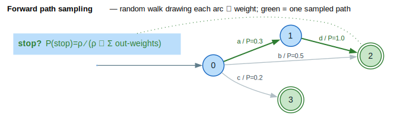

# Path Sampling

Path sampling provides algorithms for randomly drawing accepting paths from WFSTs, enabling Monte Carlo methods, online learning, and diverse output generation. (WFST = **W**eighted **F**inite-**S**tate **T**ransducer.)

## Terms & symbols

Defined centrally in [`../NOTATION.md`](../NOTATION.md); repeated locally for the terms this doc uses.

| Symbol | Meaning |
|---|---|
| `⊕` / `⊗` | semiring *plus* (combine alternatives) / *times* (accumulate a path's arcs). |
| `0̄` / `1̄` | `⊕`-identity / `⊗`-identity. |
| `ρ(q)` | final-weight function `ρ : F → K` — used in the stop-vs-continue decision. |
| `ε` | the empty label (optionally excluded from the emitted output). |
| `P(t)` | sampling probability of transition `t`. |
| `η` | power-semiring exponent (soft weights for proportional sampling). |

## Concepts

### Why Sample Paths?

While shortest-path algorithms find the single best path, sampling provides:

| Application | Benefit |
|-------------|---------|
| **Monte Carlo estimation** | Approximate expectations when exact computation is intractable |
| **Online learning** | RRWM and FPTL algorithms require sampling predictions |
| **Diverse outputs** | Generate multiple plausible alternatives, not just the best |
| **Uncertainty estimation** | Sample distribution reflects model confidence |
| **Data augmentation** | Generate training data from WFST models |

### Forward Sampling Algorithm

The sampling algorithm performs a random walk from the start state to a final state. At
each step it draws one outgoing transition under the chosen strategy; at a final state it
may stop with a strategy-dependent probability. The green path in the figure is one such
walk; the per-arc probabilities annotate the proportional choice.



*Green bold = one sampled path; grey = the alternatives not taken; arc labels carry the proportional `` `P` ``; the dotted inset is the final-state stop rule `` `P(stop) = ρ ∕ (ρ ⊕ Σ out-weights)` ``.*

<details><summary>Text view</summary>

```text
ForwardSample(WFST):
    current ← start state
    path ← empty list
    while not at final state:
        if current is final and should_stop():
            return path
        transitions ← outgoing transitions from current
        trans ← sample_transition(transitions)
        path.append(trans)
        current ← trans.destination
    return path
```

</details>

The walk decomposes into a step and a stop test; the **sampling strategy** parameterizes
both.

```text
⟨ sample one transition ⟩ ≡
    // Proportional:  P(t) = weight(t) ∕ Σ weight(out)      (normalize on the fly)
    // Uniform:       P(t) = 1 ∕ ∣out∣
    draw t ∈ out(current) with probability P(t)
```

```text
⟨ stop-or-continue at a final state ⟩ ≡
    // Proportional:  P(stop) = ρ(current) ∕ (ρ(current) ⊕ Σ weight(out))
    // Uniform:       P(stop) = 1 ∕ (1 + ∣out∣)
    return true with probability P(stop)
```

```text
⟨ forward sample a path ⟩ ≡
    current ← start;  path ← [ ];  w ← 1̄
    loop:
        if current ∈ F and ⟨ stop-or-continue at a final state ⟩:
            return (path, w ⊗ ρ(current))
        t ← ⟨ sample one transition ⟩
        path.append(t);  w ← w ⊗ weight(t);  current ← target(t)
        if ∣path∣ > max_length:  error MaxLengthExceeded
```

The key decision is how `` `⟨ sample one transition ⟩` `` weights the choice. This is
controlled by the **sampling strategy**.

### Sampling Strategies

Two strategies are supported:

**Proportional Sampling** — `` `P(t) = weight(t) ∕ Σ weight(out)` ``:

```text
P(transition t) = weight(t) ∕ Σ weight(all transitions)
```

Transitions are chosen proportional to their weights. For a stochastic (weight-pushed) WFST, this gives proper probability sampling.

```text
State 0:                         Proportional sampling:
  ┌─ a/0.3 → State 1            P(a) = 0.3 ∕ (0.3+0.5+0.2) = 0.3
  ├─ b/0.5 → State 2            P(b) = 0.5 ∕ (0.3+0.5+0.2) = 0.5
  └─ c/0.2 → State 3            P(c) = 0.2 ∕ (0.3+0.5+0.2) = 0.2
```

**Uniform Sampling** — `` `P(t) = 1 ∕ ∣out∣` ``:

```text
P(transition t) = 1 ∕ (number of transitions)
```

All transitions have equal probability, regardless of weights. Useful for exploration.

```text
State 0:                         Uniform sampling:
  ┌─ a/0.3 → State 1            P(a) = 1 ∕ 3 ≈ 0.33
  ├─ b/0.5 → State 2            P(b) = 1 ∕ 3 ≈ 0.33
  └─ c/0.2 → State 3            P(c) = 1 ∕ 3 ≈ 0.33
```

### Stochastic vs Non-Stochastic WFSTs

For best results with proportional sampling, use **weight-pushed** WFSTs where outgoing weights sum to 1:

```text
Before pushing:                  After pushing:
State 0:                        State 0:
  ├─ a/2.0 → s1                   ├─ a/0.4 → s1 (2/5)
  └─ b/3.0 → s2                   └─ b/0.6 → s2 (3/5)

Not stochastic                   Stochastic (sums to 1.0)
```

Non-stochastic WFSTs are normalized on-the-fly during sampling.

## Core API

### Configuration

```rust
use lling_llang::algorithms::{SampleConfig, SampleStrategy};

let config = SampleConfig::new()
    .max_length(1000)           // Maximum path length (default: 10,000)
    .strategy(SampleStrategy::Proportional)  // Proportional (default) or Uniform
    .include_epsilon(false)     // Include epsilon labels in output?
    .seed(42);                  // Fixed seed for reproducibility
```

### Sampling Functions

| Function | Purpose |
|----------|---------|
| `sample_path()` | Sample a single accepting path |
| `sample_paths()` | Sample multiple paths (fixed count) |
| `sample_paths_until()` | Sample until target successes or max attempts |
| `estimate_expected_weight()` | Monte Carlo estimation of expected weight |

### Error Handling

```rust
use lling_llang::algorithms::SampleError;

match sample_path(&wfst, config) {
    Ok(path) => println!("Sampled: {:?}", path.output_string()),
    Err(SampleError::EmptyWfst) => println!("WFST has no states"),
    Err(SampleError::MaxLengthExceeded) => println!("Path too long"),
    Err(SampleError::NoAcceptingPaths) => println!("No final states reachable"),
    Err(SampleError::DeadState(s)) => println!("Hit dead state {}", s),
    Err(SampleError::ZeroWeights(s)) => println!("All weights zero at state {}", s),
}
```

### SampledPath Structure

```rust
pub struct SampledPath<L, W> {
    pub input_labels: Vec<Option<L>>,   // Input labels (None = epsilon)
    pub output_labels: Vec<Option<L>>,  // Output labels (None = epsilon)
    pub weight: W,                       // Accumulated path weight
    pub states: Vec<StateId>,            // States visited
    pub length: usize,                   // Number of transitions
}

// Convenience methods
let path = sample_path(&wfst, config)?;
let inputs: Vec<&L> = path.input_string();   // Non-epsilon inputs
let outputs: Vec<&L> = path.output_string(); // Non-epsilon outputs
```

## Examples

### Basic Path Sampling

```rust
use lling_llang::algorithms::{sample_path, SampleConfig};
use lling_llang::semiring::TropicalWeight;
use lling_llang::wfst::{VectorWfst, MutableWfst};

// Create a simple WFST
let mut wfst = VectorWfst::<char, TropicalWeight>::new();
let s0 = wfst.add_state();
let s1 = wfst.add_state();
let s2 = wfst.add_state();

wfst.set_start(s0);
wfst.set_final(s2, TropicalWeight::new(0.0));

wfst.add_arc(s0, Some('a'), Some('x'), s1, TropicalWeight::new(1.0));
wfst.add_arc(s1, Some('b'), Some('y'), s2, TropicalWeight::new(1.0));

// Sample a path
let config = SampleConfig::default().seed(42);
let path = sample_path(&wfst, config).expect("Should find path");

println!("Input: {:?}", path.input_string());   // ['a', 'b']
println!("Output: {:?}", path.output_string()); // ['x', 'y']
println!("Weight: {:?}", path.weight);
println!("Length: {}", path.length);            // 2
```

### Sampling with Different Strategies

```rust
use lling_llang::algorithms::{sample_paths_until, SampleConfig, SampleStrategy};

// WFST with two paths of different weights
let mut wfst = VectorWfst::<char, TropicalWeight>::new();
let s0 = wfst.add_state();
let s1 = wfst.add_state();
let s2 = wfst.add_state();

wfst.set_start(s0);
wfst.set_final(s1, TropicalWeight::new(0.0));
wfst.set_final(s2, TropicalWeight::new(0.0));

// High-weight path (shorter in tropical = better)
wfst.add_arc(s0, Some('a'), Some('x'), s1, TropicalWeight::new(1.0));
// Low-weight path
wfst.add_arc(s0, Some('b'), Some('y'), s2, TropicalWeight::new(5.0));

// Proportional sampling: prefers lower tropical weight
let prop_config = SampleConfig::default()
    .strategy(SampleStrategy::Proportional)
    .seed(42);

let prop_paths = sample_paths_until(&wfst, 100, 1000, prop_config);
let a_count = prop_paths.iter()
    .filter(|p| p.input_string() == vec![&'a'])
    .count();
println!("Proportional: 'a' chosen {} times out of 100", a_count);

// Uniform sampling: equal probability
let unif_config = SampleConfig::default()
    .strategy(SampleStrategy::Uniform)
    .seed(42);

let unif_paths = sample_paths_until(&wfst, 100, 1000, unif_config);
let a_count = unif_paths.iter()
    .filter(|p| p.input_string() == vec![&'a'])
    .count();
println!("Uniform: 'a' chosen {} times out of 100", a_count);  // ~50
```

### Batch Sampling

```rust
use lling_llang::algorithms::{sample_paths, SampleConfig};

let config = SampleConfig::default().seed(42);

// Sample exactly 10 paths (may include errors)
let results = sample_paths(&wfst, 10, config);

for (i, result) in results.iter().enumerate() {
    match result {
        Ok(path) => println!("Path {}: {:?}", i, path.output_string()),
        Err(e) => println!("Path {} failed: {}", i, e),
    }
}

// Count successes
let successes = results.iter().filter(|r| r.is_ok()).count();
println!("{} successful samples out of 10", successes);
```

### Sampling Until Target Count

```rust
use lling_llang::algorithms::{sample_paths_until, SampleConfig};

// Sample until we have 50 successful paths (or 500 attempts)
let config = SampleConfig::default().seed(42);
let paths = sample_paths_until(&wfst, 50, 500, config);

println!("Got {} successful paths", paths.len());

// All paths in the result are successful
for path in &paths {
    println!("Output: {:?}", path.output_string());
}
```

### Monte Carlo Weight Estimation

```rust
use lling_llang::algorithms::{estimate_expected_weight, SampleConfig};

// Estimate the expected weight of accepting paths
let config = SampleConfig::default().seed(42);
let expected = estimate_expected_weight(&wfst, 1000, config);

match expected {
    Some(e) => println!("Estimated expected weight: {:.4}", e),
    None => println!("Could not estimate (empty WFST or all samples failed)"),
}
```

### Reproducible Sampling

```rust
use lling_llang::algorithms::{sample_path, SampleConfig};

// Same seed = same results
let config1 = SampleConfig::default().seed(12345);
let config2 = SampleConfig::default().seed(12345);

let path1 = sample_path(&wfst, config1)?;
let path2 = sample_path(&wfst, config2)?;

assert_eq!(path1.input_string(), path2.input_string());
assert_eq!(path1.output_string(), path2.output_string());
println!("Reproducible sampling verified!");
```

### Sampling from Stochastic WFST

```rust
use lling_llang::algorithms::{push_weights, sample_path, PushConfig, SampleConfig};
use lling_llang::semiring::PowerWeight;
use lling_llang::wfst::{VectorWfst, MutableWfst};

let eta = 1.0;
let mut wfst = VectorWfst::<char, PowerWeight>::new();

// Build WFST with arbitrary weights
let s0 = wfst.add_state();
let s1 = wfst.add_state();
let s2 = wfst.add_state();

wfst.set_start(s0);
wfst.set_final(s1, PowerWeight::one_with_eta(eta));
wfst.set_final(s2, PowerWeight::one_with_eta(eta));

wfst.add_arc(s0, Some('a'), Some('x'), s1,
    PowerWeight::from_probability(3.0, eta));
wfst.add_arc(s0, Some('b'), Some('y'), s2,
    PowerWeight::from_probability(7.0, eta));

// Push weights to make stochastic (outgoing sums to 1)
push_weights(&mut wfst, PushConfig::backward())
    .expect("Push should succeed");

// Now sampling gives proper probability distribution
let config = SampleConfig::default().seed(42);
let path = sample_path(&wfst, config)?;
println!("Sampled from stochastic WFST: {:?}", path.output_string());
```

### Handling Dead States

```rust
use lling_llang::algorithms::{sample_path, SampleConfig, SampleError};
use lling_llang::semiring::TropicalWeight;
use lling_llang::wfst::{VectorWfst, MutableWfst};

// WFST with a dead state (non-final with no outgoing transitions)
let mut wfst = VectorWfst::<char, TropicalWeight>::new();
let s0 = wfst.add_state();
let s1 = wfst.add_state(); // Dead state!

wfst.set_start(s0);
// s1 is not final and has no outgoing transitions
wfst.add_arc(s0, Some('a'), Some('a'), s1, TropicalWeight::new(1.0));

let config = SampleConfig::default().seed(42);
let result = sample_path(&wfst, config);

match result {
    Err(SampleError::DeadState(state)) => {
        println!("Encountered dead state: {}", state);
    }
    _ => unreachable!(),
}
```

## When to Use Path Sampling

| Scenario | Recommended Approach |
|----------|---------------------|
| Find the single best path | Use `viterbi()` instead of sampling |
| Generate diverse alternatives | `sample_paths_until()` with uniform strategy |
| Monte Carlo approximation | `estimate_expected_weight()` |
| Online learning (RRWM) | `sample_path()` with proportional strategy |
| Reproducible experiments | Set `seed` in config |
| Unknown WFST structure | Use `sample_paths()` and check for errors |

## Performance Considerations

| Factor | Impact | Recommendation |
|--------|--------|----------------|
| Path length | Linear in length | Set reasonable `max_length` |
| Number of transitions | Constant per state | Proportional sampling has O(n) per state |
| Stochastic vs raw | Same complexity | Push weights once, sample many times |
| Seed setting | Minor overhead | Use for reproducibility |

## Algorithm Details

### Stop Decision at Final States

When the current state is final but has outgoing transitions, the algorithm must decide whether to stop or continue:

**Proportional strategy** — `` `P(stop) = ρ(q) ∕ (ρ(q) ⊕ Σ transition_weights)` ``:
```text
P(stop) = final_weight ∕ (final_weight ⊕ Σ transition_weights)
```

**Uniform strategy** — `` `P(stop) = 1 ∕ (1 + ∣out∣)` ``:
```text
P(stop) = 1 ∕ (1 + number_of_transitions)
```

### Weight Accumulation

Path weight is accumulated using semiring multiplication, i.e. `` `w = w₁ ⊗ w₂ ⊗ … ⊗ wₙ ⊗ ρ(qₙ)` ``:

```text
path_weight = w₁ ⊗ w₂ ⊗ ... ⊗ wₙ ⊗ final_weight
```

For the tropical semiring, `` `⊗` `` is addition. For the probability semiring, multiplication.

## References

- [Mohri 2009](../BIBLIOGRAPHY.md#ref-mohri2009) — *Weighted Automata Algorithms*: the stochastic/weight-pushed automaton form that makes proportional sampling a proper probability distribution.
- [Cortes 2015](../BIBLIOGRAPHY.md#ref-cortes2015) — *On-Line Learning Algorithms for Path Experts with Non-Additive Losses*: the online-learning setting (RRWM) that consumes proportional path samples as predictions.

## Related Documentation

- [Weight Pushing](weight-pushing.md) - Make WFSTs stochastic before sampling
- [Shortest Distance](shortest-distance.md) - Alternative to sampling for exact computation
- [Power Semiring](../architecture/power-semiring.md) - Soft weights for sampling
- [RRWM Algorithm](rrwm.md) - Online learning that uses path sampling
