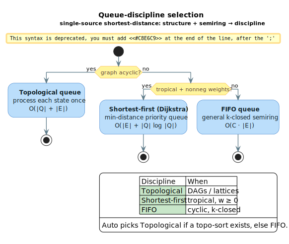

# Shortest-Distance Algorithms

Shortest-distance algorithms compute the total weight of all paths between states in a WFST. These are foundational algorithms that underpin weight pushing, epsilon removal, and many optimization techniques. (WFST = **W**eighted **F**inite-**S**tate **T**ransducer.)

## Terms & symbols

The symbols below are defined centrally in [`../NOTATION.md`](../NOTATION.md); this doc repeats only what it uses.

| Symbol | Meaning |
|---|---|
| $`\oplus`$ | semiring *plus* — combines **alternative** paths (Tropical: $`\min`$; Log: $`\oplus_{\log}`$; Probability: $`+`$). |
| $`\otimes`$ | semiring *times* — combines **sequential** arcs along one path. |
| $`\bar{0}`$ / $`\bar{1}`$ | the $`\oplus`$-identity ("no path") / the $`\otimes`$-identity ("empty path", zero cost). |
| $`d(s,t)`$ | shortest distance: the $`\oplus`$-sum of every $`s \to t`$ path weight. |
| $`a^*`$ | star/closure $`a^* = \bar{1} \oplus a \oplus a^2 \oplus \cdots`$. |
| $`\lvert Q\rvert`$, $`\lvert E\rvert`$ | number of states / transitions. |

## Concepts

### What is Shortest-Distance?

In a weighted automaton, the "shortest distance" from state $`s`$ to state $`t`$ is the $`\oplus`$-combination of all path weights:

```math
d(s,t) = \bigoplus \{\, w(\pi) : \pi \text{ is a path from } s \text{ to } t \,\}
```

Every alternative path is accumulated with $`\oplus`$, and every arc within a single path is accumulated with $`\otimes`$.

The meaning of "shortest" depends on the semiring:

| Semiring | $`\oplus`$ operation | "Shortest" means |
|----------|-------------|------------------|
| Tropical | $`\min`$ | Minimum cost path |
| Log | $`\oplus_{\log}`$ (log-sum-exp) | Total probability (in log-space) |
| Probability | $`+`$ | Sum of probabilities |
| Boolean | $`\lor`$ | Any path exists |

### Why Shortest-Distance?

Shortest-distance computation is essential for:

- **Weight Pushing**: Normalizing weight distribution along paths
- **Epsilon Removal**: Computing epsilon-closure weights
- **Pruning**: Estimating best achievable scores for beam search
- **Scoring**: Computing total probability of all accepting paths

## Core API

### Types

```rust
// Configuration for shortest-distance computation
pub struct ShortestDistanceConfig {
    pub queue_type: QueueType,       // Queue discipline
    pub max_iterations: Option<usize>, // Iteration limit
    pub is_acyclic: Option<bool>,    // Graph structure hint
    pub epsilon: f64,                // Convergence threshold
}

// Queue discipline selection
pub enum QueueType {
    Auto,          // Automatic selection
    Fifo,          // General-purpose
    Topological,   // For acyclic graphs
    ShortestFirst, // Dijkstra-style
}
```

### Functions

```rust
// Single-source: from start to all states
pub fn single_source_shortest_distance<L, W, F>(
    fst: &F,
    config: ShortestDistanceConfig,
) -> Option<Vec<W>>;

// All-pairs: between all state pairs
pub fn all_pairs_shortest_distance<L, W, F>(
    fst: &F,
) -> Option<Vec<Vec<W>>>;

// Reverse: from each state to final states
pub fn reverse_shortest_distance<L, W, F>(
    fst: &F,
    config: ShortestDistanceConfig,
) -> Option<Vec<W>>;

// Convenience: total weight to any final state
pub fn shortest_distance_to_final<L, W, F>(
    fst: &F,
    config: ShortestDistanceConfig,
) -> Option<W>;
```

## Queue Disciplines

The choice of queue discipline significantly impacts algorithm performance. The decision tree below routes each WFST to a discipline by its structure (acyclic?) and its semiring (tropical with non-negative weights?).



*Foundation-blue start; amber diamonds are decisions; algorithms-green terminals are the chosen disciplines with their complexity. `Auto` picks topological when a topological sort exists, else FIFO.*

<details><summary>Text view</summary>

```text
                    ┌─────────────────┐
                    │ Graph acyclic?  │
                    └────────┬────────┘
                      yes/   \no
                        /     \
            ┌──────────┘       └──────────┐
            │                             │
    ┌───────▼───────┐           ┌─────────▼─────────┐
    │ Topological   │           │ Tropical semiring? │
    │ O(∣Q∣ + ∣E∣)  │           └─────────┬─────────┘
    └───────────────┘                yes/   \no
                                      /     \
                          ┌──────────┘       └──────────┐
                          │                             │
                  ┌───────▼───────┐           ┌─────────▼─────────┐
                  │ ShortestFirst │           │       FIFO        │
                  │ O(∣E∣+∣Q∣log∣Q∣)│         │     O(C · ∣E∣)    │
                  └───────────────┘           └───────────────────┘
```

</details>

### FIFO Queue

```text
┌───┬───┬───┬───┐
│ 0 │ 1 │ 2 │ 3 │  →  Process in arrival order
└───┴───┴───┴───┘
      ↑
   enqueue
```

**When to use**: General-purpose for any k-closed semiring.

**Complexity**: $`O(C \cdot \lvert E\rvert)`$ where $`C`$ bounds the path length.

```rust
let config = ShortestDistanceConfig::general();
let distances = single_source_shortest_distance(&fst, config);
```

### Topological Queue

```text
Graph: 0 → 1 → 2 → 3  (acyclic)
       ↓
Order: [0, 1, 2, 3]  (process in dependency order)
```

**When to use**: Acyclic graphs (lattices, DAGs). (DAG = **D**irected **A**cyclic **G**raph.)

**Complexity**: $`O(\lvert Q\rvert + \lvert E\rvert)`$ — each state processed exactly once.

```rust
let config = ShortestDistanceConfig::acyclic();
let distances = single_source_shortest_distance(&fst, config);
```

### Shortest-First Queue (Dijkstra)

```text
Priority Queue:
  ┌─────────────────────────────┐
  │ (state=2, dist=1.0) ← min  │
  │ (state=0, dist=3.0)        │
  │ (state=1, dist=5.0)        │
  └─────────────────────────────┘
```

**When to use**: Tropical semiring with non-negative weights.

**Complexity**: $`O(\lvert E\rvert + \lvert Q\rvert \log \lvert Q\rvert)`$ — Dijkstra's algorithm.

```rust
let config = ShortestDistanceConfig::tropical();
let distances = single_source_shortest_distance(&fst, config);
```

### Automatic Selection

The `Auto` queue type examines the graph structure and selects appropriately:

1. Try topological sort
2. If acyclic → use `TopologicalQueue`
3. If cyclic → fall back to `FifoQueue`

```rust
let config = ShortestDistanceConfig::default(); // Uses Auto
let distances = single_source_shortest_distance(&fst, config);
```

## Examples

### Basic Usage

```rust
use lling_llang::prelude::*;
use lling_llang::algorithms::{
    single_source_shortest_distance,
    ShortestDistanceConfig,
};

// Build a simple WFST
let fst: VectorWfst<char, TropicalWeight> = VectorWfstBuilder::new()
    .add_states(4)
    .start(0)
    .final_state(3, TropicalWeight::one())
    .arc(0, Some('a'), Some('a'), 1, TropicalWeight::new(1.0))
    .arc(0, Some('b'), Some('b'), 2, TropicalWeight::new(2.0))
    .arc(1, Some('c'), Some('c'), 3, TropicalWeight::new(1.0))
    .arc(2, Some('d'), Some('d'), 3, TropicalWeight::new(1.0))
    .build();

// Compute distances from start
let distances = single_source_shortest_distance(
    &fst,
    ShortestDistanceConfig::default()
).expect("computation should converge");

// Distance to state 3 = min(1+1, 2+1) = 2
assert!((distances[3].value() - 2.0).abs() < 1e-10);
```

### Log Semiring for Probabilities

```rust
use lling_llang::semiring::LogWeight;

let fst: VectorWfst<char, LogWeight> = VectorWfstBuilder::new()
    .add_states(4)
    .start(0)
    .final_state(3, LogWeight::one())
    // Two paths with weights 2.0 and 3.0
    .arc(0, Some('a'), Some('a'), 1, LogWeight::new(1.0))
    .arc(0, Some('b'), Some('b'), 2, LogWeight::new(2.0))
    .arc(1, Some('c'), Some('c'), 3, LogWeight::new(1.0))
    .arc(2, Some('d'), Some('d'), 3, LogWeight::new(1.0))
    .build();

let distances = single_source_shortest_distance(
    &fst,
    ShortestDistanceConfig::default()
).unwrap();

// In log semiring, distances combine via log-sum-exp
// d[3] = -log(exp(-2) + exp(-3)) ≈ 1.69
// This represents the total probability mass
```

### Reverse Shortest-Distance

Useful for weight pushing toward final states:

```rust
use lling_llang::algorithms::reverse_shortest_distance;

// Compute distance from each state TO final states
let reverse_dists = reverse_shortest_distance(
    &fst,
    ShortestDistanceConfig::default()
).unwrap();

// reverse_dists[0] = distance from start to any final
// reverse_dists[3] = 0 (final state has zero distance to itself)
```

### All-Pairs Shortest-Distance

For complete distance matrix (requires `StarSemiring`):

```rust
use lling_llang::algorithms::all_pairs_shortest_distance;

let distances = all_pairs_shortest_distance(&fst).unwrap();

// distances[i][j] = total weight of paths from state i to state j
println!("Distance 0→3: {:?}", distances[0][3]);
```

## Algorithm Details

### Gen-Single-Source (Mohri's Algorithm)

The algorithm generalizes classical relaxation-based shortest paths to an arbitrary
semiring ([Mohri 2009](../BIBLIOGRAPHY.md#ref-mohri2009)). Each state carries two
quantities: its current distance $`d[s]`$ (the $`\oplus`$-sum of all start→$`s`$ paths seen
so far) and a **remainder** $`r[s]`$ (the part of $`d[s]`$ not yet propagated to
successors). The loop invariant is that $`d[s]`$ equals the true distance restricted
to the paths already explored, and $`r[s]`$ holds exactly the weight that still must be
pushed out of $`s`$. The relaxation step below pops a state and pushes its remainder
along every outgoing arc.

![Relaxation step: pop state s, push remainder r[s] along each arc as r[s] ⊗ w(e), updating distance and remainder of the target, then re-enqueue changed targets](../diagrams/algorithms/shortest-distance-relax.svg)

*Algorithms-green = the state being relaxed; arcs carry $`r[s] \otimes w(e)`$; the dotted queue (FIFO/shortest-first/topological per the discipline) feeds and re-receives updated successors.*

<details><summary>Text view</summary>

```text
procedure SINGLE_SOURCE(fst):
    d[s] ← 0̄ for all states s        (⊕-identity, "no path yet")
    d[start] ← 1̄                      (⊗-identity, "empty path, zero cost")
    r[s] ← 0̄ for all states s         (remainder to propagate)
    r[start] ← 1̄
    Q.insert(start)
    while Q not empty:
        s ← Q.pop()
        remainder ← r[s]; r[s] ← 0̄
        for each arc (s, label, weight, t):
            contribution ← remainder ⊗ weight
            if d[t] ⊕ contribution ≠ d[t]:
                d[t] ← d[t] ⊕ contribution
                r[t] ← r[t] ⊕ contribution
                Q.update(t)
    return d
```

</details>

The procedure decomposes into three literate chunks.

```text
⟨ initialize distances and remainders ⟩ ≡
    for each state s in Q:  d[s] ← 0̄;  r[s] ← 0̄
    d[start] ← 1̄;  r[start] ← 1̄
    Q.insert(start)
```

```text
⟨ relax outgoing arcs ⟩ ≡
    remainder ← r[s];  r[s] ← 0̄          // take and clear the pending weight
    for each arc e = (s, label, w, t):
        contribution ← remainder ⊗ w      // ⟨ extend the remainder by the arc ⟩
        if d[t] ⊕ contribution ≠ d[t]:    // only when it changes the distance
            d[t] ← d[t] ⊕ contribution
            r[t] ← r[t] ⊕ contribution
            Q.update(t)                   // (re)enqueue under the active discipline
```

```text
⟨ single-source shortest distance ⟩ ≡
    ⟨ initialize distances and remainders ⟩
    while Q not empty:
        s ← Q.pop()
        ⟨ relax outgoing arcs ⟩
    return d
```

**Key insight.** Tracking the remainder $`r[s]`$ separately from the distance
$`d[s]`$ is what generalizes Dijkstra/Bellman-Ford to non-idempotent semirings:
the remainder is the weight that *still needs to be propagated*, so a state may be
relaxed more than once until its remainder settles to $`\bar{0}`$. The convergence test
$`d[t] \oplus \text{contribution} \ne d[t]`$ halts propagation as soon as a path stops
improving the distance.

**Complexity.** With the topological discipline on a DAG each state is popped once,
giving $`O(\lvert Q\rvert + \lvert E\rvert)`$. With the FIFO discipline on a general $`k`$-closed
semiring a state is relaxed at most $`k`$ times for a bound of $`O(C \cdot \lvert E\rvert)`$
where $`C`$ is the per-state processing bound. With the shortest-first discipline on
the tropical semiring it is exactly Dijkstra's $`O(\lvert E\rvert + \lvert Q\rvert \log \lvert Q\rvert)`$.

### Floyd-Warshall Generalization

For all-pairs distances, the algorithm uses a star operation for cycles:

```math
d[i][j] \leftarrow d[i][j] \oplus \bigl(d[i][k] \otimes d[k][k]^* \otimes d[k][j]\bigr)
```

where $`d[k][k]^*`$ (the star/closure) handles cycles through state $`k`$. The star operation computes the infinite sum

```math
a^* = \bar{1} \oplus a \oplus a^2 \oplus a^3 \oplus \cdots
```

For the tropical semiring, $`a^* = \bar{1}`$ (i.e. $`0`$) when $`a \ge \bar{1}`$ (non-negative cost), and diverges to $`-\infty`$ otherwise.
For the log semiring, $`a^* = \ln(1 - e^{-a})`$ when $`a > 0`$.

## Performance

### Complexity by Queue Type

| Queue | Time Complexity | Space | Best For |
|-------|-----------------|-------|----------|
| Topological | $`O(\lvert Q\rvert + \lvert E\rvert)`$ | $`O(\lvert Q\rvert)`$ | Acyclic graphs |
| ShortestFirst | $`O(\lvert E\rvert + \lvert Q\rvert \log \lvert Q\rvert)`$ | $`O(\lvert Q\rvert)`$ | Tropical semiring |
| FIFO | $`O(C \cdot \lvert E\rvert)`$ | $`O(\lvert Q\rvert)`$ | General k-closed |
| All-Pairs | $`O(\lvert Q\rvert^3)`$ | $`O(\lvert Q\rvert^2)`$ | Complete matrix |

Where:
- $`\lvert Q\rvert`$ = number of states
- $`\lvert E\rvert`$ = number of transitions
- $`C`$ = bound on number of times a state is processed (depends on semiring)

### Queue Selection Decision Tree

See the [Queue Disciplines](#queue-disciplines) decision-tree diagram above: acyclic → topological $`O(\lvert Q\rvert + \lvert E\rvert)`$; otherwise tropical with non-negative weights → shortest-first $`O(\lvert E\rvert + \lvert Q\rvert \log \lvert Q\rvert)`$; else FIFO $`O(C \cdot \lvert E\rvert)`$.

## Convergence

### When Does It Converge?

- **Acyclic graphs**: Always converges in $`O(\lvert Q\rvert)`$ iterations
- **k-closed semirings**: Converges after at most $`k`$ iterations per state
- **Tropical with negative cycles**: May not converge (returns `None`)

### Detecting Non-Convergence

```rust
let config = ShortestDistanceConfig {
    max_iterations: Some(1000),
    ..Default::default()
};

match single_source_shortest_distance(&fst, config) {
    Some(distances) => { /* converged */ }
    None => { /* did not converge within limit */ }
}
```

## References

- [Mohri 2009](../BIBLIOGRAPHY.md#ref-mohri2009) — *Weighted Automata Algorithms* (Handbook of Weighted Automata): the generalized single-source shortest-distance algorithm with the distance/remainder decomposition, queue disciplines, and $`k`$-closed convergence used here.
- [Mohri 2002](../BIBLIOGRAPHY.md#ref-mohri2002) — *Weighted Finite-State Transducers in Speech Recognition*: shortest-distance as the workhorse behind weight pushing and lattice scoring.

## Related Topics

- [Weight Pushing](weight-pushing.md): Uses shortest-distance for normalization
- [Epsilon Removal](epsilon-removal.md): Uses shortest-distance for $`\varepsilon`$-closures
- [Determinization](determinization.md): Uses shortest-distance for subset weights
- [Semirings](../architecture/semirings.md): Understanding $`\oplus`$ and $`\otimes`$ operations
```
