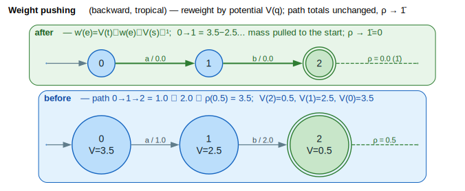

# Weight Pushing

Weight pushing redistributes weights along paths to normalize their distribution, moving weights toward initial or final states. This is essential for minimization, beam search optimization, and equivalence testing. (WFST = **W**eighted **F**inite-**S**tate **T**ransducer.)

## Terms & symbols

Defined centrally in [`../NOTATION.md`](../NOTATION.md); repeated locally for the terms this doc uses.

| Symbol | Meaning |
|---|---|
| `⊕` / `⊗` | semiring *plus* (combine alternatives) / *times* (combine arcs). |
| `0̄` / `1̄` | `⊕`-identity ("no path") / `⊗`-identity ("empty path", zero cost). |
| `V(q)` | potential of state `q` — the shortest distance from/to `q` used to reweight. |
| `V(q)⁻¹` | the `⊗`-inverse of the potential (division `⊘` on a `DivisibleSemiring`). |
| `ρ(q)` | final-weight function `ρ : F → K`. |
| `⊕ₗₒg` | log-add `x ⊕ₗₒg y = −ln(e⁻ˣ + e⁻ʸ)` (the Log-semiring `⊕`). |
| `∣Q∣`, `∣E∣` | number of states / transitions (cardinality bar `∣` = U+2223). |

## Concepts

### What is Weight Pushing?

Weight pushing transforms a WFST by redistributing weights along paths while preserving the total weight of each path. The weights are "pushed" toward either:

- **Forward (toward initial)**: Early transitions carry more weight
- **Backward (toward final)**: Late transitions carry more weight

The figure below shows a backward push: each arc is reweighted by the potentials `` `V(q)` `` so the path mass migrates toward the start, the per-path total is unchanged, and the final weight normalizes to `1̄`.



*Left = original tropical weights with each state's potential `` `V(q)` `` annotated; right = pushed — `` `w'(e) = V(t) ⊗ w(e) ⊗ V(s)⁻¹` ``, mass pulled toward the start, `` `ρ → 1̄` `` (green dashed final-weight stub).*

<details><summary>Text view</summary>

```text
Before:           After Backward Push:

 0 --1.0--> 1     0 --0.0--> 1
     |           |     |           |
    2.0         0.5   0.0         0.5
     |           |     |           |
     v           v     v           v
 2 --3.0--> 3    2 --0.0--> 3
   (ρ=0.0)         (ρ=1̄)

Path weight: 1⊗2⊗3⊗0 = 6    Path weight: 0⊗0⊗0⊗1̄ = total
                            (total preserved, mass absorbed in initial potential)
```

</details>

### Why Weight Pushing?

1. **Prerequisite for Minimization**: Weighted minimization requires pushed WFSTs
2. **Beam Search Pruning**: Log-semiring pushing dramatically improves pruning efficacy (18× speedup)
3. **Equivalence Testing**: Pushed WFSTs can be compared structurally
4. **Stochastic Normalization**: Creates automata where weights sum to 1 at each state

## Core API

### Types

```rust
// Push direction
pub enum PushDirection {
    Forward,   // Push toward initial state
    Backward,  // Push toward final states (default, recommended)
}

// General push configuration
pub struct PushConfig {
    pub direction: PushDirection,
    pub remove_non_coaccessible: bool,
    pub distance_config: ShortestDistanceConfig,
}

// Log-semiring push for beam search
pub struct LogPushConfig {
    pub verify_stochastic: bool,    // Check weights sum to 1
    pub stochastic_epsilon: f64,    // Tolerance for check
    pub normalize_finals: bool,      // Set final weights to one
}

// Result of beam search preparation
pub struct BeamSearchPrepResult {
    pub pushed: bool,
    pub total_weight: LogWeight,
    pub is_stochastic: Option<bool>,
    pub num_states: usize,
    pub num_transitions: usize,
}
```

### Functions

```rust
// General weight pushing (requires DivisibleSemiring)
pub fn push_weights<L, W, F>(
    fst: &mut F,
    config: PushConfig,
) -> Result<(), PushError>;

// Log-semiring pushing for beam search
pub fn prepare_for_beam_search<L, F>(
    fst: &mut F,
    config: LogPushConfig,
) -> Result<BeamSearchPrepResult, LogPushError>;

// Compute log-semiring potentials (backward)
pub fn compute_log_potentials<L, F>(
    fst: &F,
) -> Result<Vec<LogWeight>, LogPushError>;

// Check if WFST is stochastic
pub fn is_stochastic<L, W, F>(
    fst: &F,
    epsilon: f64,
) -> bool;
```

## The Critical Insight: Log vs Tropical

This is the most important concept in this document:

### Tropical Semiring Pushing (DON'T USE for beam search)

- Uses **minimum-weight** potential (best single path)
- Can actually **harm** beam search by distorting relative scores
- Per [Mohri 2002](../BIBLIOGRAPHY.md#ref-mohri2002): tropical pushing "may slow down beam-pruned Viterbi decoding many fold"

### Log Semiring Pushing (USE THIS for beam search)

- Uses **total probability** potential (sum of all path probabilities)
- Creates a **stochastic** automaton where weights sum to 1
- Quote: "Has a very large beneficial impact on pruning efficacy"
- Conjecture: "Optimal likelihood ratio test for pruning decisions"

```text
                    ┌─────────────────────────────────────┐
                    │        CRITICAL FOR BEAM SEARCH     │
                    │                                     │
                    │   Use LogWeight + prepare_for_      │
                    │   beam_search() for up to 18×       │
                    │   speedup in beam-pruned decoding   │
                    │                                     │
                    └─────────────────────────────────────┘
```

## Examples

### Basic Backward Push

```rust
use lling_llang::prelude::*;
use lling_llang::algorithms::{push_weights, PushConfig};

let mut fst: VectorWfst<char, TropicalWeight> = VectorWfstBuilder::new()
    .add_states(3)
    .start(0)
    .arc(0, Some('a'), Some('a'), 1, TropicalWeight::new(1.0))
    .arc(1, Some('b'), Some('b'), 2, TropicalWeight::new(2.0))
    .final_state(2, TropicalWeight::new(0.5))
    .build();

// Push weights toward final states
push_weights(&mut fst, PushConfig::backward())?;

// After pushing:
// - Final weight becomes normalized
// - Transition weights are redistributed
// - Total path weight is preserved
```

### Beam Search Optimization

```rust
use lling_llang::prelude::*;
use lling_llang::optimization::{prepare_for_beam_search, LogPushConfig};

// Build a recognition WFST with log weights
let mut fst: VectorWfst<char, LogWeight> = VectorWfstBuilder::new()
    .add_states(4)
    .start(0)
    .arc(0, Some('a'), Some('a'), 1, LogWeight::new(1.0))
    .arc(0, Some('b'), Some('b'), 2, LogWeight::new(2.0))
    .arc(1, Some('c'), Some('c'), 3, LogWeight::new(1.0))
    .arc(2, Some('d'), Some('d'), 3, LogWeight::new(0.5))
    .final_state(3, LogWeight::one())
    .build();

// Prepare for beam search with log-semiring pushing
let result = prepare_for_beam_search(&mut fst, LogPushConfig::verified())?;

println!("Total weight: {:?}", result.total_weight);
println!("Is stochastic: {:?}", result.is_stochastic);

// Now beam search will have optimal pruning behavior
```

### Verifying Stochasticity

```rust
use lling_llang::algorithms::is_stochastic;

// After log-semiring pushing, the WFST should be stochastic
// (weights sum to 1 at each state in probability space)
if is_stochastic(&fst, 1e-6) {
    println!("WFST is stochastic - optimal for beam search");
} else {
    println!("WFST is not stochastic - check for issues");
}
```

## Algorithm Details

### Potential Functions

Weight pushing uses **potential functions** `` `V(q)` `` computed via shortest-distance
([Mohri 2009](../BIBLIOGRAPHY.md#ref-mohri2009)). The potential is the total weight of
all paths from (or to) `q`; reweighting each arc by the potentials of its endpoints
leaves every full start→final path total invariant while shifting where the mass sits.

**Forward Push (toward initial)** — `` `V(q)` `` = shortest distance from the initial state to `q`:
- Transition: `` `w'(e) = V(source)⁻¹ ⊗ w(e) ⊗ V(target)` ``
- Final: `` `ρ'(q) = V(q)⁻¹ ⊗ ρ(q)` ``

**Backward Push (toward final)** — `` `V(q)` `` = shortest distance from `q` to any final state:
- Transition: `` `w'(e) = w(e) ⊗ V(target) ⊗ V(source)⁻¹` ``
- Final: `` `ρ'(q) = 1̄` `` (normalized)

```text
⟨ compute potentials ⟩ ≡
    V ← reverse_shortest_distance(fst)     // backward: V(q) = d(q → finals)
    // (forward push instead uses single_source_shortest_distance: V(q) = d(start → q))
```

```text
⟨ reweight one arc by its endpoints ⟩ ≡
    // backward form: w'(e) = w(e) ⊗ V(target) ⊗ V(source)⁻¹
    w'(e) ← w(e) ⊗ V(target(e)) ⊗ inverse(V(source(e)))
```

```text
⟨ push weights (backward) ⟩ ≡
    ⟨ compute potentials ⟩
    for each arc e:           ⟨ reweight one arc by its endpoints ⟩
    for each state q:         ρ'(q) ← 1̄          // finals normalized
```

### Log-Semiring Potentials

For the log semiring, the potential `` `V(q)` `` represents the **total probability** of
all paths from `q` to a final state, i.e. `` `V(q) = −log Σ_{π: q→final} e^{−weight(π)}` ``:

```text
V(q) = -log( Σ_{paths π from q to final} exp(-weight(π)) )
```

This is computed in reverse topological order:

```text
V(final) = final_weight
V(q) = ⊕ₗₒg over outgoing arcs of ( arc_weight ⊗ V(target) )
```

i.e. `` `V(q) = ⨁ₗₒg_e (w(e) ⊗ V(target(e)))` ``, where `` `a ⊕ₗₒg b = −log(e⁻ᵃ + e⁻ᵇ)` ``.

### Reweighting Invariant

Path weights are preserved under the reweighting, because the potentials telescope: `` `V(s₁)⁻¹ ⊗ V(s₂) ⊗ V(s₂)⁻¹ ⊗ V(s₃) = V(s₁)⁻¹ ⊗ V(s₃)` ``.

```text
                original                    after push
              ┌───────────┐               ┌───────────┐
              │  w₁ ⊗ w₂  │       =       │  w'₁ ⊗ w'₂ │
              └───────────┘               └───────────┘

Because the potentials cancel along the path:
  V(s₁)⁻¹ ⊗ V(s₂) ⊗ V(s₂)⁻¹ ⊗ V(s₃) = V(s₁)⁻¹ ⊗ V(s₃)
```

## Performance

### Complexity

| Operation | Time | Space |
|-----------|------|-------|
| Compute potentials (acyclic) | `` `O(∣Q∣ + ∣E∣)` `` | `` `O(∣Q∣)` `` |
| Compute potentials (general) | `` `O(∣E∣ + ∣Q∣ log ∣Q∣)` `` | `` `O(∣Q∣)` `` |
| Apply push | `` `O(∣Q∣ + ∣E∣)` `` | `` `O(∣E∣)` `` |

### Beam Search Speedup

From the literature ([Mohri 2002](../BIBLIOGRAPHY.md#ref-mohri2002)):

| Configuration | Relative Speed |
|---------------|---------------|
| Unpushed | 1× |
| Tropical pushed | 0.2× (slower!) |
| **Log pushed** | **18×** |

The dramatic difference comes from optimal pruning decisions when weights represent true probabilities.

## Semiring Requirements

Weight pushing requires a **divisible semiring** (implements `DivisibleSemiring`):

| Semiring | Divisible | Push Supported |
|----------|-----------|----------------|
| Tropical | Yes | Yes |
| Log | Yes | Yes (recommended for beam search) |
| Probability | Yes | Yes |
| Boolean | No | No |
| String | No | No |

## Common Patterns

### Pre-Minimization Push

```rust
use lling_llang::algorithms::{push_weights, minimize, PushConfig, MinimizeConfig};

// Weight pushing is a prerequisite for minimization
push_weights(&mut fst, PushConfig::backward())?;
let minimized = minimize(&fst, MinimizeConfig::default())?;
```

### Cascade Optimization

For speech recognition cascades (`` `H ∘ C ∘ L ∘ G` ``):

```rust
// Build the cascade
let cascade = compose(&compose(&h, &c), &compose(&l, &g));

// Apply log-semiring pushing for optimal beam search
prepare_for_beam_search(&mut cascade, LogPushConfig::verified())?;

// Now decode with beam search
let result = beam_search(&cascade, &input, config);
```

## Error Handling

```rust
use lling_llang::algorithms::PushError;
use lling_llang::optimization::LogPushError;

match push_weights(&mut fst, config) {
    Ok(()) => { /* success */ }
    Err(PushError::NoStartState) => { /* no start state set */ }
    Err(PushError::NoPotentials) => { /* no path to finals */ }
    Err(PushError::DivisionByZero) => { /* weight division failed */ }
}

match prepare_for_beam_search(&mut fst, config) {
    Ok(result) => {
        if result.is_stochastic == Some(false) {
            // Unexpected: weights don't sum to 1
        }
    }
    Err(LogPushError::NoPathToFinal) => { /* disconnected */ }
    // ...
}
```

## References

- [Mohri 2002](../BIBLIOGRAPHY.md#ref-mohri2002) — *Weighted Finite-State Transducers in Speech Recognition*: weight pushing via potentials, the log-vs-tropical pruning distinction, and the reported up-to-18× beam-search speedup.
- [Mohri 2009](../BIBLIOGRAPHY.md#ref-mohri2009) — *Weighted Automata Algorithms*: the general potential-function formulation of pushing over a divisible semiring and its role in minimization.

## Next Steps

- [Shortest-Distance](shortest-distance.md): Foundation for potential computation
- [Minimization](minimization.md): Uses weight pushing as prerequisite
- [Beam Optimization](../advanced/beam-optimization.md): Comprehensive beam search tuning
- [Semirings](../architecture/semirings.md): Understanding divisible semirings
