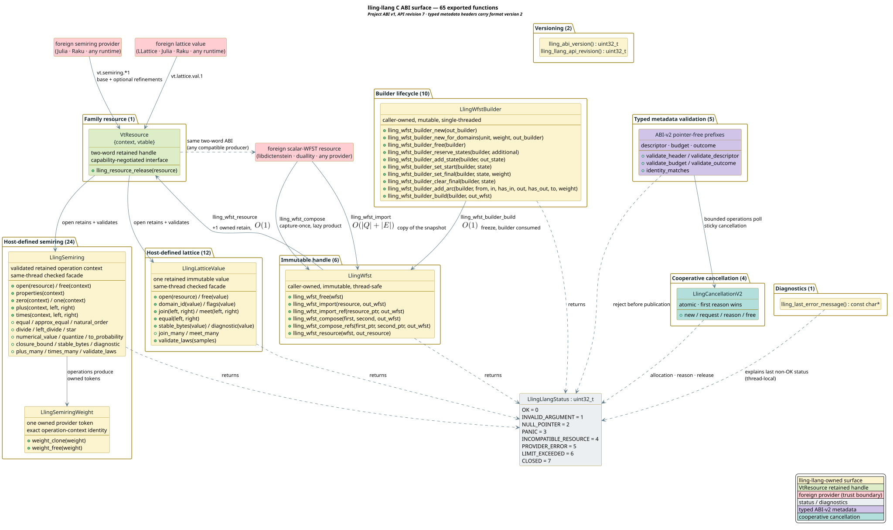

# C ABI reference — `lling_llang.h`

The complete reference for lling-llang's stable, project-owned C ABI: all 26
exported `lling_*` functions, their exact signatures, preconditions, returnable
status sets, ownership and threading rules, and complexity — plus the
weight-domain ↔ semiring dictionary shared with the whole vinary-tree family.
The ABI builds Unicode/tropical WFSTs behind opaque handles and exchanges them
with sibling libraries as retained two-word `VtResource` values carrying the
`vt.scalar-wfst.1` interface.

This document describes the surface declared in
[`include/lling_llang.h`](../../include/lling_llang.h) (C) and wrapped by
[`include/lling_llang.hpp`](../../include/lling_llang.hpp) (C++20 RAII), and
implemented by `src/ffi.rs` over the resource layer documented in
[Resource ABI architecture](../architecture/resource-abi.md). The
family-neutral base contract (two-word resources, retain/release,
`query_interface`, the scalar-WFST vtable, and the paging law) is normative in
the family canon:
[ABI reference](https://github.com/vinary-tree/vinary-tree-interop/blob/master/docs/abi-reference.md) ·
[ABI evolution](https://github.com/vinary-tree/vinary-tree-interop/blob/master/docs/abi-evolution.md) ·
[Security model](https://github.com/vinary-tree/vinary-tree-interop/blob/master/docs/security-model.md).

---

## Terms & symbols

Symbols link to [`NOTATION.md`](../NOTATION.md); authoring rules in
[`STYLE.md`](../STYLE.md).

| Symbol / term | Meaning |
|---|---|
| **ABI** | Application Binary Interface — the compiled calling contract (symbols, layouts, statuses) that stays stable across releases. |
| **WFST** | Weighted Finite-State Transducer: arcs carry an input label, an output label, and a weight. |
| `LlingStatus` | The `uint32_t` status enum returned by every fallible `lling_*` call (values 0–7, [table below](#status-codes)). |
| `VtResource` | The family's two-word retained handle `{context, vtable}`; a non-null value owns exactly one retain. |
| `vt.scalar-wfst.1` | The 16-byte interface identity under which scalar WFSTs cross the family ABI. |
| **handle** | An opaque caller-owned pointer (`LlingWfstBuilder*`, `LlingWfst*`, or `LlingCancellationV2*`) released according to its matching ownership rule. |
| **typed ABI v2** | Additive pointer-free metadata with `abi_version == 2`; this is distinct from the project-wide breaking counter `LLING_ABI_VERSION == 1`. |
| **snapshot** | The immutable revision a consumer captures once before traversal; state identifiers are scoped to it. |
| $`\langle K, \oplus, \otimes, \bar{0}, \bar{1} \rangle`$ | A semiring: carrier $`K`$, path-alternation $`\oplus`$, path-extension $`\otimes`$, and their identities ($`\bar{0}`$ = no path, $`\bar{1}`$ = empty path). |
| $`Q`$, $`E`$ | State set and arc set of a WFST; $`\lvert Q\rvert`$, $`\lvert E\rvert`$ are their sizes. |
| $`\varepsilon`$ | The empty label — encoded on the wire as a presence flag of zero. |

## The surface at a glance

Twenty-six functions in seven groups. Every fallible call returns a
`LlingStatus`; every non-`OK` return latches a thread-local, NUL-terminated
diagnostic readable through `lling_last_error_message()`.



*Yellow = lling-llang-owned surface; green = retained `VtResource` handles;
red = foreign providers across the trust boundary; grey = status and
diagnostics.*

<details><summary>Text view</summary>

<!-- vdl-disable-next-line ASCII001 -->
```text
Versioning (2)     lling_abi_version, lling_api_revision
Diagnostics (1)    lling_last_error_message
Builder (9)        lling_wfst_builder_new ─┐  caller-owned, mutable,
                   lling_wfst_builder_free │  single-threaded
                   lling_wfst_builder_reserve_states
                   lling_wfst_builder_add_state
                   lling_wfst_builder_set_start
                   lling_wfst_builder_set_final
                   lling_wfst_builder_clear_final
                   lling_wfst_builder_add_arc
                   lling_wfst_builder_build ──▶ LlingWfst (immutable)
Handle (4)         lling_wfst_free, lling_wfst_import,
                   lling_wfst_compose, lling_wfst_resource ──▶ VtResource
Resource (1)       lling_resource_release
                   (VtResource also flows IN to import/compose from any
                    compatible producer: libdictenstein, duallity, …)
Typed ABI v2 (5)   validate header · descriptor · budget · outcome
                   compare snapshot/context identity
Cancellation (4)  new · request · reason · single-release free
```

</details>

## Version constants and the handshake

```c
#define LLING_ABI_VERSION 1u
#define LLING_API_REVISION 2u
#define LLING_ABI_V2 2u

LLING_API uint32_t lling_abi_version(void);
LLING_API uint32_t lling_api_revision(void);
```

Two counters, two different promises, following the family's
[four-counter evolution model](https://github.com/vinary-tree/vinary-tree-interop/blob/master/docs/abi-evolution.md):

- **`lling_abi_version()`** — the breaking counter. A binary whose ABI version
  differs from the `LLING_ABI_VERSION` you compiled against is incompatible;
  refuse to proceed.
- **`lling_api_revision()`** — the additive counter. It only grows; a runtime
  revision **at least** your compile-time `LLING_API_REVISION` guarantees that
  every symbol you compiled against exists.
- **`LLING_ABI_V2`** — the version stored inside typed metadata structures.
  It does not replace or bump the project breaking counter. ABI-v1 resources
  therefore remain loadable as explicitly opaque inputs while API revision 2
  adds typed descriptors, outcomes, budgets, and cancellation.

Both functions are infallible, never touch the error slot, are safe from any
thread at any time, and cost $`O(1)`$. The canonical handshake:

```c
if (lling_abi_version() != LLING_ABI_VERSION ||
    lling_api_revision() < LLING_API_REVISION) {
    /* incompatible binary — do not call anything else */
}
```

## Diagnostics

```c
LLING_API const char* lling_last_error_message(void);
```

Returns this thread's last error message as a NUL-terminated UTF-8 string.

- **Thread-local.** Each thread has its own slot; a failure on thread A never
  changes what thread B reads. Read it on the same thread that received the
  non-`OK` status.
- **Latching.** The slot is overwritten by the *next* failing call on the same
  thread (and only by failing calls — a success leaves it untouched). The
  returned pointer is invalidated by that next failure: copy the string out if
  you need it beyond the next ABI call.
- Infallible, never null (the initial content is `"ok"`), $`O(1)`$.

## Status codes

`LlingStatus` is `#[repr(u32)]` in Rust and an integer-typed `enum` in C — the
same eight values on both sides, pinned by `bindings/api.json` and enforced by
`scripts/check-bindings.py`:

| Value | Name | Meaning |
|---|---|---|
| 0 | `LLING_STATUS_OK` | Operation completed successfully. |
| 1 | `LLING_STATUS_INVALID_ARGUMENT` | An argument value was rejected (absent state, non-tropical weight — NaN or $`-\infty`$, malformed label, missing start state). |
| 2 | `LLING_STATUS_NULL_POINTER` | A required pointer (or resource word) was null. |
| 3 | `LLING_STATUS_PANIC` | A Rust panic was caught at the boundary; it never unwinds into C. |
| 4 | `LLING_STATUS_INCOMPATIBLE_RESOURCE` | The resource does not expose a compatible `vt.scalar-wfst.1` interface (wrong ABI version, missing ops, wrong label or weight domain). |
| 5 | `LLING_STATUS_PROVIDER_ERROR` | A foreign provider callback failed or returned output that failed validation. |
| 6 | `LLING_STATUS_LIMIT_EXCEEDED` | A state count or label exceeds lling-llang's native representation. |
| 7 | `LLING_STATUS_CLOSED` | A builder was consumed, or a pointer-slot-owned v2 handle was already released. |

The import/compose paths classify every internal `BindingError` **totally** —
each variant maps to exactly one status, so no failure is ever swallowed or
ambiguous:

| `BindingError` (src/bindings.rs) | `LlingStatus` |
|---|---|
| `NullResource` | `NULL_POINTER` |
| `IncompatibleResourceAbi` · `MissingWfstInterface` · `IncompatibleWfstInterface` · `UnitDomainMismatch` · `WeightDomainMismatch` | `INCOMPATIBLE_RESOURCE` |
| `Provider(status)` · `InvalidProviderOutput(reason)` | `PROVIDER_ERROR` |
| `RepresentationLimit` | `LIMIT_EXCEEDED` |

Statuses arriving **from** foreign providers travel the wire as raw `uint32_t`
and are decoded with a range check before any typed use — an out-of-range
value is classified as `PROVIDER_ERROR`-class misbehavior, never undefined
behavior. See [Resource ABI architecture](../architecture/resource-abi.md#the-raw-u32-status-wire).

## Typed metadata ABI v2

API revision 2 adds typed, pointer-free metadata without changing the project
ABI or the existing resource calls. An ABI-v1 `VtResource` remains valid but is
explicitly **opaque**: it cannot authorize typed evidence until a producer or
adapter supplies a canonical `LlingWfstDescriptorV2`.

### Common prefix and layouts

Every typed structure starts with this 24-byte header:

```c
typedef struct LlingAbiV2Header {
    uint32_t struct_size;
    uint32_t abi_version;
    uint64_t flags;
    uint64_t reserved;
} LlingAbiV2Header;
```

The validator accepts `struct_size` greater than the known size so a later API
revision may append fields. It rejects a shorter prefix, any
`abi_version != LLING_ABI_V2`, unknown flag bits, or nonzero reserved data.
Callers must zero-initialize structures before assigning known fields.

| Type | Size | Alignment rule | Purpose |
|---|---:|---|---|
| `LlingAbiV2Header` | 24 bytes | native `uint64_t` alignment | Additive size, version, flags, and reserved prefix. |
| `LlingId128` | 16 bytes | 1 byte | Caller-owned semantic or snapshot identity; all-zero means absent. |
| `LlingDigest256` | 32 bytes | 1 byte | Domain-neutral evidence-context digest; all-zero means absent. |
| `LlingWfstDescriptorV2` | 120 bytes | native `uint64_t` alignment | Separate input tape, output tape, algebra, snapshot, and context identities. |
| `LlingBudgetV2` | 72 bytes | native `uint64_t` alignment | Four independently enabled, positive resource limits. |
| `LlingOutcomeV2` | 96 bytes | native `uint64_t` alignment | Orthogonal precision, completeness, applicability, termination, and evidence axes plus usage counters. |

The public header contains C11 and C++20 compile-time assertions for every
size and for the byte alignment of the identifier arrays. Rust properties and
Kani/CBMC independently pin the same values.

### Canonical descriptors and replay identity

`LlingWfstDescriptorV2.header.flags` defines three presence bits:

| Flag | Canonical rule |
|---|---|
| `LLING_DESCRIPTOR_SIGNATURE_KNOWN` | `input_tape`, `output_tape`, and `algebra` are all nonzero; when inactive all three are zero. |
| `LLING_DESCRIPTOR_SNAPSHOT_PRESENT` | Active exactly when `snapshot` is nonzero. |
| `LLING_DESCRIPTOR_CONTEXT_PRESENT` | Active exactly when `context` is nonzero. |

Typed evidence is admissible only when all three flags and their fields are
canonical. `lling_abi_v2_identity_matches` is deliberately stricter than a
snapshot-only comparison: input tape, output tape, algebra, snapshot, and
context must all match byte-for-byte. A mismatch returns `OK` with
`*out_matches == 0`; malformed descriptors return `INVALID_ARGUMENT` and do
not modify the output byte.

The validation algorithm is a fixed-work, stack-safe prefix machine:

```text
Algorithm ValidateTypedPrefix(pointer, required_size, known_flags)
  1. Reject a null or incorrectly aligned pointer without dereferencing it.
  2. Copy only LlingAbiV2Header and reject a short, wrong-version,
     unknown-flag, or nonzero-reserved prefix.
  3. Copy the now-proven known prefix into local fixed-width storage.
  4. Decode every raw discriminant through a total range check.
  5. Check structure-specific presence, reserved, and publication laws.
  6. Publish output bytes only after every check succeeds.
```

The work and auxiliary space are both $`O(1)`$; no input shape can induce
recursion or allocation.

### Orthogonal outcomes

`LlingOutcomeV2` stores raw `uint32_t` discriminants rather than C or Rust enum
objects. The implementation range-checks them before constructing a typed
value. This prevents malformed foreign discriminants from becoming undefined
Rust enum values.

The axes answer different questions and never self-promote:

- **precision** — exact, approximate, or unknown denotational preservation;
- **completeness** — whether the declared work finished;
- **applicability** — applicable, unsupported, or unknown for these domains;
- **termination** — succeeded, cancelled, budget-exhausted, or failed; and
- **evidence** — none, candidate, verified, stale, or invalid.

An authoritative exact result requires exact precision, complete work,
applicability, successful termination, and live verified evidence. Exact but
incomplete and approximate but complete are both valid non-authoritative
states. Cancellation, budget exhaustion, and failure publish neither resource
nor evidence. Cancellation and budget exhaustion also require incomplete
completion.

### Canonical budgets

Each active budget flag requires its corresponding value to be positive; each
inactive value must be zero. The two reserved words must be zero. This
one-to-one flag/value representation prevents an inactive nonzero limit from
being interpreted differently by two languages.

```c
LlingBudgetV2 budget = {0};
budget.header.struct_size = (uint32_t)sizeof budget;
budget.header.abi_version = LLING_ABI_V2;
budget.header.flags = LLING_BUDGET_STATES | LLING_BUDGET_WORK;
budget.max_states = 100000;
budget.max_work = 5000000;
if (lling_abi_v2_validate_budget(&budget) != LLING_STATUS_OK) {
    /* Reject before starting the operation. */
}
```

### Validation functions

| Function | Successful output | Rejection classes | Complexity |
|---|---|---|---|
| `lling_abi_v2_validate_header` | Header is a canonical additive prefix for the supplied size and known flags. | `NULL_POINTER`, `INVALID_ARGUMENT`, `PANIC` | $`O(1)`$ time and space |
| `lling_abi_v2_validate_descriptor` | Writes 0 or 1 to `out_typed_evidence_allowed`. | Null/misaligned pointers, malformed header, noncanonical presence fields | $`O(1)`$ time and space |
| `lling_abi_v2_validate_budget` | Budget is canonical. | Null/misaligned pointer, malformed header, flag/value mismatch, reserved data | $`O(1)`$ time and space |
| `lling_abi_v2_validate_outcome` | Writes 0 or 1 to `out_authoritative_exact`. | Non-Boolean presence byte, unknown discriminant, impossible publication state, reserved data | $`O(1)`$ time and space |
| `lling_abi_v2_identity_matches` | Writes 1 only for an exact five-field identity match. | Null/misaligned pointers or malformed descriptors | $`O(1)`$ time and space |

All output pointers are required and writable. On failure, an output byte is
left unchanged. The Boolean inputs to outcome validation accept only 0 and 1.

## Cooperative cancellation v2

`LlingCancellationV2` is an opaque, thread-safe handle containing one atomic
wire reason. Zero means live. The first valid request changes zero to one of
the four `LlingCancellationReasonV2` values; later requests observe the
already-cancelled state and cannot overwrite the first reason. This
first-writer-wins rule makes concurrent cancellation deterministic with respect
to the first successful atomic transition.

| Function | Contract |
|---|---|
| `lling_cancellation_v2_new` | Requires a non-null pointer to an initially null slot. Uses the library allocator; allocation failure returns `LIMIT_EXCEEDED`. |
| `lling_cancellation_v2_request` | Range-checks the raw reason, then performs one atomic compare-and-exchange. Unknown values return `INVALID_ARGUMENT` without changing state. |
| `lling_cancellation_v2_reason` | Writes zero while live or the first recorded reason. |
| `lling_cancellation_v2_free` | Accepts the caller's pointer slot, frees once, and nulls the slot. A second call on that slot returns `CLOSED` instead of double-freeing. |

Do not free a handle while another thread can request or read it. Ownership
transfer requires transferring the pointer slot and synchronizing all users;
copying the raw pointer does not create another owner. Every operation is
$`O(1)`$, uses no recursion, and performs no callback.

## Builder lifecycle — nine functions

`LlingWfstBuilder` is an opaque, caller-owned, **mutable** graph under
construction: Unicode-scalar labels, tropical `f64` weights. It is **not**
thread-safe — confine each builder to one thread. `build` freezes it into an
immutable `LlingWfst` in $`O(1)`$ and consumes it; every later builder call
answers `LLING_STATUS_CLOSED`.


*Yellow = the mutable Open state; amber = the Consumed builder; green = the
immutable handle; red annotations = failure statuses.*

<details><summary>Text view</summary>

<!-- vdl-disable-next-line ASCII001 -->
```text
        builder_new                     build (has start)   out_wfst
  [*] ──────────────▶ Open ──────────────────────────────▶ Consumed ──▶ LlingWfst
                       │ ▲                                     │
   reserve_states,     │ │  build with NO start state:         │ any builder call
   add_state,          └─┘  INVALID_ARGUMENT, graph restored   │ → CLOSED
   set_start/final,                                            ▼
   clear_final,        builder_free accepted from Open and Consumed alike
   add_arc (OK | INVALID_ARGUMENT, state unchanged on rejection)
```

</details>

### `lling_wfst_builder_new`

```c
LLING_API LlingStatus lling_wfst_builder_new(LlingWfstBuilder** out_builder);
```

| Aspect | Contract |
|---|---|
| Semantics | Allocates an empty builder and writes its handle to `*out_builder`. |
| Preconditions | `out_builder` non-null and writable. |
| Returns | `OK` · `NULL_POINTER` · `PANIC` |
| Ownership | Caller owns the builder; release with `lling_wfst_builder_free`. |
| Thread safety | Callable from any thread; the resulting builder is single-threaded. |
| Complexity | $`O(1)`$ |

> **Check order.** The out-pointer is validated *before* the builder is
> constructed: a null `out_builder` returns `NULL_POINTER` and allocates
> nothing.

### `lling_wfst_builder_free`

```c
LLING_API void lling_wfst_builder_free(LlingWfstBuilder* builder);
```

| Aspect | Contract |
|---|---|
| Semantics | Frees a builder in either lifecycle state (Open or Consumed). Null is accepted as a no-op. |
| Preconditions | A non-null pointer must originate from `lling_wfst_builder_new` and must not have been freed already (double-free is undefined behavior, as in `free(3)`). |
| Returns | *(void — infallible)* |
| Ownership | Ends the builder's lifetime. Handles already produced by `build` are unaffected. |
| Thread safety | Call on the thread that owns the builder. |
| Complexity | $`O(1)`$ plus deallocation of the graph if still Open. |

### `lling_wfst_builder_reserve_states`

```c
LLING_API LlingStatus lling_wfst_builder_reserve_states(
    LlingWfstBuilder* builder, size_t additional);
```

| Aspect | Contract |
|---|---|
| Semantics | Pre-allocates capacity for `additional` further states (preallocation is a best practice when the size is known). |
| Preconditions | `builder` non-null and not consumed. |
| Returns | `OK` · `NULL_POINTER` · `CLOSED` · `PANIC` |
| Ownership | No transfer. |
| Thread safety | Builder-confined (one thread). |
| Complexity | $`O(\text{additional})`$ amortized; may reallocate once. |

### `lling_wfst_builder_add_state`

```c
LLING_API LlingStatus lling_wfst_builder_add_state(
    LlingWfstBuilder* builder, uint32_t* out_state);
```

| Aspect | Contract |
|---|---|
| Semantics | Adds one state and writes its dense identifier (states number upward from 0) to `*out_state`. New states are non-final and initially unreachable. |
| Preconditions | `builder` non-null, not consumed; `out_state` non-null. |
| Returns | `OK` · `NULL_POINTER` · `CLOSED` · `PANIC` |
| Ownership | No transfer. |
| Thread safety | Builder-confined. |
| Complexity | $`O(1)`$ amortized. |

> **Check order.** `out_state` is validated before the builder is mutated. A
> null output pointer returns `NULL_POINTER` without adding a state. The builder
> remains unchanged and usable.

### `lling_wfst_builder_set_start`

```c
LLING_API LlingStatus lling_wfst_builder_set_start(
    LlingWfstBuilder* builder, uint32_t state);
```

| Aspect | Contract |
|---|---|
| Semantics | Marks `state` as the initial state $`q_0`$. Calling it again replaces the previous start. |
| Preconditions | `builder` non-null, not consumed; `state` must already exist. |
| Returns | `OK` · `INVALID_ARGUMENT` (state absent) · `NULL_POINTER` · `CLOSED` · `PANIC` |
| Ownership | No transfer. |
| Thread safety | Builder-confined. |
| Complexity | $`O(1)`$ |

### `lling_wfst_builder_set_final`

```c
LLING_API LlingStatus lling_wfst_builder_set_final(
    LlingWfstBuilder* builder, uint32_t state, double weight);
```

| Aspect | Contract |
|---|---|
| Semantics | Marks `state` final with tropical final weight $`\rho(q) = \texttt{weight}`$. |
| Preconditions | `builder` non-null, not consumed; `state` exists; `weight` in the tropical carrier $`\mathbb{R} \cup \{+\infty\}`$. |
| Returns | `OK` · `INVALID_ARGUMENT` (non-tropical weight — NaN or $`-\infty`$; state absent) · `NULL_POINTER` · `CLOSED` · `PANIC` |
| Ownership | No transfer. |
| Thread safety | Builder-confined. |
| Complexity | $`O(1)`$ |

> **Check order and the weight domain.** The weight is validated with
> `TropicalWeight::is_valid_raw` *before* the builder pointer is examined,
> so `set_final(NULL, s, NAN)` reports `INVALID_ARGUMENT`, not
> `NULL_POINTER`. `+INFINITY` is accepted (it is the tropical $`\bar{0}`$ —
> a final weight of "unreachable"); NaN **and** `-INFINITY` are rejected
> uniformly. This is the builder-surface twin of finding LLING-B2/F1
> (before the fix, a `-INFINITY` slipped the NaN-only check and surfaced as
> a caught `PANIC`) — see the
> [bindings findings ledger](../scientific-ledger/bindings-findings-ledger.md).

### `lling_wfst_builder_clear_final`

```c
LLING_API LlingStatus lling_wfst_builder_clear_final(
    LlingWfstBuilder* builder, uint32_t state);
```

| Aspect | Contract |
|---|---|
| Semantics | Clears `state`'s final flag and resets its final weight to the tropical $`\bar{0} = +\infty`$. Idempotent. |
| Preconditions | `builder` non-null, not consumed; `state` exists. |
| Returns | `OK` · `INVALID_ARGUMENT` (state absent) · `NULL_POINTER` · `CLOSED` · `PANIC` |
| Ownership | No transfer. |
| Thread safety | Builder-confined. |
| Complexity | $`O(1)`$ |

### `lling_wfst_builder_add_arc`

```c
LLING_API LlingStatus lling_wfst_builder_add_arc(
    LlingWfstBuilder* builder, uint32_t from,
    uint64_t input_label, uint8_t has_input,
    uint64_t output_label, uint8_t has_output,
    uint32_t to, double weight);
```

| Aspect | Contract |
|---|---|
| Semantics | Appends the arc $`(\mathit{from}, i, o, w, \mathit{to})`$. A presence flag of 0 makes that side $`\varepsilon`$ (the label value is then ignored); a flag of 1 requires the label to be a Unicode scalar value (any code point except surrogates, i.e. at most `0x10FFFF`). Parallel and duplicate arcs are allowed. |
| Preconditions | `builder` non-null, not consumed; `from` and `to` exist; each presence flag is 0 or 1; present labels are Unicode scalars; `weight` in the tropical carrier. |
| Returns | `OK` · `INVALID_ARGUMENT` (non-tropical weight — NaN or $`-\infty`$; presence flag $`> 1`$; non-scalar label; absent endpoint) · `NULL_POINTER` · `CLOSED` · `PANIC` |
| Ownership | No transfer. |
| Thread safety | Builder-confined. |
| Complexity | $`O(1)`$ amortized. |

> **Check order.** Validation runs weight → labels → builder → endpoints, so
> argument errors report `INVALID_ARGUMENT` even when `builder` is null. The
> weight check is the same uniform `TropicalWeight::is_valid_raw` rejection
> as `set_final` (the LLING-B2/F1 builder-surface twin).

### `lling_wfst_builder_build`

```c
LLING_API LlingStatus lling_wfst_builder_build(
    LlingWfstBuilder* builder, LlingWfst** out_wfst);
```

| Aspect | Contract |
|---|---|
| Semantics | Freezes the graph into an immutable, thread-safe `LlingWfst` and writes its handle to `*out_wfst`. The builder is consumed on success. |
| Preconditions | `builder` non-null, not consumed; a start state has been set; `out_wfst` non-null. |
| Returns | `OK` · `INVALID_ARGUMENT` (no start state — the builder is **restored**, still Open) · `NULL_POINTER` · `CLOSED` (already consumed) · `PANIC` |
| Ownership | On `OK`, the caller owns the new handle (free with `lling_wfst_free`); the consumed builder must still be freed with `lling_wfst_builder_free`. |
| Thread safety | Builder-confined; the produced handle is safe to share across threads. |
| Complexity | $`O(1)`$ — the graph is moved, not copied. |

> **Check order.** Failure never destroys caller state: the precedence is
> builder-null (`NULL_POINTER`) → out-null (`NULL_POINTER`, builder
> untouched) → consumed (`CLOSED`) → missing start (`INVALID_ARGUMENT`,
> graph restored). Both pointer failures and the missing-start failure
> leave the builder exactly as it was — set a start state and call `build`
> again.

## Immutable handles and resources — five functions

`LlingWfst` is an opaque, caller-owned, **immutable** scalar WFST: safe to
share across threads, usable concurrently, and exportable as a family
`VtResource` any number of times. Three constructors produce it (`build`,
`import`, `compose`); one destructor frees it.

### `lling_wfst_free`

```c
LLING_API void lling_wfst_free(LlingWfst* wfst);
```

| Aspect | Contract |
|---|---|
| Semantics | Frees a WFST handle. Null is accepted as a no-op. Resources previously exported from this handle remain fully valid — they own their own retains. |
| Preconditions | A non-null pointer must originate from this API and must not have been freed already. |
| Returns | *(void — infallible)* |
| Ownership | Ends the handle's lifetime (drops one retain on the underlying graph; the graph itself is freed when the last retain drops). |
| Thread safety | Any thread; must not race another `lling_wfst_free` of the same pointer. |
| Complexity | $`O(1)`$, plus teardown of uniquely-owned data when this was the last retain. |

### `lling_wfst_import`

```c
LLING_API LlingStatus lling_wfst_import(
    VtResource resource, LlingWfst** out_wfst);
```

| Aspect | Contract |
|---|---|
| Semantics | Snapshots a foreign Unicode/tropical scalar-WFST resource and **copies every reachable state and arc exactly once** into a private eager graph, independent of the source. The source can be released immediately afterwards. |
| Preconditions | `resource` non-null in both words and exposing `vt.scalar-wfst.1` with Unicode-scalar labels and tropical `f64` weights; `out_wfst` non-null. |
| Returns | `OK` · `NULL_POINTER` (null resource words; null `out_wfst`) · `INCOMPATIBLE_RESOURCE` · `PROVIDER_ERROR` (callback failure; invalid `state_info`/arc fields — including NaN or $`-\infty`$ weights; broken paging counts) · `LIMIT_EXCEEDED` (more than $`2^{32}-1`$ reachable states; a label exceeding the Unicode scalar range) · `PANIC` |
| Ownership | Takes **no** ownership of `resource` (borrows it for the call). On `OK` the caller owns the new handle. |
| Thread safety | Any thread. |
| Complexity | $`O(\lvert Q\rvert + \lvert E\rvert)`$ over the *reachable* snapshot, with $`\lceil \deg(q)/256 \rceil`$ paged callbacks per state. |

Every weight crossing this boundary is validated with
`TropicalWeight::is_valid_raw` — finite or $`+\infty`$; NaN **and**
$`-\infty`$ are rejected as provider misbehavior (the LLING-B2/F1 hardening).

> **Caution.** `out_wfst` is validated *after* the copy: passing null
> returns `NULL_POINTER`, but the fully materialized private graph is then
> unrecoverable (leaked). Always pass a valid out pointer.

### `lling_wfst_compose`

```c
LLING_API LlingStatus lling_wfst_compose(
    VtResource first, VtResource second, LlingWfst** out_wfst);
```

| Aspect | Contract |
|---|---|
| Semantics | Lazily composes two scalar-WFST resources: $`T = T_1 \circ T_2`$, matching `first`'s output tape against `second`'s input tape under an $`\varepsilon`$-filter. Construction captures **one snapshot per input** and expands **no** state; product states materialize on demand during traversal and are cached. |
| Preconditions | Both resources non-null and Unicode/tropical `vt.scalar-wfst.1` (as for `import`); `out_wfst` non-null. |
| Returns | `OK` · `NULL_POINTER` · `INCOMPATIBLE_RESOURCE` · `PROVIDER_ERROR` (discovery/snapshot/start callback failure) · `PANIC` |
| Ownership | Borrows both inputs for the call; the composition holds its **own** snapshot retains, so the caller may release `first`/`second` immediately, in any order, without invalidating the result. |
| Thread safety | Any thread; the produced handle expands product states concurrently (no resource-wide lock). |
| Complexity | Construction $`O(1)`$. Expanding one product state $`(q_1, q_2, \phi)`$ costs $`O(d_1 + d_2 + d_1 d_2)`$ where $`d_i`$ is the component out-degree (the match pass scans label pairs), amortized once per product state thanks to the cache. |

Provider failures and invalid weights (NaN, $`-\infty`$) discovered **during**
lazy expansion surface as `VT_STATUS_PROVIDER_ERROR` on the exported vtable
calls — not as an `LlingStatus`, because traversal happens through the family
interface. See [Resource ABI architecture](../architecture/resource-abi.md).

> **Caution.** `out_wfst` is validated *after* capture: passing null returns
> `NULL_POINTER`, but the constructed composition — holding one snapshot
> retain per input — is then unrecoverable (those snapshot retains leak with
> it). Always pass a valid out pointer.

### `lling_wfst_resource`

```c
/* On success, out_resource owns one retain. */
LLING_API LlingStatus lling_wfst_resource(
    const LlingWfst* wfst, VtResource* out_resource);
```

| Aspect | Contract |
|---|---|
| Semantics | Exports the handle's graph as a family `VtResource` implementing `vt.scalar-wfst.1` with the `PARALLEL_REENTRANT`, `IMMUTABLE`, and `LAZY` flags. Each call mints an **independent owned retain**; export as many as you need. |
| Preconditions | `wfst` non-null and live; `out_resource` non-null. |
| Returns | `OK` · `NULL_POINTER` · `PANIC` |
| Ownership | On `OK` the caller owns one retain in `*out_resource`; balance it with exactly one `lling_resource_release` (or hand it to a consumer that releases it). The retain keeps the graph alive independently of the handle. |
| Thread safety | Any thread, concurrently. |
| Complexity | $`O(1)`$ (an atomic reference-count increment). |

### `lling_resource_release`

```c
LLING_API void lling_resource_release(VtResource resource);
```

| Aspect | Contract |
|---|---|
| Semantics | Releases one owned retain of **any** family resource — whether produced by lling-llang or by a sibling library — by invoking the resource's own `release` through its vtable. A resource with a null word (or a null `release` slot) is ignored. |
| Preconditions | The value must represent one owned retain not yet released. |
| Returns | *(void — infallible)* |
| Ownership | Consumes one retain. Releasing more times than retained is undefined behavior (a refcount underflow in the provider), per the family [refcount laws](https://github.com/vinary-tree/vinary-tree-interop/blob/master/docs/abi-reference.md). |
| Thread safety | Any thread. |
| Complexity | $`O(1)`$ (atomic decrement; the last release tears down the resource). |

## Weight domains ↔ semirings

Arc weights cross the family ABI as IEEE-754 `double`; the vtable's
`weight_domain` declares which semiring
$`\langle K, \oplus, \otimes, \bar{0}, \bar{1} \rangle`$ that scalar denotes.
lling-llang can **produce** resources in all seven domains (via the Rust
`ScalarWfstProvider` surface); the C-ABI **consumers** — `lling_wfst_import`
and `lling_wfst_compose` — accept **`TROPICAL_F64` only** and answer
`INCOMPATIBLE_RESOURCE` for the other six. The definitions below match the
normative family table in the
[interop ABI reference](https://github.com/vinary-tree/vinary-tree-interop/blob/master/docs/abi-reference.md)
and lling-llang's own semiring documentation.

| Value | Domain | Carrier $`K`$ | $`\oplus`$ | $`\otimes`$ | $`\bar{0}`$ | $`\bar{1}`$ | Valid raw `f64` |
|---|---|---|---|---|---|---|---|
| 1 | `TROPICAL_F64` ([tropical](../architecture/semirings.md)) | $`\mathbb{R} \cup \{+\infty\}`$ | $`\min`$ | $`+`$ | $`+\infty`$ | $`0`$ | finite or $`+\infty`$ — never NaN, never $`-\infty`$ |
| 2 | `LOG_F64` ([log](../architecture/semirings.md)) | $`\mathbb{R} \cup \{+\infty\}`$ | $`x \oplus_{\log} y = -\ln(e^{-x} + e^{-y})`$ | $`+`$ | $`+\infty`$ | $`0`$ | finite or $`+\infty`$ |
| 3 | `PROBABILITY_F64` ([probability](../architecture/semirings.md)) | $`\mathbb{R}_{\ge 0}`$ | $`+`$ | $`\times`$ | $`0`$ | $`1`$ | finite and $`\ge 0`$ |
| 4 | `ARCTIC_F64` ([arctic / max-plus](../architecture/semirings.md#arcticweight)) | $`\mathbb{R} \cup \{-\infty\}`$ | $`\max`$ | $`+`$ | $`-\infty`$ | $`0`$ | finite or $`-\infty`$ — never NaN, never $`+\infty`$ |
| 5 | `SIGNED_TROPICAL_F64` ([signed tropical](../architecture/signed-tropical-semiring.md)) | $`\mathbb{R} \cup \{+\infty\}`$ | $`\min`$ | $`+`$ | $`+\infty`$ | $`0`$ | non-NaN; negative reals are rewards; closure $`w^*`$ converges only for $`w \ge 0`$ |
| 6 | `COUNT_F64` (counting) | $`\mathbb{N}`$ (in the `f64` slot) | $`+`$ | $`\times`$ | $`0`$ | $`1`$ | non-negative integers, exact up to $`2^{53}`$ |
| 7 | `BOOLEAN_F64` (reachability) | $`\{0, 1\}`$ | $`\lor`$ | $`\land`$ | $`0`$ | $`1`$ | exactly `0.0` or `1.0` |

**The NaN/infinity caveat.** NaN is invalid in *every* domain — it is ordered
by neither $`\min`$ nor $`\max`$ and poisons every arithmetic $`\oplus`$ and
$`\otimes`$. Infinities are valid only where the carrier includes them:
$`+\infty`$ in the tropical family (domains 1, 2, 5), $`-\infty`$ in arctic.
Mixing them is exactly how floating point manufactures NaN —
$`(+\infty) + (-\infty) = \mathrm{NaN}`$ under IEEE-754 $`\otimes = +`$ —
which is why lling-llang validates **every** tropical weight it ingests with
`TropicalWeight::is_valid_raw` (finite or $`+\infty`$), not merely an
`is_nan` test. A $`-\infty`$ smuggled past a NaN-only check would meet a
$`+\infty`$ final weight in composition and yield NaN downstream; this was
the confirmed finding LLING-B2/F1, fixed at every ingestion site and
regression-pinned. The exact-laws caveat for `f64` (rounding breaks
associativity where arithmetic occurs) is stated bindingly in the
[family canon](https://github.com/vinary-tree/vinary-tree-interop/blob/master/docs/abi-reference.md).

## Complete example

The program below exercises the whole surface: the version handshake, the
builder lifecycle, lazy composition, resource export, interface discovery,
the paged arc walk, import, error handling, and order-independent teardown.
It compiles clean under
`cc -std=c17 -Wall -Wextra -Werror -fsyntax-only -I include -I ../liblevenshtein-rust/vinary-tree-interop/include`
from the repository root (sibling-checkout layout; with installed packages use
`pkg-config --cflags lling-llang` instead).

```c
/* compose_demo.c — build two transducers, compose them lazily, and walk the
 * product through the family scalar-WFST interface.
 *
 * Validate without linking:
 *   cc -std=c17 -Wall -Wextra -Werror -fsyntax-only \
 *      -I include -I ../liblevenshtein-rust/vinary-tree-interop/include \
 *      compose_demo.c
 * Link a real binary with: -llling_llang
 */
#include <inttypes.h>
#include <lling_llang.h>
#include <stdio.h>
#include <stdlib.h>

/* Abort with the thread-local diagnostic when a call fails. */
static void require(LlingStatus status, const char* operation) {
    if (status != LLING_STATUS_OK) {
        fprintf(stderr, "%s failed (%u): %s\n", operation, (unsigned)status,
                lling_last_error_message());
        exit(EXIT_FAILURE);
    }
}

/* Build (q0) --input:output/weight--> ((q1/0.0)) and export its resource. */
static VtResource single_arc_resource(uint32_t input, uint32_t output,
                                      double weight) {
    LlingWfstBuilder* builder = NULL;
    LlingWfst* wfst = NULL;
    VtResource resource = { NULL, NULL };
    uint32_t q0 = 0;
    uint32_t q1 = 0;

    require(lling_wfst_builder_new(&builder), "builder_new");
    require(lling_wfst_builder_reserve_states(builder, 2), "reserve_states");
    require(lling_wfst_builder_add_state(builder, &q0), "add_state");
    require(lling_wfst_builder_add_state(builder, &q1), "add_state");
    require(lling_wfst_builder_set_start(builder, q0), "set_start");
    require(lling_wfst_builder_set_final(builder, q1, 0.0), "set_final");
    require(lling_wfst_builder_add_arc(builder, q0, input, 1, output, 1, q1,
                                       weight),
            "add_arc");
    require(lling_wfst_builder_build(builder, &wfst), "build");
    lling_wfst_builder_free(builder); /* consumed builders still need freeing */

    require(lling_wfst_resource(wfst, &resource), "wfst_resource");
    lling_wfst_free(wfst); /* the exported retain keeps the graph alive */
    return resource;
}

int main(void) {
    /* 1. Version handshake: refuse to run against an incompatible binary. */
    if (lling_abi_version() != LLING_ABI_VERSION ||
        lling_api_revision() < LLING_API_REVISION) {
        fprintf(stderr, "incompatible lling-llang binary\n");
        return EXIT_FAILURE;
    }

    /* 2. Two single-arc transducers: a:x/0.5 and x:z/0.25. */
    VtResource first = single_arc_resource((uint32_t)'a', (uint32_t)'x', 0.5);
    VtResource second = single_arc_resource((uint32_t)'x', (uint32_t)'z', 0.25);

    /* 3. Lazy composition: one snapshot per input, no product state yet. */
    LlingWfst* composed = NULL;
    require(lling_wfst_compose(first, second, &composed), "compose");

    /* The composition retained its own snapshots, so the input retains can
     * be released immediately, in any order, without invalidating it. */
    lling_resource_release(first);
    lling_resource_release(second);

    /* 4. Export the product and discover vt.scalar-wfst.1 on it. */
    VtResource product = { NULL, NULL };
    require(lling_wfst_resource(composed, &product), "wfst_resource");

    const void* interface = NULL;
    if (product.vtable->query_interface == NULL ||
        product.vtable->query_interface(product.context,
                                        &VT_WFST_INTERFACE_ID,
                                        VT_WFST_INTERFACE_VERSION,
                                        &interface) != VT_STATUS_OK ||
        interface == NULL) {
        fprintf(stderr, "scalar-WFST interface unavailable\n");
        return EXIT_FAILURE;
    }
    const VtWfstVTable* table = (const VtWfstVTable*)interface;

    /* 5. Walk the product: start state, state_info, one paged expansion. */
    uint64_t state = 0;
    if (table->start(product.context, &state) != VT_STATUS_OK) {
        return EXIT_FAILURE;
    }
    uint8_t valid = 0;
    uint8_t is_final = 0;
    double final_weight = 0.0;
    if (table->state_info(product.context, state, &valid, &is_final,
                          &final_weight) != VT_STATUS_OK ||
        valid != 1) {
        return EXIT_FAILURE;
    }

    VtWfstArc page[VT_RECOMMENDED_ARC_BATCH];
    size_t offset = 0;
    size_t total = 0;
    do { /* paging law: pages concatenate losslessly, total stays stable */
        size_t written = 0;
        if (table->state_arcs(product.context, state, offset, page,
                              VT_RECOMMENDED_ARC_BATCH, &written,
                              &total) != VT_STATUS_OK) {
            return EXIT_FAILURE;
        }
        for (size_t index = 0; index < written; ++index) {
            const VtWfstArc* arc = &page[index];
            printf("arc %" PRIu64 " -> %" PRIu64 " in=%" PRIu64
                   " out=%" PRIu64 " w=%g\n",
                   state, arc->target_state, arc->input_label,
                   arc->output_label, arc->weight);
        }
        offset += written;
    } while (offset < total);

    /* 6. lling_wfst_import materializes a private eager copy on demand. */
    LlingWfst* eager = NULL;
    require(lling_wfst_import(product, &eager), "import");

    /* 7. Error handling: building without a start state fails cleanly and
     * leaves the builder Open (reusable), not consumed. */
    LlingWfstBuilder* incomplete = NULL;
    LlingWfst* repaired = NULL;
    uint32_t lonely = 0;
    require(lling_wfst_builder_new(&incomplete), "builder_new");
    require(lling_wfst_builder_add_state(incomplete, &lonely), "add_state");
    if (lling_wfst_builder_build(incomplete, &repaired) !=
        LLING_STATUS_INVALID_ARGUMENT) {
        return EXIT_FAILURE;
    }
    printf("expected failure: %s\n", lling_last_error_message());
    require(lling_wfst_builder_set_start(incomplete, lonely), "set_start");
    require(lling_wfst_builder_set_final(incomplete, lonely, 0.0),
            "set_final");
    require(lling_wfst_builder_build(incomplete, &repaired), "build");

    /* 8. Teardown: releases and frees are order-independent. */
    lling_wfst_builder_free(incomplete);
    lling_wfst_free(repaired);
    lling_wfst_free(eager);
    lling_resource_release(product);
    lling_wfst_free(composed);
    return EXIT_SUCCESS;
}
```

The expected product of `a:x/0.5` and `x:z/0.25` is the single arc
from state $`0`$ to state $`1`$ with labels `a:z` and weight $`0.75`$ — the match move composes the labels and
the weights combine as $`w_1 \otimes w_2 = 0.5 + 0.25`$.

## See also

- [Resource ABI architecture](../architecture/resource-abi.md) — the provider,
  capture, composition, and registry machinery behind these functions.
- [ABI trust model](../security/abi-trust-model.md) — what is validated at
  this boundary and why.
- [Composition](../algorithms/composition.md) — the native lazy-composition
  algorithms these resources mirror.
- Family canon:
  [ABI reference](https://github.com/vinary-tree/vinary-tree-interop/blob/master/docs/abi-reference.md) ·
  [ABI evolution](https://github.com/vinary-tree/vinary-tree-interop/blob/master/docs/abi-evolution.md) ·
  [Security model](https://github.com/vinary-tree/vinary-tree-interop/blob/master/docs/security-model.md).

## References

- [Mohri 2002](../BIBLIOGRAPHY.md) — WFSTs in speech
  recognition; the semiring-generic transducer model this ABI transports.
- [Mohri 2009](../BIBLIOGRAPHY.md) — weighted-automata
  algorithms, including the $`\varepsilon`$-filter composition the lazy
  product implements.
- [Allauzen 2007](../BIBLIOGRAPHY.md) — OpenFst's design;
  the arc/state iteration model the paged `state_arcs` mirrors.
- [Collins 1960](../BIBLIOGRAPHY.md) — reference counting;
  the retain/release discipline `VtResource` handles obey.
