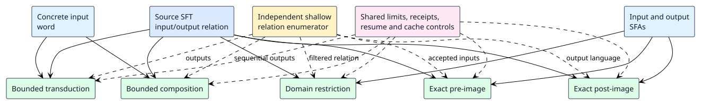

# SFT operation qualification

The five bounded symbolic finite transducer (SFT) adapters use one shared
operation contract but return different kinds of results. This campaign
slice qualifies their semantics together against a deliberately separate
small-input relation enumerator. The diagram shows each operation's input
and the independent comparison point.

`tests/sft_operations_qualification.rs` enumerates every source run on
short words by walking the original transition vector directly. It does
not call a bounded adapter, product builder or legacy `transduce` to
construct the expected relation. The fixture includes overlapping
guards, a false guard, two alternative outputs for one input, empty
output, a two-symbol constant, identity and a continuing second input
step. The same relation is checked against five laws:

| Adapter | Qualified law | Result form |
| --- | --- | --- |
| Transduction | Outputs for each concrete input equal the enumerated source outputs. | Ordered witnesses with source transition evidence. |
| Composition | Composing with a one-state identity SFT preserves those outputs, including epsilon. | Ordered two-stage witnesses. |
| Pre-image | An input is accepted iff some enumerated output is accepted by the output SFA. | Input-side SFA. |
| Post-image | An output is accepted iff some input-SFA word produces it. | Epsilon-capable output NFA. |
| Restriction | Outputs equal source outputs for accepted input-SFA words and are empty otherwise. | SFT with original output functions. |

The separate adapter test files also exercise complete transition
provenance, nondeterministic constant-output paths, all five output
function classes where supported, malformed reachable endpoints, drifted
content bindings, cancellation, every shared resource limit, exact
checkpoint resume, false-complete cache attempts, and partial-result
exclusion. In particular, computed map and flat-map functions are exact
for concrete-word transduction, composition and restriction, but
symbolic image and pre-image require a caller-supplied *exact* finite
oracle. Without one, they return a typed rejection, never a `Complete`
over-approximation. Post-image requires exact singleton predicates for
constant output values; its result has explicit epsilon edges. Identity
guard transfer requires matching algebra-instance semantics, not merely
matching Rust types.

The deep/wide qualification runs all five operations at 128 and 512
source transitions inside a 128 KiB-stack thread. Deep cases form a
single long path; wide cases form many one-step accepting branches.
Both checks require completed outcomes, expected path/state counts,
strictly increasing charged work and logical heap, and at most a
fivefold increase when size quadruples. Meter-callback stack addresses
are sampled and must span less than 16 KiB in each run. Those samples
are a regression signal, not a formal proof of constant stack use;
the small-stack execution is the stronger dynamic control. The tests
bound *charged logical* heap, not RSS, allocator slack, user-defined
callback memory or the temporary batch assembled before charge.

The exactness domain is finite source automata/transducers with truthful
Boolean-algebra operations and stable content/closure bindings. Each
adapter explores only source-reachable states and yields `Incomplete`
when work, state, arc, heap, time or cancellation limits prevent
frontier exhaustion. A checkpoint resumes only the same live in-memory
machine. There is no claim that arbitrary opaque functions have a
finite symbolic image, that a generic composition SFT can always be
materialized, or that local tests by themselves confer independent
trusted verification status in pgmcp.
