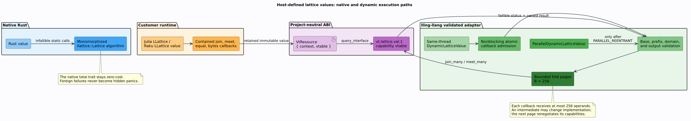

# Host-defined lattice values across language boundaries

lling-llang can consume an immutable order-theoretic lattice value implemented
by Julia, Raku, C, or another runtime through the project-neutral
`vt.lattice.val.1` capability. This is a fallible dynamic path alongside—not a
replacement for—the zero-cost native [`llattice::Lattice`](lattice-bridge.md)
path.

An **order-theoretic lattice** supplies a least upper bound, called **join**, and
a greatest lower bound, called **meet**, for every pair of values. It is not the
same thing as lling-llang's weighted directed acyclic graph type, which is also
called a [lattice](lattices.md) in speech and search literature.

## Terms and laws

| Term or symbol | Meaning |
|---|---|
| carrier | The set $`L`$ of values belonging to one lattice domain. |
| join | $`a \sqcup b`$, the least element greater than or equal to both operands. |
| meet | $`a \sqcap b`$, the greatest element less than or equal to both operands. |
| domain identifier | A stable 16-byte identifier naming both the value representation and the lattice laws. |
| retained resource | A `VtResource` whose two words point to a provider context and its base vtable; every owned copy has one balanced retain. |
| host provider | Target-language code implementing the capability callbacks, such as an `LLattice.MaxMin` value in Julia. |
| dynamic adapter | The Rust, C, Julia, or Raku handle that validates the resource before invoking it. |

A lawful lattice is idempotent, commutative, associative, and absorptive:

```math
\begin{aligned}
a \sqcup a &= a, & a \sqcap a &= a, \\
a \sqcup b &= b \sqcup a, & a \sqcap b &= b \sqcap a, \\
(a \sqcup b) \sqcup c &= a \sqcup (b \sqcup c),
& (a \sqcap b) \sqcap c &= a \sqcap (b \sqcap c), \\
a \sqcup (a \sqcap b) &= a,
& a \sqcap (a \sqcup b) &= a.
\end{aligned}
```

## Architecture and the two execution paths



Native Rust values continue to implement `llattice::Lattice`; their join and
meet calls are statically dispatched and allocate only when the value type
itself requires allocation. A foreign callback can fail, throw, return a
malformed status, violate its thread contract, or exhaust a resource limit.
The native trait returns `Self`, not `Result<Self, E>`, and promises total
operations. Consequently the dynamic wrapper deliberately does **not** pretend
to implement that trait: hiding provider failure behind a panic would weaken
both APIs. Dynamic algorithms use `Result` explicitly, while native algorithms
remain monomorphized.

`DynamicLatticeValue` is the safe same-thread Rust consumer. It negotiates the
capability through the shared dynamic-ABI machinery also used by
`DynamicSemiringContext`. `ParallelDynamicLatticeValue` is obtainable only
after the provider advertises `PARALLEL_REENTRANT`; this type-level promotion is
the only dynamic wrapper that implements `Send` and `Sync`.

## Ownership algorithm

The complete handoff is:

```text
validate the borrowed resource's base vtable
retain exactly one independent resource lifetime
query and validate vt.lattice.val.1
for each algebra operation:
    reject a different domain identifier before calling foreign code
    initialize the output resource to null
    invoke the provider through the callback-admission gate
    on failure, require the output to remain null
    on success, adopt exactly one non-null owned result
    validate the result capability, domain, and access mode
on close or drop:
    release exactly the retain owned by this wrapper
```

Join, meet, and batch operations return immutable resources. Inputs are
borrowed only for the duration of a synchronous callback. A successful result
may use another implementation of the same domain—for example, a provider may
switch from a sparse to a dense representation—so the adapter validates each
result's own vtable rather than assuming pointer identity.

## Nonblocking callback admission

Threading claims are runtime data:

| Provider flags | Public access | Admission behavior |
|---|---|---|
| `PARALLEL_REENTRANT` | local wrapper; explicit promotion to parallel wrapper | Calls may overlap and recursively re-enter; no serial gate is used. |
| `THREAD_BOUND` | local wrapper only | A callback from a thread other than the importing thread returns `WrongThread`. |
| neither | local wrapper only | One atomic compare-and-exchange admits the call; overlap or recursion returns `ConcurrentCall`. |

No consumer mutex is held across foreign code. Serial admission fails fast
instead of blocking, preventing a recursively entered provider from
deadlocking itself. Host providers may use short internal locks for their own
lifetime or arena bookkeeping, but customer join/meet code must execute after
those locks have been released.

## Boundary-amortized folds

`join_many` and `meet_many` preserve associative left-fold order. When `BATCH`
is advertised, each callback receives at most the shared recommended bound
$`B=256`$ operands. Therefore $`n`$ supplied operands require
$`\lceil n/B \rceil`$ callbacks. Between pages, the previous result becomes
the next receiver.

The result of one page may legitimately use another compatible provider. The
adapter therefore rereads the intermediate's flags and callback pointer before
every later page. If batching disappears, the remainder continues pairwise;
semantic correctness does not depend on the optimization capability.

## Output and law validation

The safe consumer rejects:

- null or incomplete base resources and capability vtables;
- unknown portable status values and invalid Boolean encodings;
- operands or results whose domain identifiers differ;
- a failed operation that writes an output resource;
- a successful operation that returns null;
- a parallel operation whose result loses parallel reentrancy;
- contradictory thread-bound and parallel-reentrant claims;
- a stable-byte response above 16 MiB, changing for more than three attempts,
  exceeding its buffer, or completing with a short final write; and
- non-UTF-8 diagnostic text.

`validate_laws` exhaustively probes all four lattice laws over at most sixteen
representative values. Its cubic associativity check can disprove a false
provider claim but cannot prove a universal theorem from finite samples.
Include bottom/top values where they exist, encoding boundaries, and common
workload values.

## Julia customer path

`LLattice.jl` implements the provider; `LlingLlang.jl` consumes its retained
resource through Rust:

```julia
using LlingLlang
import LLattice

host = LLattice.provider(LLattice.MaxMin(7);
    domain_id="demo.maxmin.v1..",
    encode=value -> Vector{UInt8}(codeunits(string(value.value))))
value = dynamic_lattice_value(host.resource)
close(host) # the lling-llang handle owns an independent retain

joined = lattice_join(value, value)
validate_lattice_laws([value, joined])
@assert String(lattice_stable_bytes(joined)) == "7"
close(joined)
close(value)
```

The domain identifier must contain exactly 16 ASCII bytes. `close` is the
deterministic lifetime operation; finalizers only prevent leaks after caller
mistakes.

## Raku customer path

The Raku packages expose the same ownership seam with methods on
`DynamicLatticeValue`:

```raku
use Lling::Llang;

# `$host` is a Vinary::Tree::Interop::LatticeValue produced by LLattice.
my $value = dynamic-lattice-value($host.resource);
$host.close;
my $joined = $value.join($value);
validate-lattice-laws([$value, $joined]);
say $joined.stable-bytes.decode('utf8');
.close for $joined, $value;
```

For source-tree testing, place both `LLattice` and `Vinary-Tree-Interop` on
`RAKULIB` and set `LLATTICE_RAKU_PROVIDER_LIB` to the LLattice callback shim.
A packaged installation obtains that shim through LLattice's build hook.

## Verification and related documents

[`tests/dynamic_lattice_abi.rs`](../../tests/dynamic_lattice_abi.rs) supplies an
independent provider and checks retain balance, exact join/meet semantics,
600-value bounded folds, law probes, cross-thread promotion, mismatched
domains, contradictory flags, malformed booleans, short buffers, hostile
interface discovery, changed-result domains, and lost parallel capability.
The C facade is exercised against the same provider. Julia contributes eight
end-to-end assertions using actual LLattice values; the Raku suite exercises
the same path inside its 44-test conformance program.

- [Dynamic semirings](dynamic-semirings.md) explains why semiring contexts use
  compact provider-scoped tokens rather than one resource per weight.
- [ABI trust model](../security/abi-trust-model.md) defines which foreign
  pointers are memory-safety preconditions and which outputs are validated.
- [Foreign-language bindings](../bindings/README.md) maps each facade to its
  package and executable evidence.
- [Semiring/lattice bridge](lattice-bridge.md) explains the narrower lawful
  relationship between idempotent semiring addition and lattice join.
