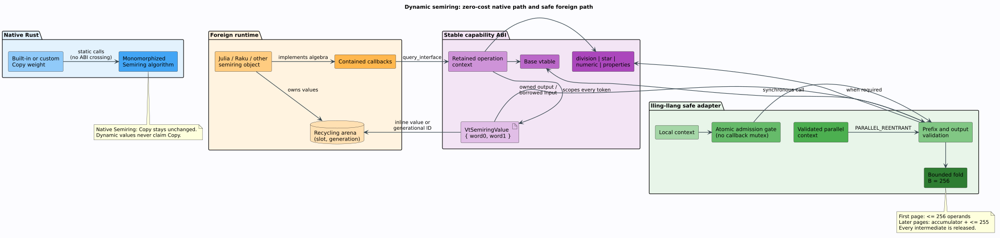

# Dynamic semirings across language boundaries

How lling-llang safely consumes a semiring implemented by a foreign runtime
without weakening the native Rust fast path. Native weights still implement
the `Copy`-bounded [`Semiring`](../api/semiring-reference.md) trait and remain
monomorphized. Foreign weights instead use the `vt.semiring.*1` capability
family from
[vinary-tree-interop](https://github.com/vinary-tree/vinary-tree-interop/blob/master/docs/abi-reference.md#76-dynamic-semiring-operation-contexts-vtsemiring1)
through `dynamic_semiring`.

## Terms and symbols

| Term or symbol | Meaning |
|---|---|
| semiring | An algebra $`\langle K, \oplus, \otimes, \bar{0}, \bar{1} \rangle`$ whose addition combines alternative paths and whose multiplication extends a path. The laws are defined in [Semirings](semirings.md). |
| operation context | One retained foreign resource that owns callbacks and all storage behind its value tokens. |
| token | `VtSemiringValue`, two provider-scoped 64-bit words. It may hold an inline value or a generational arena identifier. |
| generational identifier | A pair $`(s,g)`$ of slot and generation. Incrementing $`g`$ when slot $`s`$ is recycled makes stale tokens detectable. |
| capability | One independently negotiated vtable: base algebra, division, Kleene closure, numerical projections, or declared laws. |
| host | The target runtime that owns the provider, such as Julia or Raku. |

## Two paths, one algebraic contract



The separation is deliberate. Rust's native `Semiring` requires `Copy`; a
garbage-collected object, reference-counted object, or arena slot does not.
Pretending otherwise would turn ordinary assignment into an untracked ownership
duplication. `SemiringWeight` therefore omits `Copy` and `Clone` and exposes
fallible `try_clone` and deterministic `close` operations instead.

The base capability provides the operations every lling-llang semiring needs:

```math
\bar{0},\quad \bar{1},\quad a \oplus b,\quad a \otimes b,
\quad a \mathrel{\overset{?}{=}} b,
\quad d(a,b) \le \varepsilon,
\quad \operatorname{order}(a,b),
\quad \operatorname{bytes}(a).
```

Division, weak left division, Kleene star, numerical projection, quantization,
probability projection, and algebraic-law claims are separate capabilities. A
consumer asks only for what its algorithm requires; absence is
`MissingCapability`, not a fabricated default.

## Ownership algorithm

The adapter follows this literate ownership procedure:

```text
validate the two-word base resource and retain it once
negotiate and validate each available capability prefix
for each successful constructor or algebra callback:
    attach the returned token to this exact retained context
for each duplication:
    call clone_value; never copy token words as ownership
for each deterministic close:
    call release_values exactly once
after the final weight disappears:
    release the operation-context resource
```

Two contexts may publish the same 16-byte `domain_id` because they implement
the same algebra. Their tokens are still not interchangeable: slot 7 in one
arena says nothing about slot 7 in another. Every binary operation checks
`Arc::ptr_eq` before crossing the ABI and returns `ContextMismatch` when the
exact retained contexts differ.

If a hostile provider rejects token release during `Drop`, the adapter leaks one
bounded context retain rather than destroy a foreign arena that still owns a
live token. Audited applications use `close`, which reports the failure and
retries once during unwinding.

## Lock-free callback admission

Thread safety is runtime data, so it cannot safely become an unconditional Rust
auto-trait. Every imported context starts as `DynamicSemiringContext`; its
private `Rc` marker makes it neither `Send` nor `Sync`.

| Provider claim | Public wrapper | Admission rule |
|---|---|---|
| `PARALLEL_REENTRANT` | `parallel()` may produce `ParallelDynamicSemiringContext` | No gate; callbacks may overlap and re-enter. |
| `THREAD_BOUND` | local wrapper only | Reject a callback unless the current thread is the importing thread. |
| neither | local wrapper only | One `AtomicBool::compare_exchange`; an overlapping or recursive call returns `ConcurrentCall`. |

The serial gate is nonblocking. No mutex is held across foreign code, so a
provider cannot deadlock the consumer by recursively entering it. The rejected
call also cannot observe partially mutated adapter state because tokens are
immutable and outputs become owned only after `Ok`.

## Boundary-amortized folds

When `BATCH` is advertised, `plus_many` and `times_many` use the shared boundary
$`B = 256`$. The first callback consumes at most $`B`$ borrowed tokens. Every
later callback receives the previous accumulator followed by at most $`B-1`$
new values. Thus $`n`$ operands require

```math
1 + \left\lceil\frac{\max(0,n-B)}{B-1}\right\rceil
```

boundary crossings while preserving the provider's documented left-fold order.
Every intermediate is released before the next chunk advances. Providers that
omit `BATCH` use the same ownership seam with pairwise operations; native Rust
algorithms use neither path.

## Hostile-output validation

The safe wrapper validates before constructing Rust values:

- raw statuses must be one of the ten published `VtStatus` values;
- booleans must be zero or one;
- natural order must be `BETTER`, `EQUAL`, `WORSE`, or `INCOMPARABLE`;
- a total-order claimant may never return `INCOMPARABLE`;
- epsilon parameters must be finite and in the operation's documented range;
- probability projections must be finite and nonnegative;
- byte-buffer counts must fit the supplied storage, stabilize within three
  attempts, and remain below 16 MiB;
- failed interface discovery must leave its output pointer untouched.

`validate_declared_laws` additionally probes the semiring axioms and advertised
properties over at most sixteen caller-selected values. It checks identities,
annihilation, associativity, additive commutativity, distributivity, and every
applicable idempotence, zero-sum-free, multiplication-commutativity,
total-order, hash-coherence, nonnegativity, and bounded-closure claim. A finite
sample cannot prove a universal law; it can disprove a false claim before an
optimized algorithm relies on it. Include identities, boundary cases, and
representative workload values.

## Rust consumer example

`borrow_raw` is unsafe only because the caller must supply a live ABI resource.
Everything after successful import is safe and ownership-tracked:

```rust,no_run
use lling_llang::dynamic_semiring::{
    DynamicSemiringContext, DynamicSemiringError,
};
use vinary_tree_interop::VtResource;

fn combine(raw: VtResource) -> Result<Vec<u8>, DynamicSemiringError> {
    // SAFETY: the embedding FFI layer guarantees `raw` is live for this call.
    let semiring = unsafe { DynamicSemiringContext::borrow_raw(raw)? };
    let one = semiring.one()?;
    let two = semiring.plus(&one, &one)?;
    semiring.validate_declared_laws(
        &[one.try_clone()?, two.try_clone()?],
        1.0e-12,
    )?;
    semiring.stable_bytes(&two)
}
```

## Verification

`tests/dynamic_semiring_abi.rs` supplies a complete independent provider. It
counts resource retains and live tokens, exercises every optional refinement,
forces a 600-value fold across three bounded callbacks, moves only a validated
parallel context to another thread, and injects unknown statuses, malformed
booleans, malformed order values, non-finite probabilities, context confusion,
and a false base algebra.

The mathematical basis follows Goodman’s semiring parsing formulation
([Goodman 1999](../BIBLIOGRAPHY.md#ref-goodman1999)) and the weighted-automata
algorithms and property requirements surveyed by
[Mohri 2009](../BIBLIOGRAPHY.md#ref-mohri2009).

## Related documentation

- [Semirings](semirings.md) — native trait hierarchy and built-in weights.
- [Resource ABI architecture](resource-abi.md) — the sibling scalar-WFST
  resource protocol.
- [ABI trust model](../security/abi-trust-model.md) — adversarial boundary
  assumptions and mitigations.
- [Binding guide](../bindings/README.md) — language packaging and generated
  API documentation.
