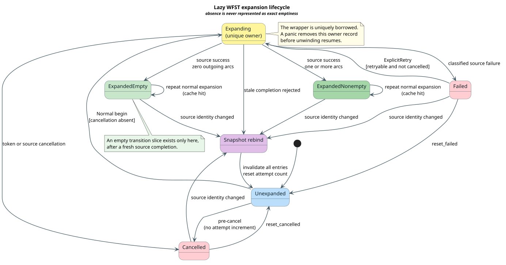
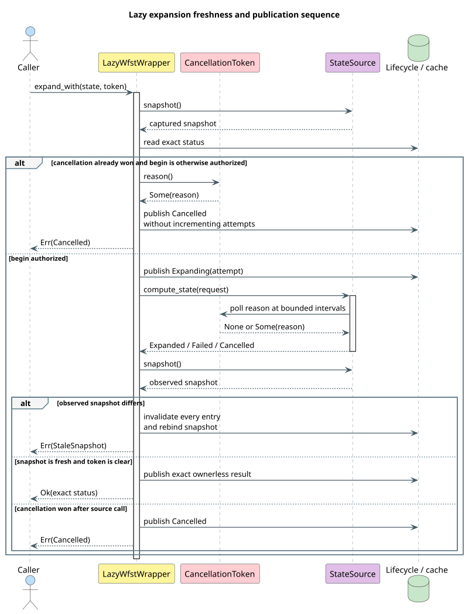

# Lazy WFST Expansion Lifecycle

The lling-llang lazy weighted finite-state transducer (WFST) wrapper represents
absence, work in progress, exact empty completion, nonempty completion,
failure, and cancellation as different states, so no caller can mistake work
that has not run for a state that was proved to have no outgoing transitions.

## Terms and symbols

| Term or symbol | Definition |
|---|---|
| **WFST** | Weighted finite-state transducer: a state graph whose arcs carry input labels, output labels, and semiring weights. |
| **source** | A `StateSource` implementation that computes one state on demand. |
| **snapshot** | A 32-byte `SourceSnapshot` identifying the source semantics observed by an attempt. |
| **attempt** | One authorized call from `LazyWfstWrapper` into `StateSource::compute_state`. |
| **owner** | The uniquely borrowed wrapper operation that is invoking the source for an attempt. |
| **observation** | Exact terminal classification: empty, nonempty, failure, or cancellation. |
| **fresh** | An entry whose captured snapshot equals the wrapper's current source snapshot. |
| **retryable** | A failure with `RetryPolicy::Explicit`; ordinary expansion still cannot retry it. |
| **LRU** | Least-recently-used cache policy; the least recently accessed completed state is evicted first. |
| $`S`$ | Set of lifecycle statuses. |
| $`e.s`$ | Snapshot captured by entry $`e`$. |
| $`s_c`$ | Current wrapper snapshot. |

## Contract

The status space is deliberately disjoint:

```math
S = \{\mathtt{Unexpanded},\mathtt{Expanding},\mathtt{ExpandedEmpty},
\mathtt{ExpandedNonempty},\mathtt{Failed},\mathtt{Cancelled}\}.
```

Only the two expanded statuses are cacheable completed results. Only fresh
terminal entries are observable:

```math
\mathrm{fresh}(e) \iff e.s = s_c.
```

| Status | Owner present? | Transition slice available? | Observable? | Normal expansion? | Explicit retry? |
|---|---:|---:|---:|---:|---:|
| `Unexpanded` | No | No | No | Yes | No |
| `Expanding` | Yes | No | No | No | No |
| `ExpandedEmpty` | No | Yes, length zero | Empty | Returns cached status | No |
| `ExpandedNonempty` | No | Yes, positive length | Nonempty | Returns cached status | No |
| `Failed` | No | No | Failure | No | Only when retryable |
| `Cancelled` | No | No | Cancellation | No | No; reset first |

The distinction between “no slice” and “a slice of length zero” is the central
semantic rule. `transitions_if_expanded` returns no transition record for an
unexpanded state and returns a present zero-length slice only after exact empty
completion. The immutable `Wfst` projection fails loudly if a valid state has
not been expanded; it never fabricates an empty slice.

## Lifecycle



[PlantUML source](../diagrams/architecture/lazy-wfst-lifecycle-state.puml)

*Blue is absence, yellow is unique ownership, green is exact completion, red is a terminal non-result, and purple is snapshot invalidation.*

<details><summary>Text view</summary>

<!-- vdl-disable-next-line ASCII001 -->
```text
Unexpanded ── normal begin ──▶ Expanding
Expanding  ── zero arcs ─────▶ ExpandedEmpty
Expanding  ── one or more ───▶ ExpandedNonempty
Expanding  ── source error ──▶ Failed ── explicit retry, if allowed ──▶ Expanding
Expanding  ── cancellation ──▶ Cancelled
Failed/Cancelled ── explicit reset ──▶ Unexpanded
Any retained phase ── snapshot rebind ──▶ Unexpanded
```

</details>

Normal expansion is idempotent after successful completion: repeated calls
return the completed status and do not invoke the source. Failure retry and
reset are separate operations, preventing an ordinary cache read from becoming
an unbounded retry loop.

## Expansion algorithm

The implementation is a finite control machine. Its loop invariant is that
every retained entry belongs to `current_snapshot`, and exactly one `Expanding`
record exists for the currently executing `&mut self` call.

```text
⟨ expand one lazy state ⟩
compare source snapshot with current snapshot; reject stale observation
read exact status
if status is completed: touch O(1) LRU links and return it
if cancellation already won and the mode could begin:
    publish Cancelled without incrementing attempts; return cancellation
check Normal or ExplicitRetry authorization
increment the saturating attempt counter
publish Expanding(attempt)
invoke StateSource with state, captured snapshot, attempt, and token
if the source panics:
    remove Expanding, or rebind if the snapshot changed; resume the panic
compare the post-call snapshot with the captured snapshot
if stale: invalidate all entries, rebind, and reject the completion
if cancellation won: publish Cancelled and return cancellation
classify source output as exact completion, failure, or cancellation
publish one ownerless terminal record
```

Every step is iterative. The control depth is constant, so expansion stack use
is $`\mathcal{O}(1)`$ with respect to state count and retry history. Expected cache lookup
is $`\mathcal{O}(1)`$. The intrusive LRU list stores predecessor and successor state IDs
inside each cache entry, making hits, insertion, and eviction $`\mathcal{O}(1)`$ instead
of scanning an access queue.

## Call sequence and freshness boundary



[PlantUML source](../diagrams/architecture/lazy-wfst-expansion-sequence.puml)

*Blue is caller control, yellow is lifecycle ownership, purple is source work, green is exact publication, and red is rejection without publication.*

<details><summary>Text view</summary>

<!-- vdl-disable-next-line ASCII001 -->
```text
Caller       Wrapper              StateSource             Cache/lifecycle
  │ expand      │                       │                         │
  ├────────────▶│ compare snapshot      │                         │
  │             │ publish Expanding ─────────────────────────────▶│
  │             ├─ compute(request) ───▶│                         │
  │             │◀─ result ─────────────┤                         │
  │             │ compare snapshot      │                         │
  │             ├─ fresh: publish exact completion ──────────────▶│
  │◀─ status ───┤
  │             └─ stale: invalidate and return StaleSnapshot
```

</details>

An external source revision that changes between calls makes status and
observation queries return `ExpansionError::StaleSnapshot`. A change detected
during an active attempt additionally invalidates the stale attempt and rebinds
the wrapper to the observed snapshot, leaving the requested state unexpanded.
`refresh_snapshot` is the explicit between-call rebind operation.

## API responsibilities

| API | Responsibility |
|---|---|
| `StateSource::compute_state` | Return `StateExpansion::Expanded`, `Failed`, or `Cancelled`; never return an ambiguous pending value. |
| `StateSource::snapshot` | Return a stable identity and change it whenever externally mutable semantics change. Immutable sources use the default identity. |
| `LazyWfstWrapper::expand` | Begin only from `Unexpanded`; return an exact status or typed error. |
| `LazyWfstWrapper::retry` | Begin only from an explicit-retry failure. |
| `expand_with` / `retry_with` | Add cooperative cancellation without changing authorization rules. |
| `expansion_status` / `observe` | Reject stale snapshots and report exact lifecycle meaning. |
| `transitions_if_expanded` | Preserve the `None` versus `Some(empty)` distinction. |
| `try_transitions_lazy` | Expand and return transitions through a fallible API. |
| `transitions_lazy` | Compatibility convenience that panics on failure rather than returning a false empty result. |
| `reset_failed` / `reset_cancelled` | Explicitly restore `Unexpanded`. |
| `replace_source` | Replace source ownership and invalidate the whole lifecycle; mutable source access is not exposed. |

## Source example

This immutable source has one valid state and proves that the state has no
outgoing transitions only when it is invoked.

```rust
use lling_llang::semiring::TropicalWeight;
use lling_llang::wfst::{
    ExpansionFailure, ExpansionRequest, ExpansionStatus, LazyWfstWrapper,
    StateExpansion, StateId, StateSource,
};
use smallvec::SmallVec;

#[derive(Clone)]
struct EmptySource;

impl StateSource<char, TropicalWeight> for EmptySource {
    fn compute_state(
        &self,
        request: ExpansionRequest<'_>,
    ) -> StateExpansion<char, TropicalWeight> {
        if request.state() != 0 {
            return StateExpansion::failed(ExpansionFailure::invalid_state(request.state()));
        }
        StateExpansion::non_final(SmallVec::new())
    }

    fn start(&self) -> StateId {
        0
    }

    fn num_states_hint(&self) -> Option<usize> {
        Some(1)
    }
}

let mut lazy = LazyWfstWrapper::new(EmptySource);
assert!(lazy.transitions_if_expanded(0).unwrap().is_none());
assert_eq!(lazy.expand(0).unwrap(), ExpansionStatus::ExpandedEmpty);
assert_eq!(lazy.transitions_if_expanded(0).unwrap().unwrap().len(), 0);
```

## Concurrency, parallelism, and cancellation

One wrapper uses unique mutable access for lifecycle mutation, so its hot path
does not acquire a mutex. This Rust ownership boundary is the implementation of
the single-owner invariant. Parallel work uses independent wrappers or shards;
`StateSource`, labels, and weights remain `Send + Sync`.

`CancellationToken` is cloneable and uses an `AtomicU8`. Competing cancellation
requests use an acquire-release compare-and-exchange; exactly one reason wins,
and all clones subsequently observe that reason. The design does not claim that
the atomic instruction is hardware-lock-free on every target. A source should
poll `request.cancellation()` at bounded intervals in long loops. The
synchronization source polls while traversing outgoing arcs.

## Failure, panic, and security behavior

- Invalid state IDs produce permanent `InvalidState` failures; they are not
  represented as empty states.
- Identifier-space exhaustion produces a permanent `ResourceExhausted` failure.
- A source panic removes its `Expanding` owner record before the panic resumes,
  so recovery code never observes a permanently owned state.
- A stale source result is never published, even if it otherwise contains a
  valid transition slice.
- A nonretryable failure cannot invoke the source again until explicit reset.
- Attempt and computation counters saturate rather than wrap.
- Cache policy changes and source replacement invalidate entries whose storage
  or semantic authority no longer applies.

## Compatibility and migration

| Previous surface | Required migration |
|---|---|
| `LazyState::Pending` | Absence is implicit `Unexpanded`; a source returns a typed failure for invalid state IDs. |
| `StateSource::compute_state(StateId) -> LazyState` | Accept `ExpansionRequest` and return `StateExpansion`. |
| Infallible `expand` | Handle `Result<ExpansionStatus, ExpansionError>`. |
| Empty immutable access before expansion | Call `expand`, `try_transitions_lazy`, or `transitions_if_expanded`; unexpanded immutable access now fails loudly. |
| `source_mut` | Use `replace_source`, which invalidates snapshot-bound state. |

## Verification and executable evidence

The implementation is refined against three complementary models:

| Evidence | Scope |
|---|---|
| [`LazyExpansion.v`](../../proofs/coq/wfst/LazyExpansion.v) | Unbounded lifecycle laws: authorization, freshness, ownership, exact classification, retry, reset, and finite control. |
| [`LazyExpansionLifecycle.tla`](../../proofs/tla/LazyExpansionLifecycle.tla) | Exhaustive finite concurrency exploration with 18 invariants and four negative controls. |
| [`vco-e4-lazy-expansion.smt2`](../../proofs/smt/vco-e4-lazy-expansion.smt2) | Fourteen boundary consistency and witness queries. |
| [`lazy-expansion-invariants.tsv`](../../proofs/doc/lazy-expansion-invariants.tsv) | Bidirectional mapping from all 89 formal declarations and queries to Rust properties. |
| `tests/lazy_expansion_*_properties.rs` | 57 Rocq counterparts, 18 TLC counterparts, and 14 SMT counterparts. |
| `src/wfst/lazy.rs` unit tests | Panic rollback, concurrent cancellation, parallel wrappers, saturating counters, LRU behavior, and cache policy transitions. |
| `benches/lazy_lifecycle_benchmarks.rs` | Focused completed-hit, intrusive-LRU scaling, and cold expansion measurements. |

<!-- vdl-disable-next-line LINK002 -->
TLA+ terminology and the role of finite-state temporal model checking follow [Lamport 2002](../BIBLIOGRAPHY.md#ref-lamport2002). The Rust atomic ordering
contract follows the
[`std::sync::atomic::Ordering`](https://doc.rust-lang.org/std/sync/atomic/enum.Ordering.html)
reference.

## References

<!-- vdl-disable-next-line LINK002 -->
- [Lamport 2002](../BIBLIOGRAPHY.md#ref-lamport2002)
- [Formal verification of the optimizer contract](../optimization/formal-verification.md)
- [WFST trait architecture](wfst-traits.md)
