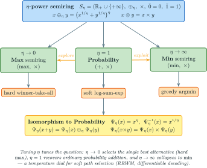

# Power Semiring

The $`\eta`$-power semiring provides a parameterized family of semirings that interpolate between different optimization objectives, enabling "soft" path selection and differentiable WFST operations.

## Terms & symbols

Symbols link to [`NOTATION.md`](../NOTATION.md); conventions in [`STYLE.md`](../STYLE.md).

| Symbol / term | Meaning |
|---|---|
| $`S_\eta`$ | The $`\eta`$-power semiring $`(\mathbb{R}_+ \cup \{+\infty\}, \oplus_\eta, \times, 0, 1)`$. |
| $`\eta`$ | The power exponent (temperature) controlling softness of $`\oplus_\eta`$. |
| $`\oplus_\eta`$ | Power *plus*: $`x \oplus_\eta y = (x^{1/\eta} + y^{1/\eta})^\eta`$. |
| $`\otimes`$ | Power *times*: ordinary $`\times`$. |
| $`\bar{0}`$ / $`\bar{1}`$ | The identities $`0`$ ($`\oplus_\eta`$) and $`1`$ ($`\otimes`$). |
| $`\Psi_\eta`$ | The isomorphism to the probability semiring, $`\Psi_\eta(x) = x^\eta`$, inverse $`\Psi_\eta^{-1}(x) = x^{1/\eta}`$. |

## Concepts

### Mathematical Definition

The **$`\eta`$-power semiring** $`S_\eta = (\mathbb{R}_+ \cup \{+\infty\}, \oplus_\eta, \times, 0, 1)`$ is defined by the soft-plus $`x \oplus_\eta y = (x^{1/\eta} + y^{1/\eta})^\eta`$ and ordinary multiplication $`\otimes = \times`$ [[Cortes 2015](../BIBLIOGRAPHY.md#ref-cortes2015), Lemma 6]:

| Operation | Definition | Intuition |
|-----------|------------|-----------|
| $`\oplus_\eta`$ | $`(x^{1/\eta} + y^{1/\eta})^\eta`$ | Soft combination of alternatives |
| $`\otimes`$ | $`x \times y`$ | Standard multiplication |
| $`\bar{0}`$ | $`0`$ | Additive identity |
| $`\bar{1}`$ | $`1`$ | Multiplicative identity |

The key insight is that the addition operation is parameterized by $`\eta`$, which controls how "soft" the combination is: $`x \oplus_\eta y = (x^{1/\eta} + y^{1/\eta})^\eta`$.

### The $`\eta`$ Parameter

The $`\eta`$ parameter controls the "softness" of the plus operation — a temperature dial between hard winner-take-all and greedy $`\min`$ selection, with ordinary probability addition at $`\eta = 1`$:

| $`\eta`$ Value | Behavior | Use Case |
|---------|----------|----------|
| $`\eta \to 0`$ | Approaches $`\max`$ semiring | Winner-take-all selection |
| $`\eta = 1`$ | Equivalent to probability semiring | Standard probability combination |
| $`\eta \to \infty`$ | Approaches $`\min`$ semiring | Greedy selection |

The figure below ties the three regimes to their algebra and to the isomorphism $`\Psi_\eta`$ with the probability semiring:



*Blue = the $`S_\eta`$ signature; green = the three limiting semirings ($`\max`$, probability, $`\min`$); amber = the algebraic-property tags and the $`\Psi_\eta`$ isomorphism; the amber explore/exploit arrows are the $`\eta`$ temperature axis.*

<details><summary>Text view</summary>

```text
η → 0                        η = 1                        η → ∞
┌─────────┐                ┌─────────┐                ┌─────────┐
│  MAX    │                │  SUM    │                │  MIN    │
│ (hard)  │  ←──────────── │ (soft)  │ ──────────→   │ (greedy)│
└─────────┘                └─────────┘                └─────────┘
        Increasing exploration ← → Increasing exploitation
```

</details>

### Isomorphism with Probability Semiring

The power semiring is **isomorphic** to the probability semiring via the mapping $`\Psi_\eta`$:

- **Forward**: $`\Psi_\eta(x) = x^\eta`$ maps probability → power semiring
- **Inverse**: $`\Psi_\eta^{-1}(x) = x^{1/\eta}`$ maps power semiring → probability

This isomorphism preserves both semiring operations:

```math
\begin{aligned}
\Psi_\eta(x + y) &= \Psi_\eta(x) \oplus_\eta \Psi_\eta(y) \\
\Psi_\eta(x \times y) &= \Psi_\eta(x) \times \Psi_\eta(y)
\end{aligned}
```

### Practical Interpretation

Consider two paths with probabilities $`p_1 = 0.3`$ and $`p_2 = 0.7`$:

| $`\eta`$ | $`\oplus_\eta`$ Result | Interpretation |
|---|------------|----------------|
| $`0.5`$ | $`0.82`$ | Strongly favors the higher probability |
| $`1.0`$ | $`1.0`$ | Standard sum ($`p_1 + p_2`$) |
| $`2.0`$ | $`0.61`$ | Moderately smoothed combination |

## Core API

### PowerWeight

The `PowerWeight` struct represents a weight in the $`\eta`$-power semiring:

```rust
use lling_llang::semiring::{PowerWeight, Semiring};

// Create a weight with explicit η
let w = PowerWeight::new(0.5, 2.0);  // value=0.5, η=2.0

// Create with default η = 1.0
let w_default = PowerWeight::with_default_eta(0.5);

// Access components
println!("Value: {}", w.value());  // 0.5
println!("η: {}", w.eta());        // 2.0
```

### Factory Methods

```rust
// Create identity elements with specific η
let zero = PowerWeight::zero_with_eta(2.0);   // Additive identity
let one = PowerWeight::one_with_eta(2.0);     // Multiplicative identity
let inf = PowerWeight::infinity(2.0);         // For unreachable states

// Check special values
assert!(zero.is_zero_value());
assert!(one.is_one_value());
assert!(inf.is_infinite());
```

### Probability Conversions

The key feature is converting between probability space and power semiring:

```rust
let eta = 2.0;
let prob = 0.7;

// Convert probability to power semiring: Ψ_η(x) = x^η
let pw = PowerWeight::from_probability(prob, eta);
println!("In power semiring: {}", pw.value());  // 0.7² = 0.49

// Convert back: Ψ_η⁻¹(x) = x^{1/η}
let recovered = pw.to_probability();
println!("Recovered: {}", recovered);  // 0.49^{1/2} = 0.7
```

### Implemented Traits

`PowerWeight` implements the full semiring trait hierarchy:

| Trait | Method | Description |
|-------|--------|-------------|
| `Semiring` | `plus()`, `times()`, `zero()`, `one()` | Basic semiring operations |
| `DivisibleSemiring` | `divide()` | Division for weight pushing |
| `StarSemiring` | `star()` | Kleene closure for cycles |
| `NumericalWeight` | `numerical_value()` | Extract f64 for sampling |

## Examples

### Basic Operations

```rust
use lling_llang::semiring::{PowerWeight, Semiring};

let eta = 2.0;
let a = PowerWeight::new(4.0, eta);
let b = PowerWeight::new(9.0, eta);

// Plus: (4^{1/2} + 9^{1/2})^2 = (2 + 3)^2 = 25
let sum = a.plus(&b);
println!("a ⊕_η b = {}", sum.value());  // 25.0

// Times: 4 × 9 = 36
let product = a.times(&b);
println!("a ⊗ b = {}", product.value());  // 36.0
```

### $`\eta = 1`$ Behaves Like Probability Semiring

```rust
let eta = 1.0;
let a = PowerWeight::new(0.3, eta);
let b = PowerWeight::new(0.5, eta);

// Plus: (0.3¹ + 0.5¹)¹ = 0.8 (standard addition)
let sum = a.plus(&b);
assert!((sum.value() - 0.8).abs() < 1e-10);

// Times: 0.3 × 0.5 = 0.15 (standard multiplication)
let product = a.times(&b);
assert!((product.value() - 0.15).abs() < 1e-10);
```

### Building a WFST with Power Weights

```rust
use lling_llang::wfst::{VectorWfst, MutableWfst};
use lling_llang::semiring::PowerWeight;

// Create WFST with η = 2.0 for softmax-like path selection
let eta = 2.0;
let mut wfst = VectorWfst::<char, PowerWeight>::new();

let s0 = wfst.add_state();
let s1 = wfst.add_state();
let s2 = wfst.add_state();

wfst.set_start(s0);
wfst.set_final(s1, PowerWeight::one_with_eta(eta));
wfst.set_final(s2, PowerWeight::one_with_eta(eta));

// Two alternative paths with different "soft" probabilities
wfst.add_arc(s0, Some('a'), Some('x'), s1,
    PowerWeight::from_probability(0.8, eta));  // High probability path
wfst.add_arc(s0, Some('b'), Some('y'), s2,
    PowerWeight::from_probability(0.2, eta));  // Low probability path
```

### Softmin Path Selection

The power semiring enables "softmin" behavior where you get smooth interpolation rather than hard selection:

```rust
use lling_llang::semiring::{PowerWeight, Semiring};

// Compare hard vs soft selection for paths with costs 1.0 and 3.0
fn compare_selection(eta: f64) {
    let cost1 = PowerWeight::from_probability((-1.0_f64).exp(), eta);
    let cost2 = PowerWeight::from_probability((-3.0_f64).exp(), eta);

    let combined = cost1.plus(&cost2);
    let soft_cost = -combined.to_probability().ln();

    println!("η = {:.1}: effective cost = {:.3}", eta, soft_cost);
}

compare_selection(0.5);   // η = 0.5: effective cost ≈ 1.0 (nearly hard min)
compare_selection(1.0);   // η = 1.0: effective cost ≈ 0.95 (log-sum-exp)
compare_selection(2.0);   // η = 2.0: effective cost ≈ 0.88 (softer)
```

### Verifying the Isomorphism

```rust
use lling_llang::semiring::{PowerWeight, Semiring};

let eta = 2.0;
let x = 0.3;
let y = 0.5;

// Verify: Ψ_η(x + y) = Ψ_η(x) ⊕_η Ψ_η(y)
let left = PowerWeight::from_probability(x + y, eta);
let px = PowerWeight::from_probability(x, eta);
let py = PowerWeight::from_probability(y, eta);
let right = px.plus(&py);

assert!((left.value() - right.value()).abs() < 1e-10);
println!("Isomorphism verified for plus!");

// Verify: Ψ_η(x × y) = Ψ_η(x) × Ψ_η(y)
let left_times = PowerWeight::from_probability(x * y, eta);
let right_times = px.times(&py);

assert!((left_times.value() - right_times.value()).abs() < 1e-10);
println!("Isomorphism verified for times!");
```

### Using with Weight Pushing

```rust
use lling_llang::algorithms::{push_weights, PushConfig};
use lling_llang::semiring::PowerWeight;
use lling_llang::wfst::{VectorWfst, MutableWfst};

let eta = 1.0;
let mut wfst = VectorWfst::<char, PowerWeight>::new();

// Build WFST...
let s0 = wfst.add_state();
let s1 = wfst.add_state();
wfst.set_start(s0);
wfst.set_final(s1, PowerWeight::one_with_eta(eta));
wfst.add_arc(s0, Some('a'), Some('a'), s1,
    PowerWeight::from_probability(0.5, eta));

// Push weights to make stochastic (needed for RRWM sampling)
push_weights(&mut wfst, PushConfig::backward())
    .expect("Push should succeed for power semiring");
```

## When to Use Power Semiring

**Choose PowerWeight when you need:**

| Scenario | Why PowerWeight? |
|----------|------------------|
| Differentiable WFST operations | Smooth gradients through soft-min operations |
| Temperature-controlled decoding | Adjust $`\eta`$ to control exploration vs exploitation |
| RRWM algorithm | Required for online learning with rational losses |
| Softmax-like path selection | Interpolate between argmax and uniform sampling |
| Probabilistic lattice rescoring | Convert between log-probs and probability space |

**Choose other semirings when:**

| Alternative | When to use |
|-------------|-------------|
| `TropicalWeight` | Standard shortest-path (hard argmin) |
| `LogWeight` | Numerical stability with log-probabilities |
| `ProbabilityWeight` | Direct probability manipulation |

## Relationship to Other Semirings

`PowerWeight` is a one-parameter family that **degenerates** to three familiar semirings at the limits of $`\eta`$: $`\max`$ (as $`\eta \to 0`$), Probability (at $`\eta = 1`$), and $`\min`$ (as $`\eta \to \infty`$) — each retaining ordinary $`\times`$ for $`\otimes`$.

<details><summary>Text view</summary>

```text
                        ┌──────────────────┐
                        │  PowerWeight     │
                        │  S_η(⊕_η, ×)     │
                        └────────┬─────────┘
                                 │
                    ┌────────────┼────────────┐
                    │            │            │
                   η→0          η=1          η→∞
                    │            │            │
                    ▼            ▼            ▼
            ┌──────────┐  ┌──────────┐  ┌──────────┐
            │   Max    │  │Probability│  │   Min    │
            │ (max, ×) │  │  (+, ×)   │  │ (min, ×) │
            └──────────┘  └──────────┘  └──────────┘
```

</details>

> The structural figure for this degeneration — with the $`\Psi_\eta`$ isomorphism — is the [`power-semiring.svg`](#the-eta-parameter) embedded above.

## References

Full entries — including DOIs — are in [`BIBLIOGRAPHY.md`](../BIBLIOGRAPHY.md).

- [**Cortes 2015**](../BIBLIOGRAPHY.md#ref-cortes2015) — Cortes, C., Kuznetsov, V., Mohri, M., & Warmuth, M. K. (2015). *On-Line Learning Algorithms for Path Experts with Non-Additive Losses.* COLT 2015, PMLR 40:424–447. Lemma 6 defines the $`\eta`$-power semiring $`S_\eta`$ and its $`\Psi_\eta`$ isomorphism to the probability semiring. [PMLR 40:424–447](https://proceedings.mlr.press/v40/Cortes15.html)
- [**Mohri 2009**](../BIBLIOGRAPHY.md#ref-mohri2009) — Mohri, *Weighted Automata Algorithms*: weight pushing and the divisibility/star properties `PowerWeight` must supply for normalization and closure. [doi:10.1007/978-3-642-01492-5_6](https://doi.org/10.1007/978-3-642-01492-5_6)

## Related Documentation

- [Semirings](semirings.md) - Overview of all semiring types
- [Weight Pushing](../algorithms/weight-pushing.md) - Normalize weights for sampling
- [Path Sampling](../algorithms/path-sampling.md) - Sample paths from WFSTs
- [RRWM Algorithm](../algorithms/rrwm.md) - Online learning using power semiring
