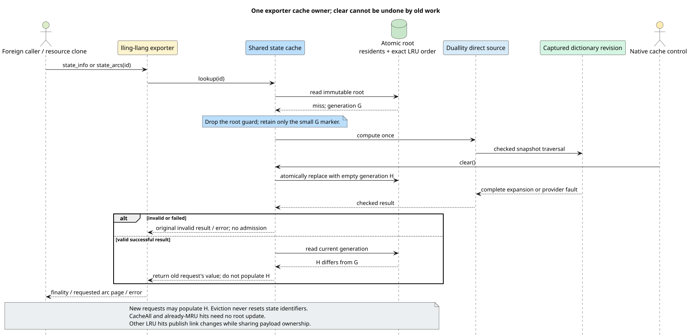

# Shared immutable-state cache

The exported scalar weighted finite-state transducer (WFST) must have one
owner for cached expansions. Otherwise a bounded cache in an adapter can be
hidden behind an unbounded exporter cache, making its policy and statistics
misleading. The cache controls described here are native Rust APIs; adding the
versioned foreign cache-control interface is a separate binding deliverable.

## What is retained, and why?

A **semantic registry** assigns stable identifiers to discovered states. A
**cached expansion** holds one state's finality, final weight and ordered
outgoing arcs. Eviction removes only the expansion: it must not change an
identifier, the source snapshot, or the machine's weighted language.

`SharedStateCache<T>` is independent of labels and semirings. The exporter
instantiates it with an immutable scalar state whose arc buffer is reference
counted. The same owner serves both tropical minimum-cost weights and Arctic
maximum-score weights. A cache is not a synchronization wrapper around a
mutable source: a valid identifier must always produce the same complete
result within the captured source revision.

`OwnedWfstResource::from_provider_with_cache` constructs a fresh cache for each
provider resource. Resource clones and snapshots share that cache.
`provider_cache()` returns a cloneable `ProviderCacheControl` for policy,
clearing and statistics. This control cannot be attached to another provider;
two independently constructed resources cannot accidentally alias state IDs.
The control retains cache payloads, not the provider or its foreign snapshot.

Duallity's exported adapters borrow `DirectStateSource` instead of cloning
native wrapper caches. The converter consumes the complete expansion inside
the dictionary's checked callback scope. Only a successful return from that
scope reaches exporter admission. Classic, universal, generalized and FZF
adapters use this same conversion path.

## Policies and observable examples

| Policy | Requests | Source computations | Final residents |
|---|---|---:|---|
| CacheAll | A, B, A, C, B | 3 | A, B, C |
| NoCache | A, B, A, C, B | 5 | none |
| LRU, capacity 1 | A, B, A, C, B | 5 | B |
| LRU, capacity 2 | A, B, A, C, B | 4 | C, B |

**LRU** means least recently used, exactly: accesses that change order linearize
at their successful atomic publication. An already-most-recent hit changes no
order and linearizes at its immutable snapshot read. It is not an approximate LFU
(least frequently used), CLOCK or sampled eviction policy. The capacity is a
`NonZeroUsize`. Applications resolve zero-valued heuristics before constructing
this generic policy.

Duallity's existing native classic, universal and generalized wrappers interpret
`CachePolicy::Lru { max_states: 0 }` through their configured maximum, clamped to
at least one. Their default is 100,000 states. Native FZF delegates to
`LazyWfstWrapper`, where zero LRU residency is transient. Those existing native
contracts are unchanged; the explicit positive exporter policy avoids silently
conflating them. Native borrow-backed NoCache scratch storage is also unchanged.
The planned configurable duallity ABI, not this generic cache, owns conversion
from a raw capacity and an adapter family's configuration to a normalized
exporter policy. The existing `create_wfst` constructor still defaults to
CacheAll and accepts no raw cache-capacity argument.

Native policy counters also differ: duallity's classic, universal and generalized
`computed_states()` reports current cache entries, whereas native FZF inherits a
cumulative computation count from `LazyWfstWrapper`. Its current transient may
be reused immediately; visiting another state discards that transient. FZF's
count is therefore not a residency measurement. Exporter control statistics use
the distinct, explicitly named `resident_states` field for current residency.

The **most recently used (MRU)** state is the tail of that exact access order.

True exporter NoCache has no scratch residency. A call to `state_info` and each
call to `state_arcs` can therefore recompute the whole state. Paging still
returns stable slices because valid state results are immutable. This cost is
observable and is not hidden by a second cache.

## Atomic snapshot representation

A **generation** identifies residency since the last clear or policy change.
It is a small separately reference-counted marker, not a numeric epoch that
could wrap and be mistaken for an old generation.

The atomically published root contains the generation and one policy-specific
representation. CacheAll uses a persistent state-ID-to-payload map. NoCache
contains no resident index. LRU contains:

- A persistent state-ID-to-entry map; each entry owns a payload and stable slot.
- A logical vector of primitive rows: reverse ID and previous/next slot links,
  stored inline for the first two residents, then in reference-counted 16-row
  blocks behind a persistent directory.
- Optional head and tail slots, and the positive capacity.

A **slot** is a compact internal residency position, not an external state ID.
Slots grow only as entries arrive. At capacity, eviction immediately reuses the
head slot; the vector never shifts, and no free list or obsolete-slot log grows.
An internal one-based index makes optional links compact without reserving any
external ID, including the maximum unsigned 64-bit value.

Persistent means updates share unaffected tree nodes with the previous root.
The ownership map is an `imbl` hash-array mapped trie (HAMT) with keyed `ahash`
hashing. The link-block directory uses its persistent vector. An LRU hit changes only links and
endpoints: the entire ownership-map root remains shared. Slots stay fixed on
hits, unlike a timestamp stored beside a payload, so touching an entry does
not copy ownership-map leaves or clone their payload references. Admission
and eviction still copy affected ownership-map leaves; eliminating hot-path
copying does not eliminate all miss-path copying. The reverse ID in a link
row identifies the old ownership-map key when its slot is reused.

The small-buffer experiment keeps zero, one or two primitive link rows inside
the staged root. Their clone needs no link allocation or reference-count update.
Admitting the third resident promotes those rows into the first 16-row block,
preserving every slot index and reverse ID. Previously published inline roots
remain unchanged. Residency does not shrink within a generation, so a
successfully published promotion happens at most once per generation. Failed
atomic-publication attempts can stage promotion more than once; clear starts
a new empty inline root.
This changes storage only, not the exact-LRU algorithm or publication boundary.
It remains a performance candidate until the complete controls pass.

After promotion, the block experiment makes the directory entry private before making its block
private. Subsequent field writes in the same staged block reuse that copy.
Unchanged blocks remain shared with old roots; no block is independently
published. A partially filled final block has at most 15 unused, initialized
rows that cannot be indexed through the logical vector. Thus logical length
remains exactly residency; physical padding is bounded and is reported in
allocation measurements rather than hidden as resident entries. A directory
copy can clone multiple block references, so smaller row copies can trade
allocation bytes for atomic reference-count traffic.

Let $`R`$ map external IDs to entries containing `slot` and `value`, $`L`$ be
the link vector and $`C`$ the capacity. Published LRU roots satisfy:

```math
|R| = |L| \le C,
\qquad
L[R(i).\mathrm{slot}].\mathrm{id} = i
\quad \text{for every } i \in \mathrm{dom}(R).
```

IDs bijectively name occupied slots. The head has no predecessor, the tail has
no successor, and following links from head visits every slot exactly once,
ending at tail. Empty residency has neither endpoint. All components publish
together through one `ArcSwap` compare-and-swap. There is no logical clock
to overflow or renumber.

See the [experiment ledger](../scientific-ledger/shared-state-cache-2026-09-06.md)
for the ordered-map, split-payload and separate-vector experiments motivating
this consolidated representation and its link-block experiment.
The block implementation remains under performance qualification; these
structural invariants do not by themselves establish a speedup.

## Algorithm, step by step

The following pseudocode separates user computation from atomic publication:

```text
lookup(id):
    read one root
    if resident:
        retain that payload
        for CacheAll, return it without changing residency
        for an already-most-recent LRU hit, return without changing order
        for LRU, retain the generation and publish an access
    otherwise:
        retain only the generation (nothing for NoCache)
        release the root before invoking user code
        compute once and classify the complete result
        return errors or uncacheable results without publication
        for NoCache, return the value
        otherwise, publish it against the captured generation

publish(id, held_payload, generation):
    repeat:
        read the latest root
        if generation changed, return held_payload without admission
        select an already-resident canonical payload when present
        if it is already most recent, return without publishing a no-op
        clone the persistent root, sharing unaffected nodes
        for LRU:
            if resident, unlink its slot and append it to the tail
            if absent and below capacity, add an ownership entry and link row
            if absent and full, replace the head slot's ownership-map entry
                and reverse ID
                and move that slot to the tail
        for CacheAll, admit the absent payload into its persistent ID map
        compare-and-swap the complete root
        on success, account for this publication and return
        on failure, retry metadata only, never the provider
```

A hit that loses a publication race may have been evicted meanwhile. It is
reinserted using its retained immutable payload; silently returning without
recording that access would weaken exact LRU. A slot resolved from the failed
candidate must never be reused on retry: another entry may now occupy it, or
the original ID may have returned in a different slot. Each retry resolves the
external ID again against the latest immutable root before staging any links.

Returning an already-most-recent entry is exact, not a dropped or approximate
touch: removing the last element and appending it gives the same order. Its
retained payload remains valid if an overlapping operation subsequently evicts
it. This read linearization also applies to a cold request finding a canonical
result already at the tail. It is especially relevant to an info call followed
by arc pages for the same state; non-most-recent hits still update exact order.

## Clear, reentry and errors



Clear atomically publishes an empty root with the same policy and a fresh
generation. Policy replacement publishes an empty root with the new policy.
An old computation may return its result but cannot repopulate the new
generation. Concurrent new-generation work can populate the cache before
`clear()` returns; clear promises removal of the old generation, not a global
pause or unconditional emptiness at return.

Only the small marker survives across computation or its admission predicate.
A blocked foreign callback therefore does not pin every pre-clear payload.
Returned payload references remain usable after eviction and clear.

No initialization cell waits for another caller to finish. Concurrent misses
may compute redundantly, and reentrant requests can complete without waiting
for their own initialization. Each request invokes its computation at most
once. An error is returned even if a nested or competing request successfully
published the same ID.

Invalid state IDs are not negatively cached. Lazy discovery can make an
invalid-now ID valid later. Provider errors, cancellation and checked-scope
faults likewise do not produce cache entries.

## Progress, memory and statistics

The publication mechanism is lock-free, not wait-free: contention can force a
particular operation to retry. Exact LRU does not silently drop a touch after
a retry budget. Allocation, user callbacks and destructors have independent
progress properties. This cache removes cache locks, not all semantic-registry
or non-reentrant foreign-provider synchronization elsewhere in the libraries.

The capacity bounds resident expansions in each published root. It does not
bound semantic registries, buffers retained by callers, separate consumer
caches, or old roots held briefly by concurrent operations. Composition
consumers still own their own captured-input and product caches; provider
controls do not claim to clear those independent resources.

Statistics distinguish first-lookup hits, source-computing misses, faults,
uncacheable results, successful insertions, capacity evictions, competing
publications actually reused, and clears. Metadata retries do not inflate
request counters. Counters saturate instead of wrapping. Current resident and
recency counts come from the same root; cumulative counters can advance
between reads and are not an atomic snapshot of all concurrent operations.
Statistics are not reset by clear or policy replacement.

## Rust usage

```rust
use std::convert::Infallible;
use std::num::NonZeroUsize;
use lling_llang::wfst::{SharedCachePolicy, SharedStateCache};

let cache = SharedStateCache::new(SharedCachePolicy::Lru {
    capacity: NonZeroUsize::new(2).expect("positive capacity"),
});
let value = cache.get_or_try_insert_with(
    7,
    || Ok::<_, Infallible>(vec!["one state's immutable result"]),
    |_| true,
).expect("infallible computation");
cache.clear();
assert_eq!(cache.statistics().resident_states, 0);
assert_eq!(value[0], "one state's immutable result");
```

Use the exporter factory when implementing `ScalarWfstProvider` rather than
placing this cache inside the provider and retaining a second exporter cache.
The generic cache is available to native applications independently of FFI.

## Finite concurrency model and runtime correspondence

[SharedStateCache.tla](../../proofs/tla/SharedStateCache.tla) separates initial
lookup, external computation, metadata preparation, successful publication,
failed-publication retry, uncached return, and clear. A separate reference
sequence records successful accesses; ghost admission provenance records that
only valid results from the current generation can be published.

| Model action | Runtime operation | Relevant runtime check |
|---|---|---|
| `Read`, `Complete` | First lookup; compute/admit outside guards | Invalid discovery, fault preservation, same-ID reentry |
| MRU `Read`, `Reuse` | Return the already-most-recent canonical payload | Unchanged root identity and competing canonical result |
| `Prepare`, `Publish`, `Retry` | Stage one complete root; compare-and-swap | Paused real hit publication versus eviction, slot reuse and clear |
| `ReturnUncached` | Old generation returns without admission | Blocked computation/admission versus clear |
| `Clear` | Replace the resident generation | Old payload release and mutating destructor reentry |
| `Again` | A caller issues another request | Differential sequential histories and exact eviction counts |

The checked instances use two workers with two requests each, three possible
IDs, at most one clear, and at most six root revisions. Separate configurations
cover CacheAll, NoCache, LRU1 and LRU2. An expected-failure witness requires a
real capacity-two eviction to be reachable; a deliberately weakened generation
guard must violate the admission invariant. Neither a timeout nor a syntax
error counts as a successful negative check.

Run the focused gate, which enforces the repository's bounded systemd scope:

```sh
bash proofs/verify.sh --shared-cache-only
```

A separate [slot model](../../proofs/tla/SharedCacheSlots.tla) checks capacities
one and two with three IDs and six completed accesses. Its concrete linked
representation must agree with an independent sequence-based LRU reference.
The model's `byId` is the slot projection of the ownership map; `rows` is the
reverse-ID projection of the link vector. Its separate previous/next sequences
represent the corresponding fields in those same link rows. Immutable payload
values are abstracted away, not independently mutable model components.
The block implementation projects occupied zero-based index $`i`$ to block
$`\lfloor i/16 \rfloor`$ and row $`i \bmod 16`$. The finite capacity-one/two
models do not prove block ownership, directory boundaries or padding safety;
the separate retained-root, staged-copy and boundary tests exercise those
runtime obligations. Changing the physical layout does not enlarge the scope
of the logical-slot model's proof claims.
A paused hit can resume after intervening slot reuse. Deliberately carrying the
old slot through that retry, or omitting the reverse-ID replacement, must fail
the corresponding invariant. The runtime additionally tests an ID evicted and
reinserted into a different slot before the paused publication retries.

All ten checks also run in the normal `--tla-only` and complete formal gates.
Finite terminal states are intentional, so deadlock checking is disabled. This
is a bounded safety check, not a liveness proof, a Rust-memory-model proof, or
a proof of unbounded state counts. Policy is fixed in each model instance;
runtime tests separately cover all nine combinations of initial and replacement
CacheAll/NoCache/LRU policies during blocked callbacks, and a real failed clear
publication racing policy replacement. Runtime tests also cover vector-boundary
and shuffled access histories, bounded slot reuse, destructor reentry,
statistics saturation, and sparse 64-bit IDs, which the models abstract.

## Evidence and implementation references

- [Implementation](../../src/wfst/shared_cache.rs): generic ownership,
  publication, exact recency, counters and adversarial unit tests.
- [Slot representation](../../src/wfst/shared_cache/lru.rs): bounded payload
  ownership, exact linked order, and invariant traversal used only in tests.
- [Link blocks](../../src/wfst/shared_cache/lru/links.rs): copy-on-write block
  ownership, checked occupied-slot indexing, and retained-root/growth tests.
- [Raw-ABI lifecycle tests](../../tests/provider_cache_lifecycle.rs): the
  invalid-ID regression, warm reuse, NoCache and resource/control lifetimes.
- [Benchmark](../../benches/provider_cache_benchmarks.rs): the same exported
  callbacks before and after the change; results and limitations are in the ledger.
- [Allocation accounting](../../benches/provider_cache_allocations.rs): separate
  requested-allocation and live-byte measurements, not timing or process RSS.
- [ArcSwap concurrency documentation](https://docs.rs/arc-swap/latest/arc_swap/docs/performance/index.html):
  synchronization guarantees and the distinction between load and owned load.
- [imbl collections](https://docs.rs/imbl/latest/imbl/): structural sharing,
  persistent ordered maps and hash-array mapped tries. Dependency source and
  versions are captured in `Cargo.lock`.

The runtime tests are not a proof of the Rust memory model or the dependencies'
implementations. Performance qualification remains open until the candidate
passes the paired workload and concurrency evaluation recorded in the ledger.
