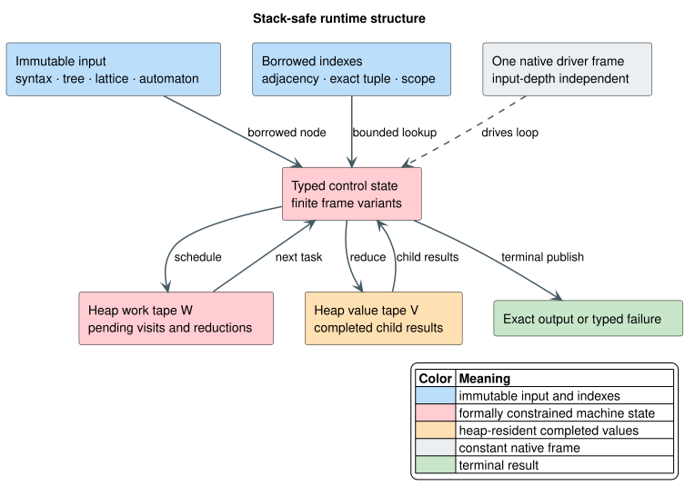
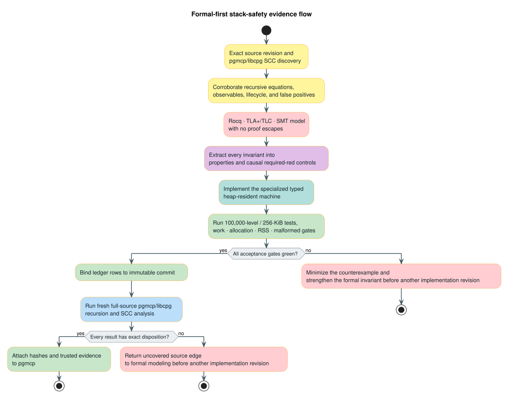

# Stack-Safe Execution Architecture

lling-llang evaluates input-shaped syntax, trees, lattices, and automata with
typed heap-resident machines whose native call-stack use is independent of
logical input depth.

## Terms and symbols

| Term or symbol | Definition |
|---|---|
| Native stack | The platform thread stack used by Rust function calls. It is deliberately bounded to 256 KiB in deep acceptance tests. |
| Logical depth, $`d`$ | The maximum number of input-dependent parent/child, syntax, or control edges on an operation path. |
| Height, $`h`$ | The largest number of simultaneously live logical continuation frames. |
| Pushdown automaton (PDA) | A state machine with an explicit stack. In this architecture its typed frames reside on the heap, not on the native call stack. |
| Strongly connected component (SCC) | A maximal set of call-graph vertices in which every vertex reaches every other vertex. A mutually recursive SCC is flattened as one machine. |
| Work tape, $`W`$ | The explicit pending-task or continuation stack. |
| Value tape, $`V`$ | The explicit stack of completed child results awaiting a parent reduction. |
| Environment, $`E`$ | Operation-specific shared context, such as an algebra, scope chain, automaton index, or cancellation state. |
| Control state, $`C`$ | A finite tag identifying the next machine transition. |
| Disposition ledger | The closed-world mapping from every discovery candidate and recursive owned lifecycle to its source evidence, formal obligations, tests, complexity, allocation plan, and immutable implementation revision. |

The central glossary defines related automata and algebra terms in
[Notation and glossary](../NOTATION.md).

## Safety and refinement contract

For an input $`x`$, let $`R(x)`$ be the pre-conversion recursive specification
and let $`M(x)`$ be the result of the explicit machine. The production contract
is exact refinement:

```math
M(x) = R(x)
```

Equality includes successful values, deterministic child and alternative order,
short-circuit points, typed errors, source locations, sharing policy, cache
effects, cancellation, and caps. It does not mean merely accepting the same
well-formed examples.

The native-stack requirement is:

```math
S_{\mathrm{native}}(d) \in O(1)
```

The explicit storage bound depends on the operation. A depth-first tree machine
normally uses $`O(h)`$ continuation storage plus its output. A graph algorithm
may require $`O(\lvert V\rvert + \lvert E\rvert)`$ adjacency, color, or visited
storage. Every ledger row states the tighter operation-specific bound rather
than hiding it behind a universal estimate.

The following invariants are mandatory for every genuine recursive exposure:

1. Every frame is well typed for the operation and references a live input,
   owned value, or stable arena entry.
2. Each nonterminal transition strictly decreases a well-founded measure or
   consumes a bounded work item.
3. A reduction consumes exactly the values produced by its scheduled children.
4. The observable transition trace refines the recursive specification.
5. Cancellation, malformed input, and resource exhaustion fail closed and do
   not publish partial success.
6. Destruction is iterative for recursively owned values; completing an
   operation cannot defer a native-stack overflow to `drop`.
7. Work and allocation bounds are stated and tested independently of stack
   safety.

Defunctionalization converts recursive continuations into first-order frame
variants. The technique originates with Reynolds and is developed as a
practical correctness bridge by Danvy and Nielsen
([Reynolds 1972](https://doi.org/10.1145/800194.805852),
[Danvy & Nielsen 2001](https://doi.org/10.7146/brics.v8i23.21684)). The use of explicit
pushdown state also aligns with classical pushdown-system analysis
([Bouajjani, Esparza & Maler 1997](https://doi.org/10.1007/3-540-63141-0_10)).

## Architecture



Editable source: [stack-safety-runtime.puml](../diagrams/architecture/stack-safety-runtime.puml).

*Blue denotes immutable input and indexes, red denotes formally constrained
machine state, green denotes accepted output, and gray denotes the bounded
native call frame.*

<details><summary>Text view</summary>

```art
immutable input ──▶ typed control + heap work tape ──▶ heap value tape ──▶ output
       │                       │                              ▲
       └── borrowed indexes ───┴── one native driver frame ───┘
```

</details>

The driver loop owns $`W`$, $`V`$, $`E`$, and $`C`$. A task can schedule child
tasks, reduce completed values, or terminate. Recursive Rust calls are absent
from input-shaped control. Wrapper boundaries such as `AnyPred` to `TreePred`
are traversed by one cross-carrier task enum so alternating types cannot recreate
mutual native recursion.

### Machine selection

| Exposure shape | Specialized representation | Reason |
|---|---|---|
| Unary recursive spine | Borrowed cursor or parity/count loop | Constant auxiliary storage and one transition per node. |
| Ordered tree construction or evaluation | Postorder task tape plus value tape | Preserves left-to-right child order and reconstructs parents once. |
| Mutually recursive syntax families | One tagged continuation enum for the complete SCC | Prevents residual recursion across helper or wrapper boundaries. |
| Graph depth-first search | Explicit `(vertex, next_edge)` frames plus color/visited storage | Preserves DFS order, detects on-path cycles, and remains $`O(\lvert V\rvert + \lvert E\rvert)`$. |
| Fixed descendant path | Cursor or zipper | Avoids a general PDA where a loop or ancestor zipper is sufficient. |
| Lazy combinatorial enumeration | Persistent choice arena plus resumable pull frames | Produces a bounded prefix without materializing the complete result space. |
| Automaton transition lookup | Stable adjacency or exact-tuple index with a scan/index hybrid | Prevents repeated global scans while retaining a bounded adversarial path. |
| Recursive ownership lifecycle | Iterative clone/equality/hash/format/drop event machine | Covers the complete lifecycle, including error unwinding and teardown. |

The simplest specialized machine satisfying the exact contract is preferred.
A general-purpose interpreter is not imposed on cursor loops or dense graph
worklists because larger frames and indirect dispatch would add cost without
adding correctness.

## Literate algorithm

The chunk `⟨ run a typed reduction machine ⟩` is the common skeleton. Its loop
invariant is that $`V`$ contains exactly the completed results for the scheduled
but unreduced parents in $`W`$, in their specified order.

```text
⟨ run a typed reduction machine ⟩
W ← [Visit(root)]
V ← []
while W is not empty:
    task ← pop(W)
    match task:
        Visit(node):
            push(W, Reduce(node, child_count(node)))
            push children onto W in reverse specified order
        Reduce(node, k):
            children ← last k values of V
            result ← operation-specific reduction(node, children, E)
            remove the last k values from V
            push(V, result)
return the sole value in V
```

Reverse scheduling makes the leftmost child execute first on a last-in,
first-out tape. A `Reduce` frame records only information needed after its
children finish. Known child counts preallocate output storage. Operation-specific
machines reuse buffers or move uniquely owned child results when the formal
value semantics permits it.

### Indexed symbolic-tree evaluation

`SymbolicTreeAutomaton::run` illustrates why stack safety and algorithmic
optimality are separate obligations. A stack-safe postorder traversal that scans
all $`m`$ transitions at each of $`n`$ input nodes still performs
$`O(nm)`$ work. The accepted implementation builds two borrowed references per
transition:

- a stable constructor/arity bucket for bounded scanning; and
- an exact child-state-tuple bucket for deterministic or low-ambiguity lookup.

At a node, the machine estimates the reachable child-state Cartesian product
and selects the lower-work path. Exact candidates are sorted by immutable source
transition index before guard evaluation. A deterministic unary path therefore
uses one exact lookup per node, while an adversarial nondeterministic product can
fall back to the structural bucket instead of materializing a larger Cartesian
product. The formal membership and work laws are in
`proofs/coq/stack_safety/TreeRunIndex.v`.

## Formal-first evidence flow



Editable source: [stack-safety-evidence-flow.puml](../diagrams/architecture/stack-safety-evidence-flow.puml).

*Yellow denotes source evidence, red denotes formal verification, purple denotes
required-red controls, green denotes production acceptance, and blue denotes the
independent fresh pgmcp/libcpg audit.*

<details><summary>Text view</summary>

```art
source + SCC discovery
        ↓ corroborate
recursive equation and observables
        ↓ prove/model-check
exhaustive invariant ledger
        ↓ extract before implementation
properties + causal required-red controls
        ↓ implement typed machine
100,000-level/256-KiB acceptance + work/RSS gates
        ↓ audit final revision
fresh pgmcp/libcpg SCC analysis and immutable evidence
```

</details>

The sequence is deliberately one-way. A green production test cannot retroactively
serve as the model from which its invariant was extracted.

1. pgmcp invokes libcpg-backed recursion and SCC discovery. Tarjan's linear-time
   depth-first SCC algorithm is the theoretical basis for this class of analysis
   ([Tarjan 1972](https://doi.org/10.1137/0201010)); the indexed result remains
   discovery evidence until checked against exact source.
2. Source inspection records recursive equations, call edges, dispatch false
   positives, observables, malformed behavior, and lifecycle reachability.
3. Rocq proves unbounded semantic and work laws. TLA+/TLC model-checks bounded
   lifecycle, concurrency, cancellation, and publication protocols where
   applicable. SMT discharges arithmetic ranks and bounded counterexamples.
4. Every formal invariant maps to a property, mutation, malformed case, or deep
   acceptance test before production changes. Property-based testing follows the
   generated-property discipline pioneered by QuickCheck
   ([Claessen & Hughes 2000](https://doi.org/10.1145/357766.351266)).
5. The typed machine is implemented without recursive fallback, helper-thread
   isolation, larger stacks, leaked ownership, or silent depth limits.
6. Acceptance exercises at least 100,000 logical levels on a 256-KiB native
   stack, including applicable construction, operation, failure, formatting,
   cloning, equality, hashing, codecs, and destruction.
7. A fresh full-source analysis is reconciled against the immutable commit.

The complete candidate-to-evidence mapping lives in
[`proofs/doc/stack-safety-dispositions.tsv`](../../proofs/doc/stack-safety-dispositions.tsv).
The validator rejects missing rows, duplicate identifiers, stale discovery
projections, vacuous fields, unsupported dispositions, non-immutable final
revisions, and flattened rows without explicit deep evidence.

## Concurrency and parallelism

Stack-safe machines are request-local. Immutable automata, algebras, syntax, and
indexes may be shared, while work tapes, value tapes, on-path sets, and scratch
buffers are not shared between independent requests. This yields lock-free
parallelism across requests without making a single ordered traversal
nondeterministic.

Parallel work inside one operation is permitted only when all of the following
hold:

- child subproblems are semantically independent;
- the merge order is fixed independently of completion order;
- cancellation is sticky and checked at bounded intervals;
- total work and memory budgets are shared rather than multiplied per worker;
- the parallel representation does not reintroduce recursive worker tasks; and
- the serial machine remains the differential oracle.

Fine-grained parallelism is intentionally absent from narrow unary spines and
small reductions: synchronization would dominate their linear work. Wide
independent forests, immutable automaton batches, and separate optimizer-plan
components are the natural parallel boundaries.

## Failure and security properties

Input depth is attacker-controlled at parsing, binding, serialization, and
foreign-interface boundaries. Stack safety therefore forms part of the denial-of-
service boundary, but it is not sufficient by itself.

- Malformed indices and graph endpoints are validated before indexing.
- Checked arithmetic protects capacity and Cartesian-product estimates.
- Cycles use explicit on-path or visited semantics; they are not hidden by a
  global depth cap.
- Resource exhaustion and cancellation return typed non-success outcomes.
- Partial values remain private until the terminal success transition.
- Drop drains recursively owned values iteratively, including failure paths.
- Request-local scratch prevents one caller from corrupting another caller's
  traversal.

## Executable usage example

The public API does not require callers to manage a machine. `run` and `accepts`
select the stack-safe implementation internally:

```rust
use lling_llang::symbolic::{
    IntervalAlgebra, SymbolicTreeAutomaton, SymTerm, TreeTrans,
};

let mut automaton = SymbolicTreeAutomaton::new(IntervalAlgebra::new(0, 1));
automaton.register("Leaf", 0);
automaton.register("Chain", 1);
let state = automaton.add_state();
automaton.set_accepting(state);
automaton.add_transition(TreeTrans {
    constructor: "Leaf".to_owned(),
    payload_guard: None,
    child_states: Vec::new(),
    target: state,
});
automaton.add_transition(TreeTrans {
    constructor: "Chain".to_owned(),
    payload_guard: None,
    child_states: vec![state],
    target: state,
});

let term = SymTerm::<i64>::node("Chain", vec![SymTerm::constant("Leaf")]);
assert!(automaton.accepts(&term));
```

The 100,000-level acceptance version of this example is in
`tests/stack_safety_properties.rs`.

## Verification commands

All heavy commands use repository-backed storage and a bounded user scope:

```text
systemd-run --user --scope \
  -p MemoryMax=4G -p MemorySwapMax=0 -p TasksMax=64 -p CPUQuota=100% \
  env CARGO_BUILD_JOBS=1 <verification command>
```

The aggregate formal entry point is `proofs/verify.sh`. The ledger gate is
`python3 -B scripts/check-stack-safety-dispositions.py`. Rust acceptance uses
all features, Clippy with warnings denied, property tests, deep small-stack
tests, documentation lint, and the repository bug gate. Evidence logs are kept
under `target/verification` only until their hashes and conclusions are attached
to pgmcp.

## References

- [Reynolds 1972](https://doi.org/10.1145/800194.805852) — original
  defunctionalization basis.
- [Danvy & Nielsen 2001](https://doi.org/10.7146/brics.v8i23.21684) — systematic
  defunctionalization and first-order machines.
- [Bouajjani, Esparza & Maler 1997](https://doi.org/10.1007/3-540-63141-0_10) —
  pushdown reachability and model checking.
- [Tarjan 1972](https://doi.org/10.1137/0201010) — linear depth-first SCC
  analysis.
- [Claessen & Hughes 2000](https://doi.org/10.1145/357766.351266) —
  property-based testing.
- [Fülöp & Vogler 2009](https://doi.org/10.1007/978-3-642-01492-5_9) — weighted tree
  automata and transducers.
