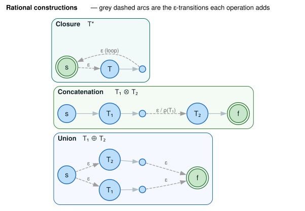

# WFST Operations

This document describes the rational and unary operations available on Weighted Finite State Transducers. These operations are the building blocks for constructing complex WFSTs from simpler ones.

## Terms & symbols

Symbols link to [`NOTATION.md`](../NOTATION.md); conventions in [`STYLE.md`](../STYLE.md).

| Symbol / term | Meaning |
|---|---|
| $`T_1 \oplus T_2`$ | **Union** — accepts strings of $`T_1`$ *or* $`T_2`$. |
| $`T_1 \otimes T_2`$ | **Concatenation** — strings of $`T_1`$ followed by strings of $`T_2`$. |
| $`T^*`$ / $`T^+`$ | **Kleene closure / plus** — zero-or-more / one-or-more repetitions. |
| $`T^{-1}`$ | **Inversion** — swap input and output labels on every arc. |
| $`\downarrow T`$ / $`T\downarrow`$ | **Input / output projection** — keep only input / output labels (yields an acceptor). |
| $`T^R`$ | **Reversal** — reverse the direction of every transition. |
| $`\varepsilon`$ | Epsilon — a transition consuming/emitting no symbol. |
| $`\lvert T\rvert`$ | The size of a transducer ($`\lvert Q\rvert + \lvert E\rvert`$), used in complexity bounds. |

## Concepts

### Why Operations?

Complex WFSTs can be built compositionally from simpler ones — union $`T_1 \oplus T_2`$, concatenation $`T_1 \otimes T_2`$, and closure $`T^*`$ correspond to the regular-expression operators:

```text
Simple FSTs → Combine with Operations → Complex FST
     T₁     →     T₁ ⊕ T₂            → Union
     T₁     →     T₁ ⊗ T₂            → Concatenation
     T₁     →       T₁*              → Kleene Closure
```

This approach has advantages:
- **Modularity**: Build and test components separately
- **Laziness**: Only compute states that are actually visited
- **Memory efficiency**: No need to materialize the entire result

### Lazy vs Constructive Operations

Operations come in two flavors:

| Type | Behavior | Memory | Example |
|------|----------|--------|---------|
| **Lazy** | States computed on demand | $`\mathcal{O}(1)`$ to create | Union, Concat, Closure, Invert, Project |
| **Constructive** | Entire result computed upfront | $`\mathcal{O}(\lvert\text{result}\rvert)`$ | Reverse |

Lazy operations are preferred when you don't need the entire result (e.g., during pruned search).

## Rational Operations

Rational operations form the "rational" part of rational transducers. They correspond to regular-expression operators [[Mohri 2009](../BIBLIOGRAPHY.md#ref-mohri2009)]. Each of the three core constructions wires the operands together with $`\varepsilon`$-transitions, sketched below:



*Blue circles = states; green double-rings = final states; grey dashed arcs = the $`\varepsilon`$-transitions each construction adds; light-grey solid arcs = the operand bodies $`T_1`$ / $`T_2`$ / $`T`$. Cluster borders are tinted blue (union), green (concat), teal (closure).*

<details><summary>Text view</summary>

```text
Union  T₁ ⊕ T₂:                Concatenation  T₁ ⊗ T₂:        Closure  T*:
        ε        ε                                                  ε (loop back)
   ┌────────► T₁ ────┐          s ─► T₁ ─ε/ρ(T₁)─► T₂ ─► f      ┌───────────────┐
 s ─┤                ├─► f                                       │   ε           │
   └────────► T₂ ────┘                                          s* ──► T ────────┘
        ε        ε                                            (s is final: accepts ε)
```

</details>

### Union: $`T_1 \oplus T_2`$

**Definition**: Creates a WFST that accepts strings from either $`T_1`$ OR $`T_2`$.

**Structure**:
```text
        ε        ε
   ┌────────► T₁ ────┐
   │                  │
 start                ▼
   │                final
   │                  ▲
   └────────► T₂ ────┘
        ε        ε
```

**Complexity**: $`\mathcal{O}(\lvert T_1\rvert + \lvert T_2\rvert)`$ — computed lazily.

**Example**:
```rust
use lling_llang::wfst::{VectorWfst, VectorWfstBuilder, Wfst};
use lling_llang::wfst::union;
use lling_llang::semiring::{Semiring, TropicalWeight};

// Create two simple WFSTs
let fst_a: VectorWfst<char, TropicalWeight> = VectorWfstBuilder::new()
    .add_states(2)
    .start(0)
    .arc(0, Some('a'), Some('a'), 1, TropicalWeight::one())
    .final_state(1, TropicalWeight::one())
    .build();

let fst_b: VectorWfst<char, TropicalWeight> = VectorWfstBuilder::new()
    .add_states(2)
    .start(0)
    .arc(0, Some('b'), Some('b'), 1, TropicalWeight::one())
    .final_state(1, TropicalWeight::one())
    .build();

// Union: accepts "a" or "b"
let u = union(&fst_a, &fst_b);
assert_eq!(u.num_states(), 5);  // 1 super-start + 2 + 2
```

**Algebraic Properties**:
- **Commutativity**: $`T_1 \oplus T_2 \equiv T_2 \oplus T_1`$
- **Associativity**: $`(T_1 \oplus T_2) \oplus T_3 \equiv T_1 \oplus (T_2 \oplus T_3)`$
- **Identity**: $`T \oplus \emptyset \equiv T`$ (union with empty FST)

### Concatenation: $`T_1 \otimes T_2`$

**Definition**: Creates a WFST that accepts strings from $`T_1`$ followed by strings from $`T_2`$.

**Structure**:
```text
                    ε (final weight)
   start ────► T₁ ────────────────────► T₂ ────► final
         path₁                     path₂
```

**Complexity**: $`\mathcal{O}(\lvert T_1\rvert + \lvert T_2\rvert + \lvert F_1\rvert\lvert I_2\rvert)`$ where $`F_1`$ = final states of $`T_1`$, $`I_2`$ = initial states of $`T_2`$.

**Example**:
```rust
use lling_llang::wfst::concat;

// Concatenation: accepts "ab" (a followed by b)
let c = concat(&fst_a, &fst_b);

// Final states are only from fst_b
// fst_a's final states have ε-transitions to fst_b's start
```

**Algebraic Properties**:
- **Associativity**: $`(T_1 \otimes T_2) \otimes T_3 \equiv T_1 \otimes (T_2 \otimes T_3)`$
- **Not commutative**: $`T_1 \otimes T_2 \ne T_2 \otimes T_1`$ in general
- **Identity**: $`T \otimes \varepsilon \equiv \varepsilon \otimes T \equiv T`$ (where $`\varepsilon`$ accepts only the empty string)
- **Annihilation**: $`T \otimes \emptyset \equiv \emptyset \otimes T \equiv \emptyset`$

### Kleene Closure: $`T^*`$

**Definition**: Creates a WFST that accepts zero or more repetitions of strings from $`T`$.

**Structure**:
```text
              ε
         ┌────────────┐
         │            │
         ▼    ε       │
    super-start ──► T ─┘
     (final)        │
         ▲          │
         └──────────┘
              ε (from T final states)
```

**Complexity**: $`\mathcal{O}(\lvert T\rvert)`$ — computed lazily.

**Example**:
```rust
use lling_llang::wfst::closure;

// Closure: accepts "", "a", "aa", "aaa", ...
let k = closure(&fst_a);

// Super-start is final (accepts empty string)
// T's final states loop back to T's start
```

**Algebraic Properties**:
- **Idempotence**: $`(T^*)^* \equiv T^*`$
- **Empty string**: $`\varepsilon \in L(T^*)`$ always

### Kleene Plus: $`T^+`$

**Definition**: One or more repetitions. Equivalent to $`T \otimes T^*`$.

**Example**:
```rust
use lling_llang::wfst::closure_plus;

// Plus: accepts "a", "aa", "aaa", ... (but NOT empty)
let kp = closure_plus(&fst_a);

// Start is NOT final (doesn't accept empty string)
```

**Relation to Closure**: $`T^+ \equiv T \otimes T^* \equiv T^* \otimes T`$

## Unary Operations

Unary operations transform a single WFST into another.

### Inversion: $`T^{-1}`$

**Definition**: Swaps input and output labels on all transitions.

**Before**: `(i:o/w)` arc
**After**: `(o:i/w)` arc

**Complexity**: $`\mathcal{O}(\lvert T\rvert)`$ — computed lazily.

**Example**:
```rust
use lling_llang::wfst::invert;

// Original: a:x -> b:y
let fst: VectorWfst<char, TropicalWeight> = VectorWfstBuilder::new()
    .add_states(3)
    .start(0)
    .arc(0, Some('a'), Some('x'), 1, TropicalWeight::one())
    .arc(1, Some('b'), Some('y'), 2, TropicalWeight::one())
    .final_state(2, TropicalWeight::one())
    .build();

// Inverted: x:a -> y:b
let inv = invert(&fst);
```

**Algebraic Properties**:
- **Involution**: $`(T^{-1})^{-1} \equiv T`$
- **Preserves weights**: Weights unchanged
- **Preserves structure**: Same states and connectivity

**Use Cases**:
- Converting input-to-output mapping to output-to-input
- Reversing translation direction

### Input Projection: $`\downarrow T`$

**Definition**: Converts a transducer to an acceptor by keeping only input labels.

**Before**: `(i:o/w)` arc
**After**: `(i:i/w)` arc (both labels are input)

**Complexity**: $`\mathcal{O}(\lvert T\rvert)`$ — computed lazily.

**Example**:
```rust
use lling_llang::wfst::project_input;

// Input projection: a -> b (ignoring output labels)
let pin = project_input(&fst);

// Result is an acceptor (input = output)
```

**Algebraic Properties**:
- **Idempotence**: $`\downarrow(\downarrow T) \equiv \downarrow T`$
- **Preserves weights**

**Use Cases**:
- Extracting the input language of a transducer
- Converting transducer to acceptor for intersection

### Output Projection: $`T\downarrow`$

**Definition**: Converts a transducer to an acceptor by keeping only output labels.

**Before**: `(i:o/w)` arc
**After**: `(o:o/w)` arc (both labels are output)

**Complexity**: $`\mathcal{O}(\lvert T\rvert)`$ — computed lazily.

**Example**:
```rust
use lling_llang::wfst::project_output;

// Output projection: x -> y (ignoring input labels)
let pout = project_output(&fst);

// Result is an acceptor (input = output)
```

**Algebraic Properties**:
- **Idempotence**: $`(T\downarrow)\downarrow \equiv T\downarrow`$
- **Relation to inversion**: $`T\downarrow \equiv \downarrow(T^{-1})`$

**Use Cases**:
- Extracting the output language of a transducer
- Computing the range of a relation

### Reversal: $`T^R`$

**Definition**: Reverses the direction of all transitions.

**Original**: $`p \to q`$
**Reversed**: $`q \to p`$

**Important**: This is a **constructive** operation (not lazy) because it requires inspecting all states to build the reversed graph.

**Complexity**: $`\mathcal{O}(\lvert Q\rvert + \lvert E\rvert)`$

**Structure**:
```text
Original:              Reversed:
  start → ... → final    super-start -ε→ (old finals) → ... → (old start, now final)
```

**Example**:
```rust
use lling_llang::wfst::reverse;

// Reversal: reverses path direction
let rev = reverse(&fst);

// Returns a VectorWfst (not lazy)
// Original final states connect from super-start via ε
// Original start state becomes final
```

**Algebraic Properties**:
- **Involution**: $`(T^R)^R \equiv T`$ (up to state renumbering)
- **Preserves weights and labels**
- **Reverses path structure**

**Use Cases**:
- Suffix-based operations (when combined with algorithms that work left-to-right)
- Epsilon removal from the right

## Composition of Operations

Operations can be combined to build complex WFSTs:

```rust
use lling_llang::wfst::{union, concat, closure, invert, project_input};

// Build a complex pattern
// Accepts: "a" | ("b" followed by zero or more "c")
let pattern = union(
    &fst_a,
    &concat(&fst_b, &closure(&fst_c))
);

// Extract input language and invert
let input_lang = project_input(&pattern);
let inverted = invert(&pattern);
```

## Lazy Chaining

When chaining lazy operations, inner FSTs must be expanded first:

```rust
let mut u12 = union(&fst_a, &fst_b);

// Expand u12 before using in another union
for s in 0..u12.num_states() as StateId {
    u12.expand(s);
}

// Now we can compose with another operation
let u123 = union(&u12, &fst_c);
```

This is because lazy wrappers read from their inner FST on demand.

## State ID Encoding

Each operation uses a specific state ID encoding:

### Union State IDs
```
State 0: Super-start
States 1..=n1: States from T₁ (offset by 1)
States n1+1..=n1+n2: States from T₂ (offset by n1+1)
```

### Concatenation State IDs
```
States 0..n1: States from T₁
States n1..n1+n2: States from T₂ (offset by n1)
```

### Closure State IDs
```
State 0: Super-start (final, accepts empty)
States 1..=n: States from T (offset by 1)
```

### Reversal State IDs
```
State 0: Super-start
States 1..=n: Reversed states from T (offset by 1)
```

## Performance Considerations

### When to Use Lazy Operations

- **Pruned search**: Only explore relevant states
- **Large FSTs**: Avoid materializing entire result
- **Composition chains**: Defer computation

### When to Materialize

- **Random access needed**: Multiple traversals
- **Reversal**: Always constructive
- **Caching**: When same states accessed repeatedly

### Memory Usage

| Operation | Creation | Per-State Access |
|-----------|----------|------------------|
| Union | $`\mathcal{O}(1)`$ | $`\mathcal{O}(1)`$ |
| Concat | $`\mathcal{O}(1)`$ | $`\mathcal{O}(1)`$ |
| Closure | $`\mathcal{O}(1)`$ | $`\mathcal{O}(1)`$ |
| Invert | $`\mathcal{O}(1)`$ | $`\mathcal{O}(1)`$ |
| Project | $`\mathcal{O}(1)`$ | $`\mathcal{O}(1)`$ |
| Reverse | $`\mathcal{O}(\lvert Q\rvert + \lvert E\rvert)`$ | $`\mathcal{O}(1)`$ |

## Related Topics

- [Semirings](semirings.md): Weight algebra for WFSTs
- [Composition](../algorithms/composition.md): Composing two transducers
- [Determinization](../algorithms/determinization.md): Making WFSTs deterministic
- [Epsilon Removal](../algorithms/epsilon-removal.md): Removing epsilon transitions
- [Shortest Distance](../algorithms/shortest-distance.md): Computing path weights
- [Subsequential Transducers](../advanced/subsequential-transducers.md): Deterministic transducers with piecewise decomposition

## References

Full entries — including DOIs — are in [`BIBLIOGRAPHY.md`](../BIBLIOGRAPHY.md).

- [**Mohri 2009**](../BIBLIOGRAPHY.md#ref-mohri2009) — Mohri, *Weighted Automata Algorithms*: the rational operations (union, concatenation, closure) and unary operations (inversion, projection, reversal) on weighted automata, with their $`\varepsilon`$-construction and complexity. [doi:10.1007/978-3-642-01492-5_6](https://doi.org/10.1007/978-3-642-01492-5_6)
- [**Mohri 2002**](../BIBLIOGRAPHY.md#ref-mohri2002) — Mohri, Pereira & Riley, *Weighted Finite-State Transducers in Speech Recognition*: lazy (on-demand) evaluation of these constructions as the basis for pruned search. [doi:10.1006/csla.2001.0184](https://doi.org/10.1006/csla.2001.0184)
- [**Allauzen 2007**](../BIBLIOGRAPHY.md#ref-allauzen2007) — Allauzen et al., *OpenFst*: the reference library whose `Union`/`Concat`/`Closure`/`Invert`/`Project`/`Reverse` operations these mirror. [doi:10.1007/978-3-540-76336-9_3](https://doi.org/10.1007/978-3-540-76336-9_3)
