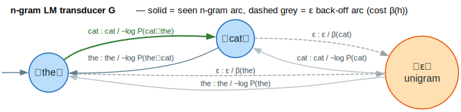
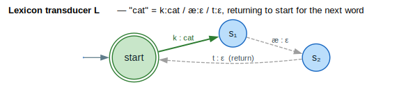
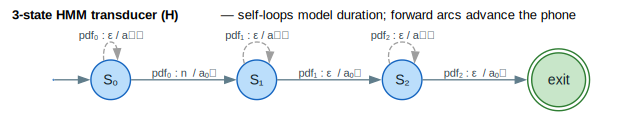
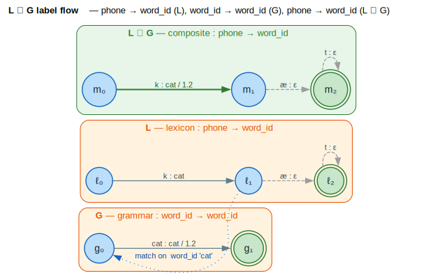
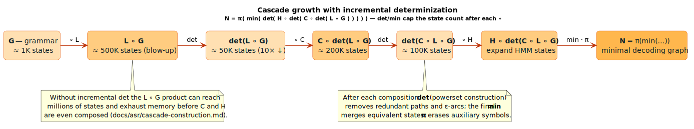

# ASR Cascade Construction

The ASR cascade is a pre-compiled recognition network that enables real-time
speech recognition by combining all knowledge sources (acoustic model,
pronunciation dictionary, language model) into a single weighted finite-state
transducer. **ASR** = Automatic Speech Recognition; **WFST** = Weighted
Finite-State Transducer.

## Terms & symbols

The symbols below are the cascade-local subset of the central
[`NOTATION.md`](../NOTATION.md); see it for the full glossary.

| Symbol | Name | Meaning |
|---|---|---|
| $`H`$ | HMM transducer | Maps HMM-state ids → context-dependent phones (sub-phonetic topology). |
| $`C`$ | context-dependency | Maps context-dependent (triphone) phones → context-independent phones. |
| $`L`$ | lexicon | Maps phone strings → word ids (the pronunciation dictionary). |
| $`G`$ | grammar / LM | Maps word ids → word ids, carrying the n-gram language-model weights. |
| $`\circ`$ | composition | $`A \circ B`$ chains transducers: $`A`$'s output tape feeds $`B`$'s input tape. |
| $`\det`$ | determinization | Powerset construction; one transition per (state, input) pair. |
| $`\min`$ | minimization | Merges equivalent states into the minimal equivalent machine. |
| $`\pi`$ | projection / erasing | Erases auxiliary symbols, projecting to the recognition network $`N`$. |
| $`\lvert Q\rvert`$, $`\lvert E\rvert`$ | cardinality | State / arc counts used in the size bounds below. |

## The Recognition Network

The full ASR cascade follows the Mohri–Pereira–Riley formulation
([Mohri 2002](../BIBLIOGRAPHY.md#ref-mohri2002)): the recognition network $`N`$ is

```math
N = \pi(\min(\det(\tilde{H} \circ \det(\tilde{C} \circ \det(\tilde{L} \circ G)))))
```

Where:
- $`G`$ = Grammar (word-level language model)
- $`L`$ = Lexicon (pronunciation dictionary)
- $`C`$ = Context-dependency transducer (triphone mapping)
- $`H`$ = HMM transducer (hidden Markov model structure)
- $`\det`$ = Determinization (powerset construction)
- $`\min`$ = Minimization (state reduction)
- $`\pi`$ = Projection/erasing (remove auxiliary symbols)

### Why Pre-Compilation?

Pre-compiling the cascade offers significant advantages:

1. **Real-time decoding**: Single FST traversal vs. on-the-fly composition
2. **Optimized graph**: Determinization and minimization reduce redundancy
3. **Memory efficiency**: Shared structure across recognition sessions
4. **Predictable latency**: No runtime composition overhead

## Pipeline Components

### Grammar ($`G`$): Word-Level Language Model

The grammar $`G : \text{WordId} \to \text{WordId}`$ is an identity transducer carrying LM weights;
it assigns probabilities to word sequences, typically from n-gram language models.
Seen n-grams take a direct word arc weighted by $`-\log P(w_n \mid h)`$; unseen n-grams
follow an $`\varepsilon`$ **back-off** arc (cost $`\beta(h)`$) to a shorter-history state and retry
at the lower order — Katz back-off, encoded structurally so the machine stays
sparse (`NgramBuilder`, `src/asr/ngram.rs`).



*Solid arcs carry seen-n-gram cost $`-\log P(w_n \mid h)`$; bold green is the live decode path; dashed grey are the $`\varepsilon`$ back-off arcs (cost $`\beta(h)`$) to the orange unigram state.*

<details><summary>Text view</summary>

```text
G: WordId → WordId (identity transducer with LM weights)

Structure:
  ┌────────────────────────────────────────┐
  │  Unigram state with backoff arcs       │
  │       │                                │
  │       ▼                                │
  │  ┌─────────┐    word/word    ┌───────┐ │
  │  │ History │ ─────────────►  │ Next  │ │
  │  │  State  │    (LM weight)  │ State │ │
  │  └─────────┘                 └───────┘ │
  │       │                          │     │
  │       └────── backoff ───────────┘     │
  └────────────────────────────────────────┘
```

</details>

The grammar FST encodes:
- N-gram probabilities as arc weights
- Backoff structure for unseen n-grams
- Start/end sentence markers

### Lexicon ($`\tilde{L}`$): Pronunciation Dictionary

The lexicon maps phone sequences to words: $`L : \text{PhoneId} \to \text{WordId}`$. For the entry
`"cat" → [k, æ, t]` with weight $`w`$, the **first** phone arc emits the word id on
the output tape, **interior** phones emit $`\varepsilon`$ (the word is already emitted), and
the **last** phone returns to the start state so consecutive words concatenate.



*Bold green `k:cat` emits the word id; dashed grey `æ:ε` / `t:ε` are $`\varepsilon`$-output arcs; the double-ring start state is also final, so word streams loop back through it.*

<details><summary>Text view</summary>

```text
L: PhoneId (input) → WordId (output)

Entry: "cat" → [k, æ, t] with weight w

FST Structure:
              word_id
  (start) ───k/cat───► (s1) ───æ/ε───► (s2) ───t/ε───► (start)
     │                                                    ▲
     │                                                    │
     └────────────────────────────────────────────────────┘
                    (return for next word)
```

</details>

Key features:
- **First arc**: Emits word ID on output
- **Subsequent arcs**: Epsilon output (word already emitted)
- **Returns to start**: Allows continuous word sequences
- **Multiple pronunciations**: Homophones have parallel paths

```rust
pub struct LexiconEntry<W: Semiring> {
    /// Word identifier
    pub word: WordId,

    /// Pronunciation as phone sequence
    pub phones: Vec<PhoneId>,

    /// Pronunciation probability (for variants)
    pub weight: W,

    /// Auxiliary symbols for disambiguation
    pub auxiliaries: Vec<AuxiliarySymbol>,
}
```

### Context-Dependency ($`\tilde{C}`$): Triphone Mapping

The context-dependency transducer maps context-independent phones to context-dependent ones:

```
C: PhoneId (context-dependent) → PhoneId (context-independent)

Example: Triphone "a-n+b" → monophone "n"

Structure encodes context windows:
  Left context × Phone × Right context → Phone

  ┌─────┐   p_cd/p_ci   ┌─────┐
  │ ctx │ ────────────► │ ctx'│
  └─────┘               └─────┘
```

Context-dependent phone IDs typically encode:
- Center phone identity
- Left context (preceding phone or word boundary)
- Right context (following phone or word boundary)

### HMM Transducer ($`\tilde{H}`$): Hidden Markov Model

The HMM transducer models sub-phonetic states: $`H : \text{HMM-state-Id} \to \text{PhoneId}`$. The
standard topology is a 3-state left-to-right HMM per phone — each state carries a
**self-loop** (duration modelling) and a **forward** arc to the next state, with
the phone label emitted on the first arc only. This is exactly
`TransitionMatrix::left_to_right(3, p)` in `src/acoustic/mod.rs`.



*Solid arcs (`pdfᵢ : …`) advance the sub-phonetic state and carry forward cost $`a_{on}`$; dashed grey self-loops carry the stay cost $`a_{sl}`$; the first forward arc emits the phone id, the rest emit $`\varepsilon`$.*

<details><summary>Text view</summary>

```text
H: HMM-state-Id (input) → PhoneId (output)

Standard 3-state HMM per phone:
           ┌───┐     ┌───┐     ┌───┐
  phone ─► │ 1 │ ──► │ 2 │ ──► │ 3 │ ──► next
           └─┬─┘     └─┬─┘     └─┬─┘
             │         │         │
             └─────────┴─────────┘
              (self-loops for duration modeling)
```

</details>

Each state has:
- Self-loop for extended duration
- Forward transition to next state
- Output label on first state only

### Erasing ($`\pi`$): Auxiliary Symbol Removal

Auxiliary symbols (disambiguation, word boundaries) are removed in the final step:

```rust
pub enum AuxiliarySymbol {
    /// Word boundary marker (#)
    WordBoundary,

    /// Disambiguation symbol (#0, #1, ...)
    Disambiguation(u32),

    /// Epsilon (for erasing)
    Epsilon,
}
```

## $`L \circ G`$ Composition

The key insight for efficient cascade construction is proper $`L \circ G`$ composition.

### Label Flow

For composition to work, output labels of the first FST must match input labels of the second:

```
Lexicon L:
  Input:  PhoneId (acoustic phones)
  Output: WordId  (word tokens)

Grammar G:
  Input:  WordId  (word tokens)
  Output: WordId  (word tokens, or could be different)

Composition L ∘ G:
  L.output (WordId) matches G.input (WordId) ✓
  Result: Input=PhoneId, Output=WordId
```

Visually, $`L`$'s output tape (`WordId`) feeds $`G`$'s input tape (`WordId`), and the
composite $`L \circ G`$ reads phones and writes word ids:



*Three clustered machines: $`L`$ (phone → word_id), $`G`$ (word_id → word_id), and the green composite $`L \circ G`$ (phone → word_id); the dotted blue arc marks the matched `word_id` label that makes composition defined, and the composite arc carries the summed weight `1.2`.*

<details><summary>Text view</summary>

```text
┌─────────────────────────────────────────────────────────────────┐
│                        L ∘ G Composition                         │
│                                                                  │
│   Lexicon (L)              Match              Grammar (G)        │
│   ───────────              ─────              ───────────        │
│                                                                  │
│   phone ──► word_id   ═══════════════►   word_id ──► word_id    │
│   (input)   (output)       on WordId      (input)    (output)   │
│                                                                  │
│   Result (L ∘ G):                                                │
│   phone ─────────────────────────────────────────────► word_id  │
│   (input)                                               (output) │
└─────────────────────────────────────────────────────────────────┘
```

</details>

### Implementation

The cascade builder creates a lexicon with WordId outputs for proper composition:

```rust
/// Build lexicon FST with WordId on output for L∘G composition
fn build_lexicon_for_composition(&self) -> VectorWfst<u32, W> {
    let mut fst = VectorWfst::new();
    let start = fst.add_state();
    fst.set_start(start);
    fst.set_final(start, W::one());

    for entry in &self.lexicon {
        let mut current = start;

        // First phone: emit word ID on output
        let next = fst.add_state();
        fst.add_arc(
            current,
            Some(entry.phones[0] as u32),  // Input: phone
            Some(entry.word as u32),        // Output: word ID
            next,
            entry.weight.clone(),
        );
        current = next;

        // Middle phones: epsilon output
        for &phone in &entry.phones[1..entry.phones.len()-1] {
            let next = fst.add_state();
            fst.add_arc(current, Some(phone as u32), None, next, W::one());
            current = next;
        }

        // Last phone: return to start
        if entry.phones.len() > 1 {
            let last_phone = entry.phones[entry.phones.len() - 1];
            fst.add_arc(current, Some(last_phone as u32), None, start, W::one());
        }
    }

    fst
}
```

## API Reference

### CascadeBuilder

```rust
pub struct CascadeBuilder<W: Semiring> {
    config: CascadeConfig,
    grammar: Option<VectorWfst<WordId, W>>,
    lexicon: Vec<LexiconEntry<W>>,
    context: Option<VectorWfst<PhoneId, W>>,
    hmm: Option<VectorWfst<PhoneId, W>>,
}

impl<W: Semiring> CascadeBuilder<W> {
    /// Create a new builder
    pub fn new() -> Self;

    /// Set configuration
    pub fn config(self, config: CascadeConfig) -> Self;

    /// Set grammar (language model) FST
    pub fn grammar(self, g: VectorWfst<WordId, W>) -> Self;

    /// Add a lexicon entry
    pub fn add_lexicon_entry(&mut self, entry: LexiconEntry<W>);

    /// Set context-dependency transducer
    pub fn context_dependency(self, c: VectorWfst<PhoneId, W>) -> Self;

    /// Set HMM transducer
    pub fn hmm(self, h: VectorWfst<PhoneId, W>) -> Self;

    /// Build cascade (basic version)
    pub fn build(self) -> AsrCascade<W>;

    /// Build cascade with optimization (requires DivisibleSemiring)
    pub fn build_optimized(self) -> AsrCascade<W>
    where
        W: DivisibleSemiring + TotallyOrderedSemiring;
}
```

### Configuration

```rust
pub struct CascadeConfig {
    /// Apply determinization after each composition (default: true)
    pub incremental_det: bool,

    /// Minimize the final result (default: true)
    pub minimize: bool,

    /// Use lazy composition (default: false)
    pub lazy: bool,

    /// Maximum pronunciations per word (default: 10)
    pub max_homophony: u32,

    /// Add word boundary markers (default: true)
    pub word_boundaries: bool,
}
```

### Build Strategies

**`build()`**: Basic composition without optimization

```rust
let cascade = CascadeBuilder::new()
    .grammar(lm_fst)
    .add_lexicon_entries(&lexicon)
    .build();

// Suitable for:
// - Development and debugging
// - Small vocabularies
// - When optimization overhead exceeds benefit
```

**`build_optimized()`**: Incremental optimization

```rust
let cascade = CascadeBuilder::new()
    .config(CascadeConfig {
        incremental_det: true,
        minimize: true,
        ..Default::default()
    })
    .grammar(lm_fst)
    .add_lexicon_entries(&lexicon)
    .context_dependency(triphone_fst)
    .hmm(hmm_fst)
    .build_optimized();

// Suitable for:
// - Production deployment
// - Large vocabularies (10K+ words)
// - Real-time requirements
```

### Statistics

```rust
pub struct CascadeStats {
    /// Grammar FST states
    pub g_states: usize,

    /// States after L ∘ G
    pub lg_states: usize,

    /// States after det(L ∘ G)
    pub det_lg_states: usize,

    /// States after C ∘ det(L ∘ G)
    pub clg_states: usize,

    /// States after det(C ∘ L ∘ G)
    pub det_clg_states: usize,

    /// Final cascade states
    pub final_states: usize,

    /// Final cascade arcs
    pub final_arcs: usize,
}
```

## Examples

### Simple Lexicon + Grammar

```rust
use lling_llang::asr::{CascadeBuilder, CascadeConfig, LexiconEntry};
use lling_llang::semiring::LogWeight;

// Define vocabulary
let lexicon = vec![
    LexiconEntry {
        word: 0,  // "the"
        phones: vec![0, 1],  // [DH, AX]
        weight: LogWeight::one(),
        auxiliaries: vec![],
    },
    LexiconEntry {
        word: 1,  // "cat"
        phones: vec![2, 3, 4],  // [K, AE, T]
        weight: LogWeight::one(),
        auxiliaries: vec![],
    },
    LexiconEntry {
        word: 2,  // "sat"
        phones: vec![5, 3, 4],  // [S, AE, T]
        weight: LogWeight::one(),
        auxiliaries: vec![],
    },
];

// Build cascade (no grammar = accept any word sequence)
let mut builder = CascadeBuilder::<LogWeight>::new();
for entry in lexicon {
    builder.add_lexicon_entry(entry);
}
let cascade = builder.build();

println!("Cascade: {} states, {} arcs",
    cascade.stats().final_states,
    cascade.stats().final_arcs);
```

### Full Pipeline with Language Model

```rust
use lling_llang::asr::{CascadeBuilder, CascadeConfig};
use lling_llang::asr::ngram::NgramTransducer;
use lling_llang::semiring::LogWeight;

// Load n-gram language model as FST
let grammar: VectorWfst<WordId, LogWeight> = NgramTransducer::from_arpa("lm.arpa")
    .to_fst();

// Build context-dependency transducer
let context_fst = build_triphone_transducer(&phone_inventory);

// Build HMM transducer
let hmm_fst = build_3state_hmm(&phone_inventory);

// Construct full cascade
let cascade = CascadeBuilder::new()
    .config(CascadeConfig {
        incremental_det: true,
        minimize: true,
        ..Default::default()
    })
    .grammar(grammar)
    .context_dependency(context_fst)
    .hmm(hmm_fst)
    .add_lexicon_entries(&lexicon)
    .build_optimized();

// Inspect pipeline statistics
let stats = cascade.stats();
println!("Pipeline growth:");
println!("  G:           {} states", stats.g_states);
println!("  L∘G:         {} states", stats.lg_states);
println!("  det(L∘G):    {} states", stats.det_lg_states);
println!("  C∘det(L∘G):  {} states", stats.clg_states);
println!("  Final:       {} states, {} arcs",
    stats.final_states, stats.final_arcs);
```

### Using the Cascade for Decoding

```rust
use lling_llang::algorithms::shortest_path;
use lling_llang::composition::compose;

// Get the recognition network
let network = cascade.as_fst();

// Acoustic scores from neural network (as FST)
let acoustic_fst = build_acoustic_fst(&encoder_output);

// Compose acoustic scores with recognition network
let search_space = compose(acoustic_fst, network);

// Find best path
let best_path = shortest_path(&search_space, 1);

// Extract word sequence from path
let words: Vec<WordId> = best_path
    .output_labels()
    .filter_map(|l| l)
    .collect();
```

## Advanced Topics

### Incremental Determinization Strategy

Determinizing after each composition prevents exponential state explosion. The
state count $`\lvert Q\rvert`$ blows up at every raw composition and is pulled back down by the
following $`\det`$; the final $`\min`$ and $`\pi`$ yield the minimal decoding graph $`N`$.



*Each $`\circ`$ (darker orange) inflates $`\lvert Q\rvert`$; the following $`\det`$ (lighter orange) deflates it; $`\min \cdot \pi`$ (amber) produces the minimal recognition network $`N`$. Counts are illustrative figures matching `CascadeStats`.*

<details><summary>Text view</summary>

```text
Without incremental det:
  L: 10K states
  L ∘ G: 10M states (explosion!)
  (L ∘ G) ∘ C: Memory exhausted

With incremental det:
  L: 10K states
  L ∘ G: 500K states
  det(L ∘ G): 50K states (10x reduction)
  det(L ∘ G) ∘ C: 200K states
  det(C ∘ L ∘ G): 100K states
  Final: Manageable size
```

</details>

The determinization removes:
- Redundant paths to the same state
- Non-deterministic choice points
- Epsilon transitions (via epsilon removal)

### Handling Homophones

Multiple pronunciations for the same word create parallel paths:

```rust
// "read" (present) vs "read" (past) - same spelling, different pronunciation
lexicon.push(LexiconEntry {
    word: word_id("read"),
    phones: vec![R, IY, D],  // "reed"
    weight: LogWeight::new(0.6),  // More common
    ..Default::default()
});
lexicon.push(LexiconEntry {
    word: word_id("read"),
    phones: vec![R, EH, D],  // "red"
    weight: LogWeight::new(0.4),  // Less common
    ..Default::default()
});
```

The `max_homophony` config limits pronunciations per word to control graph size.

### Lazy Composition (Future)

For dynamic applications, lazy composition avoids materializing the full graph:

```rust
// Future API
let cascade = CascadeBuilder::new()
    .config(CascadeConfig {
        lazy: true,  // Don't materialize full graph
        ..Default::default()
    })
    .build_lazy();

// Composition happens on-demand during search
let result = beam_search(&cascade, &acoustic_scores, beam_width);
```

### Memory vs. Speed Tradeoffs

| Setting | Memory | Decoding Speed | Build Time |
|---------|--------|----------------|------------|
| No optimization | High | Slow | Fast |
| Det only | Medium | Medium | Medium |
| Det + Min | Low | Fast | Slow |
| Lazy | Very Low | Medium | None |

## Related Documentation

- [ASR Pipeline](../advanced/asr-pipeline.md) - High-level ASR architecture
- [Determinization](../algorithms/determinization.md) - Powerset construction
- [Minimization](../algorithms/minimization.md) - State reduction
- [Composition](../algorithms/composition.md) - WFST composition
- [Subword Lexicon](subword-lexicon.md) - BPE/word-piece lexicons for open vocabulary
- [N-gram Models](../integration/external/speech-nlp.md) - Language model integration

## References

- [Mohri, Pereira & Riley 2002](../BIBLIOGRAPHY.md#ref-mohri2002) — *Weighted
  Finite-State Transducers in Speech Recognition.* The $`N = \pi(\min(\det(H \circ C \circ L \circ G)))`$
  cascade and incremental optimization.
- [Mohri 2009](../BIBLIOGRAPHY.md#ref-mohri2009) — *Weighted Automata Algorithms.*
  The determinization, minimization, and weight-pushing algorithms applied after
  each composition.
