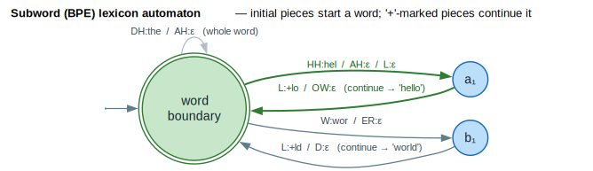

# Subword Lexicon Builder

Building WFST lexicons with **BPE** (Byte-Pair Encoding) / subword tokenization
for **ASR** (Automatic Speech Recognition). **WFST** = Weighted Finite-State
Transducer; **OOV** = Out-Of-Vocabulary.

## What is a Subword Lexicon?

A subword lexicon maps subword units (from BPE or SentencePiece) to phone
sequences, enabling ASR systems to handle open vocabulary without explicit word
boundaries. Where a traditional whole-word lexicon `L` cannot pronounce a word it
never saw (the OOV problem), a subword lexicon `L'` composes the unseen word from
**initial** pieces (which start a word) and `+`-marked **continuation** pieces.



*The double-ring **word-boundary** hub is the start and final state; bold green arcs build `hel · +lo → "hello"`; plain arcs build `wor · +ld → "world"`; the grey self-loop is the whole-word piece `the`. Each arc emits its subword id on the first phone and `ε` thereafter.*

<details><summary>Text view</summary>

```text
┌─────────────────────────────────────────────────────────────────────────────┐
│                        Subword Lexicon in ASR                                │
├─────────────────────────────────────────────────────────────────────────────┤
│                                                                             │
│   Traditional Lexicon (L):                                                  │
│   ┌────────────────────────────────────────────────────────────────────┐   │
│   │ "hello" → [HH, AH, L, OW]                                          │   │
│   │ "world" → [W, ER, L, D]                                             │   │
│   │ "unknown" → ???  (OOV problem!)                                     │   │
│   └────────────────────────────────────────────────────────────────────┘   │
│                                                                             │
│   Subword Lexicon (L'):                                                     │
│   ┌────────────────────────────────────────────────────────────────────┐   │
│   │ "hel"  (initial)  → [HH, AH, L]                                    │   │
│   │ "+lo"  (medial)   → [L, OW]                                         │   │
│   │ "wor"  (initial)  → [W, ER]                                         │   │
│   │ "+ld"  (final)    → [L, D]                                          │   │
│   │ "un"   (initial)  → [AH, N]                                         │   │
│   │ "+known" (final)  → [N, OW, N]   ← Can compose subwords!           │   │
│   └────────────────────────────────────────────────────────────────────┘   │
│                                                                             │
│   Benefits: Open vocabulary, smaller lexicon, better OOV handling           │
│                                                                             │
└─────────────────────────────────────────────────────────────────────────────┘
```

</details>

## Terminology

| Term | Definition |
|------|------------|
| **Subword** | Fragment of a word from BPE/SentencePiece tokenization |
| **BPE** | Byte Pair Encoding - iterative merge-based tokenization |
| **Marking** | Notation indicating subword position in word |
| **Phone** | Phoneme unit (e.g., "HH", "AH", "L") |

## Marking Styles

Subword boundaries must be marked for correct word reconstruction.

```
┌─────────────────────────────────────────────────────────────────────────────┐
│                          Marking Styles                                      │
├─────────────────────────────────────────────────────────────────────────────┤
│                                                                             │
│   Word "hello" = ["hel", "lo"]                                              │
│                                                                             │
│   LeftMarked:      "hel"  + "+lo"     (continuation from left)             │
│   RightMarked:     "hel+" + "lo"      (continuation to right)              │
│   BoundaryTag:     "<w>hel" + "lo"    (explicit word start)                │
│                                                                             │
│   Detection:                                                                │
│   ┌──────────────┬────────────┬────────────┬──────────────────────────┐    │
│   │    Style     │  Initial   │   Medial   │         Final            │    │
│   ├──────────────┼────────────┼────────────┼──────────────────────────┤    │
│   │  LeftMarked  │  no "+"    │   "+..."   │     "+..." (final)       │    │
│   │  RightMarked │  "...+"    │   "...+"   │     no "+"               │    │
│   │  BoundaryTag │  "<w>..."  │   "..."    │     "..."                │    │
│   └──────────────┴────────────┴────────────┴──────────────────────────┘    │
│                                                                             │
└─────────────────────────────────────────────────────────────────────────────┘
```

```rust
pub enum MarkingStyle {
    LeftMarked,   // "+word" means word continues from left
    RightMarked,  // "word+" means word continues to right
    BoundaryTag,  // "<w>word" marks word beginning
}
```

## SubwordPosition

Position of a subword within its containing word.

```rust
pub enum SubwordPosition {
    WholeWord,  // Complete word, no markers needed
    Initial,    // First subword of multi-part word
    Medial,     // Middle subword
    Final,      // Last subword
}
```

## Creating a Subword Lexicon

### Basic Usage

```rust
use lling_llang::asr::{SubwordLexiconBuilder, MarkingStyle, SubwordPosition};
use lling_llang::semiring::LogWeight;

// Create builder with left-marked style
let mut builder = SubwordLexiconBuilder::<LogWeight>::new(MarkingStyle::LeftMarked);

// Add complete word entry
builder.add_word("hello", &["HH", "AH", "L", "OW"], LogWeight::one());

// Add subword entries
let id_hel = builder.add_subword(
    "hel",
    &["HH", "AH", "L"],
    SubwordPosition::Initial,
    LogWeight::one()
);

let id_lo = builder.add_subword(
    "lo",
    &["L", "OW"],
    SubwordPosition::Final,
    LogWeight::one()
);

// Vocabulary size
println!("Subwords: {}", builder.vocab_size());
println!("Phones: {}", builder.phone_vocab_size());
```

### Registering Word Decompositions

```rust
// Link complete word ID to its subword decomposition
let word_id = 42;  // ID for "hello"
builder.register_decomposition(word_id, vec![id_hel, id_lo]);

// Later: reconstruct words from subword sequences
let words = builder.reconstruct_words(&[id_hel, id_lo]);
assert_eq!(words, vec!["hello"]);
```

## Building the Lexicon FST

```rust
// Build WFST lexicon
let lexicon_fst = builder.build_lexicon_fst();

// Or get as LexiconEntry list for CascadeBuilder
let entries = builder.to_lexicon_entries();
for entry in entries {
    println!("{} → {:?} (weight: {:?})",
             entry.word, entry.phones, entry.weight);
}
```

## Querying the Builder

```rust
// Get subword ID by marked form
let id = builder.get_subword_id("+lo");  // Left-marked style

// Get subword text by ID
let text = builder.get_subword_text(id_lo);  // Some("lo")

// Get phone name by ID
let phone_name = builder.get_phone_name(0);  // Some("HH")

// Check if token is word boundary
let is_boundary = builder.is_word_boundary("<w>hel");  // true (BoundaryTag)
let is_boundary = builder.is_word_boundary("+lo");     // false (continuation)
```

## Example: BPE Lexicon Construction

```rust
use lling_llang::asr::{SubwordLexiconBuilder, MarkingStyle, SubwordPosition};
use lling_llang::semiring::LogWeight;

fn build_bpe_lexicon(bpe_vocab: &[(String, Vec<String>)]) -> SubwordLexiconBuilder<LogWeight> {
    let mut builder = SubwordLexiconBuilder::new(MarkingStyle::LeftMarked);

    for (subword, phones) in bpe_vocab {
        // Determine position from markers
        let position = if subword.starts_with("##") {
            // BERT-style continuation marker
            SubwordPosition::Medial  // or Final, depending on context
        } else if subword.starts_with("▁") {
            // SentencePiece word-start marker
            SubwordPosition::Initial
        } else {
            SubwordPosition::WholeWord
        };

        // Convert phone strings to slices
        let phone_refs: Vec<&str> = phones.iter().map(|s| s.as_str()).collect();

        builder.add_subword(
            subword,
            &phone_refs,
            position,
            LogWeight::one()
        );
    }

    builder
}
```

## Complete Example: ASR Cascade

```rust
use lling_llang::asr::{SubwordLexiconBuilder, MarkingStyle, SubwordPosition, CascadeBuilder};
use lling_llang::semiring::LogWeight;

fn build_asr_cascade() {
    // Step 1: Build subword lexicon
    let mut lex_builder = SubwordLexiconBuilder::<LogWeight>::new(MarkingStyle::LeftMarked);

    // Add vocabulary
    lex_builder.add_subword("the", &["DH", "AH"], SubwordPosition::WholeWord, LogWeight::one());
    lex_builder.add_subword("hel", &["HH", "EH", "L"], SubwordPosition::Initial, LogWeight::one());
    lex_builder.add_subword("lo", &["L", "OW"], SubwordPosition::Final, LogWeight::one());
    lex_builder.add_subword("wor", &["W", "ER"], SubwordPosition::Initial, LogWeight::one());
    lex_builder.add_subword("ld", &["L", "D"], SubwordPosition::Final, LogWeight::one());

    // Step 2: Build lexicon FST
    let lexicon_entries = lex_builder.to_lexicon_entries();

    // Step 3: Load n-gram language model
    let lm_wfst = load_language_model("ngram.wfst");

    // Step 4: Build ASR cascade
    let cascade = CascadeBuilder::new()
        .with_lexicon_entries(lexicon_entries)
        .with_language_model(lm_wfst)
        .build();

    // Step 5: Decode
    let result = cascade.decode(&acoustic_posteriors);
    println!("Transcription: {}", result.text);
}
```

## Marking Style Comparison

| Style | Pros | Cons | Use When |
|-------|------|------|----------|
| **LeftMarked** | Simple, common | Requires lookahead for parsing | Default choice |
| **RightMarked** | Easy left-to-right parsing | Less common | Streaming needed |
| **BoundaryTag** | Explicit, unambiguous | Extra token | Needs clear boundaries |

## Word Reconstruction

Given a sequence of subword IDs, reconstruct the original words:

```rust
// Subword sequence: ["hel", "+lo", "wor", "+ld"]
// With LeftMarked style:

let subword_ids = vec![id_hel, id_lo, id_wor, id_ld];
let words = builder.reconstruct_words(&subword_ids);

// Result: ["hello", "world"]
// Reconstruction algorithm:
//   1. "hel" (no +) → start new word
//   2. "+lo" (has +) → append to current word → "hello"
//   3. "wor" (no +) → start new word
//   4. "+ld" (has +) → append to current word → "world"
```

## Integration with CTC Decoding

```rust
use lling_llang::ctc::CtcTopology;

// Subword-based CTC decoder
let num_subwords = builder.vocab_size();
let ctc_topology = CtcTopology::compact(num_subwords);

// Build decoding graph
// CTC output → Subword sequence → Word sequence
// (via lexicon FST composition)

let decoding_graph = compose(
    ctc_topology.to_fst(),
    builder.build_lexicon_fst()
);
```

## Phone Inventory

```rust
// Get all registered phones
let num_phones = builder.phone_vocab_size();
println!("Phone inventory size: {}", num_phones);

// Phones are automatically assigned IDs
// First phone gets ID 0, second gets ID 1, etc.
```

## Related Documentation

- [CTC Topologies](../advanced/ctc-topologies.md)
- [ASR Cascade](cascade-construction.md)
- [libgrammstein BPE](../../libgrammstein/docs/components/embedding/bpe.md)

## References

- [Mohri 2002](../BIBLIOGRAPHY.md#ref-mohri2002) — *Weighted Finite-State
  Transducers in Speech Recognition.* The lexicon transducer `L` whose subword
  variant is described here, and its place in the `H ∘ C ∘ L ∘ G` cascade.
- [Miao 2015](../BIBLIOGRAPHY.md#ref-miao2015) — *EESEN: End-to-End Speech
  Recognition using Deep RNN Models and WFST-based Decoding.* WFST decoding from
  subword/character units, the setting in which an open-vocabulary subword `L'`
  composes with a CTC topology.
