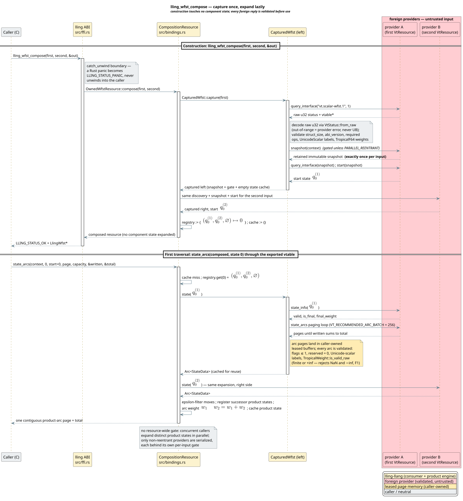

# Foreign-language bindings

**Navigation:** [documentation index](../README.md) ·
[C ABI reference](../api/c-abi-reference.md) ·
[resource architecture](../architecture/resource-abi.md) ·
[ABI trust model](../security/abi-trust-model.md)

lling-llang exposes one stable project ABI and five standalone facade guides.
JavaScript, TypeScript, and ClojureScript deliberately share one package and
one singleton runtime, so their guide documents both the common ownership laws
and each language's syntax. Julia and Raku additionally expose the producer
side of `vt.scalar-wfst.1`, allowing customer automata to participate directly
in snapshot-consistent lazy composition. They also implement both sides of
`vt.semiring.*1`: arbitrary Julia or Raku values cross Rust as owned,
generation-checked tokens with explicit optional algebra capabilities. The
project-neutral contract and its Rust consumer are documented in
[Dynamic semirings](../architecture/dynamic-semirings.md); language-side
provider facades use the same capability split rather than pretending a
foreign-owned weight satisfies Rust's `Copy` bound.

| Guide | Languages | Package/boundary | Executable evidence |
|---|---|---|---|
| [C](../../bindings/c/README.md) | C17/C23 | CMake/pkg-config; direct `lling_*` | [`compose_demo.c`](../../bindings/c/examples/compose_demo.c) |
| [C++](../../bindings/cpp/README.md) | C++20+ | Header-only RAII over C | [`package_smoke.cpp`](../../bindings/cpp/tests/package_smoke.cpp) |
| [JavaScript family](../../bindings/javascript/README.md) | JavaScript, TypeScript, ClojureScript | npm; N-API/WebAssembly/WASI singleton runtime | [`facades.test.mjs`](../../bindings/javascript/test/facades.test.mjs) |
| [Julia](../../bindings/julia/LlingLlang/README.md) | Julia 1.10+ | `LlingLlang`; `ccall` plus a host-provider vtable | [`runtests.jl`](../../bindings/julia/LlingLlang/test/runtests.jl) |
| [Raku](../../bindings/raku/README.md) | Raku 6.d | `Lling-Llang`; NativeCall plus an atomic C17 provider shim | [`01-conformance.rakutest`](../../bindings/raku/t/01-conformance.rakutest) |

The shared semantic core is capture-once composition: a constructor validates
and retains an immutable input snapshot, then lazy traversal publishes product
states as demanded. The diagram shows the complete import/compose boundary:



## Documentation governance

[`bindings/api.json`](../../bindings/api.json) is the machine-readable inventory.
The documentation gate rejects a missing guide or example, broken local link,
untagged code fence, placeholder, or absent operational topic:

```sh
python3 scripts/check-binding-docs.py
```

Every facade guide must cover installation/loading, executable evidence, API
and data domains, ownership/snapshots, errors, concurrency, performance,
security, compatibility, and the maintainer workflow. The package guide and
checked example ship together.
