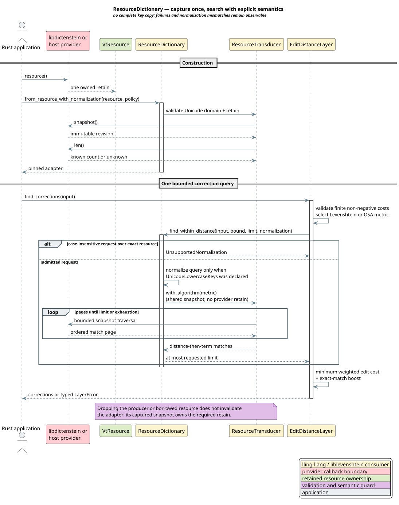

# Snapshot-Pinned Dictionary Providers

This guide explains how to use a libdictenstein dictionary or another
`vt.dictionary.v1` provider as the lexical search index behind
lling-llang's `EditDistanceLayer`. The integration is available with the
`levenshtein` Cargo feature.

The adapter is intended for applications that already own a large dictionary
and need correction candidates without copying every key into a second
`HashSet<String>`. It preserves the provider's immutable query-start
snapshot, streams only bounded result pages, and reports provider failures to
the layer pipeline.

## Terms

| Term | Meaning |
|---|---|
| **dictionary resource** | A retained two-word `VtResource` exposing the versioned `vt.dictionary.v1` interface. |
| **snapshot** | An immutable dictionary revision captured before any query traversal. |
| **optimal string alignment (OSA)** | Levenshtein insertion, deletion, and substitution plus an adjacent transposition, with the restriction that one substring is not edited twice. |
| **candidate distance** | The unit-cost edit distance used to admit and order dictionary matches. |
| **weighted correction cost** | The minimum configured insertion, deletion, substitution, and optional transposition cost assigned after admission. |
| **normalization contract** | The caller's explicit statement about whether stored resource keys are exact or already Unicode-lowercased. |

## End-to-end architecture



[PlantUML source](../diagrams/architecture/dictionary-resource-adapter.puml)

Construction validates the ABI and Unicode-scalar domain, captures one
immutable revision, and records its term count when the provider exposes that
count cheaply. Querying selects a liblevenshtein algorithm without acquiring a
new provider retain. A mutable producer may continue publishing later
revisions, but an existing adapter deliberately remains pinned.

## Rust usage

The complete executable is
[`examples/resource_dictionary_layer.rs`](../../examples/resource_dictionary_layer.rs).
Run it from the repository root:

```sh
cargo run --example resource_dictionary_layer --features levenshtein
```

The essential construction is:

```rust
use std::sync::Arc;

use libdictenstein::bindings::{BindingUnitDomain, DynamicDawgBinding};
use lling_llang::layers::{
    EditDistanceLayer, ResourceDictionary, ResourceDictionaryNormalization,
};
use lling_llang::semiring::TropicalWeight;

let producer = DynamicDawgBinding::new(BindingUnitDomain::UnicodeScalar);
producer.insert_text(b"the", None)?;
let resource = producer.resource();

// SAFETY: the owned resource keeps its ABI callbacks and vtables valid.
let dictionary = unsafe {
    ResourceDictionary::from_resource_with_normalization(
        resource.as_raw(),
        ResourceDictionaryNormalization::UnicodeLowercaseKeys,
    )
}?;

let layer = EditDistanceLayer::<TropicalWeight>::with_dictionary(
    Arc::new(dictionary),
)
.with_max_distance(1)
.with_max_corrections(3);

let corrections = layer.find_corrections("TEH")?;
```

The adapter retains its own immutable snapshot. The application may drop both
`resource` and `producer` after successful construction; subsequent
queries remain valid until the adapter itself is dropped.

## Query contract

`DictionarySearchOptions` makes the work and semantics explicit:

| Field | Contract |
|---|---|
| `max_distance` | Largest accepted unit-cost distance. |
| `max_results` | Hard upper bound on materialized matches; zero performs no provider call. |
| `metric` | `Levenshtein` or restricted adjacent-transposition `OptimalStringAlignment`. |
| `case_insensitive` | Requests Unicode-lowercase matching; admission depends on the resource normalization declaration. |

Matches are ordered first by increasing candidate distance and then
lexicographically by term. The in-memory provider retains only the best
requested matches in an $`\mathcal{O}(k)`$ heap. The resource provider asks
liblevenshtein for distance-then-term ordering and stops pulling pages when the
limit is reached.

The dictionary's `len` operation returns
`Result<Option<usize>, DictionaryError>`. `None` is an explicit
"cheap count unavailable" result, not zero. This preserves the ABI's optional
length contract without forcing an unbounded graph traversal.

## Metric and cost semantics

Candidate admission remains an integer edit-distance question. After a term is
admitted, `EditDistanceLayer` computes the minimum weighted edit cost:

- insertion and deletion cost `cost_per_edit`;
- substitution costs `cost_per_edit * substitution_multiplier`; and
- an admitted adjacent transposition costs
  `cost_per_edit * transposition_multiplier`.

The dynamic program always chooses the least-cost script. For example, a
substitution multiplier above two makes one deletion plus one insertion
cheaper than a substitution. All three non-negative cost parameters must be
finite. `exact_match_boost` must also be finite. Invalid configurations
return `LayerError::ConfigError` before provider traversal.

The `enable_transpositions` setting controls both candidate generation
and weighted cost. Disabled searches use ordinary Levenshtein distance;
enabled searches use OSA. The compatibility function
`damerau_levenshtein_distance` remains available, but its implementation
is precisely the restricted OSA recurrence rather than unrestricted
Damerau-Levenshtein distance.

## Normalization

Normalization is never guessed:

- `ResourceDictionaryNormalization::Exact` performs exact scalar
  matching. A case-insensitive search request returns
  `DictionaryError::UnsupportedNormalization`.
- `UnicodeLowercaseKeys` declares that every stored key was normalized
  with Rust's Unicode lowercase conversion. The adapter applies the same
  conversion to each query before traversal.

The second mode is a caller assertion because version 1 of the dictionary ABI
does not carry a normalization-profile identifier. Declaring lowercase keys
for a mixed-case resource is a semantic provider error. Applications that
need another normalization regime should publish a separately normalized
dictionary revision with a stable profile at their own boundary.

## Failures and pipeline behavior

`Dictionary` operations are fallible. ABI status failures, malformed
presence bytes, unit-domain mismatches, and invalid result domains become
`DictionaryError`. The correction layer translates these into
`LayerError::ResourceError`; it never treats a provider failure as an
empty dictionary or empty match set.

`CorrectionLayer::check_applicability` is the error-aware preflight used
by `LayerPipeline`. Existing purely local layers inherit a default
implementation based on `can_apply`. Resource-backed layers override the
fallible method, so an error while determining emptiness stops the pipeline
with diagnostics.

## Concurrency, ownership, and security

The provider's resource flags govern callback admission. A provider declaring
parallel reentrancy may receive concurrent calls. Other providers are
serialized by their per-resource callback gate; there is no process-wide
lock. No lling-llang internal lock is held while foreign code executes.

Every callback result is untrusted input. The liblevenshtein consumer validates
ABI versions, required callbacks, unit domains, statuses, presence bytes,
Unicode scalar labels, page counts, node identifiers, and match term domains
before exposing results. Panics must not unwind through a C ABI provider.
Managed-language provider facades are responsible for translating exceptions
to status values and rooting callback objects until the final release.

## Performance properties

The adapter avoids a complete dictionary-key copy. A cold provider may expose
an immutable compact graph that liblevenshtein validates and imports once;
otherwise traversal uses bounded edge pages and a revision-local cache.
Returned match strings are necessarily owned by the correction layer because
they outlive the page callback.

Algorithm rebinding is an immutable Rust clone sharing the provider owner,
captured graph, and node cache. It makes no provider callback and acquires no
new external retain. The result limit is pushed into both native and resource
providers, preventing the layer from first constructing an unbounded match
vector and truncating it afterward.

## Verification

Run the focused semantic and lifecycle suite:

```sh
RUST_BACKTRACE=1 cargo test --lib \
  layers::filtering::edit_distance::tests \
  --features levenshtein
cargo run --example resource_dictionary_layer --features levenshtein
```

The tests cover deterministic top-k selection, Levenshtein/OSA separation,
weighted substitution and transposition costs, Unicode scalar word length,
invalid numeric configuration, provider-error propagation, snapshot isolation,
post-producer-drop lifetime, result bounds, and explicit normalization
admission.
