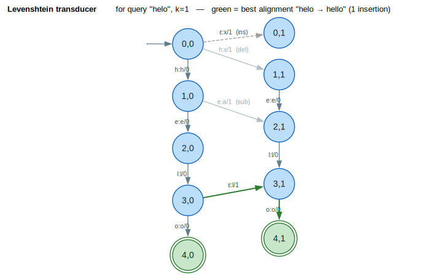

# Error-model transducers

> **Thesis.** The `error_models` module compiles the *ways text goes wrong* —
> spelling slips, keyboard and OCR confusions, homophones, and surface noise —
> into weighted finite-state transducers (WFSTs) so that correction becomes a
> single weighted composition $`\text{query} \circ \text{error-model} \circ \text{dictionary}`$ whose best path
> is the most probable intended string.

This document covers the module `src/error_models/`
([`mod.rs`](../../src/error_models/mod.rs)): edit-distance transducers
([`edit_distance.rs`](../../src/error_models/edit_distance.rs)), confusion
matrices ([`confusion.rs`](../../src/error_models/confusion.rs)), homophones
([`homophone.rs`](../../src/error_models/homophone.rs)), and normalization
([`normalize.rs`](../../src/error_models/normalize.rs)).

---

## Terms & symbols

All mathematics is Unicode in backticks (see [`STYLE.md`](../STYLE.md)); symbols
link to [`NOTATION.md`](../NOTATION.md).

| Symbol / term | Meaning |
|---|---|
| **WFST** | Weighted Finite-State Transducer: each arc has an input label, an output label, and a weight (see [wfst-traits](../architecture/wfst-traits.md)). |
| $`x`$ | An *observed* (potentially erroneous) string — what was typed/scanned/heard. |
| $`y`$ | An *intended* (candidate correct) string — what the writer meant. |
| $`d(i,j)`$ | Edit distance between the length-$`i`$ prefix of $`x`$ and the length-$`j`$ prefix of $`y`$. |
| $`k`$ | The maximum edit distance the transducer admits (`EditDistanceConfig::max_distance`). |
| $`C[i][j]`$ | Confusion-matrix cost $`C[i][j] = -\log P(\text{observe } j \mid \text{true } i)`$ (lower = more likely confusion). |
| $`P(j \mid i)`$ | Conditional probability of observing symbol $`j`$ given the intended symbol $`i`$. |
| $`\Sigma`$ | The character alphabet over which a transducer is built (`EditDistanceConfig::alphabet`). |
| $`\oplus`$ / $`\otimes`$ | Semiring *plus* (combine alternatives) / *times* (combine sequential costs). For Tropical: $`\oplus = \min`$, $`\otimes = +`$. |
| $`\bar{0}`$ / $`\bar{1}`$ | The $`\oplus`$-identity ("no path", Tropical $`\infty`$) and $`\otimes`$-identity ("empty path", Tropical $`0`$). |
| **Semiotic class** | The category of a token for normalization (handled in [text-normalization](text-normalization.md)); here we use only the character-level error models. |

The default weight throughout this module is `TropicalWeight` — costs in
$`\mathbb{R} \cup \{\infty\}`$ combined by $`(\min, +)`$ — because a correction cost is a
shortest-path problem: the cheapest sequence of edits wins.

---

## Formal model

### Edit-distance transducer

For a maximum distance $`k`$, the edit-distance transducer $`T_k`$
accepts exactly the $`(x, y)`$ pairs within distance $`k`$:

```math
\mathcal{L}(T_k) = \{\, (x, y) \mid d(x, y) \le k \,\}
```

where $`d`$ is the **Levenshtein** distance (insertions, deletions,
substitutions) or, with transpositions enabled, the **Damerau–Levenshtein**
distance. $`d(i,j)`$ obeys the classic dynamic-programming recurrence
([Levenshtein 1966](#ref-levenshtein1966); [Wagner & Fischer 1974](#ref-wagner1974)):

```math
\begin{aligned}
d(0,0) &= 0 \\
d(i,0) &= i \cdot c_{\text{del}} && \text{(delete } x_1 \dots x_i\text{)} \\
d(0,j) &= j \cdot c_{\text{ins}} && \text{(insert } y_1 \dots y_j\text{)} \\
d(i,j) &= \min \begin{cases}
  d(i{-}1,\, j{-}1) + (x_i = y_j\ ?\ 0 : c_{\text{sub}}) & \text{substitute / match} \\
  d(i{-}1,\, j) + c_{\text{del}} & \text{delete } x_i \\
  d(i,\, j{-}1) + c_{\text{ins}} & \text{insert } y_j
\end{cases} \\
&\quad (\text{Damerau: also } d(i{-}2,\, j{-}2) + c_{\text{tr}} \text{ when } x_i = y_{j-1} \wedge x_{i-1} = y_j)
\end{aligned}
```

The per-operation costs $`c_{\text{ins}}, c_{\text{del}}, c_{\text{sub}}, c_{\text{tr}}`$ are the fields of
[`EditCosts`](../../src/error_models/edit_distance.rs); the recurrence above is
exactly what each arc of $`T_k`$ realizes incrementally — a *match* arc adds
$`0`$, an *error* arc adds the relevant $`c`$ and advances the error
counter.

The transducer encodes the DP table's frontier as a state. Two encodings ship:

| Builder | State = | State count |
|---|---|---|
| [`build`](../../src/error_models/edit_distance.rs) (alphabet-general) | error count $`e \in \{0, \dots, k\}`$ | $`k + 1`$ |
| [`build_for_query`](../../src/error_models/edit_distance.rs) (query-specific) | $`(\text{pos}, e)`$ with $`\text{pos} \in \{0, \dots, n\}`$, $`e \in \{0, \dots, k\}`$ | $`(n+1)(k+1)`$ |

For the query-specific form the state ID is the linearization
$`\text{state}(\text{pos}, e) = \text{pos} \cdot (k+1) + e`$ (see
[`encode_state`](../../src/error_models/edit_distance.rs)), giving an
$`O(n \cdot (2k+1))`$ state space as documented in the module header.

### Confusion matrix

A **confusion matrix** $`C`$ stores, for each ordered pair of characters,
the negative-log conditional probability of confusing them:

```math
C[i][j] = -\log P(\text{observe } j \mid \text{true } i)
```

so a *more likely* confusion has a *lower* cost. $`C`$ is sparse — only
observed confusions are stored — with three companion maps for deletions
$`-\log P(\text{delete } i)`$, insertions $`-\log P(\text{spurious } j)`$, and
transpositions (see [`ConfusionMatrix`](../../src/error_models/confusion.rs)).
The induced transducer maps intended $`\to`$ observed with weight
$`C[i][j]`$ on each arc; composing it with an observed string scores every
intended candidate by $`\sum`$ of its arc costs, i.e. by
$`-\log \prod_t P(\text{observe } x_t \mid \text{true } y_t)`$.

### Homophones

Two words are **homophones** when a phonetic encoder $`\varphi`$ maps them to the
same code: $`\varphi(w_1) = \varphi(w_2)`$. The homophone transducer groups a vocabulary
by $`\varphi`$ and maps each word to its sound-alikes with a tunable cost; this is
the spoken-language analogue of the confusion matrix, but keyed on pronunciation
rather than glyph shape.

---

## Intuition — a worked spelling correction

Take the misspelling $`x = \text{"helo"}`$ and ask for corrections within
$`k = 1`$ over the alphabet of `"hello"`. The query-specific builder
lays out a $`(n+1)(k+1) = 5 \times 2 = 10`$-state grid indexed by
$`(\text{pos}, \text{error})`$. The cheapest accepting path inserts a single $`l`$
between `"hel"` and `"o"`:

```text
(0,0) --h:h/0--> (1,0) --e:e/0--> (2,0) --l:l/0--> (3,0)
                                                    │ ε:l / 1.0   (insertion — spend the one edit)
                                                    ▼
                                                  (3,1) --o:o/0--> (4,1)   ✔ final, total cost 1.0
```

The best path has weight $`1.0`$ (one insertion) and emits the output
`"hello"`. Any candidate reachable with $`\le 1`$ edit is enumerated;
composing this transducer against a dictionary acceptor keeps only candidates
that are real words. This is the diagram in
[§ Diagrams](#diagrams) below.

---

## Architecture & API

```text
error_models
├── edit_distance ── EditDistanceTransducer · EditCosts · EditDistanceConfig
│                    DamerauLevenshteinTransducer · LazyEditDistanceTransducer
├── confusion ────── ConfusionMatrix · ConfusionTransducer · ConfusionConfig
│                    qwerty/dvorak/ocr/combined_confusion_matrix · train_confusion_matrix
├── homophone ────── HomophoneTransducer · PhoneticEncoder · PhoneticAlgorithm
│                    PhoneticCode · HomophoneConfig · english_homophone_transducer
└── normalize ────── NormalizationTransducer · NormalizationConfig · CharacterMapping
                     ascii/unicode/search_normalizer
```

| Type | Responsibility |
|---|---|
| [`EditDistanceTransducer`](../../src/error_models/edit_distance.rs) | Builds a `VectorWfst<char, TropicalWeight>` accepting $`(x,y)`$ within $`k`$ edits. `build` is alphabet-general; `build_for_query` is query-specialized. |
| [`EditCosts`](../../src/error_models/edit_distance.rs) | Per-operation costs (`insert`, `delete`, `substitute`, `transpose`); `uniform`, `prefer_transpose` presets. |
| [`EditDistanceConfig`](../../src/error_models/edit_distance.rs) | `max_distance`, `costs`, `include_transpositions` (Damerau), `alphabet`; `levenshtein`/`damerau_levenshtein` constructors. |
| [`LazyEditDistanceTransducer`](../../src/error_models/edit_distance.rs) | On-demand $`(\text{pos}, \text{error})`$ expansion via `encode_state`/`decode_state`, for composition where only reachable states matter. |
| [`ConfusionMatrix`](../../src/error_models/confusion.rs) | Sparse $`C[i][j]`$ plus deletion/insertion/transposition maps; `merge` keeps the lower (more likely) cost. |
| [`ConfusionTransducer<W>`](../../src/error_models/confusion.rs) | Compiles a matrix into a single-state WFST (`build`) or an indel-aware WFST over `Option<char>` (`build_with_indels`). |
| [`PhoneticEncoder`](../../src/error_models/homophone.rs) | Computes a `PhoneticCode` under one of seven `PhoneticAlgorithm`s (Soundex, Metaphone, Double Metaphone, NYSIIS, Caverphone, Cologne, Refined Soundex). |
| [`HomophoneTransducer<W>`](../../src/error_models/homophone.rs) | Indexes a vocabulary by phonetic code; `homophones(word)` returns ranked sound-alikes; `build` emits a word-level WFST. |
| [`NormalizationTransducer<W>`](../../src/error_models/normalize.rs) | Surface cleanup (case-fold, smart-quotes, dashes, zero-width removal, diacritics, whitespace) as a WFST and/or a string pass. |

The transducers are built on the [`MutableWfst`](../../src/wfst/traits.rs) API —
`add_state`, `set_start`, `set_final`, and `add_arc(from, in, out, to, weight)` —
so they compose with every algorithm in the library (composition, shortest
distance, n-best).

---

## Algorithms — building the query-specific Levenshtein transducer

The query-specific builder is the workhorse for fuzzy lookup. Its intent: given
a fixed query $`x = x_1 \dots x_n`$ and budget $`k`$, materialize only the states
the query can reach, indexed by $`(\text{pos}, \text{error})`$, with one arc per edit
operation. The loop invariant is *every arc out of $`(\text{pos}, e)`$ advances
$`\text{pos}`$ and/or $`e`$ monotonically*, so the graph is a DAG and the
shortest path is well-defined.

```text
⟨ build query-specific T_k ⟩ ≡
  n ← len(x);  allocate (n+1)(k+1) states;  state(pos,e) ≡ pos·(k+1)+e
  set_start( state(0,0) )
  for e in 0..=k:  set_final( state(n,e), 1̄ )          ▷ all input consumed
  for pos in 0..=n:
    for e in 0..=k:
      from ← state(pos,e)
      if pos < n:                                       ▷ ⟨ match / substitute / delete ⟩
        c ← xₚₒₛ
        add_arc(from, c, c,  state(pos+1, e),   1̄)              ▷ match, cost 0
        if e < k:
          add_arc(from, c, ε, state(pos+1, e+1), c_del)         ▷ deletion
          for d in Σ, d ≠ c:
            add_arc(from, c, d, state(pos+1, e+1), c_sub)       ▷ substitution
      if e < k:                                         ▷ ⟨ insertion ⟩
        for d in Σ:
          add_arc(from, ε, d, state(pos, e+1), c_ins)           ▷ insertion
```

Here $`\varepsilon`$ is the empty label (Rust `None`), $`\bar{1}`$ is
`TropicalWeight::one()` (cost $`0`$), and $`c_{\text{del}}, c_{\text{sub}}, c_{\text{ins}}`$
come from [`EditCosts`](../../src/error_models/edit_distance.rs). Each cell
emits $`O(\lvert \Sigma\rvert)`$ arcs, so construction is
$`O(n \cdot k \cdot \lvert \Sigma\rvert)`$ time and $`O(n \cdot k)`$ states — matching the
$`O(n \cdot (2k+1))`$ bound in the module header. Because every arc strictly
advances $`\text{pos}`$ or $`e`$, a single topological shortest-distance pass
(see [shortest-distance](../algorithms/shortest-distance.md)) recovers the best
alignment.

**Trace** ($`x = \text{"helo"}`$, $`k = 1`$, target `"hello"`): the path
$`(0,0) \to (1,0) \to (2,0) \to (3,0)`$ matches $`h, e, l`$ at cost $`0`$; the
insertion arc $`(3,0) \xrightarrow{\varepsilon:l\,/\,1.0} (3,1)`$ spends the one edit; then
$`(3,1) \xrightarrow{o:o/0} (4,1)`$ matches the final $`o`$. Total $`1.0`$,
output `"hello"`. ∎

---

## Examples

All snippets use the real API and are lifted from the modules' compiler-checked
`#[cfg(test)]` suites.

### Edit-distance transducer

```rust,ignore
use lling_llang::error_models::{EditDistanceConfig, EditDistanceTransducer};
use lling_llang::wfst::Wfst;

// Levenshtein, k = 2, restricted to the alphabet of the target word.
let transducer = EditDistanceTransducer::levenshtein(2).with_alphabet("hello");

// Query-specific build for "helo": (4+1)·(2+1) = 15 states.
let fst = transducer.build_for_query("helo");
assert_eq!(fst.num_states(), 15);
```

Damerau–Levenshtein with a cheaper transposition than a separate delete+insert:

```rust,ignore
use lling_llang::error_models::{EditCosts, EditDistanceConfig, EditDistanceTransducer};

let config = EditDistanceConfig::damerau_levenshtein(1)
    .with_alphabet("abcdefghijklmnopqrstuvwxyz")
    .with_costs(EditCosts::prefer_transpose()); // transpose = 0.5
let _fst = EditDistanceTransducer::new(config).build();
```

### Confusion matrices (QWERTY & OCR)

```rust,ignore
use lling_llang::error_models::{
    combined_confusion_matrix, qwerty_confusion_matrix, ConfusionTransducer,
};
use lling_llang::semiring::TropicalWeight;

// Adjacent QWERTY keys carry low substitution costs (q↔w, a↔s, …).
let qwerty = qwerty_confusion_matrix();
assert!(qwerty.substitution_cost('q', 'w').is_some());

// Keyboard ∪ OCR confusions, compiled to a single-state WFST.
let matrix = combined_confusion_matrix();
let transducer = ConfusionTransducer::<TropicalWeight>::from_matrix(matrix);
let _fst = transducer.build();
```

Training a matrix from aligned `(correct, observed)` pairs (add-$`\alpha`$
smoothing) converts counts to $`C[i][j] = -\log P(\text{observe } j \mid \text{true } i)`$:

```rust,ignore
use lling_llang::error_models::train_confusion_matrix;

let pairs = vec![
    ("hello".to_string(), "hallo".to_string()),
    ("world".to_string(), "warld".to_string()),
];
let matrix = train_confusion_matrix(&pairs, 0.1); // smoothing = 0.1
assert!(matrix.substitution_cost('e', 'a').is_some());
```

### Homophones

```rust,ignore
use lling_llang::error_models::{HomophoneTransducer, PhoneticAlgorithm};
use lling_llang::semiring::TropicalWeight;

let transducer = HomophoneTransducer::<TropicalWeight>::new(PhoneticAlgorithm::Metaphone)
    .with_vocabulary(&["their", "there", "they're", "hear", "here"]);

let homophones = transducer.homophones("there");
let words: Vec<&str> = homophones.iter().map(|(w, _)| w.as_str()).collect();
assert!(words.contains(&"their"));
```

### Normalization

```rust,ignore
use lling_llang::error_models::NormalizationTransducer;
use lling_llang::semiring::TropicalWeight;

let normalizer = NormalizationTransducer::<TropicalWeight>::new()
    .with_case_fold_lower(true)
    .with_smart_quotes(true)
    .with_normalize_dashes(true)
    .with_collapse_whitespace(true);

assert_eq!(normalizer.normalize_string("  “Hello”  WORLD  "), "\"hello\" world");
```

---

## Diagrams

### The edit-distance / alignment transducer



*Blue = states $`(\text{position}, \text{error})`$; double green ring = final (all input
consumed); bold green = the best alignment `"helo" → "hello"` (one
insertion); grey/dashed = alternative delete/substitute/insert arcs; arc labels
read `in:out/weight` with $`\varepsilon`$ the empty label.*

<details><summary>Text view</summary>

```text
 e=0:  (0,0) --h:h/0--> (1,0) --e:e/0--> (2,0) --l:l/0--> (3,0) --o:o/0--> (4,0)✔
          |                 |                              |
          | ε:x/1 (ins)     | e:a/1 (sub)        BEST ▶   | ε:l/1 (ins)
          ▼                 ▼                              ▼
 e=1:  (0,1)             (2,1) --l:l/0--> (3,1) --o:o/0--> (4,1)✔
        ▲ h:ε/1 (del) from (0,0)
 final = states (pos = 4, any error);  ✔ = accepting;  total best cost = 1.0
```

</details>

### QWERTY confusion submatrix (heat-table)

A fragment of [`qwerty_confusion_matrix`](../../src/error_models/confusion.rs):
horizontally/vertically adjacent keys cost `0.5`, diagonally adjacent keys
cost `0.5 + 0.2 = 0.7` (the `base_cost` and `diagonal_penalty`), and
non-adjacent keys are absent (no arc, i.e. cost $`\bar{0} = \infty`$). Lower cost =
more likely confusion = warmer cell.

| $`C[i][j]`$ (cost) | → `q` | → `w` | → `e` | → `a` | → `s` | → `d` |
|---|---|---|---|---|---|---|
| **from `q`** | — | `0.5` | $`\infty`$ | `0.7` | `0.7` | $`\infty`$ |
| **from `w`** | `0.5` | — | `0.5` | `0.7` | `0.7` | `0.7` |
| **from `e`** | $`\infty`$ | `0.5` | — | $`\infty`$ | `0.7` | `0.7` |
| **from `a`** | `0.7` | `0.7` | $`\infty`$ | — | `0.5` | $`\infty`$ |
| **from `s`** | `0.7` | `0.7` | `0.7` | `0.5` | — | `0.5` |
| **from `d`** | $`\infty`$ | `0.7` | `0.7` | $`\infty`$ | `0.5` | — |

Reading the table: $`q \to w`$ is a same-row neighbor (`0.5`); $`q \to a`$
and $`q \to s`$ are diagonal neighbors (`0.7`); $`q \to e`$ and
$`q \to d`$ are not adjacent on QWERTY, so the model assigns them no
substitution arc (cost $`\infty`$). The matrix is symmetric because
[`add_symmetric_substitution`](../../src/error_models/confusion.rs) inserts both
directions with equal cost.

---

## Relation to the library

- **Composition is the correction operator.** Each error model is a
  `VectorWfst` consumed by `compose` (see
  [composition](../algorithms/composition.md)): $`\text{query} \circ \text{error} \circ \text{lexicon}`$
  yields a lattice of weighted candidates, and `viterbi`/`nbest` (see
  [path-extraction](../algorithms/path-extraction.md)) reads off the best ones.
- **Weights.** The models default to `TropicalWeight` so that
  shortest-path = most-likely correction; because all costs are
  $`-\log P`$, summing arc costs along a path multiplies probabilities. Any
  [`Semiring`](../architecture/semirings.md) implementing
  `From<TropicalWeight>` works in `ConfusionTransducer::build` and
  `HomophoneTransducer::build`.
- **liblevenshtein bridge.** With the `levenshtein` feature, the
  query-specific automaton aligns with the trie automata in
  [`integration`](../../src/integration/liblevenshtein_bridge.rs) for
  dictionary-backed fuzzy lookup; the lazy variant exists precisely so
  composition expands only reachable $`(\text{pos}, \text{error})`$ states.
- **Pipeline placement.** Normalization runs *first* (surface cleanup), then
  edit-distance / confusion / homophone candidates feed the
  [layer stack](../architecture/layers.md). Token-level normalization of
  numbers, money, dates, etc. is the separate
  [text-normalization](text-normalization.md) module.

---

## References

- <a id="ref-levenshtein1966"></a>**[Levenshtein 1966]** Levenshtein, V. I.
  (1966). *Binary codes capable of correcting deletions, insertions, and
  reversals.* Soviet Physics Doklady 10(8):707–710.
  [bibcode:1966SPhD...10..707L](https://ui.adsabs.harvard.edu/abs/1966SPhD...10..707L)
- <a id="ref-wagner1974"></a>**[Wagner & Fischer 1974]** Wagner, R. A., &
  Fischer, M. J. (1974). *The String-to-String Correction Problem.* Journal of
  the ACM 21(1):168–173.
  [doi:10.1145/321796.321811](https://doi.org/10.1145/321796.321811)
- <a id="ref-damerau1964"></a>**[Damerau 1964]** Damerau, F. J. (1964). *A
  technique for computer detection and correction of spelling errors.*
  Communications of the ACM 7(3):171–176.
  [doi:10.1145/363958.363994](https://doi.org/10.1145/363958.363994)
- <a id="ref-kernighan1990"></a>**[Kernighan 1990]** Kernighan, M. D., Church,
  K. W., & Gale, W. A. (1990). *A Spelling Correction Program Based on a Noisy
  Channel Model.* COLING 1990, Vol. 2:205–210.
  [doi:10.3115/997939.997975](https://doi.org/10.3115/997939.997975)
- <a id="ref-mohri2009"></a>**[Mohri 2009]** Mohri, M. (2009). *Weighted
  Automata Algorithms.* In *Handbook of Weighted Automata*, pp. 213–254.
  Springer.
  [doi:10.1007/978-3-642-01492-5_6](https://doi.org/10.1007/978-3-642-01492-5_6)
  — see [`BIBLIOGRAPHY.md`](../BIBLIOGRAPHY.md#ref-mohri2009).
- <a id="ref-philips2000"></a>**[Philips 2000]** Philips, L. (2000). *The Double
  Metaphone Search Algorithm.* C/C++ Users Journal 18(6):38–43.
  [article](https://www.drdobbs.com/the-double-metaphone-search-algorithm/184401251)
