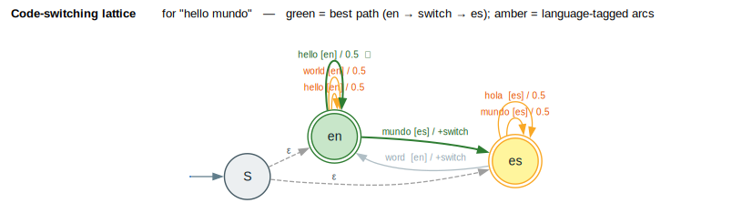
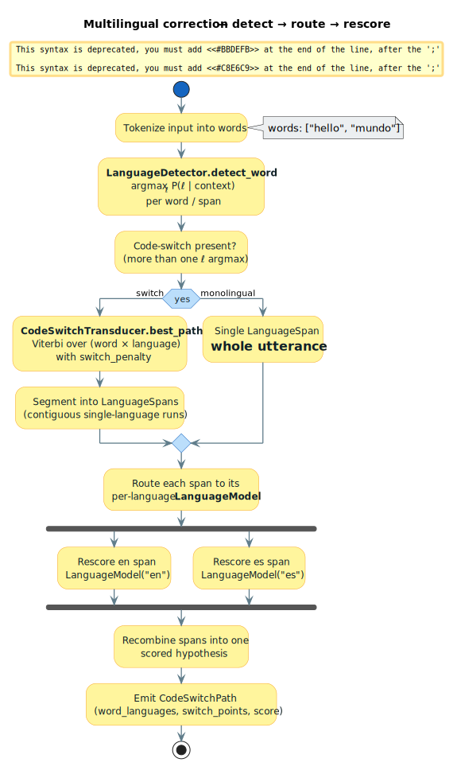

# Multilingual & code-switching transducers

> **Thesis.** The `multilingual` module decides *which language each word is in*
> and scores hypotheses accordingly: a per-word language detector picks
> `` `argmaxₗ P(ℓ ∣ context)` ``, a `CodeSwitchTransducer` resolves the cheapest
> sequence of language assignments under a switch penalty, and per-language
> `LanguageModel`s rescore each contiguous span.

This document covers the module `src/multilingual/`
([`mod.rs`](../../src/multilingual/mod.rs)): the code-switching transducer
([`code_switch.rs`](../../src/multilingual/code_switch.rs)) and the language
types ([`language.rs`](../../src/multilingual/language.rs)).

---

## Terms & symbols

Symbols link to [`NOTATION.md`](../NOTATION.md); see [`STYLE.md`](../STYLE.md)
for the backtick/Unicode conventions.

| Symbol / term | Meaning |
|---|---|
| **Code-switching** | Alternation between two or more languages within one utterance ("hello mundo"). |
| `` `ℓ` `` | A language, identified by a [`LanguageId`](../../src/multilingual/language.rs) code (e.g. `"en"`, `"es"`). |
| `` `context` `` | The surrounding words used to condition language identity (here: the word itself plus the previous language). |
| `` `argmaxₗ P(ℓ ∣ context)` `` | The most probable language for a span given its context — what `LanguageDetector` returns. |
| `` `P(ℓ)` `` | Language **prior** — the expected frequency of `` `ℓ` `` (`LanguageConfig::prior`). |
| `` `P(w ∣ ℓ)` `` | Word probability under language `` `ℓ` ``'s model (stored as a log-probability). |
| `` `s` `` | The **switch penalty** added (in log space) whenever consecutive words change language (`CodeSwitchConfig::switch_penalty`). |
| `` `b` `` | The **same-language bonus** added when consecutive words keep the language (`same_language_bonus`). |
| **Span** | A maximal contiguous run of same-language words ([`LanguageSpan`](../../src/multilingual/code_switch.rs)). |
| **Switch point** | A position where the language changes ([`SwitchPoint`](../../src/multilingual/code_switch.rs)). |
| **WFST** | Weighted Finite-State Transducer (see [wfst-traits](../architecture/wfst-traits.md)). |

Scores in this module are **log-probabilities** where *higher is better*
(unlike the cost convention of [error-models](error-models.md)); the
`CodeSwitchTransducer::build_wfst` adapter negates them when emitting a
`` `TropicalWeight` `` lattice, since Tropical minimizes.

---

## Formal model

### Per-span language detection

For a word (or span) with context, the [`LanguageDetector`](../../src/multilingual/language.rs)
assigns the language that maximizes the posterior:

```text
ℓ̂ = argmaxₗ P(ℓ ∣ context)
   = argmaxₗ [ log P(ℓ) + log P(w ∣ ℓ) ]      (Bayes; the evidence is constant in ℓ)
```

The detector computes `` `log P(ℓ) + log P(w ∣ ℓ)` `` for each configured
language, then a numerically stable softmax over those scores yields the
confidence and the ranked alternatives returned in
[`DetectionResult`](../../src/multilingual/language.rs). Unknown words fall back
to `LanguageConfig::unknown_word_prob`.

### The code-switching model

A hypothesis assigns a language `` `ℓₜ` `` to each word `` `wₜ` `` of an
utterance `` `w₁…w_n` ``. Its score is the sum of word log-probabilities,
language priors, and transition terms:

```text
score(w, ℓ) = Σₜ [ log P(wₜ ∣ ℓₜ) + log P(ℓₜ) + τ(ℓₜ₋₁, ℓₜ) ]

             ⎧ b        if ℓₜ = ℓₜ₋₁     (same-language bonus)
τ(ℓₜ₋₁, ℓₜ) = ⎨
             ⎩ −s       if ℓₜ ≠ ℓₜ₋₁     (switch penalty)
```

with `` `τ` `` undefined for `` `t = 1` `` (no predecessor). This is a
first-order (bigram-over-languages) sequence model: maximizing
`` `score(w, ℓ)` `` over all assignments is a Viterbi decoding whose state is
the current language. The
[`CodeSwitchTransducer`](../../src/multilingual/code_switch.rs) realizes exactly
this — its `score_with_languages` evaluates a fixed assignment, and `best_path`
finds the optimum.

### As a WFST

`build_wfst(vocabulary)` materializes the model as a
`` `VectorWfst<String, W>` ``: **one state per language**, **self-loop arcs** for
in-language words, **cross arcs** carrying the switch penalty, and an optional
ε-connected super-start when `allow_any_start` is set (so the utterance may begin
in any language). Start→language paths through this WFST enumerate exactly the
language assignments scored above; this is the lattice drawn in
[§ Diagrams](#diagrams).

---

## Intuition — "hello mundo"

Two languages: English (`` `P(ℓ) = 0.5` ``) with `` `P("hello") ` `` high and
`` `P("mundo")` `` low, and Spanish (`` `P(ℓ) = 0.5` ``) with the reverse. With a
*small* switch penalty `` `s = 1.0` ``, the cheapest assignment reads
`` `"hello"` `` as English and `` `"mundo"` `` as Spanish, paying `` `s` `` once
at the single switch point:

```text
            hello                 mundo
   en ●────self-loop────► en ──switch (−s)──► es ●  ✔
        log P(hello∣en)              log P(mundo∣es)
        + log P(en)         (one switch point)   + log P(es)
```

`best_path` returns `` `word_languages = [en, es]` ``,
`` `num_switches = 1` ``, and the span decomposition
`` `[en:0..1, es:1..2]` ``. Had the switch penalty been large, the decoder would
prefer a single-language reading even at the cost of a low word probability —
the penalty `` `s` `` is the knob that trades *fit* against *switch frequency*.

---

## Architecture & API

```text
multilingual
├── language ──── LanguageId · LanguageConfig · Script
│                 LanguageModel (trait) · SimpleLanguageModel
│                 LanguageDetector · DetectionResult · WordProbability
└── code_switch ─ CodeSwitchTransducer · CodeSwitchBuilder · CodeSwitchConfig
                  CodeSwitchPath · LanguageSpan · SwitchPoint
```

| Type | Responsibility |
|---|---|
| [`LanguageId`](../../src/multilingual/language.rs) | A language code (`new("en")`) with presets (`english()`, `spanish()`, `mandarin()`, …). |
| [`LanguageConfig`](../../src/multilingual/language.rs) | Per-language `prior`, `vocabulary`, `word_probs`, `unknown_word_prob`, `rtl`, `Script`; `word_log_prob` resolves a word's log-probability. |
| [`Script`](../../src/multilingual/language.rs) | Writing-system tag (Latin, Cyrillic, Arabic, Han, Hangul, …) for detection heuristics. |
| [`LanguageModel`](../../src/multilingual/language.rs) | Trait: `word_log_prob`, `context_log_prob`, `vocabulary_size`, `in_vocabulary`. |
| [`SimpleLanguageModel`](../../src/multilingual/language.rs) | A unigram model; `from_counts` builds it by normalizing frequencies to log-probs. |
| [`LanguageDetector`](../../src/multilingual/language.rs) | `detect_word` / `detect_sequence` return a [`DetectionResult`](../../src/multilingual/language.rs) (`argmaxₗ P(ℓ ∣ context)` + alternatives). |
| [`CodeSwitchConfig`](../../src/multilingual/code_switch.rs) | `switch_penalty` `` `s` ``, `same_language_bonus` `` `b` ``, `allow_any_start`, `max_switches`. |
| [`CodeSwitchBuilder`](../../src/multilingual/code_switch.rs) | Fluent builder: `add_language`, `add_language_model`, `switch_penalty`, `build`. |
| [`CodeSwitchTransducer<W>`](../../src/multilingual/code_switch.rs) | `word_score`, `score_with_languages`, `best_path` (Viterbi), `build_wfst`. |
| [`CodeSwitchPath`](../../src/multilingual/code_switch.rs) | A decoded result: `score`, `word_languages`, `switch_points`, `spans`, with `num_switches` and `dominant_language` helpers. |

---

## Algorithms — Viterbi over the language lattice

`best_path` decodes the optimal language assignment by dynamic programming over
`` `(position, language)` ``. The intent: fill a table `` `best[t][ℓ]` `` = the
best score of any assignment ending at word `` `t` `` in language `` `ℓ` ``,
keeping back-pointers to reconstruct the argmax. The loop invariant is that
`` `best[t][ℓ]` `` already incorporates every term up to and including word
`` `t` ``.

```text
⟨ code-switch Viterbi ⟩ ≡
  n ← len(words);  Λ ← configured languages
  for ℓ in Λ:                                      ▷ ⟨ initialize first word ⟩
    best[0][ℓ] ← log P(w₀ ∣ ℓ) + log P(ℓ)
  for t in 1..n:                                    ▷ ⟨ fill the trellis ⟩
    for ℓ in Λ:
      wscore ← log P(wₜ ∣ ℓ) + log P(ℓ)
      (best[t][ℓ], back[t][ℓ]) ←
          max over ℓ′ ∈ Λ of  ( best[t−1][ℓ′] + τ(ℓ′, ℓ) + wscore )
  ℓ* ← argmaxₗ best[n−1][ℓ]                         ▷ ⟨ backtrack ⟩
  follow back-pointers from (n−1, ℓ*) to recover the assignment
```

where `` `τ(ℓ′, ℓ) = b` `` if `` `ℓ′ = ℓ` `` else `` `−s` ``. With `` `n` ``
words and `` `m = ∣Λ∣` `` languages the trellis has `` `n·m` `` cells, each
relaxing `` `m` `` predecessors, so decoding is
`` `O(n · m²)` `` time and `` `O(n · m)` `` space — the standard Viterbi bound
(see [path-extraction](../algorithms/path-extraction.md)). The implementation
in [`best_path`](../../src/multilingual/code_switch.rs) matches this chunk
exactly.

**Trace** (`` `["hello", "mundo"]` ``, `` `s = 1.0` ``): with
`` `log P(hello∣en) = −0.5` ``, `` `log P(mundo∣en) = −10` ``,
`` `log P(hello∣es) = −10` ``, `` `log P(mundo∣es) = −0.5` `` and equal priors,
the cell `` `best[1][es]` `` maximizes over `` `best[0][en] − s − 0.5` `` (≈
switch from en) versus `` `best[0][es] + b − 0.5` `` (stay es). The switch path
wins because staying in Spanish would have paid `` `log P(hello∣es) = −10` `` at
word 0. The recovered path is `` `[en, es]` `` with one switch point. ∎

---

## Examples

Snippets are from the modules' `#[cfg(test)]` suites and use the real API.

### Detecting languages

```rust,ignore
use lling_llang::multilingual::{LanguageConfig, LanguageDetector};

let mut detector = LanguageDetector::new();
detector.add_language(
    LanguageConfig::new("en").with_prior(0.5).add_words(vec!["hello", "world", "the"]),
);
detector.add_language(
    LanguageConfig::new("es").with_prior(0.5).add_words(vec!["hola", "mundo", "el"]),
);

let result = detector.detect_word("hello");      // argmaxₗ P(ℓ | context)
assert_eq!(result.language.code(), "en");
assert!(result.confidence > 0.5);
```

### Building and decoding a code-switching transducer

```rust,ignore
use lling_llang::multilingual::{CodeSwitchBuilder, CodeSwitchTransducer, LanguageConfig, LanguageId};
use lling_llang::semiring::TropicalWeight;

let english = LanguageConfig::new("en")
    .with_prior(0.5)
    .add_word_prob("hello", -0.5)
    .add_word_prob("mundo", -10.0);          // English is a poor fit for "mundo"
let spanish = LanguageConfig::new("es")
    .with_prior(0.5)
    .add_word_prob("hola", -10.0)
    .add_word_prob("mundo", -0.5);

let transducer: CodeSwitchTransducer<TropicalWeight> = CodeSwitchBuilder::new()
    .add_language(english)
    .add_language(spanish)
    .switch_penalty(1.0)                     // small penalty ⇒ switching is allowed
    .build();

let path = transducer.best_path(&["hello", "mundo"]);
assert_eq!(path.word_languages[0].code(), "en");
assert_eq!(path.word_languages[1].code(), "es");
assert_eq!(path.num_switches(), 1);
```

### Scoring a fixed assignment

```rust,ignore
use lling_llang::multilingual::{CodeSwitchBuilder, CodeSwitchTransducer, LanguageConfig, LanguageId};
use lling_llang::semiring::TropicalWeight;

let english = LanguageConfig::new("en").with_prior(1.0)
    .add_word_prob("hello", -1.0).add_word_prob("world", -1.0);
let spanish = LanguageConfig::new("es").with_prior(1.0)
    .add_word_prob("hola", -1.0).add_word_prob("mundo", -1.0);

let transducer: CodeSwitchTransducer<TropicalWeight> = CodeSwitchBuilder::new()
    .add_language(english).add_language(spanish).switch_penalty(5.0).build();

// Staying monolingual outscores switching when the penalty is large.
let same = transducer.score_with_languages(
    &["hello", "world"], &[LanguageId::english(), LanguageId::english()]);
let switched = transducer.score_with_languages(
    &["hello", "mundo"], &[LanguageId::english(), LanguageId::spanish()]);
assert!(same > switched);
```

---

## Diagrams

### Code-switching lattice (language-tagged arcs)



*Blue `` `S` `` = ε super-start (`allow_any_start`); double-ring = final
language states; amber = language-tagged word arcs (self-loops); bold green =
the best path `` `en →[switch]→ es` ``; grey = alternative cross arc; dashed
grey = ε entry. Arc labels read `` `word [lang] / cost` ``.*

<details><summary>Text view</summary>

```text
        ε        hello [en]/0.5 (self)        mundo [es]/0.5 (self)
   S ──────► (en) ◄────────────────┐     ┌────────────────► (es) ✔
   │  ε                            └─ … ─┘
   └──────► (es) ✔
                 (en) ──mundo [es] / +switch──► (es)   ◀ BEST (green)
                 (es) ──world [en] / +switch──► (en)   ◀ alternative (grey)
   final = any language state may end the utterance
```

</details>

### Detect → route → rescore flow



*Amber = correction/NLP activities; blue diamonds = decisions; green terminal =
the emitted `` `CodeSwitchPath` ``; the fork shows per-language rescoring of the
`en` and `es` spans in parallel.*

<details><summary>Text view</summary>

```text
start
  → tokenize words  ["hello", "mundo"]
  → LanguageDetector.detect_word :  argmaxₗ P(ℓ | context)  per word
  → [code-switch present?] ── yes ─► CodeSwitchTransducer.best_path (Viterbi, +switch_penalty)
  │                                    → segment into LanguageSpans
  └── no ─► single span = whole utterance
  → route each span to its per-language LanguageModel
  → fork:  rescore en span  ‖  rescore es span
  → recombine spans into one scored hypothesis
  → emit CodeSwitchPath (word_languages, switch_points, score)
stop
```

</details>

---

## Relation to the library

- **Weights & lattices.** `build_wfst` produces a `` `VectorWfst<String, W>` ``
  over any [`Semiring`](../architecture/semirings.md); with
  `` `TropicalWeight` `` the negated log-scores make the best path the
  highest-probability language assignment, decodable by the shared
  [path-extraction](../algorithms/path-extraction.md) machinery.
- **Composition with correction.** The code-switching lattice composes with the
  [error-models](error-models.md) and the
  [layer pipeline](../architecture/layers.md): detect language first, then apply
  language-appropriate spelling/confusion correction per span.
- **Detector ↔ decoder.** `LanguageDetector.detect_word` provides the per-span
  `` `argmaxₗ P(ℓ ∣ context)` `` used to seed or prune the
  `CodeSwitchTransducer` trellis; both share the `LanguageConfig` priors and
  per-language `word_log_prob`.
- **No feature gate.** `multilingual` is always compiled (see
  [`lib.rs`](../../src/lib.rs)); it depends only on the core `semiring` and
  `wfst` modules.

---

## References

- <a id="ref-poplack1980"></a>**[Poplack 1980]** Poplack, S. (1980). *Sometimes
  I'll start a sentence in Spanish y termino en español: toward a typology of
  code-switching.* Linguistics 18(7–8):581–618.
  [doi:10.1515/ling.1980.18.7-8.581](https://doi.org/10.1515/ling.1980.18.7-8.581)
- <a id="ref-solorio2008"></a>**[Solorio & Liu 2008]** Solorio, T., & Liu, Y.
  (2008). *Learning to Predict Code-Switching Points.* EMNLP 2008:973–981.
  [doi:10.3115/1613715.1613841](https://doi.org/10.3115/1613715.1613841)
- <a id="ref-li2013"></a>**[Li & Fung 2013]** Li, Y., & Fung, P. (2013).
  *Improved mixed language speech recognition using asymmetric acoustic model
  and language model with code-switch inversion constraints.* ICASSP
  2013:7368–7372.
  [doi:10.1109/ICASSP.2013.6639093](https://doi.org/10.1109/ICASSP.2013.6639093)
- <a id="ref-viterbi1967"></a>**[Viterbi 1967]** Viterbi, A. (1967). *Error
  bounds for convolutional codes and an asymptotically optimum decoding
  algorithm.* IEEE Transactions on Information Theory 13(2):260–269.
  [doi:10.1109/TIT.1967.1054010](https://doi.org/10.1109/TIT.1967.1054010)
- <a id="ref-mohri2009"></a>**[Mohri 2009]** Mohri, M. (2009). *Weighted
  Automata Algorithms.* In *Handbook of Weighted Automata*, pp. 213–254.
  Springer.
  [doi:10.1007/978-3-642-01492-5_6](https://doi.org/10.1007/978-3-642-01492-5_6)
  — see [`BIBLIOGRAPHY.md`](../BIBLIOGRAPHY.md#ref-mohri2009).
