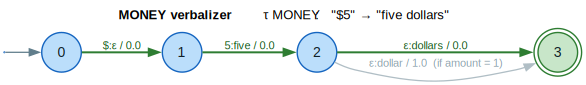

# Text normalization & inverse text normalization (TN / ITN)

> **Thesis.** The `text_processing` module converts between the *written* and
> *spoken* forms of text — `"$5" ⇄ "five dollars"`, `"123" ⇄ "one hundred
> twenty three"` — by classifying each token into a **semiotic class** and
> applying a per-class verbalizer $`\tau_c`$ realized as a WFST, then
> reassembling the pieces.

This document covers the module `src/text_processing/`
([`mod.rs`](../../src/text_processing/mod.rs)): **Text Normalization (TN)**,
$`\text{text} \to \text{spoken}`$, and its inverse **ITN**, $`\text{spoken} \to \text{text}`$.

---

## Terms & symbols

Symbols link to [`NOTATION.md`](../NOTATION.md); see [`STYLE.md`](../STYLE.md)
for conventions.

| Symbol / term | Meaning |
|---|---|
| **TN** | Text Normalization: written form → spoken form ("$5.50" → "five dollars and fifty cents"). |
| **ITN** | Inverse Text Normalization: spoken form → written form (the inverse map). |
| **Semiotic class** | The category of a token determining how it is verbalized: $`c \in \{\text{CARDINAL}, \text{ORDINAL}, \text{MONEY}, \text{TIME}, \text{DATE}, \text{MEASURE}, \dots\}`$ (the [`SemioticClass`](../../src/text_processing/mod.rs) enum). |
| $`\tau_c`$ | The **verbalizer** for class $`c`$ — a WFST mapping a written token of that class to its spoken form (TN), or the inverse (ITN). |
| $`\Sigma`$ | The character alphabet of a verbalizer WFST (`VectorWfst<char, W>`). |
| $`\oplus`$ / $`\otimes`$ | Semiring *plus* (alternatives) / *times* (sequential). Default weight is `TropicalWeight`. |
| $`\bar{1}`$ | The $`\otimes`$-identity (Tropical cost $`0`$), used for the cost-free arcs of the demonstration verbalizers. |
| **Classifier** | The WFST/tagger that assigns each input span a `SemioticClass`, producing [`TaggedToken`](../../src/text_processing/mod.rs)s. |
| **WFST** | Weighted Finite-State Transducer (see [wfst-traits](../architecture/wfst-traits.md)). |

The two-stage **classify-then-verbalize** design follows the production WFST
pipeline of [Zhang 2021](../BIBLIOGRAPHY.md#ref-zhang2021): a *classifier* tags
semiotic tokens, then a *verbalizer* grammar rewrites each tagged token.

---

## Formal model

### TN as a composition of class verbalizers

Let the classifier partition an input string into tagged tokens
$`(t_1, c_1), \dots, (t_m, c_m)`$ where $`t_i`$ is a token and
$`c_i \in \text{SemioticClass}`$. TN is the labelled composition

```math
\text{TN}(\text{input}) = \text{reassemble}\bigl( \tau_{c_1}(t_1), \tau_{c_2}(t_2), \dots, \tau_{c_m}(t_m) \bigr)
```

where each $`\tau_c`$ is a WFST and $`\text{reassemble}`$ concatenates the spoken
spans in their original order. Plain tokens use the identity verbalizer
$`\tau_{\text{PLAIN}} = \text{id}`$. ITN is the same pipeline with each verbalizer inverted:

```math
\text{ITN}(\text{input}) = \text{reassemble}\bigl( \tau^{-1}_{c_1}(t_1), \dots, \tau^{-1}_{c_m}(t_m) \bigr)
```

Because each $`\tau_c`$ is a finite-state transducer, the whole map is rational
and composes with the rest of the library (lattices, n-best). The module's
[`TextNormalizer`](../../src/text_processing/mod.rs) holds a `classifier`
`VectorWfst<char, W>` plus a `HashMap<SemioticClass, Verbalizer<W>>`,
and returns `Vec<(String, W)>` — a *weighted* list of candidates, keeping
the signature ready for downstream beam search.

### The semiotic classes

| Class $`c`$ | TN example ($`\text{written} \to \text{spoken}`$) |
|---|---|
| `CARDINAL` | `"123" → "one hundred twenty three"` |
| `ORDINAL` | `"1st" → "first"` |
| `MONEY` | `"$5" → "five dollars"` |
| `TIME` | `"3:30 PM" → "three thirty PM"` |
| `DATE` | `"01/15/2024" → "January fifteenth twenty twenty four"` |
| `MEASURE` | `"5 km" → "five kilometers"` |

(The enum also defines `Decimal`, `Fraction`, `Address`, `Telephone`,
`Electronic`, `Verbatim`, `Whitelist`, and `Plain`.) Each row is one
$`\tau_c`$; the four-symbol classes named in this doc's mandate
(`CARDINAL, ORDINAL, MONEY, TIME, DATE, MEASURE`) are the canonical set.

### The CARDINAL spine

`MONEY`, `MEASURE`, `ORDINAL`, and others delegate their numeric core to the
CARDINAL verbalizer. The implementation's
[`number_to_words`](../../src/text_processing/mod.rs) realizes $`\tau_{\text{CARDINAL}}`$
by positional decomposition into `{ones, tens}` tables scaled by
`{hundred, thousand, million, billion}` multipliers; its ITN inverse
[`words_to_number`](../../src/text_processing/mod.rs) folds the word stream back
into an integer by accumulating values and applying multipliers. These are the
proven kernels (`"123" ⇄ "one hundred twenty three"`) on which the
class-specific WFSTs build.

---

## Intuition — `"$5" → "five dollars"`

The MONEY verbalizer $`\tau_{\text{MONEY}}`$ reads the amount and currency and emits a
spoken phrase. Conceptually it (1) consumes the currency symbol and remembers it,
(2) verbalizes the integer amount via the CARDINAL spine, and (3) appends the
currency name — singular or plural depending on the amount, from
[`MoneyConfig`](../../src/text_processing/mod.rs):

```text
 "$5"                       "five dollars"
  $   ──$:ε / 0──►  ──5:five / 0──►  ──ε:dollars / 0──►  ✔
 (symbol absorbed)  (CARDINAL: 5→five)  (name_plural, amount ≠ 1)
```

For `"$1"` the final arc would instead emit the singular
`name_singular = "dollar"`, giving `"one dollar"`. This is the WFST
drawn in [§ Diagrams](#diagrams).

---

## Architecture & API

```text
text_processing
├── SemioticClass        — the token category enum (CARDINAL, MONEY, …)
├── TaggedToken          — (text, class, start, end) from the classifier
├── TextNormalizer<W>    — classifier WFST + per-class Verbalizer map; normalize()
├── InverseTextNormalizer<W> — the ITN counterpart; denormalize()
├── Verbalizer<W>        — a per-class verbalization WFST (wfst(), class())
├── MoneyConfig          — symbol / name(s) / subunit(s) / divisor for MONEY
├── DateFormat           — MonthDayYear · DayMonthYear · YearMonthDay
└── TimeFormat           — TwelveHour · TwentyFourHour
```

| Type | Responsibility |
|---|---|
| [`SemioticClass`](../../src/text_processing/mod.rs) | The class tag $`c`$ driving verbalizer selection. |
| [`TaggedToken`](../../src/text_processing/mod.rs) | A classified span: `text`, `class`, `start`, `end`. |
| [`TextNormalizer<W>`](../../src/text_processing/mod.rs) | Holds the classifier `VectorWfst<char, W>` and the per-class verbalizers; `normalize(input) -> Vec<(String, W)>`. |
| [`InverseTextNormalizer<W>`](../../src/text_processing/mod.rs) | The ITN side; `denormalize(input) -> Vec<(String, W)>`. |
| [`Verbalizer<W>`](../../src/text_processing/mod.rs) | Wraps one class's WFST $`\tau_c`$; exposes `wfst()` and `class()`. |
| [`MoneyConfig`](../../src/text_processing/mod.rs) | Currency `symbol`, `name_singular/plural`, `subunit_singular/plural`, `subunit_divisor` (e.g. `100` for cents). |
| [`DateFormat`](../../src/text_processing/mod.rs) / [`TimeFormat`](../../src/text_processing/mod.rs) | Disambiguate ordering/clock conventions for `DATE`/`TIME`. |

The verbalizer WFSTs are built with the [`MutableWfst`](../../src/wfst/traits.rs)
API (`add_state`, `set_start`, `set_final`, `add_transition`/`add_arc`), and the
normalizer requires `W: Semiring + Clone + From<f64>` so class costs can be
injected.

---

## Algorithms — classify → normalize-per-class → reassemble

The pipeline's intent: tag each token, route it to the verbalizer for its class,
and concatenate the results, leaving plain tokens untouched. The invariant is
that token boundaries (`start`, `end`) are preserved end-to-end, so the
reassembled output is in input order.

```text
⟨ TN(input) ⟩ ≡
  tokens ← classify(input)                       ▷ Vec<TaggedToken> via the classifier WFST
  out ← []
  for (text, c, _, _) in tokens:                 ▷ ⟨ verbalize per class ⟩
    out.push(
      match c:
        PLAIN              → text                 ▷ τ_PLAIN = identity
        CARDINAL           → number_to_words(text)
        MONEY              → τ_MONEY(text)        ▷ CARDINAL spine + currency name
        ORDINAL│TIME│DATE│MEASURE│…
                           → τ_c(text)            ▷ class-specific verbalizer
    )
  return reassemble(out)                          ▷ concatenate spans in order
```

`classify` is $`O(\lvert \text{input}\rvert)`$ for the demonstration classifier; each
$`\tau_c`$ is a finite transducer so verbalizing a token is linear in its
length; $`\text{reassemble}`$ is linear in the number of tokens. ITN runs the same
chunk with $`\tau^{-1}_c`$ (e.g. `words_to_number`) and inverted PLAIN handling.

**Trace** (`"I have 123 apples"`, TN): the classifier tags `"123"` as
`CARDINAL` and the rest as `PLAIN`; $`\tau_{\text{CARDINAL}}(\text{"123"}) = \text{"one hundred twenty three"}`$;
reassembly yields `"I have one hundred twenty three apples"`.
The ITN trace runs in reverse: `` `words_to_number(["one","hundred","twenty",
"three"]) = (123, 4)` `` consuming four words, so
`"... one hundred twenty three apples" → "... 123 apples"`. ∎

---

## Examples

Snippets are from the module's `#[cfg(test)]` suite (the conversion kernels are
compiler-checked).

### TN: written → spoken

```rust,ignore
use lling_llang::text_processing::TextNormalizer;
use lling_llang::semiring::TropicalWeight;

let normalizer: TextNormalizer<TropicalWeight> = TextNormalizer::new();
let results = normalizer.normalize("I have 123 apples");
assert!(results[0].0.contains("one hundred twenty three"));
```

### ITN: spoken → written

```rust,ignore
use lling_llang::text_processing::InverseTextNormalizer;
use lling_llang::semiring::TropicalWeight;

let itn: InverseTextNormalizer<TropicalWeight> = InverseTextNormalizer::new();
let results = itn.denormalize("I have one hundred twenty three apples");
assert!(results[0].0.contains("123"));
```

### The CARDINAL spine ($`\tau_{\text{CARDINAL}}`$ and its inverse)

`number_to_words` / `words_to_number` are crate-internal kernels
(reached publicly through `normalize` / `denormalize`); this snippet is their
in-module test, demonstrating the exact `"123" ⇄ "one hundred twenty three"`
correspondence the MONEY/MEASURE/ORDINAL verbalizers reuse.

```rust,ignore
// number_to_words / words_to_number are the proven numeric kernels.
assert_eq!(number_to_words("123"), "one hundred twenty three");
assert_eq!(number_to_words("1234"), "one thousand two hundred thirty four");

assert_eq!(words_to_number(&["one", "hundred", "twenty", "three"]), Some((123, 4)));
assert_eq!(words_to_number(&["one", "thousand"]), Some((1000, 2)));
```

### Configuring the MONEY class

```rust,ignore
use lling_llang::text_processing::MoneyConfig;

// Defaults realize  "$N" → "N dollars" / "N dollar" with cents as the subunit.
let cfg = MoneyConfig::default();
assert_eq!(cfg.symbol, "$");
assert_eq!(cfg.name_plural, "dollars");
assert_eq!(cfg.subunit_divisor, 100); // cents
```

---

## Diagrams

### Classify → normalize-per-class → reassemble (TN/ITN flow)


*Amber = per-class verbalization activities; blue diamond = the class switch;
green terminal = the emitted weighted candidates `Vec<(String, W)>`; the
loop iterates over the classifier's `TaggedToken`s.*

<details><summary>Text view</summary>

```text
start
  → input text ("I have 123 apples")
  → Classifier WFST → Vec<TaggedToken>   (c ∈ {CARDINAL, MONEY, TIME, DATE, MEASURE, …, PLAIN})
  → for each TaggedToken:  [which class c?]
        CARDINAL → τ_CARDINAL  "123" ↔ "one hundred twenty three"
        MONEY    → τ_MONEY     "$5"  ↔ "five dollars"
        TIME/DATE/MEASURE/ORDINAL → τ_c
        PLAIN    → pass through
  → reassemble: concatenate verbalized spans in order
  → emit Vec<(String, W)>  (weighted candidates)
stop
```

</details>

### The MONEY-class WFST (`$5 → five dollars`)



*Blue = states; double green ring = final; bold green = the single accepting
derivation `"$5" → "five dollars"`; grey = the singular alternative
(`"$1" → "one dollar"`). Arc labels read `in:out/weight` with
$`\varepsilon`$ the empty label.*

<details><summary>Text view</summary>

```text
   (0) ──$:ε / 0──► (1) ──5:five / 0──► (2) ──ε:dollars / 0──► (3) ✔      [BEST, green]
                                          (2) ──ε:dollar / 1 (if amount = 1)──► (3) ✔   [grey]
   τ_MONEY :  absorb '$' → CARDINAL(amount) → currency name (plural | singular)
```

</details>

---

## Relation to the library

- **Verbalizers are WFSTs.** Each $`\tau_c`$ is a
  `VectorWfst<char, W>` (via [`Verbalizer`](../../src/text_processing/mod.rs)),
  so TN/ITN compose with [composition](../algorithms/composition.md) and feed the
  same [path-extraction](../algorithms/path-extraction.md) used elsewhere; the
  `Vec<(String, W)>` return type is a ready-made candidate list for a beam.
- **Weights.** `W: Semiring + From<f64>` lets class-specific costs (e.g. a
  penalty on an unusual verbalization) ride on the arcs; with
  `TropicalWeight` the lowest-cost verbalization is selected by
  shortest path.
- **Pipeline order.** TN/ITN is a *token-level* stage that runs after the
  character-level surface cleanup of
  [`error_models::normalize`](error-models.md) and alongside the
  [layer stack](../architecture/layers.md): normalize glyphs first, then
  verbalize numbers/money/dates.
- **Production lineage.** The classify-then-verbalize split and the semiotic-class
  taxonomy follow NeMo's WFST TN/ITN system
  ([Zhang 2021](../BIBLIOGRAPHY.md#ref-zhang2021)); the same two-grammar
  decomposition underlies [Sproat 2001](#ref-sproat2001)'s original formulation.

---

## References

- <a id="ref-zhang2021"></a>**[Zhang 2021]** Zhang, Y., Bakhturina, E., Gorman,
  K., & Ginsburg, B. (2021). *NeMo Inverse Text Normalization: From Development
  to Production.* Interspeech 2021.
  [arXiv:2104.05055](https://arxiv.org/abs/2104.05055) — see
  [`BIBLIOGRAPHY.md`](../BIBLIOGRAPHY.md#ref-zhang2021).
- <a id="ref-sproat2001"></a>**[Sproat 2001]** Sproat, R., Black, A. W., Chen,
  S., Kumar, S., Ostendorf, M., & Richards, C. (2001). *Normalization of
  non-standard words.* Computer Speech & Language 15(3):287–333.
  [doi:10.1006/csla.2001.0169](https://doi.org/10.1006/csla.2001.0169)
- <a id="ref-ebden2015"></a>**[Ebden & Sproat 2015]** Ebden, P., & Sproat, R.
  (2015). *The Kestrel TTS text normalization system.* Natural Language
  Engineering 21(3):333–353.
  [doi:10.1017/S1351324914000175](https://doi.org/10.1017/S1351324914000175)
- <a id="ref-mohri2002"></a>**[Mohri 2002]** Mohri, M., Pereira, F., & Riley, M.
  (2002). *Weighted Finite-State Transducers in Speech Recognition.* Computer
  Speech & Language 16(1):69–88.
  [doi:10.1006/csla.2001.0184](https://doi.org/10.1006/csla.2001.0184) — see
  [`BIBLIOGRAPHY.md`](../BIBLIOGRAPHY.md#ref-mohri2002).
