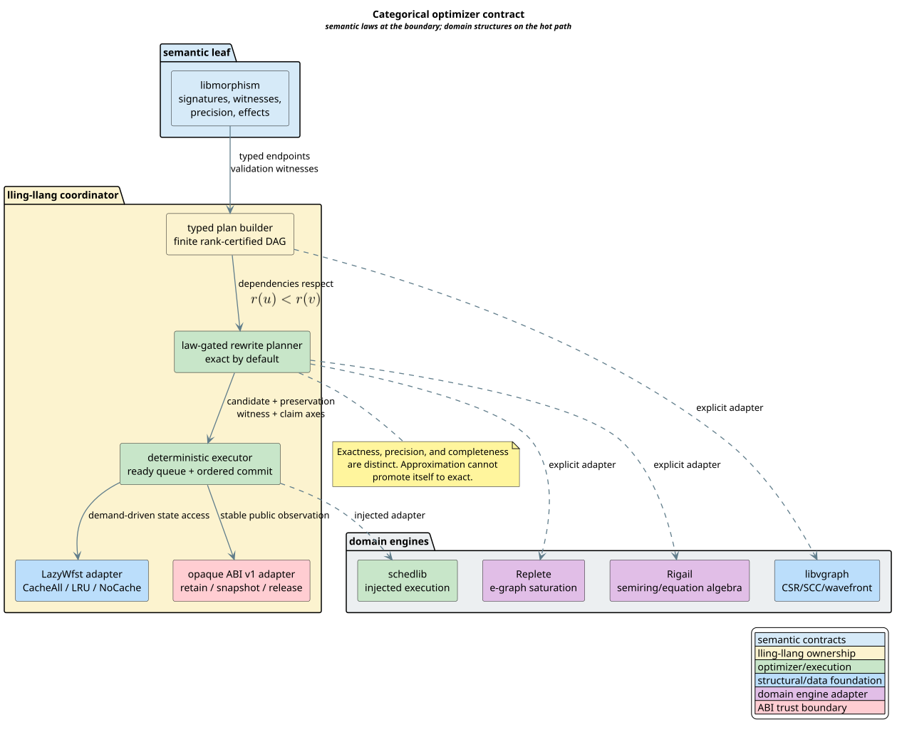

# Categorical Optimizer Contract

The lling-llang optimizer uses category theory as a compile-time and
proof-time discipline for composing domain operations; it does not place a
generic category, monad, or fibration object on the runtime hot path.

## Terms and symbols

| Term or symbol | Definition |
|---|---|
| **object** | A typed semantic boundary. Here it is a tape domain together with the value and effect contracts accepted at that boundary. |
| **morphism** $`f : A \to B`$ | A transformation from object $`A`$ to object $`B`$ that carries its declared effects, precision, completeness, provenance, and validation evidence. |
| **identity** $`\mathrm{id}_A`$ | The transformation that leaves an object's denotation unchanged. |
| **composition** $`g \circ f`$ | Applying $`f : A \to B`$ and then $`g : B \to C`$ when the middle tape domain $`B`$ matches exactly. |
| **denotation** $`\mathrm{den}(f)`$ | The relation between input and output traces represented by a transformation. |
| **exact rewrite** | A candidate whose denotation is equivalent to its source in both directions. |
| **precision** | Whether the analysis claim is exact or a sound approximation. Precision is independent of completeness. |
| **completeness** | Whether all relevant behavior is represented. Completeness is independent of precision. |
| **fiber** $`F_b`$ | The candidates indexed by a fixed base value $`b`$, such as one query, prefix, state, or lattice position. |
| **fibration** | An indexed family equipped with lawful lifting along base morphisms. A feed is not called a fibration until those lifts and their laws exist. |
| **monoid** | A carrier with an associative binary operation and an identity element. Different domain monoids remain distinct. |
| **monad** | An endofunctor with unit and associative bind. It is useful only where effect sequencing is explicit and law checked. |
| **DAG** | Directed acyclic graph. Optimizer dependencies form a finite DAG certified by a natural-number rank. |
| **ABI** | Application Binary Interface: the stable compiled calling contract used across library boundaries. |

The general category, monoid, monad, and composition terminology follows
[Mac Lane 1998](../BIBLIOGRAPHY.md). Weighted finite-state
transducer (WFST) composition follows the domain semantics summarized by
[Mohri 2009](../BIBLIOGRAPHY.md).

## Why this is categorical

A composable optimizer step has a distinct input tape and output tape. Its
signature is

```math
\mathrm{sig}(f) = (\mathrm{in}(f),\mathrm{out}(f)).
```

Two steps compose precisely when

```math
\mathrm{out}(f)=\mathrm{in}(g).
```

The composite keeps the first input and last output:

```math
\mathrm{sig}(g \circ f)
= (\mathrm{in}(f),\mathrm{out}(g)).
```

The checked laws are the category laws:

```math
(h \circ g) \circ f = h \circ (g \circ f),
\qquad
\mathrm{id}_B \circ f = f = f \circ \mathrm{id}_A.
```

These equations are useful because they turn pipeline reassociation from an
informal optimization into a law-gated rewrite. They do not imply that every
domain operation shares one representation. A semiring product, an edit-cost
sum, an e-graph merge, and a provenance join can each be monoidal without being
the same monoid.

## The architectural boundary



[PlantUML source](../diagrams/optimization/categorical-optimizer-contract.puml)

*Blue identifies semantic and structural foundations, yellow identifies lling-llang ownership, green identifies optimizer execution, purple identifies domain engines, and red identifies the ABI trust boundary.*

<details><summary>Text view</summary>

<!-- vdl-disable-next-line ASCII001 -->
```text
libmorphism semantic laws
          │ typed endpoints and witnesses
          ▼
lling-llang plan builder → rewrite planner → deterministic executor
          │                    │                    │
          │                    ├─ Replete adapter   ├─ schedlib adapter
          └─ libvgraph adapter └─ Rigail adapter    ├─ LazyWfst
                                                    └─ opaque ABI v1
```

</details>

Ownership is deliberately narrow:

| Component | Owns | Does not own |
|---|---|---|
| `libmorphism` | Signatures, endpoints, effects, precision, completeness, provenance, validation and composition witnesses, law evidence | Plans, scheduling, execution, ABI handles, optimization reports |
| lling-llang | Optimizer plan, planner, executor, exactness policy, publication gate, WFST adapters | Generic runtime category objects |
| Replete | Production e-graph representation and saturation | Cross-domain optimizer policy |
| Rigail | Semiring and equation-solving algebra | A flattened universal weight type |
| `libvgraph` | Deterministic compressed sparse row graphs, strongly connected components, condensation, wavefront primitives | WFST denotation or optimizer policy |
| `schedlib` | Sync-first deterministic scheduling with an injected executor | Semantic rewrite validity |

This keeps categorical abstractions out of cache-sensitive loops. The hot path
uses native Rust types, static dispatch where practical, compact graph storage,
and domain-specific operations. Law witnesses are constructed at planning and
validation boundaries, where they can prevent an invalid plan before execution.

## Exactness has three independent obligations

For source denotation $`S`$ and candidate denotation $`T`$, an exact rewrite
witness proves

```math
\forall x.\; x \in S \Longleftrightarrow x \in T.
```

That theorem is not the same thing as either analysis axis:

| Axis | Values | Conservative composition |
|---|---|---|
| Precision | `Exact`, `SoundApproximation` | Exact only when both inputs are exact |
| Completeness | `Complete`, `Incomplete` | Complete only when both inputs are complete |
| Denotation | Bidirectional trace relation | Exact only with a proof-carrying witness |

An `Exact` flag cannot manufacture a denotational witness. Likewise, composing
two approximate analyses cannot self-promote them to exact. The Rocq model
constructs `publishable_exact` only when both the claim and an independent
`exact_witness` are present.

## Fibers, fibrations, monoids, and monads

### Feeds are indexed fibers

A liblevenshtein or libdictenstein feed naturally forms an indexed family:

```math
F_b = \{\, c : c \text{ is a candidate for base value } b \,\}.
```

For example, $`b`$ may be a normalized query and $`F_b`$ its fuzzy candidates.
Calling $`F_b`$ a **fiber** is accurate: it is the collection above one base
index. Calling the whole feed a **fibration** requires more. A base morphism
$`u : b \to b'`$ must induce a lawful lift between $`F_b`$ and $`F_{b'}`$, and
identity and composition of lifts must be demonstrated. The constructive
countermodel in `TapeSignatures.v` guards against assuming such structure from
similar labels alone.

### Monoids apply locally

Monoids are central to the campaign:

- path weights combine under a semiring's multiplicative monoid;
- edit scripts concatenate under an edit-sequence monoid;
- provenance appends under an ordered trace monoid;
- independent facts may join under an idempotent commutative monoid or
  semilattice.

Adapters must preserve the selected operation and identity. They must not
claim a homomorphism merely because both source and target have an operation
named `combine`.

### Monads are not a default runtime wrapper

Monads are appropriate when a transformation explicitly sequences effects:
validation failure, cancellation, resource budgets, or asynchronous execution.
The required laws are left identity, right identity, and associativity of bind.
The current optimizer contract instead exposes these outcomes directly in its
lifecycle. This is easier to inspect, avoids allocation and dynamic dispatch,
and prevents a generic effect wrapper from hiding cancellation or approximation.

## Plan validation and execution

Let $`G=(V,E)`$ be the plan graph and let $`r : V \to \mathbb{N}`$ be its rank
witness. Every dependency edge satisfies

```math
(u,v) \in E \Longrightarrow r(u) < r(v).
```

A cycle would imply $`r(v) < r(v)`$ by transitivity, which is impossible.
Therefore a validated plan is acyclic without requiring recursive cycle
detection during execution.

The execution algorithm is iterative and stack safe. Its invariant is: every
node placed in the ready queue has all dependencies in the finished set, and
the committed provenance is a prefix of canonical plan order.

```text
⟨ execute a validated categorical plan ⟩
ready ← nodes with no unfinished dependencies
while ready is not empty and budget remains and not cancelled:
    dispatch ready nodes through the injected executor
    for each completed node:
        validate its witness and conservatively combine claim axes
        mark the node finished
        enqueue newly ready dependents
    while the next canonical sequence number is finished:
        append that node's provenance and advance the sequence number
if cancelled, budget-exhausted, or failed: return that terminal outcome
if every node is finished and provenance is complete: construct completion witness
publish only when the witness exists and every exact result is independently confirmed
```

The scheduler may finish independent work in different orders, but ordered
commit makes the externally observed exact result invariant under worker count
and completion timing. The traversal state lives in heap-backed queues and
sets, not the native call stack.

## Performance consequences

Category theory supplies design and architectural performance benefits rather
than a new runtime algorithm:

- typed endpoints reject incompatible compositions before expensive work;
- associativity permits cost-based regrouping after preservation is proved;
- identities enable safe elimination of no-op stages;
- exact rewrite witnesses allow memoization and cache reuse under a semantic
  key rather than an implementation-specific key;
- DAG ranks enable deterministic parallel wavefronts;
- independent precision and completeness axes prevent expensive exact work
  from being silently replaced by an approximation;
- native domain adapters avoid canonical JSON on hot paths.

The abstractions add overhead if implemented as heap-allocated trait objects,
runtime proof search, or universal tagged values. Those designs are explicitly
outside this contract.

## Formal homes

| Obligation | Normative artifact |
|---|---|
| Typed tapes and category laws | `proofs/coq/optimizer/TapeSignatures.v` |
| Denotation, precision, completeness | `proofs/coq/optimizer/RewriteSemantics.v` |
| Ranked DAG and ordered commit | `proofs/coq/optimizer/PlanDag.v` |
| Optimizer lifecycle and concurrency | `proofs/tla/OptimizerLifecycle.tla` |
| Lazy WFST cache lifecycle | `proofs/tla/LazyWfstLifecycle.tla` |
| ABI ownership and opacity | `proofs/coq/abi/OwnershipLifecycle.v`, `proofs/tla/AbiOwnershipLifecycle.tla` |

The [formal evidence report](formal-verification.md) states proof strengths,
finite bounds, negative controls, and reproduction commands. The [execution
contract](plan-and-provenance.md) specifies plan syntax and terminal outcomes.

## References

- [Mac Lane 1998](../BIBLIOGRAPHY.md)
- [Mohri 2009](../BIBLIOGRAPHY.md)
- [Lamport 2002](../BIBLIOGRAPHY.md)
- [Delmas et al. 2026](../BIBLIOGRAPHY.md)
