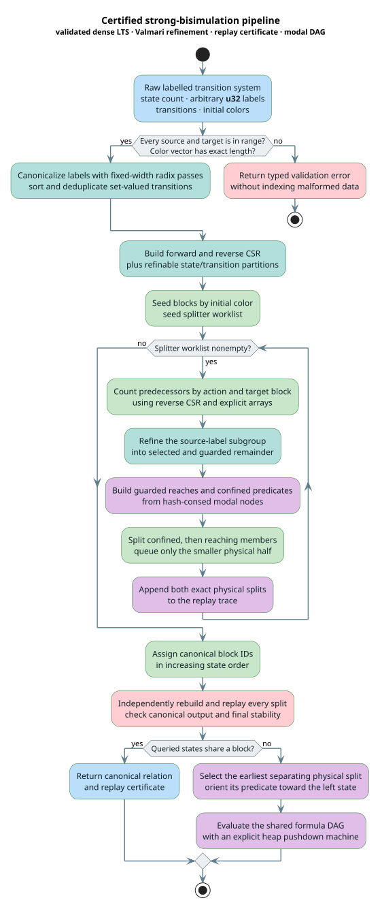
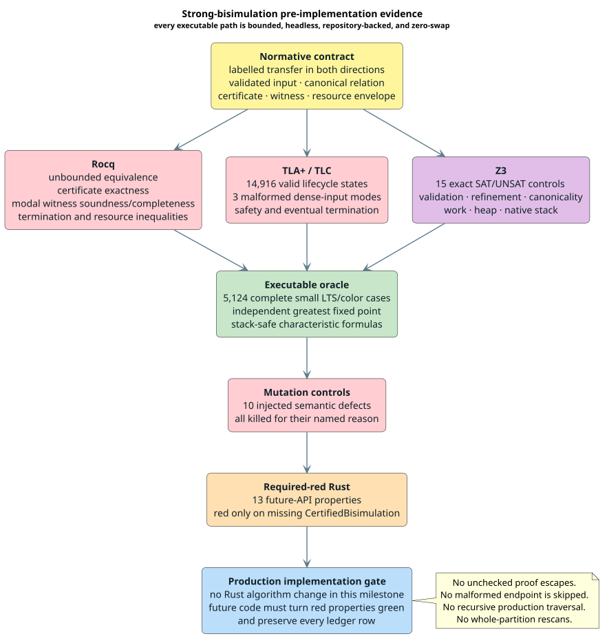

# Certified Strong-Bisimulation Contract

This document is the normative pre-implementation contract for replacing the
current signature-rescan routine in `src/symbolic/bisimulation.rs`. The
replacement computes strong bisimilarity for a finite labelled transition
system (LTS), rejects malformed inputs before indexing them, emits replayable
evidence, supplies a modal witness for non-equivalence, and uses a constant
native call stack.

The production replacement is intentionally absent in this milestone. Its 13
Rust properties are required-red on the missing `CertifiedBisimulation` API.
No existing production Rust file is changed by this formal-verification task.

## Terms

| Term | Definition |
|---|---|
| **labelled transition system (LTS)** | A finite state set, an action-label set, and labelled directed transitions. |
| **strong bisimulation** | A relation whose related states have the same initial color and can match each other's transitions, label for label, into related states. |
| **partition** | Disjoint blocks of states; two states are related exactly when they share a block. |
| **splitter** | An action and target block whose predecessor set divides a current block. |
| **smaller-half rule** | Queue the smaller result of a split so each charged element moves at most logarithmically many times. |
| **compressed sparse row (CSR)** | Dense offsets plus contiguous edges for one traversal direction. |
| **certificate** | A safe split trace plus a stable canonical final partition that an independent checker can replay. |
| **distinguishing witness** | An oriented modal formula that is true at one queried state and false at the other. |
| **formula DAG** | A hash-consed directed acyclic graph that shares repeated modal-formula subexpressions. |
| **canonical relation** | The state-pair equivalence relation, independent of incidental block identifiers or transition insertion order. |
| **native-stack safety** | The maximum number of native call frames is independent of input depth. |

The public action type remains an arbitrary `u32`. “Malformed label” in the
finite dense-core models means an internally fabricated dense label outside
the canonicalized action domain; every public `u32` label is representable.

## Semantic contract

Let the state set be $`\mathcal{S}`$, the action set be $`\mathcal{A}`$, the
transition relation be
$`T\subseteq\mathcal{S}\times\mathcal{A}\times\mathcal{S}`$,
and the initial coloring be $`c:\mathcal{S}\to\mathcal{C}`$. A relation
$`R\subseteq\mathcal{S}\times\mathcal{S}`$ is a colored strong bisimulation
when every $`(p,q)\in R`$ satisfies:

1. $`c(p)=c(q)`$;
2. for each $`(p,a,p')\in T`$, some $`(q,a,q')\in T`$ has
   $`(p',q')\in R`$; and
3. for each $`(q,a,q')\in T`$, some $`(p,a,p')\in T`$ has
   $`(p',q')\in R`$.

Strong bisimilarity is the union of all such relations. The Rocq theory proves
that it is reflexive, symmetric, and transitive. It also proves that a replayed
safe refinement contains every bisimilar pair, while a stable accepted
partition contains only bisimilar pairs. Therefore an accepted certificate is
exact, not merely sound.

Duplicate transitions have set semantics. Transition order, duplicate removal,
and injective action relabeling cannot change the relation. Initial colors are
observations: differently colored states never merge, even when both are
deadlocked.

## Validated representation



*Blue is input/output, teal is canonical representation, green is refinement,
red is validation/proof checking, and purple is witness construction.*

[PlantUML source](../diagrams/optimization/strong-bisimulation-flow.puml)

<details><summary>Text view</summary>

```text
raw LTS + colors
  -> total endpoint/color validation
  -> deterministic dense labels + forward/reverse CSR
  -> refinable state and transition partitions
  -> smaller-half splitter worklist
  -> canonical blocks + replayed stable certificate
       -> same block: equivalence evidence
       -> different blocks: shared modal distinguishing DAG
```

</details>

Validation is a mandatory phase boundary:

- every source and target is checked against the state count before any array
  access;
- the color vector has exactly one entry per state;
- all allocation sizes and CSR prefix sums are checked for integer overflow;
- the empty LTS with an empty color vector is valid and has the unique empty
  partition;
- malformed endpoints, queries, and certificate indices return typed errors
  rather than being skipped or panicking; and
- an internal dense label is checked against the dense action count.

The canonicalizer compresses arbitrary `u32` action values to a deterministic
dense domain, sorts and deduplicates set-valued transitions with fixed-width
radix passes, and builds both forward and reverse CSR. Fixed-width word-RAM
radix passes keep preprocessing linear in states plus input transitions and
avoid randomized hashing in canonical output.

The reverse CSR is mandatory. Splitter refinement repeatedly asks which states
reach a selected target block under one action; scanning all outgoing
transitions or the whole partition for each splitter violates the work
contract.

## Algorithm decision

The production core will specialize Valmari's refinable state-and-transition
partition algorithm for labelled nondeterministic systems
([Valmari 2010](../BIBLIOGRAPHY.md)). It meets the required
$`O(m\log n)`$ refinement target with linear partition storage, handles
nondeterminism directly, and exposes split history for certificates and modal
witnesses. Paige and Tarjan provide the partition-refinement discipline
([Paige & Tarjan 1987](../BIBLIOGRAPHY.md)); Fernandez
documents an efficient bisimulation implementation
([Fernandez 1990](../BIBLIOGRAPHY.md)).

This is a design decision, not a claim that the current implementation already
uses those algorithms. The current routine repeatedly constructs and sorts
whole-state signatures. Its comments name Paige–Tarjan, but its data
structures implement neither Paige–Tarjan nor Valmari refinement.

The maintained AutomataLib implementation was reviewed as an engineering
cross-check at commit
[`c371af4fce44505987b0da94de98991f76ce3f09`](https://github.com/LearnLib/automatalib/blob/c371af4fce44505987b0da94de98991f76ce3f09/util/src/main/java/net/automatalib/util/partitionrefinement/Valmari.java).
The Rust implementation must be derived from this contract and the primary
paper; it must not be a line-for-line port.

The partition-refinement lower bound explains the logarithmic-element charging
for this algorithmic family
([Groote, Martens & de Vink 2021](../BIBLIOGRAPHY.md)). No
alternative-algorithm benchmark is needed to re-establish that theoretical
decision. Production benchmarks instead measure constants, allocation traffic,
cache behavior, and crossover thresholds against the current baseline.

## Literate refinement algorithm

Every worklist, partition, and evaluator stack is an explicit contiguous
container.

```text
⟨ validate and canonicalize the LTS ⟩ ≡
    require colors.length = state_count
    for each raw transition (source, action, target):
        require source < state_count and target < state_count
    dense_action <- deterministic radix-compressed action IDs
    transitions <- radix-sort and deduplicate (source, dense_action, target)
    forward_csr <- build CSR grouped by source
    reverse_csr <- build CSR grouped by (dense_action, target)
```

```text
⟨ initialize refinable partitions ⟩ ≡
    state_partition <- canonical blocks grouped by initial color
    transition_partition <- transitions grouped by dense action and target block
    worklist <- initial transition splitters
    certificate <- empty split sequence
    witness_dag <- color atoms, hash-consed
```

```text
⟨ refine one splitter without a whole-partition scan ⟩ ≡
    splitter <- worklist.pop()
    touched_states <- reverse_csr predecessors selected by splitter
    touched_blocks <- count touched_states by current state block
    for each touched block:
        split touched members from untouched members in place
        append the exact safe split to certificate
        append shared modal nodes that characterize the new blocks
        queue the smaller resulting subblock
    update only transition blocks incident to changed state blocks
```

```text
⟨ finalize and certify ⟩ ≡
    assign block IDs by first state in increasing state order
    replay every certificate split from the initial coloring
    require replay result = canonical final partition
    require final partition is stable in both transfer directions
    return partition, certificate, shared witness DAG, resource account
```

Refinement, certificate replay, modal evaluation, graph traversal, destruction,
and serialization must not use input-shaped native recursion. A specialized
explicit pushdown automaton carries evaluator program counters and child
indices. Partition refinement is an iterative worklist machine.

## Certificates and witnesses

A safe splitter is the preimage of a current block under one action. Splitting
an equivalence relation by a saturated predicate cannot separate a bisimilar
pair. Replaying only safe splits proves the “contains bisimilarity” direction;
checking final stability proves the converse.

| Certificate field | Obligation |
|---|---|
| input digest | Binds state count, canonical transitions, and initial colors. |
| split sequence | Names the action, target block identity, affected parent, and exact child memberships. |
| canonical partition | Assigns block IDs by increasing first state. |
| stability evidence | Rejects a pair whose transfer obligation remains unsatisfied. |
| resource account | Records charges, partition cells, witness cells, whole-partition rescans, and maximum native frames. |

The witness language has color atoms, conjunction, negation, and labelled
diamond. The formula $`\langle a\rangle\varphi`$ holds at a state exactly when
it has an $`a`$-transition to a state satisfying $`\varphi`$. A split caused
by a state that can reach a characteristic target block while its peer cannot
yields an oriented distinguishing formula.

Witnesses are hash-consed DAGs, not expanded trees and not one copy per state
pair. Evaluation is bottom-up or uses the explicit pushdown automaton.
Wißmann, Milius, and Schröder establish quasilinear generic modal-witness
construction
([Wißmann, Milius & Schröder 2022](../BIBLIOGRAPHY.md)).
Their formal setting is not silently treated as the labelled proof:
`StrongBisimulation.v` directly proves this labelled LTS construction.

## Canonical output

The semantic result is the relation, not mutable block numbers. The
implementation exposes a length-$`n`$ canonical block vector whose IDs are
assigned by the first state in each block. The full $`n\times n`$ Boolean
relation matrix is materialized only on explicit request; its unavoidable
quadratic cost is excluded from core resource claims.

Canonicality requires:

- identical relation and block vector under transition permutation;
- identical relation and block vector after duplicate removal;
- identical relation under injective relabeling of actions;
- deterministic certificate ordering after canonical input normalization; and
- no dependence on hash seeds, worker completion order, or addresses.

Rocq proves relation-matrix invariance under injective block relabeling. The
executable oracle also checks first-state block normalization, transition
permutation, duplicates, and injective action relabeling for every case.

## Resource contract

Let $`n`$ be the number of states and $`m`$ the number of distinct canonical
transitions.

| Component | Time | Auxiliary heap | Native stack |
|---|---:|---:|---:|
| validation, radix canonicalization, CSR | $`O(n+m)`$ on fixed-width word-RAM | $`O(n+m)`$ | $`O(1)`$ |
| Valmari refinement core | $`O(n+m\log\max(2,n))`$ | $`O(n+m)`$ | $`O(1)`$ |
| canonical block numbering | $`O(n)`$ | $`O(n)`$ | $`O(1)`$ |
| replay certificate and shared modal DAG | $`O((n+m)\log\max(2,n))`$ | $`O((n+m)\log\max(2,n))`$ evidence | $`O(1)`$ |
| optional relation matrix | $`O(n^2)`$ | $`O(n^2)`$ | $`O(1)`$ |

Every state or transition charged through a smaller-half split has at most
$`\lfloor\log_2\max(1,n)\rfloor`$ charges. The resource account reports zero
whole-partition rescans and one native frame. Counters must be connected to
actual loop events and allocations; constants initialized to desired values
are not evidence.

## Parallelism and concurrency

Parallel execution is useful only when it preserves work efficiency,
canonicality, and memory bounds:

- validation and radix histograms may use deterministic chunks and prefix sums
  above a measured crossover threshold;
- predecessor counting may use thread-local touched-block arrays followed by a
  deterministic reduction;
- split commits remain exclusive and ordered by canonical splitter identity;
- modal DAG interning uses deterministic batch merge or canonical final IDs;
  and
- immutable validated CSR and completed results may implement `Send` and
  `Sync`, while mutable partitions remain private to a proved protocol.

The TLA+ model verifies the sequential lifecycle, not parallel execution.
Parallel refinement stays disabled until a separate concurrency refinement
proves race freedom, deterministic commit, bounded queues, cancellation, and
equivalence to the scalar result. A work-efficient scalar implementation is
the acceptance baseline.

## Proposed API obligations

| Surface | Required behavior |
|---|---|
| `CertifiedBisimulation::compute` | Returns a result; never skips malformed endpoints and never panics during input validation. |
| `blocks` | Returns one canonical block ID per state. |
| `relation_matrix` | Explicitly materializes the optional quadratic view. |
| `certificate().replay` | Reconstructs the exact partition or rejects the first invalid split. |
| `witness(left, right)` | Returns no witness for equivalent states and a sound oriented modal DAG for every separated pair. |
| `resources` | Exposes work, heap-cell, rescan, witness-cell, and native-frame measurements. |

Out-of-range queries, certificates bound to a different input, overflowed
allocation sizes, and malformed witness references return typed errors.
Deserializers apply the same validation as in-memory construction.

## Formal evidence and acceptance



*Yellow is design, red is proof and mutation evidence, purple is solver
evidence, green is the oracle, orange is required-red, and blue is the future
implementation gate.*

[PlantUML source](../diagrams/optimization/strong-bisimulation-evidence.puml)

<details><summary>Text view</summary>

```text
normative contract
  -> Rocq universal proofs
  -> TLA+/TLC finite lifecycle
  -> Z3 boundary controls
  -> 5,124-case independent executable oracle
  -> 10 killed semantic mutants
  -> 13 causally required-red Rust properties
  -> future production implementation and profiling
```

</details>

| Evidence | Scope | Acceptance |
|---|---|---|
| `StrongBisimulation.v` | Unbounded semantics, certificate exactness, labelled modal witnesses, validation, canonical relation, termination, and resource inequalities | Kernel compilation and zero proof escapes |
| `StrongBisimulationLifecycle.tla` | Selected finite edge sets and color maps; valid and three malformed dense-input modes | 14,916 valid distinct states plus 128 per malformed mode; safety and liveness hold |
| `vco-e4-strong-bisimulation.smt2` | Validation, refinement, witness, canonicality, work, heap, and stack boundaries | Exact 15-result transcript |
| executable oracle | Independent greatest fixed point versus partition refinement and stack-safe characteristic formulas | All 5,124 complete cases pass |
| mutation campaign | Endpoint, color, transfer, termination, duplicate, modal, certificate, and canonical-ID defects | All 10 fail for their named invariant |
| invariant ledger | Every Rocq theorem/lemma, configured TLC check, and named SMT control | 83 rows map to 13 Rust properties |
| required-red package | Future validation, equivalence, evidence, resource, empty-input, and deep-stack behavior | Cargo status 101 solely because `CertifiedBisimulation` is absent |

The required-red package is isolated under `proofs/required_red`; it does not
make ordinary repository tests intentionally fail.

## Security and failure behavior

A valid implementation:

- validates untrusted graph data before indexing;
- checks multiplication and prefix-sum overflow;
- limits optional quadratic output and evidence retention;
- replays the input-bound certificate rather than trusting its digest;
- rejects witness DAG cycles and invalid child, action, or state references;
- avoids randomized-output nondeterminism; and
- leaves caller input unchanged after every error.

Cancellation or resource exhaustion returns an explicit incomplete outcome and
cannot publish a partition as certified. Any future spill uses
repository-backed storage, never a memory-backed temporary filesystem.

## Implementation acceptance order

1. Keep every formal artifact green and all 13 implementation properties red.
2. Implement total validation, label compression, and forward/reverse CSR.
3. Implement refinable state and transition partitions and smaller-half work.
4. Compare exhaustively with the independent fixed-point oracle.
5. Add canonical numbering and independent certificate replay.
6. Add shared labelled modal witnesses and the stack-safe evaluator.
7. Connect resource counters to real operations and allocations.
8. Run deep-chain, adversarial, sanitizer, profiler, and benchmark acceptance
   under the repository-backed 4 GiB/zero-swap envelope.
9. Add parallel execution only after its separate concurrency proof is green.

No step may weaken an already green invariant.

## Verification boundary

This milestone does not prove Rust memory safety, cache locality, wall-clock
constants, race freedom, or that current `src/symbolic/bisimulation.rs`
satisfies the new contract. Resource theorems prove inequalities from explicit
accounting premises; production must establish those premises.

The contract is local to lling-llang's generic symbolic LTS. It introduces no
libcpg dependency and makes no CPG-specific claim. An independent adapter may
consume the eventual result without coupling lling-llang to libcpg.

## References

- [Paige & Tarjan 1987](../BIBLIOGRAPHY.md)
- [Fernandez 1990](../BIBLIOGRAPHY.md)
- [Valmari 2010](../BIBLIOGRAPHY.md)
- [Groote, Martens & de Vink 2021](../BIBLIOGRAPHY.md)
- [Wißmann, Milius & Schröder 2022](../BIBLIOGRAPHY.md)
