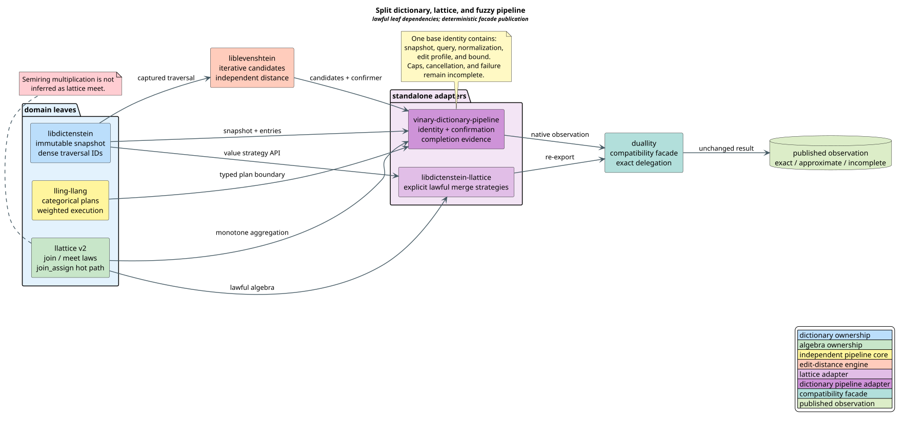

# Split Dictionary, Lattice, and Fuzzy Pipeline Contract

This document fixes the preimplementation contract for connecting
libdictenstein, liblevenshtein, llattice, lling-llang, and duallity. The
categorical optimizer remains inside lling-llang and independent of the domain
libraries. Domain-specific integration belongs in two standalone adapters:

- **libdictenstein-llattice** adapts lawful llattice operations to explicit
  libdictenstein value-merge strategies.
- **vinary-dictionary-pipeline** owns dictionary/edit-distance query identity,
  candidate feeds, independent confirmation, result classification, and the
  outward adapter to lling-llang pipelines.

duallity remains a compatibility facade. Production implementation is blocked
until the formal models, mutation controls, and required-red properties pass
review.

## Terms

| Term | Definition |
|---|---|
| **adapter** | A package that translates between existing public abstractions without taking ownership of their source algorithms. |
| **candidate** | A dictionary term proposed for confirmation. Candidate membership is not exact evidence. |
| **confirmation** | An independent edit-distance check against the same captured query identity. |
| **dense identifier** | A compact, snapshot-local integer used on a hot path. It is not a durable external identity. |
| **external key** | A caller-visible identity meaningful outside one dense arena. |
| **fiber** | The candidates or results indexed by one complete query identity. |
| **fibration** | An indexed family equipped with lawful cartesian lifts along base morphisms. |
| **join semilattice** | A carrier with an idempotent, commutative, associative least-upper-bound operation. |
| **monoid** | A carrier with an associative binary operation and an identity element. |
| **morphism** | A typed semantics-preserving transformation between pipeline objects. |
| **normalization profile** | A durable identity for the exact rules applied to query and term units. |
| **precision** | Whether the computed semantics is exact or approximate. |
| **coverage** | Whether every member of the selected semantics was considered. |
| **query identity** | The snapshot, query, normalization profile, edit profile, and bound that jointly determine a result fiber. |
| **stack-safe** | Native call-stack use is bounded independently of input or graph depth. |
| **worklist machine** | A state machine whose continuation is stored in a heap-backed queue or stack and advanced one bounded step at a time. |

Category terminology follows [Mac Lane 1998](../BIBLIOGRAPHY.md).
Weighted morphism and transducer terminology follows
[Mohri 2002](../BIBLIOGRAPHY.md).

## Reviewed API baselines

The machine-readable source of truth is
[`dictionary-surface-api-baselines.tsv`](../../proofs/doc/dictionary-surface-api-baselines.tsv).
It pins source identity, selected API files, and deterministic `git archive`
digests.

| Package surface | Pinned source | Contract role |
|---|---|---|
| libdictenstein | `4.0.0-rc.5`, `1cf21a1ef1861ca074ded8b63ed17c98c9fd6c7c` | Captured immutable roots, deterministic iterative entries, revision-local cursors, and snapshot identity. |
| liblevenshtein | `4.0.0-rc.5`, `a08279410e572f0c932b1887a1906aba6fdcece4` | Iterative candidates, explicit algorithm selection, independent distance checks, and ordered exact top-k traversal. |
| llattice | published `0.1.0` plus v2 candidate `e123c8711aaff177c14b2b5852af06bd07ba3dc2` | Compatibility baseline and future lawful layered algebra. |
| lling-llang | `4.0.0-rc.5`, `d4cdb40540338c901addb7c28b932f2d9222a151` | Independent categorical planning, weighted morphisms, and specialized execution. |
| duallity | `4.0.0-rc.5`, `387521f2e2c40ea1abc14e267c35f6006291b703` | Compatibility facade over canonical standalone adapters. |

The reviewed lling-llang `LatticeBackend` denotes vocabulary storage and
interning. It is not llattice's algebraic `Lattice` trait.

## Ownership and dependency architecture



[PlantUML source](../diagrams/optimization/dictionary-surface-architecture.puml)

Arrows in this text view point from a dependency to its consumer:

<!-- vdl-disable-next-line ASCII001 -->
```text
libdictenstein ────────────────┐
llattice ──────────────────────┼──► libdictenstein-llattice ──┐
                              │                                │
libdictenstein ─► liblevenshtein ─┐                            │
llattice ──────────────────────────┼──► vinary-dictionary-pipeline ─► duallity
lling-llang ───────────────────────┘
```

The formal rank gives leaf packages rank zero, liblevenshtein and
libdictenstein-llattice rank one, vinary-dictionary-pipeline rank two, and
duallity rank three. Every consumer-to-dependency edge strictly decreases
rank, so a dependency cycle is impossible.

Ownership is normative:

1. libdictenstein owns dictionaries, snapshots, traversal, entries, values,
   and non-algebraic merge plumbing.
2. liblevenshtein owns edit algorithms and optimized transducers.
3. llattice owns the algebraic vocabulary and law checks.
4. libdictenstein-llattice owns explicit lawful join or meet strategies.
5. vinary-dictionary-pipeline owns composite identity, candidate/confirmation
   orchestration, completion evidence, and lling-llang exposure.
6. lling-llang remains independent of all domain integrations.
7. duallity delegates and re-exports only after observational parity is proven.

libdictenstein cannot re-export libdictenstein-llattice: the adapter must
depend on libdictenstein, so a reverse re-export would form a Cargo cycle.

## Categorical interpretation

### Fibers, not assumed fibrations

For snapshot $`\sigma`$, query $`q`$, normalization profile $`n`$, edit profile
$`e`$, and bound $`k`$, the base identity is:

```math
b = (\sigma, q, n, e, k).
```

The candidate feed $`C_b`$, independently confirmed reference set $`R_b`$,
and accepted set $`A_b`$ are fibers over $`b`$. Exact acceptance is:

```math
A_b = C_b \cap R_b.
```

A complete generator satisfies:

```math
R_b \subseteq C_b.
```

Fibers give cache, batching, and evidence boundaries. A fibration additionally
requires total cartesian lifts along declared base morphisms plus identity,
composition, and universal laws. Mutation or normalization change supplies no
such evidence.

### Morphisms

Useful morphisms are concrete typed transformations:

- normalization maps source units to normalized units and carries a profile
  identity;
- dictionary traversal maps a captured root to candidate events;
- edit confirmation maps a candidate and the same base identity to an
  accept/reject observation;
- the dictionary adapter maps domain values to typed lling-llang objects;
- the duallity facade maps compatibility calls to native adapter calls without
  changing observations.

Composition laws justify planner rewrites and adapter fusion. They do not
justify allocating category objects on the hot path. Rust generics, associated
types, and specialized machines should erase categorical scaffolding after
validation.

### Monoids, semilattices, semirings, and monads

A semiring contains two monoids: alternatives under semiring addition and path
concatenation under semiring multiplication. A join semilattice becomes a
commutative idempotent monoid only when a lawful bottom exists. These laws
enable deterministic parallel reduction and incremental fixed points.

They are not interchangeable. Tropical semiring multiplication is arithmetic
addition. It is not idempotent, so it cannot be lattice meet. The existing
semiring-times-as-meet mapping must be removed. A replacement may expose a
join wrapper only when semiring addition satisfies llattice's join laws. Meet
requires an independent lawful operation.

Raw floating values and raw left-biased sequences receive no blanket algebra
implementation. Not-a-number values break ordinary equality laws; left-biased
append is not structurally commutative. Callers need an explicitly validated
finite-number wrapper or a canonical set/multiset quotient.

`Option`, `Result`, iterators, and futures have monadic composition patterns
useful for absence, failure, streaming, and asynchronous work. Rust has no
general higher-kinded abstraction that makes a universal `Monad` trait useful
here. Use the concrete effect types directly; cancellation remains an explicit
signal and terminal reason. No monad-transformer stack belongs in the runtime.

## Capability contracts

There is no categorical-object supertrait. Objects implement only the narrow
capabilities used by a given adapter:

```rust
pub trait SemanticQueryIdentity {
    type SnapshotId: Clone + Eq + std::hash::Hash;
    type Query: Clone + Eq + std::hash::Hash;
    type NormalizationId: Clone + Eq + std::hash::Hash;
    type EditProfileId: Clone + Eq + std::hash::Hash;
    type Bound: Clone + Eq + std::hash::Hash;

    fn snapshot_id(&self) -> &Self::SnapshotId;
    fn query(&self) -> &Self::Query;
    fn normalization_id(&self) -> &Self::NormalizationId;
    fn edit_profile_id(&self) -> &Self::EditProfileId;
    fn bound(&self) -> &Self::Bound;
}

pub enum FeedEvent<T> {
    Candidate(T),
    Exhausted,
    Capped,
    Cancelled,
}

pub trait CandidateSource {
    type Identity: SemanticQueryIdentity;
    type Candidate;
    type Error;

    fn identity(&self) -> &Self::Identity;
    fn next_event(&mut self) -> Result<FeedEvent<Self::Candidate>, Self::Error>;
}

pub trait ExactConfirmer<I, T> {
    type Error;

    fn identity(&self) -> &I;
    fn confirm(&mut self, candidate: &T) -> Result<bool, Self::Error>;
}

pub trait DenseExternalIdentity<External> {
    fn external_for(&self, dense: u32) -> Option<&External>;
    fn dense_for(&self, external: &External) -> Option<u32>;
}

pub trait CancellationSignal {
    fn is_cancelled(&self) -> bool;
}
```

The required-red tests additionally pin `DictionaryQueryIdentity`,
`CandidateFeed`, `DenseExternalMap`, `ConfirmationMachine`,
`TerminationReason`, and explicit outcome types. These are values, not trait
objects.

The llattice boundary uses layered capabilities:

- `JoinSemilattice: Clone + PartialEq` for monotone aggregation;
- `MeetSemilattice: Clone + PartialEq` only for explicit greatest-lower-bound
  behavior;
- `Lattice` only after both absorption laws pass; and
- `Bottom` only when a context-free least value exists.

`Send` and `Sync` do not belong on algebra traits. The parallel executor adds
them at the boundary where values actually move between workers.

## Exact lifecycle and stack safety

Every stage uses the complete identity. A mismatch is rejected before
candidate inspection.

The literate worklist algorithm is:

```text
CAPTURE:
    capture one immutable dictionary snapshot
    construct identity from snapshot, query, normalization, edit profile, bound
    construct the candidate source and confirmer from the same identity

GENERATE:
    on Candidate(value), append value to the heap-backed pending worklist
    on Exhausted, mark coverage complete
    on Capped or Cancelled, mark the result incomplete
    on provider error, mark ProviderFailed and incomplete

CONFIRM:
    while pending work exists and cancellation is false
        remove one pending candidate
        compute independent distance under the captured identity
        append only successful confirmations to accepted

PUBLISH:
    publish CompleteExact only after exhaustion, complete coverage,
        exact precision, and independent confirmation evidence
    otherwise publish CompleteApproximate or Incomplete explicitly
```

Each `ConfirmationMachine::step` removes one pending item before adding an
accepted result, so pending length strictly decreases. Logical continuation is
heap-backed and native stack depth is constant.

A specialized pushdown automaton is appropriate when parser or candidate
semantics is genuinely nested or mutually recursive. Flat dictionary/edit
confirmation needs a specialized worklist, not a gratuitous pushdown stack.

## Performance and algorithm selection

Category theory supplies laws and boundaries, not automatic speedups.
Performance comes from:

- snapshot-local `u32` traversal cursors;
- durable external keys only at boundary and persistence points;
- static dispatch for merge and confirmation;
- in-place `join_assign` with an exact change flag;
- iterative traversal and confirmation;
- ordered liblevenshtein traversal for exact top-k;
- bounded queues, reusable buffers, and backpressure;
- rank-certified wavefront scheduling; and
- deterministic ordered commit after parallel computation.

For $`c`$ candidates and confirmation cost $`d_i`$ for candidate $`i`$:

```math
T = \Theta\!\left(\sum_{i=1}^{c} d_i\right).
```

Orchestration adds $`\Theta(c)`$ time. Memory is proportional to the bounded
frontier, explicit traversal state, and output. Input-dependent native
recursion is forbidden.

An arbitrary iterator `limit` does not prove exact top-k coverage. Exact top-k
requires ordered liblevenshtein traversal and an explicit stopping
certificate; otherwise the result is incomplete.

## Parallelism and concurrency

Safe parallelism follows identity and ownership boundaries:

1. independent query identities execute concurrently;
2. all workers for one query share one immutable captured snapshot;
3. candidate batches may be partitioned for independent confirmation;
4. workers produce local accepted buffers and provenance;
5. the coordinator commits buffers in deterministic sequence order;
6. cap, cancellation, or failure stops admission and publishes incomplete.

A balanced parallel join reduction is legal only for lawful values that are
`Send + Sync`. Commutativity and associativity remove scheduling-order
sensitivity; idempotence tolerates duplicate delivery. Order-sensitive merges
stay sequential and explicitly named.

Work stealing may reorder computation but not publication. Bounded channels
provide backpressure. Small batches remain local. The scheduler is injected
through lling-llang; adapters do not create unbounded private thread pools.
Rank-certified wavefront execution follows the precedence intuition of
[Kahn 1962](../BIBLIOGRAPHY.md).

## Security and failure semantics

Providers, profiles, and bindings are trust boundaries. Implementations must:

- validate unit domains and profile identities;
- reject stale or foreign snapshots;
- check all lengths, indices, and allocation arithmetic for overflow;
- bound frontier, candidates, outputs, and provider batches;
- preserve deterministic publication after parallel work;
- classify cap, cancellation, and failure as incomplete;
- avoid locks across callbacks or expensive confirmation;
- avoid unsafe code except at separately reviewed ABI boundaries; and
- never cache exact evidence under a partial identity.

Dense identifiers are untrusted outside their captured snapshot. External keys
must round-trip through the dense map before publication or reuse.

## Migration and acceptance

1. Release and pin lawful llattice v2.
2. Create libdictenstein-llattice with explicit `LatticeJoin` and only
   independently lawful `LatticeMeet` strategies.
3. Remove libdictenstein's always-on ownership of llattice adapters while
   preserving non-algebraic merge plumbing.
4. Replace lling-llang's semiring-times-as-meet wrapper with a join-only bridge.
5. Create vinary-dictionary-pipeline and make its required-red properties green.
6. Add duallity re-exports and prove native/facade observational parity.
7. Convert the required-red gate to a normal green property gate.
8. Publish coordinated release candidates after cross-package acceptance.

The invariant registry
[`dictionary-surface-invariants.tsv`](../../proofs/doc/dictionary-surface-invariants.tsv)
maps all 57 obligations to implementation owners and real proptest functions.

| Layer | Artifact | Purpose |
|---|---|---|
| Rocq | `DictionarySurface.v` | Unbounded identity, mapping, algebra, dependency, facade, fiber, termination, and worklist proofs. |
| TLA+/TLC | `DictionarySurfaceLifecycle.tla` | Exhaustive bounded lifecycle and terminal-cause interleavings. |
| Z3 | `vco-e6-dictionary-surface.smt2` | Decidable boundary impossibilities and concrete countermodels. |
| proptest | `proofs/required_red/dictionary_surface/tests` | Executable API properties pinned before either adapter exists. |

TLC mutants corrupt each identity dimension, promote an incomplete result, and
alter facade output. Each must fail on its named invariant. The required-red
Cargo gate accepts only an absent canonical adapter; network, registry,
compiler, and unrelated workspace failures do not satisfy it.
