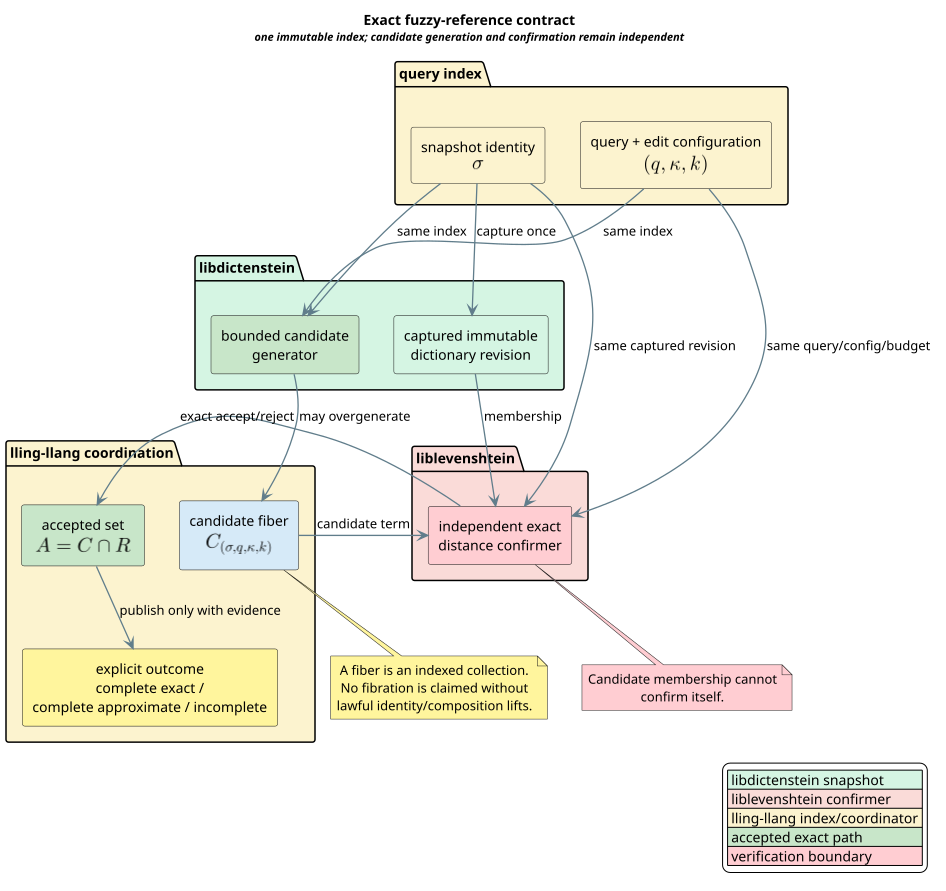
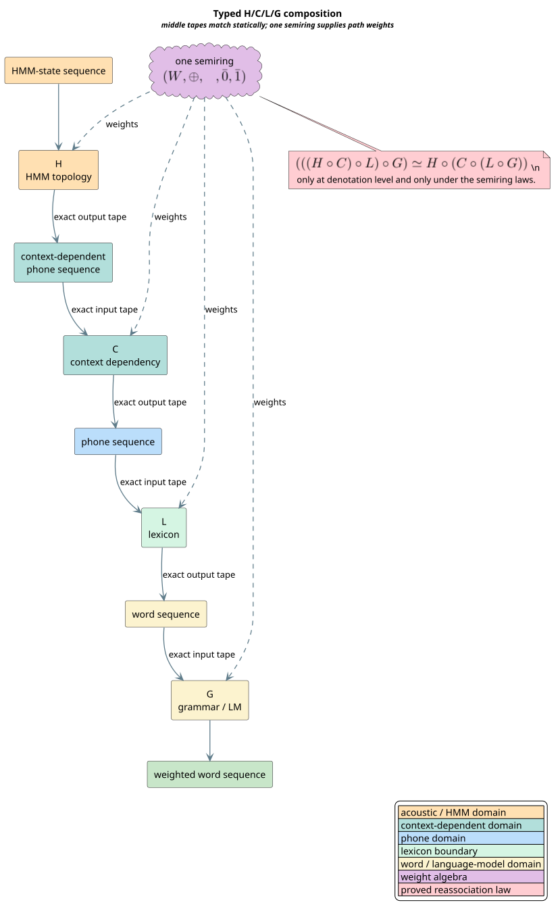

# Fuzzy-Dictionary and Typed H/C/L/G Integration Contract

This document fixes the semantic boundary for the E6 domain integrations
before any production adapter is implemented. It connects libdictenstein,
liblevenshtein, duallity, and lling-llang without replacing their optimized
representations with a generic runtime category object.

The contract has two independent parts:

1. an exact fuzzy-query reference semantics over one immutable dictionary
   snapshot; and
2. typed, weighted composition for the H/C/L/G speech-recognition cascade.

Both are category-theoretic at planning and proof boundaries. Their runtime
algorithms remain specialized, iterative, statically dispatched where
practical, and free of input-dependent native recursion.

## Terms and symbols

| Term or symbol | Definition |
|---|---|
| **snapshot** $`\sigma`$ | One immutable dictionary revision captured when a query begins. |
| **query** $`q`$ | The unit sequence supplied to the edit-distance algorithm. |
| **configuration** $`\kappa`$ | The exact edit algorithm, operation policy, unit domain, normalization identity, and weight/cost parameters. |
| **budget** $`k`$ | The maximum accepted edit cost in the configuration's exact cost domain. |
| **index** $`b=(\sigma,q,\kappa,k)`$ | The complete base value identifying one fuzzy-query fiber. |
| **reference set** $`R_b`$ | Every term in snapshot $`\sigma`$ whose independently computed cost from $`q`$ under $`\kappa`$ is at most $`k`$. |
| **candidate fiber** $`C_b`$ | Terms proposed by a bounded index or another generator at base index $`b`$. It may contain false positives. |
| **accepted set** $`A_b`$ | Candidates that an independent confirmer proves to be reference members. |
| **complete generator** | A generator satisfying $`R_b \subseteq C_b`$. It may still overgenerate. |
| **sound confirmer** | A confirmer that never accepts a term outside $`R_b`$. |
| **complete confirmer** | A confirmer that accepts every term in $`R_b`$. |
| **fiber** | The collection associated with one fixed base index. |
| **fibration** | An indexed family plus lawful lifts along base morphisms. No such structure is claimed here. |
| **morphism** $`f : X \to Y`$ | A weighted relation from input tape type $`X`$ to output tape type $`Y`$. |
| **semiring** | A weight carrier with alternative combination $`\oplus`$, path concatenation $`\otimes`$, zero $`\bar 0`$, one $`\bar 1`$, and their laws. |
| **H/C/L/G** | HMM topology, context dependency, lexicon, and grammar/language-model transducers. |
| **PDA** | Pushdown automaton: an explicit-stack state machine for genuinely nested or mutually recursive semantics. |

Category terminology follows [Mac Lane 1998](../BIBLIOGRAPHY.md). Weighted
transducer composition and H/C/L/G structure follow
[Mohri 2002](../BIBLIOGRAPHY.md) and
[Mohri 2009](../BIBLIOGRAPHY.md).

## Source-contract basis

The model was derived from the concrete repositories, not from an anticipated
API:

| Repository baseline | Contract used by this model |
|---|---|
| libdictenstein `62e489b0d83ced995b177d51968473b90f0e0b1f` | `Dictionary::traversal_root` captures one immutable revision; descendants and compact traversal cursors remain revision-local; deterministic outgoing labels identify at most one path per label sequence. |
| liblevenshtein `b60726bcb6e2f8d28c0c6363bbc895ea3bc20f4d` | A query obtains one traversal root at query start; candidates are emitted only after the selected algorithm computes a completed distance within the declared budget; iterative heap-backed queues drive dictionary traversal. |
| duallity `09555556d8069fd02cf5c1471d55bf5fc9450d0c` | Dictionary/edit products are exposed as lazy scalar WFSTs; the dictionary revision is captured before later expansion; weights use lling-llang semiring types. |
| lling-llang `6157d60360b36993f4d0a5d1cfa17fa0b47a70fd` | Typed tape signatures, proof-carrying exact rewrites, independent precision/completeness axes, deterministic plan execution, and weighted WFST composition are already formalized. |

These commit identifiers describe the reviewed baseline. They are not semantic
cache keys. A production cache key must use stable, backend-provided snapshot
and configuration identities rather than a repository commit.

## Exact fuzzy reference semantics

The reference set at index $`b=(\sigma,q,\kappa,k)`$ is

```math
R_b = \{t : t \in D_\sigma \land d_\kappa(q,t) \le k\}.
```

Here $`D_\sigma`$ is the term set visible through the captured dictionary
revision and $`d_\kappa`$ is the independent cost function selected by the
complete configuration. A candidate generator supplies $`C_b`$. A confirmer
supplies predicate $`E_b(t)`$. The optimized accepted set is

```math
A_b = \{t : t \in C_b \land E_b(t)\}.
```

The proof premises are:

```math
\begin{aligned}
\text{generation completeness:}\quad &R_b \subseteq C_b,\\
\text{confirmation soundness:}\quad &E_b(t) \Longrightarrow t \in R_b,\\
\text{confirmation completeness:}\quad &t \in R_b \Longrightarrow E_b(t).
\end{aligned}
```

The Rocq theorem `complete_confirmed_feed_equals_reference` derives

```math
A_b = R_b.
```

This theorem permits overgeneration: $`C_b`$ need not be a subset of $`R_b`$.
It does not permit undergeneration on an exact path. The confirmer is
independent in the logical sense: its correctness hypotheses mention the
reference semantics, not the candidate predicate.



[PlantUML source](../diagrams/optimization/fuzzy-reference-contract.puml)

*Green is the libdictenstein snapshot and candidate boundary, red is the liblevenshtein confirmation boundary, yellow is lling-llang coordination, and the verification boundary is pink.*

<details><summary>Text view</summary>

<!-- vdl-disable-next-line ASCII001 -->
```text
index b = (snapshot, query, configuration, budget)
        │
        ├── libdictenstein candidate generator ──► candidate fiber C_b
        │                                              │
        └── captured dictionary + liblevenshtein ─────┤ independent confirm
                                                       ▼
                                            accepted A_b = C_b ∩ R_b
                                                       │
                                      explicit exact/approximate/incomplete outcome
```

</details>

### Snapshot and configuration identity

The generator and confirmer must use the same four-field index. Equality of
the query text alone is insufficient. The following differences invalidate
cross-boundary exact evidence:

- dictionary revision;
- unit domain (`u8`, Unicode scalar, or `u64` token);
- edit algorithm (standard, optimal string alignment, merge/split, or
  unrestricted Damerau-Levenshtein);
- substitution or operation policy;
- normalized versus original unit sequence and the normalization-rule
  identity;
- exact fixed-point or floating cost parameters; and
- budget.

The formal negative controls construct both a stale-snapshot failure and a
changed-configuration failure. Consequently, an implementation must reject a
mismatched index before inspecting or confirming candidates.

### Fibers, not assumed fibrations

The candidate feed at one fixed $`b`$ is accurately described as a fiber. The
whole mapping $`b \mapsto C_b`$ is only an indexed family. It becomes a
fibration only if a base morphism $`u : b \to b'`$ induces a lift between the
corresponding candidate collections and the lifts obey identity and
composition laws. Snapshot mutation, query normalization, and budget changes
do not supply those lifts automatically.

This distinction is operationally useful: it permits indexed caching and
batching without falsely authorizing evidence transport between revisions.

## Explicit outcomes

Precision and completeness remain orthogonal:

| Precision | Completeness | Publishable outcome | Meaning |
|---|---|---|---|
| exact | complete | `CompleteExact` | The accepted set has an independent bidirectional reference witness. |
| approximate | complete | `CompleteApproximate` | All results of the approximate semantics were considered, but that semantics is not the exact reference. |
| exact | incomplete | `Incomplete` | The checked portion may be exact, but at least one reference member may be absent. |
| approximate | incomplete | `Incomplete` | Neither exactness nor full coverage is claimed. |

Incomplete coverage is absorbing for publication. Approximate precision and
incomplete coverage never self-promote, even if a finite example happens to
produce the same terms as the reference.

## Typed H/C/L/G composition

The cascade components have distinct types:

```math
\begin{aligned}
H &: \mathrm{HmmState}^{*} \to \mathrm{ContextDependentPhone}^{*},\\
C &: \mathrm{ContextDependentPhone}^{*} \to \mathrm{Phone}^{*},\\
L &: \mathrm{Phone}^{*} \to \mathrm{Word}^{*},\\
G &: \mathrm{Word}^{*} \to \mathrm{Word}^{*}.
\end{aligned}
```

Composition is defined only when the left output tape is the right input tape.
Equal integer encodings do not establish tape equality. This is important in
the current Rust implementation, where several components are stored as
`VectorWfst<u32, W>`: a common representation must not erase the semantic tape
type at the planner boundary.



[PlantUML source](../diagrams/optimization/hclg-typed-composition.puml)

*Orange is the HMM domain, teal is context dependency, blue is the phone domain, green is the lexicon boundary, yellow is the word domain, and purple is the shared semiring.*

<details><summary>Text view</summary>

<!-- vdl-disable-next-line ASCII001 -->
```text
HmmState* ──H──► ContextDependentPhone* ──C──► Phone* ──L──► Word* ──G──► Word*
                         all path weights combine in the same semiring W
```

</details>

### Denotational composition

A weighted morphism $`f : X \to Y`$ is a relation
$`\mathcal{R}_f(x,y,w)`$. For
$`f : X \to Y`$ and $`g : Y \to Z`$, composition means

```math
\mathcal{R}_{g \circ f}(x,z,w)
\Longleftrightarrow
\exists y,w_f,w_g.\;
\mathcal{R}_f(x,y,w_f)
\land \mathcal{R}_g(y,z,w_g)
\land w \equiv w_f \otimes w_g.
```

The existential middle value is the matched tape. The weight order is the
component order and is not swapped. `TypedHclg.v` proves left identity, right
identity, and associativity under the existing semiring equivalence:

```math
(((H \circ C) \circ L) \circ G)
\simeq
H \circ (C \circ (L \circ G)).
```

The symbol $`\simeq`$ denotes equality of weighted denotations, not Rust object
identity or equality of cache layout.

### Weight-domain changes

All four components normally share one weight type $`W`$. A cross-domain
adapter is valid only with an explicit semiring homomorphism $`\phi`$ satisfying

```math
\begin{aligned}
\phi(\bar 0_W) &= \bar 0_V, &
\phi(\bar 1_W) &= \bar 1_V,\\
\phi(a \oplus_W b) &= \phi(a) \oplus_V \phi(b), &
\phi(a \otimes_W b) &= \phi(a) \otimes_V \phi(b).
\end{aligned}
```

A numeric cast, shared `f64` representation, or operation with the same name
does not establish those laws.

## Required production interfaces and laws

The later implementation may choose exact Rust names, but it must preserve the
following semantic roles. Static generics and associated types are preferred
on hot paths.

| Role | Required data or operation | Law gate |
|---|---|---|
| query index | stable snapshot identity, query identity or owned units, complete configuration identity, exact budget | equality includes every semantic field |
| candidate feed | indexed iterator or batch of terms plus explicit coverage claim | `Complete` implies reference coverage; candidate membership never implies acceptance |
| exact confirmer | membership and exact cost under the same captured index | sound and complete against the independent reference oracle |
| outcome | accepted values, precision, completeness, provenance, snapshot identity | exact publication requires the full certificate |
| typed morphism | input tape, output tape, weight domain, denotation/provenance identity | middle tapes match; identity and associativity hold at denotation level |
| weight adapter | source/target weight types and conversion | preserves zero, one, alternative combination, and path concatenation |

No trait should require heap allocation, dynamic dispatch, canonical JSON, or
runtime proof search. An ABI adapter may erase Rust types only after validating
stable domain tags and must reconstruct typed evidence before planning a
composition.

## Stack-safe implementation strategy

Neither fuzzy confirmation nor finite WFST product expansion is inherently
pushdown. Their optimal control representation is a flat iterative state
machine with heap-backed work storage. A specialized PDA is reserved for a
component whose semantics genuinely contain nested or mutually recursive
continuations, such as a future general-purpose parser frontend.

The executable refinement must follow this literate algorithm:

```text
⟨confirm one indexed candidate feed⟩
capture exactly one immutable dictionary revision and construct index b
obtain candidate feed C_b and its explicit coverage/precision claims
initialize a heap-backed work queue from C_b
while work remains:
    remove one candidate without recursive descent
    reject immediately if its index differs from b
    compute exact dictionary membership and edit cost using b
    append an acceptance record only when the independent check succeeds
classify incomplete before considering precision
if complete and exact:
    require the generation-coverage and confirmer witnesses
    publish the canonical accepted sequence with b and provenance
otherwise publish the explicit non-exact outcome
```

Input depth and candidate count may grow without consuming native call-stack
depth. Any nested configuration or grammar traversal introduced later must be
lowered to a specialized PDA whose frame variants contain only the live
continuation data for that grammar production.

## Parallelism and deterministic observation

Independent candidate confirmation may run concurrently after the one-time
snapshot capture. Parallelism is valid only when:

- all workers share the same immutable index;
- each candidate is confirmed exactly once;
- workers do not mutate the dictionary or a shared WFST cache without its
  documented synchronization protocol;
- all work joins before the query returns;
- cancellation and resource exhaustion yield explicit incomplete outcomes;
- the externally observed sequence is canonical and independent of worker
  count, completion order, and timing; and
- the serial and parallel paths have identical accepted sets, weights,
  provenance, precision, and completeness.

The natural implementation is indexed parallel map followed by deterministic
ordered collection, matching schedlib's existing owned-pool contract. Shared
Replete saturation is outside this adapter unless Replete independently proves
its concurrency and determinism laws.

## Performance envelope

Category theory contributes compile-time rejection and lawful replanning; it
does not add a runtime algorithm:

- candidate generation stays in libdictenstein's backend-native compact
  traversal;
- exact confirmation stays in liblevenshtein's monomorphized iterative
  machines;
- lazy dictionary/edit WFST products stay in duallity;
- typed plan construction and reassociation stay in lling-llang;
- parallel execution is injected through schedlib; and
- no general-purpose categorical wrapper enters an edge, transition, or
  distance hot loop.

The exhaustive reference enumerator is an oracle for tests and certification,
not the production search path. Production acceptance compares the optimized
path against that independent oracle on generated finite cases, exhaustive
small alphabets, adversarial snapshots/configurations, and deep stack-safety
fixtures.

## Formal evidence and implementation gate

| Obligation | Artifact | Strength |
|---|---|---|
| fuzzy index, confirmation, exact-reference equality, outcome classification, negative controls | `proofs/coq/domain_integration/FuzzyReference.v` | unbounded Rocq proof and constructive countermodels |
| typed weighted morphisms, category laws, H/C/L/G reassociation, weight homomorphism requirements | `proofs/coq/domain_integration/TypedHclg.v` | unbounded Rocq proof |
| arbitrary confirmation order, snapshot mutation, coverage/outcome lifecycle | `proofs/tla/FuzzyReferenceLifecycle.tla` | exhaustive finite TLC model |
| finite boundary independence and countermodels | `proofs/smt/vco-e6-domain-contracts.smt2` | Z3 satisfiability/unsatisfiability transcript |
| exhaustive formal-to-executable mapping | `proofs/doc/domain-integration-invariants.tsv` | machine-checked 57-row registry |

The registry's `implementation_state` is
`required-red-before-production`. Therefore the next milestone must create
every named property or compile-fail test and demonstrate a genuine failure
against the absent or deliberately incomplete adapter before adding production
code. After implementation, the registry may move a row to an accepted state
only with recorded test evidence.

## Security and failure behavior

- A snapshot or configuration mismatch is an error, never a cache miss that
  silently recomputes under another index.
- Candidate and value handles remain owned by the captured revision for the
  full confirmation lifetime.
- Integer budgets and exact fixed-point costs use checked conversions;
  unrepresentable configurations fail before traversal.
- Resource limits, cancellation, provider failure, and partial traversal
  return explicit incomplete or failed outcomes and cannot publish exact.
- Foreign ABI tags are validated before reconstructing typed tape or weight
  evidence.
- Diagnostic provenance must not expose pointer values or backend-private
  capabilities.

## References

- [Mac Lane 1998](../BIBLIOGRAPHY.md)
- [Mohri 2002](../BIBLIOGRAPHY.md)
- [Mohri 2009](../BIBLIOGRAPHY.md)
- [Lamport 2002](../BIBLIOGRAPHY.md)
