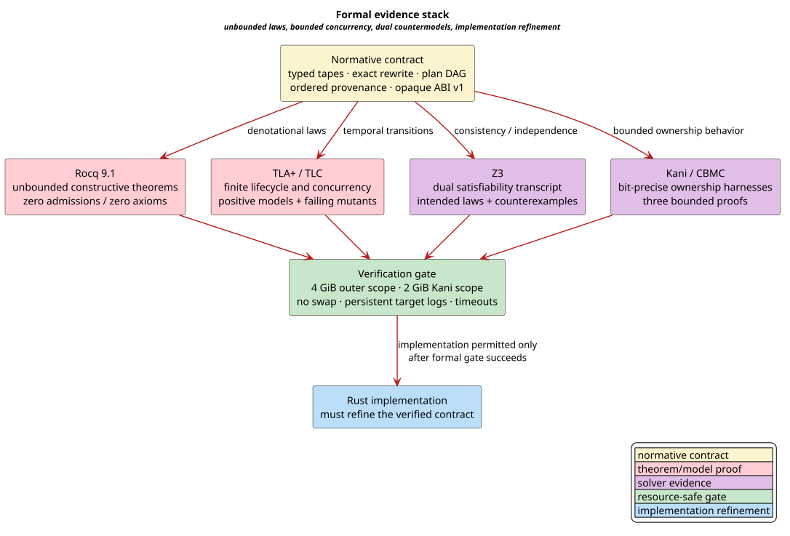

# Formal Verification of the Optimizer Contract

This report identifies exactly what is proved, what is exhaustively checked in
finite models, how representative defects are detected, and what remains an
implementation-refinement obligation.

## Terms

| Term | Definition |
|---|---|
| **Rocq** | Interactive theorem prover used for unbounded constructive laws. |
| **TLA+** | Temporal Logic of Actions specification language used for lifecycle and concurrency. |
| **TLC** | Explicit-state model checker for finite TLA+ configurations. |
| **SMT** | Satisfiability Modulo Theories; Z3 checks small consistency and independence formulas. |
| **Kani** | Rust verifier that lowers proof harnesses to the C Bounded Model Checker (CBMC). |
| **positive model** | Intended state machine; every configured invariant must hold. |
| **negative control** | Deliberately broken model; the named invariant must fail for the expected reason. |
| **refinement** | Evidence connecting implementation behavior to the abstract contract. |

## Evidence stack



[PlantUML source](../diagrams/optimization/formal-evidence-stack.puml)

*Yellow is the normative contract, red is theorem and temporal proof, purple is solver evidence, green is the resource-safe gate, and blue is the implementation boundary.*

<details><summary>Text view</summary>

<!-- vdl-disable-next-line ASCII001 -->
```text
Normative contract
 ├─ Rocq: unbounded denotational and algebraic laws
 ├─ TLA+/TLC: finite concurrent lifecycle exploration
 ├─ Z3: intended unsatisfiability plus constructive counterexample
 └─ Kani/CBMC: bit-precise bounded ownership behavior
          │
          ▼
resource-safe formal gate
          │
          ▼
Rust implementation must refine the checked contract
```

</details>

The tools are complementary. TLC state counts are not presented as unbounded
proofs. Rocq category and DAG theorems do not establish pointer validity. Kani
checks bounded executable behavior but does not replace the denotational proof.

## Unbounded Rocq theorems

All listed modules compile without `Admitted`, `Abort`, `Axiom`, `Conjecture`,
or proof parameters masquerading as global facts. `Assumptions.v` prints the
assumption closure of representative theorems.

| Module | Checked results |
|---|---|
| `optimizer/TapeSignatures.v` | Separate tape endpoints; signature identity and associativity; typed morphism associativity; constructive counterexample to input-only compatibility |
| `optimizer/RewriteSemantics.v` | Reflexive, symmetric, transitive exact rewrite; composable proof witnesses; precision and completeness no-promotion; exact publication implies denotational preservation |
| `optimizer/PlanDag.v` | Dependency paths strictly increase rank; valid plans are acyclic; no self edge; successful commit advances exactly once; out-of-order commit is rejected; existing provenance is a prefix after commit |
| `domain_integration/FuzzyReference.v` | Exact indexed reference membership; same-index transport; independent confirmer soundness/completeness; complete accepted/reference equivalence; explicit exact/approximate/incomplete outcomes; stale-snapshot, changed-configuration, candidate-self-confirmation, and incomplete-feed countermodels |
| `domain_integration/TypedHclg.v` | Semiring-equivalent weighted relations; typed composition and identity; denotational category laws; explicit weight-domain homomorphism obligations; left/right H/C/L/G parenthesization equivalence |
| `domain_integration/DataflowMigration.v` | Join-derived partial order and least-upper-bound laws; exact `join_assign` value/change flag; IFDS order reversal; explicit default-bottom bridge; permutation/duplicate invariance; stable-output uniqueness; resource-cap monotonicity; finite heap-worklist control |
| `domain_integration/GraphQuotient.v` | Total, nonempty, disjoint SCC fibers; exact quotient/original-edge witnesses; no self edges; acyclic condensation; vertex/component renaming equivariance; strict linear validated-CSR import charge; finite adapter control |
| `domain_integration/EvidenceAssurance.v` | Five-coordinate evidence identity; exact accepted/reference equality; field-by-field stale rejection; digest/trust/independence binding; self-confirmation rejection; no precision/completeness promotion; finite validation control |
| `abi/OwnershipLifecycle.v` | Initial retain count; release at zero rejected; retain then release neutral; transfer count preservation; opaque ABI v1 observational equivalence |

## Finite TLA+/TLC exploration

The following counts are from the checked configurations committed beside each
specification. A **distinct state** is a unique reachable assignment after TLC
fingerprinting; **depth** is the longest shortest path in the complete state
graph.

| Model | Generated | Distinct | Depth | Principal invariants |
|---|---:|---:|---:|---|
| `OptimizerLifecycle.tla` | 831 | 607 | 14 | ranked DAG, dependency readiness, no precision/completeness promotion, canonical provenance prefix, terminal non-publication, exact confirmation |
| `FuzzyReferenceLifecycle.tla` | 325 | 175 | 9 | immutable query-start snapshot, exact checked/reference intersection under arbitrary confirmation order, complete/incomplete coverage, no outcome promotion, exact/reference equality |
| `LibcpgEvidenceLifecycle.tla` | 7,570 | 2,721 | 10 | immutable evidence capture; exact publication requires five-coordinate freshness, digest binding, trust, independence, and distinct producer/verifier; stale, dependent, self, approximate, and incomplete rejection |
| `LazyWfstLifecycle.tla` | 449 | 80 | 7 | no persistent entries for no-cache/zero-LRU, positive LRU capacity, exact finite LRU order, unique transient entry |
| `AbiOwnershipLifecycle.tla` | 3,757 | 912 | 13 | retain count equals owned clients, moved/released clients do not own, ABI version and identity stable, private relayout unobservable |

The LazyWfst model deliberately represents LRU order as a finite sequence. An
earlier timestamp encoding introduced irrelevant unbounded clock symmetry and
was rejected after diagnostic exploration. The checked model preserves the
observable eviction order while keeping the state space finite.

## Negative controls

Every mutation is generated in ignored persistent evidence storage, checked,
and removed. A negative control passes only when TLC fails on the named
invariant; syntax errors, timeouts, and different invariant failures fail the
gate.

| Mutation | Required detection |
|---|---|
| No-cache insertion stores a persistent entry | `MemoryBounded` violation |
| Foreign provider callback acquires registry writer | `NoCallbackUnderRegWrite` violation |
| RRWM uses stale expert losses | `WeightsExact` violation |
| Cascade omits ordering constraint | `OrderingConstraints` violation |
| Optimizer commits an arbitrary finished node | `ProvenanceIsCanonicalPrefix` violation |
| Fuzzy confirmer accepts a non-reference candidate | `AcceptedExactlyCheckedReference` violation |
| libcpg exact publication omits the independence predicate while actor names remain distinct | `DependentGuaranteeBlocksExact` violation |
| LazyWfst policy change retains cache in no-cache mode | `NoCacheHasNoPersistentEntries` violation |
| ABI release fails to decrement retain count | `RetainsEqualOwners` violation |

## Z3 dual transcript

`vco-e4-contracts.smt2` has six independent queries with the required result
sequence:

```text
unsat
unsat
sat
unsat
unsat
unsat
```

The satisfiable query is intentional: if the output-tape type is erased, equal
input domains can coexist with an incompatible left output and right input.
The unsatisfiable queries cover precision promotion, completeness promotion,
release at zero under a positive-retain precondition, out-of-order successful
commit, and publication after cancellation.

`vco-e6-domain-contracts.smt2` adds seven independent fuzzy/H/C/L/G queries:

```text
unsat
unsat
sat
unsat
unsat
sat
unsat
```

The satisfiable cases are required countermodels: candidate membership can
coexist with non-membership in the exact reference, and equal numeric label
encodings can coexist with distinct tape-domain tags. The unsatisfiable cases
block stale-snapshot publication, incomplete publication, certificate/reference
disagreement, a missing H/C/L/G middle-tape equality, and non-associative
reweighting under the assumed semiring law.

`vco-e7-libcpg-assurance.smt2` adds thirteen dataflow, graph, and evidence
queries:

```text
unsat
unsat
unsat
unsat
unsat
unsat
unsat
unsat
unsat
unsat
unsat
unsat
sat
```

The final satisfiable query is a required nonvacuity witness: exact publication
is possible when every premise is present. The twelve unsatisfiable queries
cover join least-upper-bound behavior, IFDS order direction, exact mutation
flags, canonical merging, quotient self/exactness, linear CSR work, all stale
coordinates, digest/trust binding, dependence, self-confirmation, and
precision/completeness promotion.

## Kani bounded ABI refinement

`proofs/kani/abi_ownership_model.rs` contains three harnesses:

1. six nondeterministic operations across three clients preserve exactly one
   retain per owned client;
2. release at zero returns `None`; and
3. ABI v1 public observations ignore private layout.

Kani 0.67.0 and CBMC 6.8.0 checked all three harnesses successfully. The
ownership harness uses unwind bound 7, sufficient for its six-iteration loop
and the three-element owner-count loop. [Delmas et al. 2026](../BIBLIOGRAPHY.md)
describes Kani's Rust-to-CBMC verification pipeline.

## Resource and storage envelope

The outer proof script self-enters a user systemd scope with:

- `MemoryMax=4G`;
- `MemorySwapMax=0`;
- `CPUQuota=400%`;
- `TasksMax=64`;
- one Rocq build job and one TLC worker; and
- a 120-second timeout per TLC model.

Kani self-enters a nested 2 GiB/no-swap scope with one job and a 120-second
wall-clock timeout. Java receives a 3 GiB heap ceiling and an explicit headless
mode. All logs, model metadata, mutants, Kani targets, and tool temporary files
live below the repository's ignored `target/formal-verification/`; no material
artifact uses a memory-backed temporary directory.

## Verification boundary

This milestone proves the contract before optimizer API implementation. Later
Rust code must add refinement evidence connecting concrete plan, scheduler,
LazyWfst, and ABI types to these models. The present proofs do not claim:

- memory safety for arbitrary foreign pointers that violate C preconditions;
- liveness under an unfair executor or a provider that never returns;
- asymptotic bounds for domain work inside a plan node;
- that every indexed candidate feed is a fibration; or
- that approximate and exact denotations are interchangeable.

The E6 domain-integration registry adds 57 obligations in
`proofs/doc/domain-integration-invariants.tsv`. Every Rocq theorem/lemma, every
configured TLC invariant, and every named E6 SMT check maps to a unique planned
Rust property or compile-fail test. The registry checker requires the state
`required-red-before-production`; production adapter work cannot start until
those tests exist and a genuine red baseline has been recorded.

The E7 libcpg-assurance registry adds 122 obligations in
`proofs/doc/libcpg-assurance-invariants.tsv`. Its checker is exhaustive over
every named Rocq definition, record, inductive type, theorem, and lemma in the
three E7 files, every configured libcpg TLC invariant, and every named E7 SMT
query. Each maps to one unique required-red Rust property. Production libcpg,
llattice v2, libvgraph, lling-llang integration, and assurance-adapter work
remains blocked until those tests exist and the intended red evidence is
recorded.

## Reproduction

```bash
make verify-proofs
```

Inspect captured evidence under `target/formal-verification/logs/`. Successful
execution removes TLC state databases and generated mutants; logs remain for
diagnosis and are ignored by Git.

## References

- [Lamport 2002](../BIBLIOGRAPHY.md)
- [Delmas et al. 2026](../BIBLIOGRAPHY.md)
- [Mac Lane 1998](../BIBLIOGRAPHY.md)
