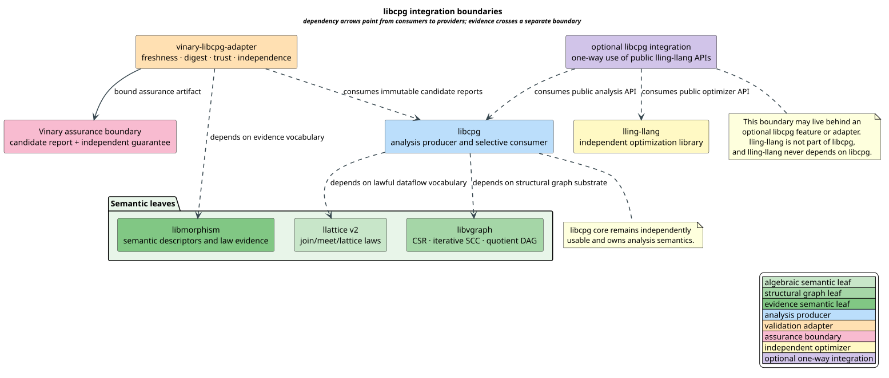
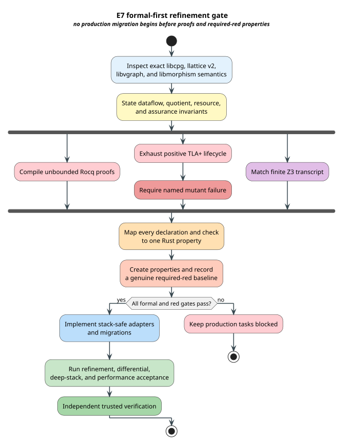

# libcpg Dataflow, Graph, and Assurance Contract

This document is the normative pre-implementation contract for the E7
integration campaign. It fixes the meaning of the libcpg-to-llattice v2
migration, the libcpg-to-libvgraph structural adapter, and the
`vinary-libcpg-adapter` assurance boundary. Production work is forbidden until
the formal gate and the required-red property suites described here succeed.

## Terms and scope

| Term | Definition |
|---|---|
| **join-semilattice** | A set with an associative, commutative, and idempotent join operation. |
| **induced order** | The order defined by join: the left value is below the right value exactly when joining them yields the right value. |
| **subsumption** | libcpg IFDS terminology for containment; its arguments reverse the llattice v2 induced order. |
| **strongly connected component (SCC)** | A maximal set of graph vertices that are mutually reachable. |
| **quotient fiber** | The complete set of original vertices mapped to one SCC identifier. |
| **condensation graph** | The directed acyclic graph obtained by contracting each SCC to one vertex. |
| **candidate report** | Analysis output that has not independently established an exact-publication claim. |
| **exact guarantee** | Trusted validation evidence bound to one immutable evidence index and result digest. |
| **independence relation** | A trust-policy judgment between producer and verifier; actor-name inequality is necessary in the modeled policy but is not sufficient. |
| **precision** | Whether reported findings use exact or approximate semantics. |
| **completeness** | Whether every finding in the selected semantics is covered. |
| **refinement** | Executable evidence that concrete Rust behavior implements the formal contract. |

The campaign makes three deliberately narrow changes:

1. replace duplicated libcpg lattice vocabulary with explicit llattice v2
   adapters without changing analysis results;
2. consume libvgraph for structural SCC, quotient, condensation, and wavefront
   behavior without moving analysis semantics into libvgraph; and
3. produce assurance artifacts through a companion adapter while permitting a
   narrow optional libcpg integration to use lling-llang's public API.

lling-llang remains an independent library and is never a libcpg subsystem.
The optional dependency direction is libcpg integration code toward
lling-llang. The libcpg analysis core remains independently usable, and
lling-llang never depends on libcpg.



[PlantUML source](../diagrams/optimization/libcpg-integration-boundaries.puml)

*Green components are semantic leaves, blue is libcpg, orange is the companion
adapter, pink is the assurance boundary, and yellow is lling-llang.*

<details><summary>Text view</summary>

<!-- vdl-disable-next-line ASCII001 -->
```text
libcpg core ──► llattice v2
      └──────► libvgraph
vinary-libcpg-adapter ──► libcpg core
                     └──► libmorphism
optional libcpg integration ──► libcpg core
                           └──► lling-llang

Ownership rule: lling-llang is independent; optional libcpg integration may
use its public API, while the two cores remain separately usable.
```

</details>

## Lawful dataflow migration

Let $`L`$ be a join-semilattice, let $`\vee`$ denote join, and let
$`\preceq`$ denote the induced order:

```math
a \preceq b \quad\Longleftrightarrow\quad a \vee b = b.
```

The Rocq model proves reflexivity, transitivity, antisymmetry, and the
least-upper-bound laws from associativity, commutativity, and idempotence.
These are the laws required by Kildall-style accumulation
([Kildall 1973](../BIBLIOGRAPHY.md)) and by the lattice
interpretation of static analysis
([Cousot & Cousot 1977](../BIBLIOGRAPHY.md)).

### Adapter direction

The intraprocedural libcpg operation and llattice v2 operation agree directly:

```math
\mathrm{legacyJoin}(a,b)
=
\mathrm{llatticeJoin}(a,b)
=
a \vee b.
```

The in-place mutation flag is exact:

```math
\mathrm{changed}(a,b)
\Longleftrightarrow
(a \vee b) \ne a.
```

The Interprocedural Finite Distributive Subset (IFDS) interface uses the
opposite observation order:

```math
\mathrm{subsumes}(\mathit{container},\mathit{contained})
\Longleftrightarrow
\mathit{contained} \preceq \mathit{container}.
```

This reversal is an adapter fact, not a second lattice law. IFDS itself is the
graph-reachability formulation of distributive interprocedural dataflow
described by
[Reps, Horwitz & Sagiv 1995](../BIBLIOGRAPHY.md).

### `Default` is not automatically bottom

The legacy IFDS trait obtains an initial value through Rust's `Default`.
llattice v2 exposes `Bottom` only when a type has a context-free least element.
The bridge is lawful only for an explicitly named type satisfying:

```math
\mathrm{Default}(L)=0_L
\quad\text{and}\quad
\forall x \in L.\; 0_L \preceq x.
```

There is no blanket `Default`-to-`Bottom` implementation. Analyses whose initial
fact depends on procedure, query, program point, or configuration must receive
that value explicitly.

### Convergence and budgets

Join laws make merge order and duplicate delivery irrelevant; they do not
guarantee termination. A complete result additionally needs one of these
analysis-specific facts:

- finite lattice height;
- a proved finite ascending-chain bound;
- a lawful widening with its own soundness contract; or
- an explicit stable fixed-point witness.

For deterministic monotone iteration from bottom, the model proves:

- once a state is stable, later iterations are identical;
- two completed budgets produce the same output;
- a larger budget preserves an already completed output; and
- incompleteness at a larger budget implies incompleteness at every smaller
  budget.

The publication layer must therefore preserve the distinction between
`Complete` and `Incomplete`. Reaching a resource cap never proves stability.

## Exact structural-graph quotient

Let $`G=(V,E)`$ be a directed graph and let $`q:V\to C`$ map each vertex to its
SCC identifier. The fiber over component $`c`$ is:

```math
q^{-1}(c)=\{v\in V : q(v)=c\}.
```

Every vertex belongs to exactly one nonempty fiber. Two vertices share a fiber
exactly when each reaches the other:

```math
q(u)=q(v)
\Longleftrightarrow
(u \to^{*} v)\land(v \to^{*} u).
```

The condensation edge relation is exact:

```math
(c,d)\in E_C
\Longleftrightarrow
c\ne d
\land
\exists u,v.\;
q(u)=c\land q(v)=d\land(u,v)\in E.
```

Consequently, every quotient edge retains an original-edge witness, self edges
are absent, and the condensation graph is acyclic.

### Renaming equivariance

A lawful bijective vertex renaming may change dense numeric identifiers but
must not change graph meaning. The induced component bijection preserves both
fiber membership and condensation edges. Equality of raw component numbers is
not required across renaming; equality up to the induced bijection is.

### Algorithm and resource contract

libvgraph owns the canonical dense Compressed Sparse Row (CSR) representation
and iterative Tarjan SCC decomposition. The SCC algorithm follows the
linear-time depth-first structure of
[Tarjan 1972](../BIBLIOGRAPHY.md), while placing every
input-depth-dependent frame on the heap.

For already canonical dense CSR:

| Operation | Required time | Auxiliary space | Native-stack growth |
|---|---:|---:|---:|
| validated import | $`\mathcal{O}(\lvert V\rvert+\lvert E\rvert)`$ | $`\mathcal{O}(\lvert V\rvert)`$ | constant |
| iterative SCC | $`\mathcal{O}(\lvert V\rvert+\lvert E\rvert)`$ | $`\mathcal{O}(\lvert V\rvert)`$ | constant |
| quotient/condensation | $`\mathcal{O}(\lvert V\rvert+\lvert E\rvert)`$ | $`\mathcal{O}(\lvert V\rvert+\lvert E_C\rvert)`$ | constant |
| deterministic wavefront | $`\mathcal{O}(\lvert C\rvert+\lvert E_C\rvert)`$ | $`\mathcal{O}(\lvert C\rvert)`$ | constant |

The formal import charge is exactly $`2|V|+2|E|=2(|V|+|E|)`$: one validation
and one import pass on each axis. Arbitrary stable-label canonicalization is a
separately named cost and must not be hidden inside the SCC measurement.

This control flow is a finite graph machine, not a pushdown-language problem.
It uses explicit heap worklists and frames because those are the optimal
stack-safe representation. A pushdown automaton is reserved for genuinely
matched call/return or mutually recursive semantics.

## Assurance evidence

An evidence index is the immutable five-tuple:

```math
\beta=(s,r,c,t,e),
```

where $`s`$ is the analysis subject, $`r`$ is the source snapshot or revision,
$`c`$ is the complete analysis configuration, $`t`$ is the tool revision, and
$`e`$ is the execution environment identity. A separate digest $`d`$ binds the
reported result bytes.

An exact-publication certificate for report $`R`$ and guarantee $`G`$ exists
only when all of the following hold:

1. report precision is exact;
2. report coverage is complete;
3. both report and guarantee indices equal the requested index;
4. report and guarantee digests are equal;
5. the guarantee is trusted;
6. the verifier is independent of the report producer under the configured
   trust relation;
7. candidate generation covers the reference semantics; and
8. confirmation is sound and complete against that reference.

Under those premises, the accepted findings equal the requested reference
denotation. Stale subject, snapshot, configuration, tool, or environment
coordinates each independently reject exact publication.

Actor inequality does not establish independence. The TLA+ negative control
keeps distinct producer and verifier identifiers but changes the trust relation
to dependent; TLC then produces a concrete
`DependentGuaranteeBlocksExact` counterexample.

## Literate validation algorithms

### Dataflow adapter

The purpose of this algorithm is to preserve the old value and return contract
while delegating the algebra to llattice v2.

```text
DATAFLOW-JOIN-ASSIGN(current, incoming)
    joined  ← LLATTICE-JOIN(current, incoming)
    changed ← (joined ≠ current)
    current ← joined
    return changed
```

The order of the assignments matters: `changed` compares against the old
`current`. The corresponding property requires the returned flag to be true
exactly when the stored value changes.

### Exact evidence validation

The validator short-circuits failures but does not reorder semantic priority:
incomplete and approximate results remain classified rather than being
misreported as trusted exact results.

```text
VALIDATE-EXACT(requested, report, guarantee, trust-policy)
    require report.precision = exact
    require report.coverage = complete
    require report.index = requested
    require guarantee.index = requested
    require report.digest = guarantee.digest
    require trust-policy.trusted(guarantee)
    require trust-policy.independent(report.producer, guarantee.verifier)
    require generator coverage and confirmer soundness/completeness
    return complete-exact
```

The implementation must use a flat finite validation state machine. It neither
recurses nor needs a pushdown stack.

## Concurrency and determinism

Parallelism is legal only between immutable, independent analysis units or
condensation-wavefront members. Each worker produces private candidate output.
Commit order is derived from canonical component order, never task-completion
timing.

The following results must be byte-identical for exact execution:

- one worker and multiple workers;
- original and randomized worker completion order;
- original edge insertion order and any permutation;
- duplicate delivery of a join operand; and
- every lawful bijective vertex renaming, after applying the induced
  identifier map.

Shared mutation of lattice values or assurance artifacts is excluded unless a
separate deterministic merge contract is proved.

Optional libcpg use of lling-llang follows the same rule: pass immutable typed
plans or reports across the integration boundary, keep each library's internal
state private, and canonicalize commit order in the consuming integration
layer.

## Formal evidence and refinement obligations



[PlantUML source](../diagrams/optimization/libcpg-refinement-gate.puml)

| Artifact | Strength | Obligation |
|---|---|---|
| `DataflowMigration.v` | unbounded Rocq | algebra, order reversal, stable iteration, budgets, finite heap control |
| `GraphQuotient.v` | unbounded Rocq | exact partition/quotient, acyclicity, renaming, linear import charge |
| `EvidenceAssurance.v` | unbounded Rocq | freshness, exact equality, trust, independence, no promotion |
| `LibcpgEvidenceLifecycle.tla` | exhaustive finite TLC | capture/analyze/guarantee/publish lifecycle and all rejection paths |
| dependent-evidence mutant | required finite failure | omission of independence must violate the named invariant |
| `vco-e7-libcpg-assurance.smt2` | finite Z3 boundary | 12 impossible counterclaims and one nonvacuous valid witness |
| `libcpg-assurance-invariants.tsv` | exhaustive registry | every named declaration/check maps one-to-one to a Rust property |

The registry contains 122 obligations and rejects omissions, duplicates,
unknown artifacts, or any state other than
`required-red-before-production`. The next tranche must create those five Rust
property suites and capture a genuine failing baseline before production edits.

## Acceptance boundary

E7 production is accepted only after all of these are true:

- all formal artifacts pass under the bounded no-swap gate;
- every registry property exists and first failed for the intended missing
  implementation behavior;
- the migrated analyses are differentially identical to the preserved serial
  libcpg reference;
- deep linear graphs pass under the campaign's small-native-stack gate;
- exact worker-count and insertion-order determinism pass;
- no hot-path wall-time, allocation, or peak-RSS regression exceeds the
  preregistered campaign margin;
- documentation passes vinary-doc-lint; and
- independent trusted pgmcp verification accepts the evidence.

## References

- [Kildall 1973](../BIBLIOGRAPHY.md)
- [Cousot & Cousot 1977](../BIBLIOGRAPHY.md)
- [Tarjan 1972](../BIBLIOGRAPHY.md)
- [Reps, Horwitz & Sagiv 1995](../BIBLIOGRAPHY.md)
- [Lamport 2002](../BIBLIOGRAPHY.md)
