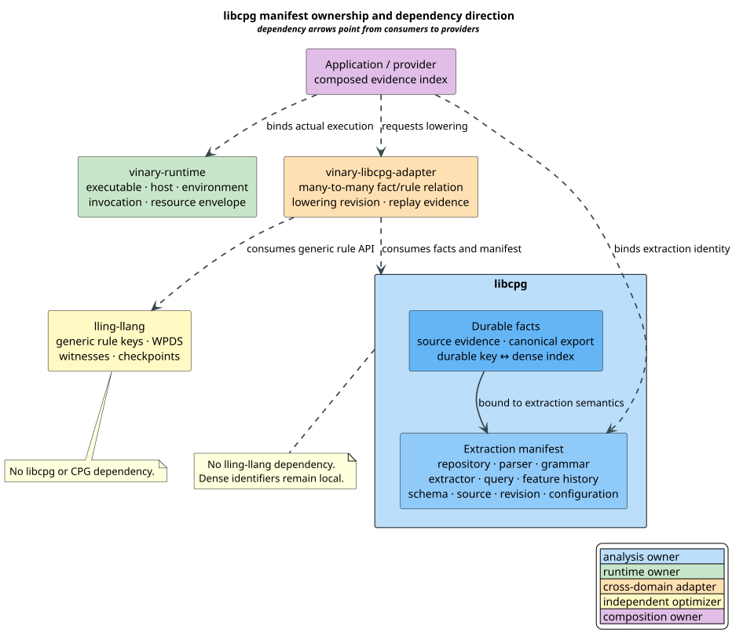
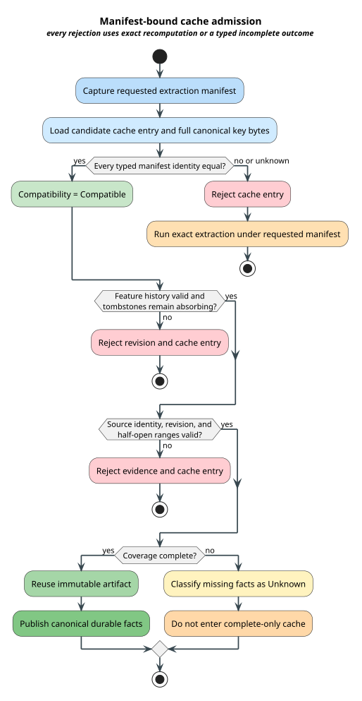

# libcpg Manifest and Durable-Fact Contract

This document is the normative, pre-implementation contract for versioned
libcpg extraction manifests and portable fact identities. It preserves the
existing dense hot path while adding the durable identities needed by caches,
portable exports, evidence, and the separately owned
`vinary-libcpg-adapter`. Production schema work is not admissible until the
formal models, mutation controls, and required-red properties described here
pass.

## Terms

| Term | Definition |
|---|---|
| **extraction manifest** | The immutable tuple of identities that determines libcpg extraction semantics for one source revision. |
| **runtime envelope** | Execution identity owned by `vinary-runtime`: executable, host, environment, invocation, and resource-envelope identities. |
| **durable fact key** | A portable external identifier that survives an explicitly recognized display rename and is never a dense array offset. |
| **dense fact identifier** | A snapshot-local `u32` index used for compact arrays, bit sets, and cache-friendly analysis. |
| **feature identity** | A stable identifier for one extraction feature and its unchanged semantics across manifest revisions. |
| **tombstone** | A retained historical feature entry that is no longer active and cannot be reactivated or reused for different semantics. |
| **source evidence** | A source identity, source revision, and validated half-open byte range attached to a fact. |
| **canonical export** | A deterministic fact sequence ordered by durable key and independent of insertion or worker-completion order. |
| **coverage** | Whether extraction considered every fact in the selected semantics; incomplete coverage cannot establish absence. |
| **lowering relation** | The many-to-many relation from durable libcpg fact keys to generic lling-llang rule keys, owned by `vinary-libcpg-adapter`. |
| **manifest compatibility** | Exact equality of every extraction-semantic identity; uncertainty is incompatible with cache reuse. |

`NodeId`, `FactUniverse` dense identifiers, and PyG dense indices are useful
snapshot-local identifiers. They are not durable fact keys. Calling a numeric
identifier “stable” within one graph does not make it stable across repository
revisions, parser upgrades, or canonical rebuilds.

## Reviewed starting point

The protected libcpg baseline is commit
`0a54d1e9307633b3a440b4154d088c4d08703d1b` on `main`. Its user-owned
`Cargo.lock` edit is retained unchanged. The formal gate records hashes for
the manifest, graph, fact, export, parser-registry, and incremental-cache
surfaces and fails if any moves before an ownership handoff.

The existing implementation already provides several correct foundations:

- `NodeId` and `FactUniverse` use compact `u32` identifiers;
- `FactUniverse` retains a checked dense-to-value correspondence;
- `PygExport` aligns dense rows, graph-local node identifiers, and exact
  `SourceRange` values;
- Datalog export sorts and deduplicates relation rows deterministically; and
- `FunctionAnalysisCache` compares full canonical key bytes after digest
  lookup, uses function-local coordinates, bounds entries and resident bytes,
  and conservatively bypasses nonlocal dependencies.

The function cache is not a repository manifest. Its key binds local source
bytes or syntax shape, language, builder options, a local schema version, and
artifact kind. It does not bind repository, parser, grammar, extractor, query,
feature-history, portable schema, source-revision, or repository-revision
identity. The new manifest wraps this cache boundary; it does not weaken or
duplicate the existing collision-safe key comparison.

## Ownership and dependency architecture



[PlantUML source](../diagrams/optimization/libcpg-manifest-ownership.puml)

| Owner | Authoritative dimensions | Explicit exclusions |
|---|---|---|
| libcpg | Repository, parser, grammar, extractor, query, feature history, fact schema, source, source revision, semantic configuration | Host process, generic WPDS rule semantics, optimizer execution |
| `vinary-runtime` | Executable, host, environment, invocation, resource envelope | libcpg feature meanings and fact schemas |
| `vinary-libcpg-adapter` | Fact-to-rule lowering relation, lowering revision, cross-domain evidence | libcpg extraction and lling-llang generic rule semantics |
| lling-llang | Generic external rule keys, WPDS rules, witnesses, checkpoints | libcpg, CPGs, extractor manifests |

The only allowed core dependency edges originate in
`vinary-libcpg-adapter`: it may depend on libcpg and it may independently
depend on lling-llang.

There is no libcpg-to-lling-llang or lling-llang-to-libcpg core dependency.
An application may compose the runtime envelope and extraction manifest into a
larger evidence index without transferring ownership of either component.

## Formal semantic contract

### Extraction manifest

The extraction manifest is the typed tuple:

```math
M=(r,p,g,x,q,h,s,u,v,c),
```

where $`r`$ is repository identity, $`p`$ parser identity, $`g`$ grammar
identity, $`x`$ extractor identity, $`q`$ query identity, $`h`$ feature-history
revision, $`s`$ fact-schema identity, $`u`$ source identity, $`v`$ source
revision, and $`c`$ semantic-configuration identity.

Two manifests are cache-compatible exactly when the typed tuples are equal:

```math
\mathrm{compatible}(M_1,M_2)\quad\Longleftrightarrow\quad M_1=M_2.
```

Each coordinate mismatch independently rejects reuse. A comparison result of
`Unknown` also rejects reuse. Display repository names and display source paths
are metadata outside $`M`$; an explicit rename preserves the durable identity.
A content, grammar, query, feature, schema, or configuration change produces a
new identity and invalidates dependent evidence.

The runtime envelope is a separate tuple:

```math
R=(e,h,z,n,b),
```

where $`e`$ is executable identity, $`h`$ is host identity, $`z`$ is
environment identity, $`n`$ is invocation identity, and $`b`$ is the actual
resource envelope. Resource limits that change extraction semantics are also
represented by libcpg's semantic-configuration identity; the runtime envelope
records what was actually enforced.

### Durable and dense correspondence

A durable fact key is constructed from stable semantic coordinates:

```math
k=(u,f,a,o),
```

where $`u`$ is source identity, $`f`$ feature identity, $`a`$ is a stable
semantic anchor, and $`o`$ distinguishes multiple facts at the same anchor.
Display paths, dense indices, and mutable process addresses do not enter $`k`$.
A semantic edit may retain $`k`$ only when the extractor establishes continuity;
otherwise the old key is retired and a new key is minted.

For active fact set $`A`$ of size $`n`$, the dense table supplies inverse maps:

```math
d:A\to[0,n),\qquad k:[0,n)\to A,
```

with the laws:

```math
k(d(a))=a,\qquad d(k(i))=i.
```

Consequently, every active durable key has exactly one bounded dense identifier,
every dense identifier has a durable key, and two durable keys cannot share one
dense identifier. Dense identifiers may change between snapshots without
changing portable identity.

### Feature revisions and tombstones

Every feature revision retains all historical feature identifiers. For an old
entry $`a`$ and its new entry $`a'`$:

```math
\mathrm{id}(a')=\mathrm{id}(a)\quad\Longrightarrow\quad
\mathrm{semantics}(a')=\mathrm{semantics}(a).
```

Renaming a display label preserves identity, semantics, and state. A tombstone
is absorbing:

```math
\mathrm{state}(a)=\mathrm{Tombstoned}\quad\Longrightarrow\quad
\mathrm{state}(a')=\mathrm{Tombstoned}.
```

Reactivation and semantic reuse are invalid feature-history transitions, not
backward-compatible changes.

### Exact source evidence

A source-backed fact carries source identity $`u`$, source revision $`v`$, and
a half-open range $`[b_s,b_e)`$. For source byte length $`N`$:

```math
0\le b_s\le b_e\le N.
```

The source and revision must equal the manifest. Byte offsets are authoritative;
line and column coordinates are checked derived conveniences. Synthetic facts
must use an explicitly typed synthetic-evidence variant rather than forge a
zero range.

### Cache admission and invalidation

An artifact is reusable only if all gates hold:

```math
\mathrm{reuse}\Longleftrightarrow
\mathrm{compatible}(M_{\mathrm{requested}},M_{\mathrm{cached}})\land
\mathrm{comparisonKnown}\land
\mathrm{complete}\land
\mathrm{rangeValid}\land
\mathrm{featureHistoryValid}.
```

This is conservative invalidation: failure to prove equality causes a miss and
exact recomputation. A digest accelerates lookup but never replaces canonical
byte equality. This follows the verifying-trace distinction between dependency
identity and rebuild policy described by
[Mokhov, Mitchell & Peyton Jones 2018](https://doi.org/10.1145/3236774).



[PlantUML source](../diagrams/optimization/libcpg-manifest-invalidation.puml)

### Coverage and absence

Observation and coverage are independent. For fact $`f`$:

```math
\mathrm{classify}(f)=
\begin{cases}
\mathrm{Present} & \text{if observed},\\
\mathrm{Absent} & \text{if not observed and coverage is complete},\\
\mathrm{Unknown} & \text{if not observed and coverage is incomplete}.
\end{cases}
```

Budget exhaustion, cancellation, unsupported syntax, missing parser features,
and truncated input therefore cannot establish absence.

### Canonical export

Portable export scans the canonical key universe and selects active facts. If
$`\pi`$ permutes insertion order, then:

```math
\mathrm{export}(F)=\mathrm{export}(\pi(F)).
```

The output contains every active represented key exactly once and no key not
present in the input. A deterministic encoder applied to equal canonical key
sequences produces equal bytes.

### Many-to-many lowering

The adapter owns a relation rather than a function:

```math
L\subseteq F\times R,
```

where $`F`$ is the durable fact-key set and $`R`$ is lling-llang's generic rule
key set. One fact may justify several rules, and one rule may combine several
facts. A lowering certificate retains every selected pair and requires at least
one source fact for every emitted rule. This is relational provenance in the
general sense developed by
[Green, Karvounarakis & Tannen 2007](https://doi.org/10.1145/1265530.1265535); the
adapter does not claim that arbitrary provenance composition is a libcpg
semiring law.

## Literate algorithms

### Capture and compare a manifest

The comparison is over a fixed number of typed identities, so its time and
auxiliary-space cost are constant once canonical identities have been computed.

```text
MANIFEST-COMPATIBILITY(requested, cached)
  for each typed extraction dimension in schema order
    if requested.dimension differs from cached.dimension
      return Incompatible(dimension)
  return Compatible
```

Unknown or malformed dimensions return `Unknown`, never `Compatible`.

### Build the snapshot-local dense table

Fact keys arrive in canonical order from the immutable snapshot. The builder
uses one pre-sized vector and one key-to-dense lookup table. No input-depth
state is placed on the native stack.

```text
BUILD-DENSE-INDEX(canonical-active-facts)
  reserve exactly the checked active-fact count
  for each key in canonical-active-facts
    reject duplicate keys
    assign the next checked u32 dense identifier
    append key to dense-to-key vector
    insert key and dense identifier into key-to-dense map
  verify both round trips
  return immutable index
```

For an already canonical snapshot this is $`\mathcal{O}(n)`$ expected time, $`\mathcal{O}(n)`$
space, and constant native-stack growth. Canonicalization of arbitrary external
input is a separate named cost. The production implementation must benchmark
comparison sort against a fixed-width radix strategy on preregistered small,
medium, and large fact populations; it may select adaptively, but output bytes
must remain identical.

### Export with an explicit heap machine

```text
EXPORT-CANONICAL(snapshot, limits)
  state.remaining := snapshot.canonical_keys
  state.output := a bounded pre-sized vector
  while state.remaining is not empty
    key := remove the next key from the explicit heap cursor
    charge one unit of work
    if snapshot marks key active
      append its validated record
  return state.output
```

The Rocq relation proves for an arbitrary $`m`$-step execution:

```math
m+\lvert\mathrm{remaining}_{\mathrm{final}}\rvert
=\lvert\mathrm{remaining}_{\mathrm{initial}}\rvert,
```

so total work is linear and the native-frame bound remains one. There is no
mutual recursion and therefore no need to model this flat scan as a pushdown
language.

## Parallel and concurrent execution

The immutable manifest, feature history, and dense table may be shared by
read-only reference. Parallel extraction uses worker-local fact buffers and a
deterministic ordered commit:

1. partition work by stable source key;
2. emit worker-local durable records without allocating global dense IDs;
3. wait for all selected workers or classify the result incomplete;
4. merge by canonical durable key, rejecting duplicates or conflicting
   semantics; and
5. assign dense identifiers in the canonical merged order.

No shared atomic counter determines a portable identifier. Worker count,
scheduling, and completion order cannot affect canonical bytes. Cancellation
discards uncommitted worker buffers and produces incomplete coverage; it does
not publish a partial cache entry as complete. `schedlib` may orchestrate these
tasks after its immutable release, but the manifest and fact schema do not
depend on a scheduler implementation.

## Proposed typed Rust surface

The production API should use domain vocabulary rather than category-runtime
types:

- fixed-width typed identities for every manifest coordinate;
- `ExtractorManifest` and a separate runtime-envelope binding;
- `DurableFactKey` and `DenseFactIndex<K>`;
- `HistoricalFeatureId`, `FeatureHistory`, and typed active/tombstoned entries;
- `SourceFactEvidence` with checked half-open ranges;
- `ExtractionCoverage` and orthogonal precision/completion metadata;
- `PortableFactSnapshot` with canonical iteration and explicit limits; and
- `CacheCompatibility` with `Compatible`, `Incompatible`, and `Unknown`.

The public API must not expose a generic runtime `Category`, `Monad`, or
`Fibration` abstraction. The useful categorical content is already concrete:
typed objects, lawful mappings, indexed fact families, composition witnesses,
and preservation proofs.

## Migration and compatibility

1. Preserve existing `NodeId`, `FactUniverse`, Datalog, and PyG APIs.
2. Add the durable manifest/fact module additively and assign a new portable
   schema identity.
3. Bind existing function-cache reuse to the enclosing extraction manifest;
   an incompatible or unknown manifest clears or namespaces affected entries.
4. Export both the durable key and any snapshot-local `NodeId` evidence where
   available; never serialize a dense identifier as durable identity.
5. Retain every historical feature identifier and tombstone through schema
   revisions.
6. Release libcpg identity APIs before creating the independently versioned
   adapter.
7. In the adapter, lower the fact/rule relation without adding a libcpg
   dependency to lling-llang or the reverse.

## Formal and test evidence

The executable contract contains:

- 63 unbounded Rocq theorems and lemmas;
- 25 TLC safety invariants plus eventual termination over 19 scenarios;
- one causal single-defect mutant for every TLC property;
- 24 Z3 results: 22 forbidden-state queries and two constructive witnesses;
- 113 unique required-red Rust properties; and
- immutable hashes for ten reviewed libcpg API and manifest files plus the
  explicitly absent adapter baseline.

The deterministic ledger is
[`libcpg-manifest-invariants.tsv`](../../proofs/doc/libcpg-manifest-invariants.tsv).
The implementation must turn the corresponding required-red properties green
without weakening, deleting, renaming, or self-confirming them.

## Security and resource guidance

The detailed threat analysis is in
[`libcpg-manifest-trust-model.md`](../security/libcpg-manifest-trust-model.md).
Portable digests require an explicitly versioned canonical preimage and domain
separation. A cryptographic digest detects change only under its algorithm and
trust assumptions; it is not authentication. SHA-2 definitions are standardized
by [NIST FIPS 180-4](https://csrc.nist.gov/pubs/fips/180-4/upd1/final), while signature,
attestation, and reviewer authority remain assurance-layer concerns.

Every decoder and traversal must reject declared lengths, counts, offsets, and
work budgets before allocation; use checked arithmetic; retain input-depth state
on the heap; and honor the campaign's repository-backed spill policy. Neither
`/tmp` nor another tmpfs is an admissible overflow store.

## References

- Mokhov, A., Mitchell, N., & Peyton Jones, S. (2018). *Build Systems à la
  Carte.* [Canonical DOI](https://doi.org/10.1145/3236774).
- Green, T. J., Karvounarakis, G., & Tannen, V. (2007). *Provenance
  Semirings.* [Canonical DOI](https://doi.org/10.1145/1265530.1265535).
- National Institute of Standards and Technology. (2015). *Secure Hash
  Standard.* [FIPS PUB 180-4](https://csrc.nist.gov/pubs/fips/180-4/upd1/final).
