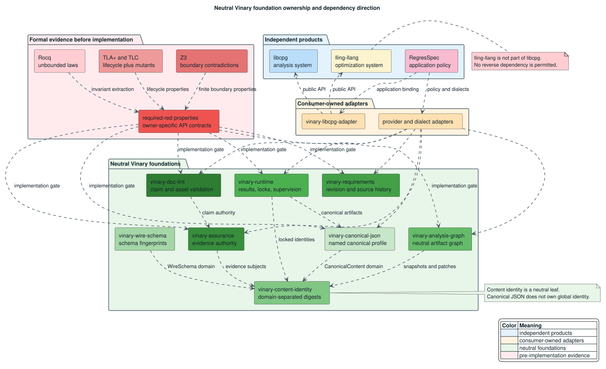
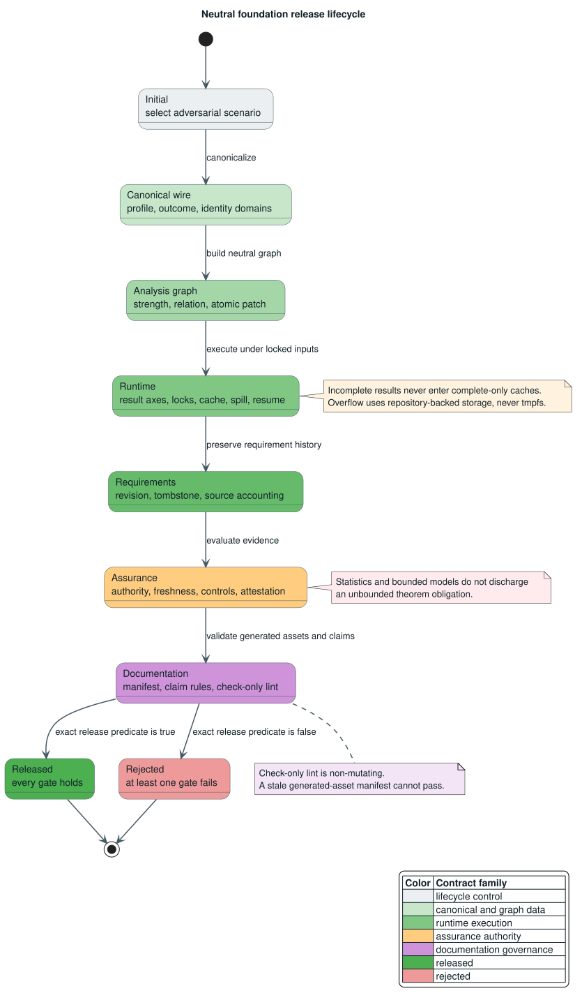

# Neutral Vinary Foundation Contract

This document is the normative, pre-implementation contract for the
RegresSpec-driven E9 neutral Vinary foundations. It assigns each capability to
one owner, defines the laws that cross owners, and records the evidence that
must exist before protected prototype code changes. It does not authorize
production implementation in any protected repository.

The contract follows the reviewed RegresSpec Vinary-tree gap-analysis
decisions:
neutral libraries remain application-independent; domain policy stays in
adapters; dense hot-path identifiers remain distinct from durable external
identity; and no evidence class may be promoted into a stronger claim.

## Normative language and terms

The words **must**, **must not**, **required**, and **forbidden** identify
acceptance conditions. The following terms are used throughout.

| Term | Definition |
|---|---|
| **artifact** | Immutable bytes plus the profile, schema, domain, and input identities needed to interpret those bytes. |
| **canonical profile** | A named, versioned mapping from an admitted value domain to one byte sequence per value. |
| **content identity** | A digest over an explicit identity domain and framed payload; it is not a schema fingerprint. |
| **schema fingerprint** | An identity for wire-level type and schema meaning, independent of any one encoded value. |
| **precision** | Whether the reported denotation is exact or approximate. |
| **completion** | Whether the authorized search or execution was completed. |
| **authority** | The kind of evidence offered: theorem proof, bounded model check, statistical inference, empirical test, assumption, unsupported claim, or scope exclusion. |
| **input lock** | An immutable identity for an executable, model, data set, schema, environment, seed, configuration, or other replay-relevant input. |
| **required-red property** | A property written before production code that fails for the intended missing API or behavior. |
| **ownership gate** | A prohibition on changing a protected prototype until its owner supplies an immutable reviewed baseline or explicit handoff. |
| **native-stack bound** | A bound on ordinary call frames; input-shaped control state must instead use bounded, heap-resident machine state. |

## Architectural boundary



[PlantUML source](../diagrams/optimization/neutral-foundation-architecture.puml)

*Blue components are independent products, orange components are adapters,
green components are neutral foundations, and red components are
pre-implementation evidence.*

<details><summary>Text view</summary>

<!-- vdl-disable-next-line ASCII001 -->
```text
RegresSpec ──> consumer-owned adapters ──> neutral Vinary foundations
                         │                         │
                         ├──> libcpg public API    ├── canonical JSON
                         └──> lling-llang API      ├── wire schema
                                                   ├── content identity
lling-llang and libcpg remain independent.         ├── analysis graph
No neutral foundation depends on RegresSpec.       ├── runtime / requirements
                                                   └── assurance / doc lint

Rocq + TLA+/TLC + Z3 ──> required-red properties ──> owner handoff
```

</details>

The dependency rules are immutable for this campaign:

1. lling-llang is not part of libcpg and does not depend on libcpg.
2. libcpg may consume lling-llang only through a separate adapter such as
   `vinary-libcpg-adapter`; that adapter may depend on both public APIs.
3. no neutral foundation depends on RegresSpec, pgmcp, a provider executable,
   or an application-specific dialect.
4. `vinary-canonical-json` owns one canonical wire profile, not global semantic
   identity.
5. `vinary-content-identity` is an independent neutral leaf. Schema and content
   identities occupy different domains.
6. canonical JSON is a boundary representation, not a native graph, runtime,
   scheduler, or optimizer hot-path representation.

## Ownership matrix

| Owner | Owns | Does not own |
|---|---|---|
| `vinary-canonical-json` | Named canonical encoding, admitted numbers, duplicate-key rejection, canonical byte emission, atomic `ByteSink`, malformed and budget outcomes | Global content identity, application schemas, provider policy |
| `vinary-wire-schema` | Stable wire-format and schema fingerprints | Content digests, runtime cache keys |
| `vinary-content-identity` | Domain framing and content digests | Canonicalization, schema derivation, application semantics |
| `vinary-analysis-graph` | Neutral nodes and edges, epistemic and snapshot axes, relation-node lowering, dialect conformance hooks, JSONL budgets, atomic base-digest patches, explicit projection loss | RegresSpec-required fields, CPG internals, hypergraph-specific duplicate storage |
| `vinary-runtime` | Orthogonal result axes, complete input locks, complete-only cache/release gates, process-tree supervision, bounded output, repository-backed spill, checkpoint compatibility | Tool-specific semantics, application evidence policy |
| `vinary-requirements` | Stable requirement identity, revisions, tombstones, total source accounting, preserved unclassified text | pgmcp imports, RegresSpec claim-ledger policy |
| `vinary-assurance` | Evidence authority taxonomy, freshness, applicability, negative controls, revision-bound attestations | Provider execution, theorem proving, statistical engines |
| `vinary-doc-lint` | Deterministic generated-asset manifests, staleness, assurance-aware claim rules, non-mutating check-only validation | Rendering, opaque heuristic censorship, application-specific evidence generation |

## Canonical wire profile

The profile identifier is `vinary.canonical-json/v1`. A consumer must compare
the identifier, not infer semantics from the crate name. The admitted numeric
domain contains signed 64-bit integers, unsigned 64-bit integers, and finite
IEEE 754 binary64 values. Non-finite binary64 values are rejected. Every
positive and negative zero encodes as `0`.

This profile is deliberately **not** the JSON Canonicalization Scheme defined
by [RFC 8785](../BIBLIOGRAPHY.md). The release contract must keep
the differences visible:

| Dimension | `vinary.canonical-json/v1` | RFC 8785 |
|---|---|---|
| Numeric carriers | Preserves admitted `i64`, `u64`, and finite `f64` carrier semantics | Constrains interoperable numbers to IEEE 754 binary64 semantics |
| Integral finite float | Ryu's Rust representation retains the float carrier, for example `1.0` | ECMAScript serialization emits `1` for the same binary64 value |
| Large integer | An admitted `u64` is emitted as its exact decimal integer | Values outside exact binary64 integer range require application-level handling |
| Object-key order | Decoded Rust strings use scalar/UTF-8 lexicographic order | Property names are ordered by UTF-16 code units |
| Profile identity | `vinary.canonical-json/v1` | RFC 8785 / JCS |

Duplicate decoded keys, isolated Unicode surrogates, trailing commas, malformed
syntax, exhausted budgets, and non-finite numbers are failures. None can be
represented as successful completion.

An atomic `ByteSink` accepts a complete chunk or accepts nothing. Let
$`B_0`$ be the sink state before a rejected chunk and $`B_1`$ the state after
rejection. Atomicity requires:

```math
B_1 = B_0.
```

Buffered and streaming emission must produce the same byte sequence and the
same digest. Streaming reuses the canonical encoder; a second hashing encoder
is forbidden.

## Identity and schema separation

Let $`H`$ be the release-selected cryptographic digest, $`d`$ an identity-domain
tag, and $`x`$ the payload bytes. Content identity uses an unambiguous,
versioned frame:

```math
I_d(x) = H(\mathrm{frame}(\texttt{vinary.identity/v1}, d, |x|, x)).
```

At minimum, the domains `WireSchema` and `CanonicalContent` are distinct, so
the same bytes cannot acquire the same typed identity merely by reuse:

```math
I_{\mathrm{WireSchema}}(x) \ne I_{\mathrm{CanonicalContent}}(x).
```

The production crate must freeze the digest algorithm, frame bytes, length
encoding, domain registry, and cross-language vectors before release. A schema
fingerprint identifies type meaning; a canonical-content identity identifies
encoded value bytes. Neither substitutes for the other.

## Neutral analysis graph

Precision, completion, claim strength, evidence authority, and snapshot
revision are independent axes. Updating one axis must not silently change
another. Projection into a less expressive dialect can preserve or weaken a
claim but can never strengthen it.

N-ary statements use a relation node plus role-labelled binary edges. For a
relation $`r`$ with roles $`(p_i, v_i)`$, lowering preserves every indexed role:

```math
\mathrm{lower}(r) = [(r, p_i, v_i)]_{i=0}^{n-1}.
```

A neutral dialect requires no application fields. RegresSpec may define a
separate `regresspec.analysis/v1` dialect and conformance adapter.

Graph patches are immutable transactions bound to a base digest. If the patch
base and current snapshot differ, application returns an error and leaves the
snapshot byte-for-byte unchanged. JSON Lines construction is budgeted; limit
exhaustion produces an incomplete result, never success.

## Runtime, cache, and process supervision

Precision, completion, applicability, availability, integrity, and
termination remain orthogonal. A complete approximate result may be cacheable
under an explicitly approximate cache policy, but only an exact, complete
result with every input lock matched may satisfy an exact release gate.

Output retained in memory is bounded. When output exceeds the memory cap, the
runtime routes it to repository-backed persistent storage. `/tmp`, other
memory-backed temporary filesystems, and unbounded pipes are forbidden for
heavy output. Checkpoint resume requires exact compatibility across all locked
inputs.

Process-tree termination uses an explicit heap worklist. Each step removes or
advances pending work under a well-founded measure. No child may remain live
after a terminal success, failure, cancellation, or timeout report.

## Requirements and source accounting

A revision changes payload or status while retaining a stable external
requirement identity. Revision numbers strictly advance. A tombstone records
retirement and is never active.

Import is total over material source spans. If a span is not understood, it is
stored as an unclassified extension with its exact source bytes or lossless
reference. Silent deletion is forbidden. A future `vinary-requirements-pgmcp`
adapter may translate pgmcp hierarchy and lifecycle fields without adding a
pgmcp dependency to the neutral core.

## Assurance and claim language

Evidence authority is a tagged taxonomy, not a linear score. The validation
matrix is intentionally non-promoting:

| Evidence authority | May discharge theorem obligation | May discharge bounded-model obligation | May discharge statistical obligation |
|---|---:|---:|---:|
| Theorem proof | Yes | Only with an explicit policy mapping | No automatic promotion |
| Bounded model check | No | Yes | No |
| Statistical inference | No | No | Yes |
| Empirical test | No | No | No, unless the obligation is explicitly empirical |
| Assumption / unsupported / out of scope | No | No | No |

Verification additionally requires fresh subject and assumption identities,
applicable evidence, a passing negative control, and an attestation bound to
the exact reviewed revision. A stale subject invalidates evidence
automatically.

`vinary-doc-lint` applies the same vocabulary to prose. Claim checks must be
deterministic and explain the rejected wording. Check-only mode never mutates
documentation. A generated asset passes only when source, generator, tool
environment, arguments, and output identities match its manifest.

## Release lifecycle



[PlantUML source](../diagrams/optimization/neutral-foundation-lifecycle.puml)

*Green stages construct neutral data, orange evaluates evidence, purple
validates documentation, and the terminal state is explicitly released or
rejected.*

<details><summary>Text view</summary>

<!-- vdl-disable-next-line ASCII001 -->
```text
Initial -> Canonical -> Graph -> Runtime -> Requirements -> Assurance -> Documentation
                                                                            |       |
                                                             every gate true       any gate false
                                                                            |       |
                                                                         Released  Rejected
```

</details>

Define the Boolean gates:

- $`C`$: canonicalization succeeded;
- $`P`$: the graph patch committed against its matching base;
- $`E`$: runtime precision is exact;
- $`K`$: runtime completion is complete and every input lock matches;
- $`S`$: source accounting retained every material span;
- $`L`$: the documentation manifest is current and lint passes;
- $`T`$: the release claim requires theorem authority; and
- $`A`$: assurance is verified under freshness, applicability, negative
  control, and revision attestation.

The exact release predicate is:

```math
R = C \land P \land E \land K \land S \land L \land (\neg T \lor A).
```

Failure of any required conjunct rejects the release; it never downgrades the
claim silently.

## Parallelism and deterministic commit

Parallel work is legal only when its effects are disjoint or when an explicit
commutation law proves that every schedule has the same observable result.
Parallel execution does not weaken identity, budget, evidence, or completion
requirements.

The implementation pattern is a stack-safe wavefront with ordered commit:

```text
Algorithm: deterministic bounded wavefront
Input: an acyclic plan, immutable inputs, resource budget, cancellation token
Output: a committed prefix and one typed terminal outcome

1. Compute ready nodes with an explicit heap worklist.
2. Admit only a bounded batch whose effects are independent.
3. Execute the batch concurrently against immutable snapshots.
4. Collect results without publishing them.
5. Validate identities, budgets, completion, and evidence.
6. Commit successful results in canonical plan order.
7. On failure or cancellation, terminate descendants and publish no later node.
8. Repeat until the terminal frontier is reached.
```

Canonical `ByteSink` chunks remain ordered; concurrent hashing of arbitrary
chunks is forbidden unless a formally specified tree-hash construction replaces
the sequential digest. Graph patches commit atomically. Cache insertion occurs
after validation and only for an admitted completion class.

## Stack safety and resource invariants

Every operation whose control state grows with input depth must use an explicit,
heap-resident pushdown automaton or worklist. Native recursion is forbidden for
canonical parsing/emission, graph traversal, patch validation, process-tree
termination, requirement-history traversal, and documentation traversal.

Let $`n`$ be input size or nesting depth and $`F(n)`$ the maximum number of
ordinary call frames. The required native-stack law is:

```math
\exists k \in \mathbb{N}.\; \forall n \in \mathbb{N}.\; F(n) \le k,
```

where $`k`$ is independent of $`n`$. Heap state, work, bytes, pending frames,
and output each have checked budgets. Integer overflow and allocation failure
are typed rejections.

## Categorical interpretation

Category theory is used as a law vocabulary, not as a dynamic runtime
framework. Versioned artifacts are objects. Typed, evidence-bearing adapters
are morphisms. Legal composition requires matching source and target
signatures, associative evidence composition, and an identity transformation.

Provider-result mapping is functorial only when it preserves completion,
precision, limitations, and identity. Limitation accumulation and ordered
evidence accumulation form useful local monoids when associativity and an empty
identity are proved. Ordinary Rust `Result`, asynchronous execution, or state
passing does not justify introducing a monad API without a concrete shared
representation and checked unit/associativity laws.

Collections of artifacts over one external identity or snapshot may be
described as fibers. They are not automatically a categorical fibration. A
fibration claim requires represented cartesian lifts and their universal law;
this campaign makes no such claim. This restraint follows the distinction
between useful categorical laws and abstraction-first machinery described by
[Mac Lane 1998](../BIBLIOGRAPHY.md).

## Threat model

| Threat | Required defense |
|---|---|
| Same bytes reused across semantic domains | Versioned domain-separated identity framing |
| Stale patch or checkpoint | Exact base and input-lock comparison before mutation or resume |
| Incomplete result presented as complete | Orthogonal completion axis and complete-only gates |
| Statistics presented as proof | Authority-specific obligation matrix and claim lint |
| Provider self-confirmation | Independent assurance context and negative controls |
| Partial sink write | Atomic chunk contract and unchanged-state property |
| Deep-input stack exhaustion | Explicit pushdown machine or heap worklist with constant native frames |
| Output-driven memory exhaustion | Hard in-memory cap and repository-backed spill |
| Concurrent nondeterminism | Independence/commutation proof plus canonical ordered commit |
| Stale generated diagram | Source, generator, environment, argument, and output manifest |

## Formal evidence and traceability

The contract is established before production implementation by complementary
methods. Rocq proves 36 unbounded logical laws. TLA+ and TLC check 19 safety
invariants and one liveness property over 16 named adversarial scenarios; each
of the 20 obligations has a dedicated one-defect mutant. Z3 checks 19 forbidden
boundary states as unsatisfiable and two valid states as satisfiable witnesses.
The result is 77 formal obligations mapped one-to-one to 77 required-red
properties in
[`neutral-foundation-invariants.tsv`](../../proofs/doc/neutral-foundation-invariants.tsv).

[Lamport 2002](../BIBLIOGRAPHY.md) explains why the finite TLA+
model is lifecycle evidence rather than an unbounded mathematical proof. A
bounded model check and a statistical test therefore cannot discharge a Rocq
theorem obligation.

Current execution status is explicit:

| Surface | Status | Meaning |
|---|---|---|
| canonical wire | Causally required-red | Compilation reaches only the proposed missing canonical/profile/sink/schema APIs. |
| analysis graph | Causally required-red | Compilation reaches only the proposed missing graph APIs. |
| runtime and lifecycle | Causally required-red | Compilation reaches only the proposed missing result, lock, spill, process, checkpoint, and release APIs. |
| assurance | Causally required-red | Compilation reaches only the proposed missing authority APIs. |
| content identity | Absent-crate gate | The independent crate does not yet exist; its three properties fail on that absence. |
| requirements | Protected-baseline blocker | `vinary-test-ir` currently has no Cargo target, so the property source cannot yet reach the proposed APIs. |
| documentation | Protected-baseline blocker | The protected dependency baseline fails in its older CMake/bindgen chain before the proposed APIs. |

The last two rows are not misreported as causal required-red evidence.

## Reproduction and implementation handoff

Run the complete bounded gate from persistent repository storage:

```bash
make verify-proofs
```

The gate self-enters a headless user systemd scope with a 4 GiB memory ceiling,
no swap, one Cargo build job, one TLC worker, and repository-backed temporary
and evidence directories. The owner-isolated property gate can be reproduced
directly:

```bash
scripts/check-neutral-foundation-required-red.sh
```

That command exits successfully only when every intended pre-implementation
failure is causal or is the exact reviewed ownership blocker. It cleans its
bounded build cache afterward.

Production work may begin for an owner only after:

1. the owner supplies an immutable reviewed baseline or explicit handoff;
2. every applicable property has a genuine red baseline attributable to the
   intended missing behavior;
3. the formal model, property source, and proposed API agree;
4. implementation uses stack-safe, budgeted, optimized algorithms;
5. all owner tests, cross-language vectors, documentation lint, and formal
   gates pass; and
6. independent review verifies the claimed evidence strength.

## References

- [Mac Lane 1998](../BIBLIOGRAPHY.md)
- [Lamport 2002](../BIBLIOGRAPHY.md)
- [Rundgren, Jordan & Erdtman 2020](../BIBLIOGRAPHY.md)
