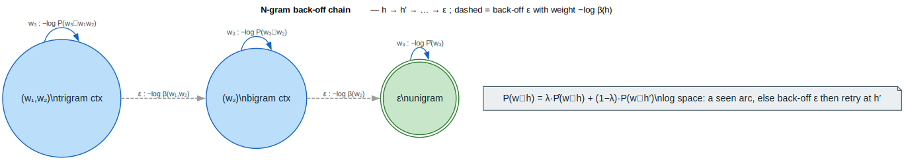

# N-gram Back-off

**Thesis.** A back-off n-gram language model represents an exponentially large
distribution compactly by storing only *observed* n-grams and, for everything
else, **backing off** to a shorter context: when the bigram `` `w₁w₂` `` is
unseen, the model interpolates with the unigram estimate via
`` `P(w∣h) = λ·P̂(w∣h) + (1−λ)·P(w∣h′)` ``, where `` `h′` `` is `` `h` `` with
its oldest word dropped.

As a WFST this is realized with **back-off states** reached by `` `ε` ``-arcs:
seen n-grams are direct arcs, and an unseen continuation falls through an
`` `ε` ``-arc of weight `` `−log β(h)` `` to the state for `` `h′` ``, where the
shorter-context arc is tried instead. This keeps the graph linear in the number
of *observed* n-grams rather than `` `O(∣V∣ⁿ)` ``. Source:
[`src/optimization/ngram_backoff.rs`](../../src/optimization/ngram_backoff.rs).

---

## Terms & symbols

| Term | Meaning |
|---|---|
| **LM** | Language Model — a distribution over token sequences. |
| `` `w` `` | A word/token; `` `VocabId = u32` `` identifies it. |
| `` `h` `` | History/context, e.g. `` `(w₁, w₂)` `` for a trigram ending in `` `w₃` ``. |
| `` `h′` `` | Backed-off history — `` `h` `` with its oldest word removed (`backoff_context`). |
| `` `P(w∣h)` `` | Probability of `` `w` `` given history `` `h` ``. |
| `` `P̂(w∣h)` `` | The directly-estimated (observed) probability for context `` `h` ``. |
| `` `λ` `` | Interpolation weight — mixes the higher- and lower-order estimates. ([NOTATION](../NOTATION.md)) |
| `` `β(h)` `` | Back-off weight for context `` `h` ``; the arc carries `` `−log β(h)` ``. |
| `` `ε` `` | Empty label — the back-off arc consumes/emits nothing. |
| `` `⊕ₗₒg` `` | Log-add — the log-semiring `` `⊕` `` used to combine paths. |
| `` `∣V∣` `` | Vocabulary size (cardinality, U+2223, not ASCII `|`). |

WFST = Weighted Finite-State Transducer
([`architecture/wfst-traits.md`](../architecture/wfst-traits.md)).

---

## Formal model

A back-off LM defines `` `P(w∣h)` `` recursively on the length of the history.
With a directly-estimated probability `` `P̂` `` where the n-gram was observed and
a back-off weight `` `β(h)` `` otherwise, the standard interpolated form is

```text
P(w∣h) = λ·P̂(w∣h) + (1 − λ)·P(w∣h′)      if (h, w) observed
P(w∣h) = β(h) · P(w∣h′)                   if (h, w) unobserved   (back off to h′)
```

bottoming out at the unigram `` `P(w∣ε) = P̂(w)` ``. The module works in
**negative log space**, so a stored value is `` `−log p` ``, products become
sums, and the unobserved case is `` `−log P(w∣h) = −log β(h) − log P(w∣h′)` `` —
exactly the `` `unigram + backoff` `` arithmetic in `BigramLm::prob`.

As an automaton (`NgramLmBuilder::build` / `BigramLm::to_wfst`):

| Construct | Arc | Weight |
|---|---|---|
| seen n-gram `` `h --w--> h·w` `` | `` `w : w` `` | `` `−log P̂(w∣h)` `` |
| back-off `` `h --ε--> h′` `` | `` `ε : ε` `` | `` `−log β(h)` `` |
| final (can end here) | — | `` `1̄` `` (log `` `0` ``) for states ending in `EOS` |

The crucial relation in one line is the back-off recurrence
`` `P(w∣h) = λ·P̂(w∣h) + (1−λ)·P(w∣h′)` ``; following the `` `ε` `` chain
`` `h → h′ → … → ε` `` realizes the `` `(1−λ)·P(w∣h′)` `` term when the
higher-order arc is absent.

| Component | Type | Role |
|---|---|---|
| `NgramEntry` | `{ context, word, log_prob }` | One observed n-gram `` `−log P̂(w∣h)` ``. |
| `BackoffWeight` | `{ context, weight }` | `` `−log β(h)` `` for context `` `h` ``. |
| context state | `StateId` | One state per observed context `` `h` ``. |

---

## Intuition — seen vs. backed-off bigram

Take a 5-word vocabulary with `` `P̂(2) = 1.0` `` (i.e. `` `−log = 1.0` ``),
a seen bigram `` `P̂(1∣0) = 0.5` ``, and a back-off weight
`` `−log β(0) = 0.1` ``:

```text
query (0, 1):  bigram observed  →  −log P(1∣0) = 0.5
query (0, 2):  bigram unseen    →  back off: −log P(2) + (−log β(0)) = 1.0 + 0.1 = 1.1
```

This is `test_bigram_lm_basic`: `lm.prob(0, 1) == 0.5` (direct) and
`lm.prob(0, 2) == 1.1` (backed-off).

---

## Architecture & API

### `BigramLm` — the specialized fast path

`BigramLm` stores unigrams in a dense `` `Vec<f64>` `` and bigrams in a sparse
map, with one back-off weight per word. `prob(w1, w2)` returns the seen bigram if
present, else `` `unigram(w2) + backoff(w1)` `` — the log-space back-off. It
converts to a WFST with one state per word plus a shared back-off state:

```rust
use lling_llang::optimization::BigramLm;

let mut lm = BigramLm::new(5);
lm.set_unigram(2, 1.0);          // −log P̂(2)
lm.set_bigram(0, 1, 0.5);        // −log P̂(1|0)  (observed)
lm.set_backoff(0, 0.1);          // −log β(0)

assert!((lm.prob(0, 1) - 0.5).abs() < 1e-10);          // direct bigram
assert!((lm.prob(0, 2) - (1.0 + 0.1)).abs() < 1e-10);  // backed off to unigram
```

| Method | Role |
|---|---|
| `set_unigram` / `set_bigram` / `set_backoff` | Populate `` `−log P̂` `` and `` `−log β` ``. |
| `prob(w1, w2)` | `` `−log P(w2∣w1)` `` with back-off. |
| `to_wfst()` | Build the `VectorWfst<VocabId, LogWeight>` (word states + back-off state). |
| `stats()` | `BigramStats { vocab_size, num_unigrams, num_bigrams, sparsity }`. |

### `NgramLmBuilder` — general order with `ε` back-off chains

`NgramLmBuilder` handles arbitrary order `` `n` `` via `NgramLmConfig`. It adds
n-grams and back-off weights, then `build()` emits a WFST whose contexts are
states, observed n-grams are arcs, and each non-empty context has a back-off arc
to its `backoff_context` (one word shorter). States whose context ends in `EOS`
become final.

```rust
use lling_llang::optimization::{NgramLmBuilder, NgramLmConfig};

let config = NgramLmConfig { order: 3, vocab_size: 10, ..Default::default() };
let mut builder = NgramLmBuilder::new(config);

builder.add_ngram(&[0, 1], 2, 0.5);   // trigram −log P̂(2 | 0,1)
builder.add_ngram(&[1], 2, 0.6);      // bigram   −log P̂(2 | 1)
builder.add_ngram(&[], 2, 1.5);       // unigram  −log P̂(2)
builder.add_backoff(&[0, 1], 0.1);    // −log β(0,1)
builder.add_backoff(&[1], 0.2);       // −log β(1)

let fst = builder.build();            // contexts → states, ε back-off arcs
```

| Item | Role |
|---|---|
| `NgramLmConfig` | `{ order, use_backoff_symbol, vocab_size, prune_threshold }`. |
| `add_ngram(context, word, log_prob)` | Register one observed n-gram (pruned if above `prune_threshold`). |
| `add_backoff(context, weight)` | Register `` `−log β(context)` ``. |
| `build()` | Materialize the WFST with `` `ε` `` back-off chains. |
| `stats()` | `NgramStats` with per-order counts. |

`use_backoff_symbol` controls whether the back-off arc is a plain `` `ε` `` (may
be expanded by `` `ε` ``-removal) or a dedicated symbol that *prevents* such
expansion — important because expanding back-off `` `ε` ``-arcs would defeat the
compactness the structure exists to provide.

### Quantifying the saving — `compute_size_reduction`

`compute_size_reduction(vocab_size, num_observed, order)` contrasts the dense
representation (`` `∣V∣^{n−1}` `` states, `` `∣V∣ⁿ` `` arcs) with the sparse one
(≈ observed contexts and arcs), returning a `SizeReduction` with state/arc
reduction ratios. `PruningStrategy` enumerates the supported thinning policies
(`CountThreshold`, `ProbabilityThreshold`, `EntropyThreshold`).

---

## Algorithms

### ⟨ build back-off LM WFST ⟩

The intent is to *emit a WFST that is linear in observed n-grams yet assigns the
correct backed-off probability to every continuation*. The invariant is that
**every non-empty context state has exactly one back-off `` `ε` ``-arc to its
`` `h′` `` state**, so any unseen continuation has a defined fall-through.

```text
⟨ build back-off LM WFST ⟩ ≡
  create start state for the empty context ε
  for each observed n-gram (h, w, −log P̂):       ⟨ collect contexts ⟩
      ensure states for h and for (h·w truncated to order−1)
  for each context h ≠ ε:                          ⟨ ensure back-off targets ⟩
      ensure state for h′ = backoff_context(h)
  for each observed n-gram (h, w, −log P̂):       ⟨ emission arcs ⟩
      add arc  h --w:w / −log P̂--> (h·w truncated)
  for each context h ≠ ε:                          ⟨ back-off arcs ⟩
      add arc  h --ε:ε / −log β(h)--> h′          (β defaults to 1, weight 0)
  mark states whose context ends in EOS as final; make ε final too
```

The build is `` `O(∣observed∣)` `` states and arcs — independent of `` `∣V∣ⁿ` ``.
At query/decoding time, scoring a continuation is: try the emission arc at the
current context; if absent, take the back-off `` `ε` `` and retry at `` `h′` ``,
repeating down the chain `` `h → h′ → … → ε` `` until an emission arc exists
(the unigram always does).



*Blue = context states with their observed emission self-arcs; grey dashed = the back-off `` `ε` ``-arcs carrying `` `−log β(h)` ``; green double ring = the unigram root `` `ε` `` every chain bottoms out in; the note restates the interpolation identity.*

<details><summary>Text view</summary>

```text
(w₁,w₂) trigram ctx ──w₃ : −log P(w₃|w₁w₂)──▶ (emit)
   │ ε : −log β(w₁,w₂)   (dashed back-off)
   ▼
(w₂) bigram ctx ────────w₃ : −log P(w₃|w₂)───▶ (emit)
   │ ε : −log β(w₂)      (dashed back-off)
   ▼
ε  unigram (final) ─────w₃ : −log P̂(w₃)──────▶ (emit)

P(w|h) = λ·P̂(w|h) + (1−λ)·P(w|h′)
log space: take a seen arc, else back off (ε) then retry at h′.
```

</details>

---

## Examples

From `#[cfg(test)]` in
[`src/optimization/ngram_backoff.rs`](../../src/optimization/ngram_backoff.rs).

### Back-off query and WFST construction

```rust
use lling_llang::optimization::BigramLm;
use lling_llang::wfst::Wfst;

let mut lm = BigramLm::new(3);
lm.set_unigram(0, 1.0);
lm.set_unigram(1, 2.0);
lm.set_bigram(0, 1, 0.5);

let fst = lm.to_wfst();
assert_eq!(fst.num_states(), 4);    // 3 word states + 1 back-off state
```

### Size reduction for a 1000-word bigram model

```rust
use lling_llang::optimization::compute_size_reduction;

let reduction = compute_size_reduction(1000, 50_000, 2);
assert_eq!(reduction.dense_states, 1000);
assert_eq!(reduction.dense_arcs, 1_000_000);     // ∣V∣² = 10⁶ dense arcs
assert!(reduction.sparse_arcs < reduction.dense_arcs);
assert!(reduction.arc_reduction > 0.9);          // > 90% fewer arcs
```

---

## Relation to the library

- **ASR grammar (G).** A back-off LM is the **G** transducer of the ASR cascade
  `` `N = π(min(det(H ∘ C ∘ L ∘ G)))` ``
  ([`asr/cascade-construction.md`](../asr/cascade-construction.md)); its compact
  form keeps the cascade tractable.
- **Log semiring.** Weights are `LogWeight` (`` `−log p` ``); paths combine with
  `` `⊕ₗₒg` `` ([`architecture/semirings.md`](../architecture/semirings.md)).
- **`ε`-removal.** `use_backoff_symbol` interacts with
  [`algorithms/epsilon-removal.md`](../algorithms/epsilon-removal.md): a dedicated
  back-off symbol resists expansion that would inflate the graph.
- **Composition.** The built WFST composes with acoustic and lexicon transducers
  ([`algorithms/composition.md`](../algorithms/composition.md)).
- **Differentiable n-grams.** The same back-off topology underlies the prunable
  n-gram model in [`advanced/differentiable.md`](../advanced/differentiable.md).
- See the optimization research log in [`journal.md`](journal.md).

---

## References

- [Mohri 2002](../BIBLIOGRAPHY.md#ref-mohri2002) — *Weighted Finite-State
  Transducers in Speech Recognition.* Back-off LMs as WFSTs with `` `ε` `` back-off
  states.
- [Hannun 2020](../BIBLIOGRAPHY.md#ref-hannun2020) — *Differentiable Weighted
  Finite-State Transducers.* Compact n-gram representations and their role in
  training cost reduction for large word-piece vocabularies.
