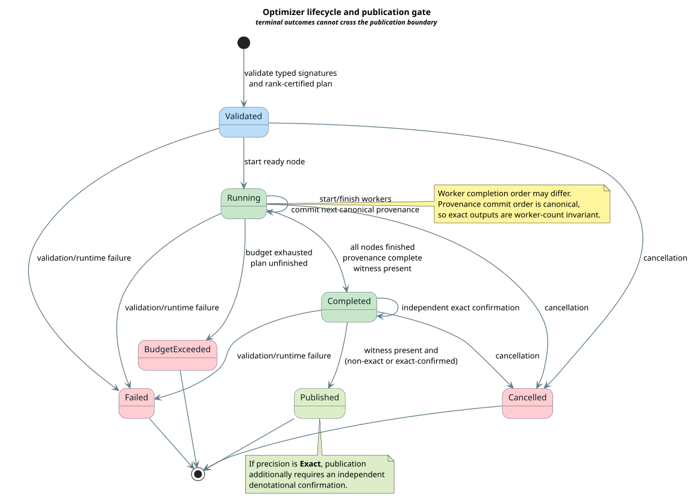

# Optimizer Plan, Concurrency, and Provenance

This document is the normative execution contract for lling-llang optimizer
plans: a plan is a finite rank-certified dependency graph whose concurrent
workers commit results in a stable canonical order.

## Terms and symbols

| Term or symbol | Definition |
|---|---|
| $`V`$ | Finite set of plan nodes. |
| $`E \subseteq V \times V`$ | Dependency edges; $`(u,v)`$ means $`u`$ must finish before $`v`$ starts. |
| $`r : V \to \mathbb{N}`$ | Rank certificate. Every edge increases rank strictly. |
| **ready** | A node not running or finished whose dependencies are all finished. |
| **completion order** | Physical order in which workers finish. It is diagnostic, not canonical. |
| **provenance order** | Stable plan-defined sequence used for externally visible commit. |
| **budget** | Finite execution allowance. Exhaustion produces a typed terminal outcome. |
| **cancellation** | Cooperative request that ends execution without publication. |
| **publication** | Transition making a completed candidate externally visible. |

## Normative plan model

The logical plan record contains these fields. It is not a JSON wire format;
the production Rust representation must use native typed values.

| Field | Contract |
|---|---|
| `nodes` | Duplicate-free finite node collection. |
| `dependencies` | Edges whose endpoints both occur in `nodes`. |
| `rank` | Natural number per node; every dependency increases it. |
| `input_domain`, `output_domain` | Separate tape-domain identifiers for every transformation. |
| `claim` | Independent precision and completeness values. |
| `effects` | Declared cancellation, allocation, I/O, and provider-call effects. |
| `witness` | Evidence that validation or exact rewrite preservation succeeded. |
| `sequence` | Stable canonical provenance position. |
| `budget_cost` | Checked resource charge consumed by execution. |

Plan validation rejects any missing endpoint, duplicate node, incompatible tape
pair, non-increasing edge, duplicate sequence number, undeclared effect, or
missing witness required by the selected optimization mode.

## Lifecycle



[PlantUML source](../diagrams/optimization/optimizer-lifecycle-state.puml)

*Blue is validation, green is productive execution, pale green is publication, and red is a non-publishing terminal outcome.*

<details><summary>Text view</summary>

<!-- vdl-disable-next-line ASCII001 -->
```text
                    ┌──────────── cancellation ────────────▶ Cancelled
Validated ─▶ Running├──────────── budget exhausted ───────▶ BudgetExceeded
                    ├──────────── failure ─────────────────▶ Failed
                    └─ all nodes + provenance ─▶ Completed
                                                    │
                                      witness + exact confirmation
                                                    ▼
                                                Published
```

</details>

The allowed phases are:

| Phase | Entry condition | May publish? |
|---|---|---|
| `Validated` | Typed signatures, DAG ranks, effects, and static witnesses accepted | No |
| `Running` | At least one ready node dispatched | No |
| `Completed` | All nodes finished, no worker running, canonical provenance complete, completion witness present | Only through the publication guard |
| `Published` | Completion witness present; an exact claim also has independent exact confirmation | Already published |
| `Cancelled` | Cancellation accepted before publication | No; terminal |
| `BudgetExceeded` | Budget exhausted before all nodes finish | No; terminal |
| `Failed` | Validation, provider, rewrite, or execution failure | No; terminal |

## Stack-safe wavefront execution

The executor uses a ready queue and reverse dependency counts. No operation is
recursive in input depth. With a compact adjacency representation, scheduling
cost is $`O(\lvert V\rvert + \lvert E\rvert)`$ time and
$`O(\lvert V\rvert)`$ auxiliary space, excluding domain work performed by each
node.

The loop invariant is:

```math
\forall v \in \mathrm{ready} \cup \mathrm{running}.\;
\mathrm{deps}(v) \subseteq \mathrm{finished}.
```

```text
⟨ advance one deterministic wavefront ⟩
for each ready node in canonical node order:
    reserve its declared budget
    dispatch it through the injected executor
collect completed nodes without exposing their physical completion order
for each completed node:
    validate result and witness
    decrement each dependent's unfinished-dependency count
    enqueue every count that reaches zero
commit finished results only while the next canonical sequence is available
```

Parallel adapters may change dispatch and collection mechanics. They may not
change readiness, resource accounting, validation, or ordered commit.

## Why ordered provenance is required

Suppose independent nodes 1 and 2 execute concurrently. One run may physically
finish in order $`\langle 1,2\rangle`$ and another in order
$`\langle 2,1\rangle`$. Appending on physical completion would make reports,
hashes, and caches nondeterministic.

The commit function accepts only the expected sequence:

```math
\mathrm{commit}(k,j,P,e) =
\begin{cases}
(k+1, P \mathbin{+\!+} \langle(j,e)\rangle), & j=k,\\
\mathrm{None}, & j\ne k.
\end{cases}
```

The Rocq theorem `commit_rejects_out_of_order` proves the second branch, and
TLC checks that every reachable provenance sequence is a prefix of canonical
order. A deliberately mutated model appends an arbitrary finished node and is
required to violate that invariant.

## Budgets and cancellation

Budget accounting is monotone. A node reserves its declared amount before it
starts. A plan that cannot reserve the next ready node reaches
`BudgetExceeded`; it does not return a partial candidate as if it were exact.

Cancellation is checked before dispatch and at domain-defined cooperative
boundaries. Once `Cancelled`, `BudgetExceeded`, or `Failed` is entered, only
temporal stuttering is permitted. There is no transition from any of those
states to `Published`.

## Exact publication guard

A completed result is publishable only when:

1. every node is finished;
2. canonical provenance is complete;
3. a completion witness exists;
4. precision and completeness have not self-promoted; and
5. an exact precision claim has independent exact confirmation.

Approximate execution is explicit. An approximate candidate can be useful, but
its claim remains `SoundApproximation`, and downstream consumers can reject it
without inspecting implementation-specific metadata.

## Reproduction

Run the complete resource-bounded gate from the repository root:

```bash
make verify-proofs
```

The script creates evidence beneath ignored `target/formal-verification/`, not
a memory-backed temporary filesystem. Local execution requires a user systemd
scope with a 4 GiB RSS ceiling, no swap, at most one TLC worker, and hard TLC
timeouts. The nested Kani gate uses a 2 GiB ceiling and one job.

## References

- [Lamport 2002](../BIBLIOGRAPHY.md)
- [Mac Lane 1998](../BIBLIOGRAPHY.md)
