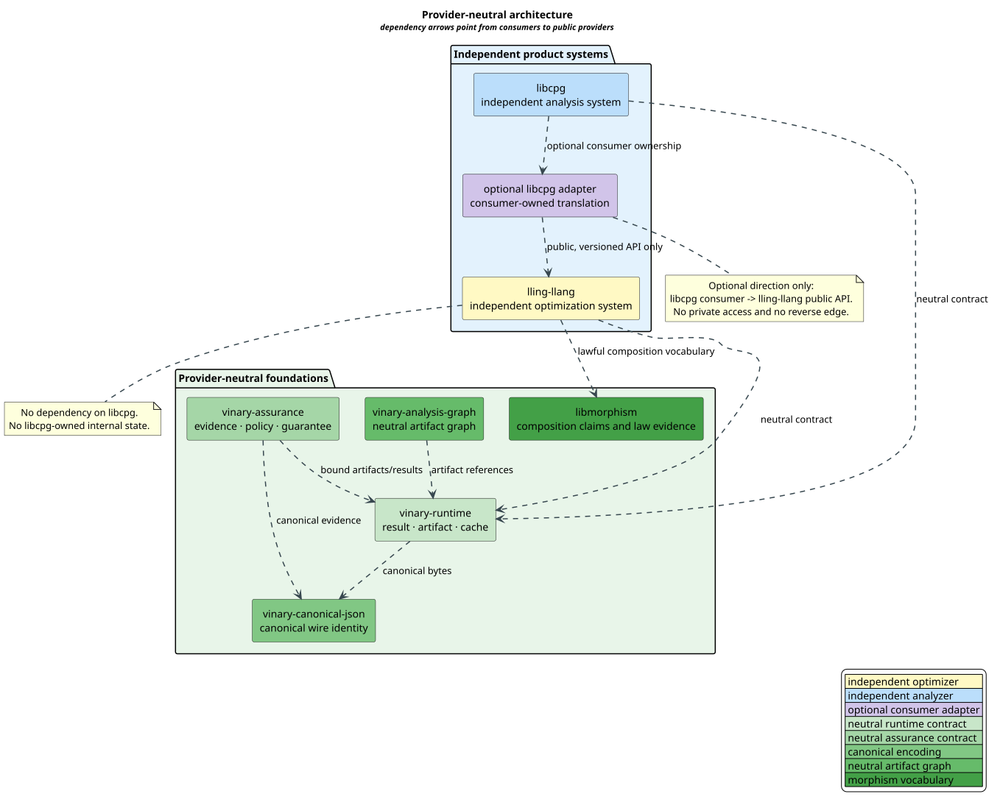
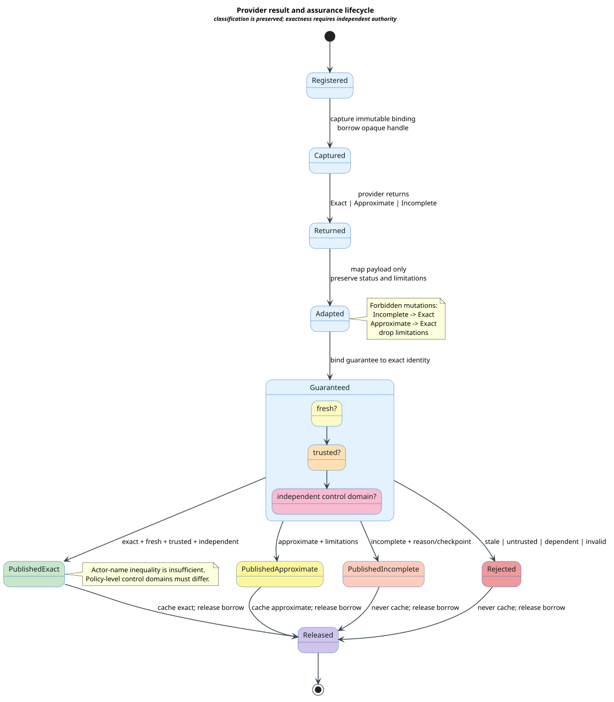

# Provider-Neutral Boundary Contract

This document is the normative pre-implementation contract for the E9 Vinary
foundation boundary. It defines canonical artifact identity, provider-result
classification, limitation propagation, independent assurance, native-resource
ownership, and legal dependency direction. Production adapters are forbidden
until every property in
[`provider-boundary-invariants.tsv`](../../proofs/doc/provider-boundary-invariants.tsv)
has first demonstrated a genuine failing baseline and then passes against the
implementation.

## Terms

| Term | Definition |
|---|---|
| **provider** | An independently deployable component that produces an artifact or result through a public interface. |
| **consumer** | A component that optionally invokes a provider through that public interface. |
| **adapter** | Consumer-owned translation code that converts public values without reaching into provider internals. |
| **completion class** | One of `CompleteExact`, `CompleteApproximate`, or `Incomplete`. |
| **limitation** | A machine-readable statement describing how an approximate result differs from an exact result. |
| **binding** | The immutable identity tuple that connects evidence to its inputs, provider, configuration, environment, and result. |
| **guarantee** | Separately validated evidence authorizing a claim stronger than the provider's untrusted candidate report. |
| **control domain** | The policy-level administrative authority controlling an actor; actor-name inequality alone does not establish independence. |
| **native handle** | An opaque resource whose owner, borrow count, and release state cross a foreign-function or provider boundary. |

## Architectural independence

lling-llang and libcpg are independent projects. Neither owns the other.
lling-llang is not a libcpg component and must never depend on libcpg. libcpg
may optionally consume lling-llang through lling-llang's public, versioned API,
with the adapter owned by libcpg or by a separate integration crate.

The permitted dependency is therefore one-way:

```math
\mathrm{libcpg}_{\mathrm{optional\ adapter}}
\longrightarrow
\mathrm{lling\text{-}llang}_{\mathrm{public\ API}}.
```

The reverse edge and access to private implementation state are invalid:

```math
\neg(
\mathrm{lling\text{-}llang}
\longrightarrow
\mathrm{libcpg}
),
\qquad
\neg\mathrm{PrivateAccess}.
```



[PlantUML source](../diagrams/optimization/provider-boundary-architecture.puml)

This rule does not forbid both projects from using the same neutral foundation
crates. Shared contracts live below both projects; they do not make either
project a subsystem of the other.

## Three result classes

For payload type $`A`$ and checkpoint type $`K`$, the provider result is the
sum type:

```math
R(A,K)
=
\mathrm{Exact}(A)
+
\mathrm{Approximate}(A,M,L,B)
+
\mathrm{Incomplete}(Q,A_{?},K_{?}),
```

where $`M`$ identifies the approximation method, $`L`$ is a nonempty sequence
of limitations, $`B`$ is an optional bound, and $`Q`$ is the noncompletion
reason. A partial payload or checkpoint does not change `Incomplete` into a
complete result.

### Payload mapping is status preserving

Mapping $`f:A\to B`$ over a provider result changes only its payload:

```math
\mathrm{status}(R(f)(r))=\mathrm{status}(r).
```

It also preserves limitations, checkpoint identity, validity, and cache
eligibility. The Rocq model proves the identity and composition laws:

```math
R(\mathrm{id})=\mathrm{id},
\qquad
R(g)\circ R(f)=R(g\circ f).
```

This is the useful functorial structure: adapters may translate payload
representation but cannot rewrite assurance metadata. The terminology follows
the standard treatment of functors and composition in
[Mac Lane 1998](../BIBLIOGRAPHY.md).

### Composition is a conservative monoid

Completion status composes with `CompleteExact` as the identity. `Incomplete`
is absorbing; otherwise any approximate operand yields
`CompleteApproximate`. Thus:

```math
s \otimes t = \mathrm{CompleteExact}
\Longrightarrow
s=t=\mathrm{CompleteExact}.
```

Result metadata pairs that status with an ordered limitation sequence.
Metadata composition uses status meet and sequence concatenation. Rocq proves
left identity, right identity, and associativity. It also proves that all
limitations are retained in composition order.

No `Result`-like monad is required at this boundary. Payload mapping is useful;
unrestricted `bind` would be dangerous because a continuation could silently
replace an incomplete or approximate classification. If a future sequencing
operator is introduced, its type must force the composed status and limitation
accumulator returned by this contract.

## Canonical artifact identity

An artifact identity binds schema, declared digest, declared size, Uniform
Resource Identifier (URI) digest, observed digest, and observed size. A valid
artifact satisfies:

```math
d_{\mathrm{declared}}=d_{\mathrm{URI}}=d_{\mathrm{observed}},
\qquad
n_{\mathrm{declared}}=n_{\mathrm{observed}}.
```

The logic treats digests as perfect symbolic identities. It proves equality
checking and tamper rejection, not collision resistance of a concrete hash
function. Cryptographic algorithm selection and canonical byte encoding remain
explicit implementation obligations.

Input artifacts are canonicalized against a finite artifact universe as a
membership vector. The model proves invariance under input permutation and
duplicate delivery. Consequently, scheduling order cannot change the binding.

The full evidence binding is:

```math
\beta=(s,c,p,e,I,r),
```

where $`s`$ is the snapshot digest, $`c`$ the configuration digest, $`p`$ the
complete provider-descriptor identity, $`e`$ the environment digest, $`I`$ the
canonical input manifest, and $`r`$ the result digest. Changing any coordinate
makes evidence stale.

Provider identity covers identifier, version, protocol, build digest,
capabilities, guarantees, determinism, side effects, and lock declarations.
Capabilities or build behavior cannot change while retaining the same
descriptor identity.

## Exact publication requires independent assurance

A provider report is untrusted candidate evidence. Exact publication requires
a certificate containing all of these facts:

1. the candidate is `CompleteExact`;
2. the candidate binding equals the requested binding;
3. the guarantee binding equals the requested binding;
4. the guarantee is trusted by current policy; and
5. producer and verifier occupy independent control domains.

Actor names are diagnostic labels, not trust boundaries. Two different actor
names controlled by the same organization, process, key, or policy authority
remain dependent. The formal counterexample assigns different names to a
single control domain and proves that exact publication is rejected.

Approximate and incomplete reports cannot self-promote even when every other
binding is fresh. A trusted independent guarantee validates a claim; it does
not erase the provider's completion class.

## Native ownership

Opaque handles carry one stable owner, a nonnegative borrow count, and a
released flag. The contract proves:

- borrowing a live handle preserves ownership and adds exactly one borrow;
- releasing a borrow preserves ownership and cannot underflow zero;
- only the provider owner can destroy a live, unborrowed handle; and
- successful destruction produces a released handle.

The retain/release lineage follows the reference-counting discipline described
by [Collins 1960](../BIBLIOGRAPHY.md), but the E9 model makes
the boundary's partial operations explicit.

No operation is recursive. Result classification, evidence validation, and
ownership control are finite state machines. Input-sized manifests and
limitations are traversed iteratively on the heap, so native stack growth is
constant.

## Literate boundary algorithms

### Adapt a provider result

The purpose of `ADAPT-RESULT` is to map a payload representation while making
metadata mutation impossible by construction.

```text
ADAPT-RESULT(result, map_payload)
  MATCH result
    CompleteExact(payload):
      RETURN CompleteExact(map_payload(payload))
    CompleteApproximate(payload, approximation):
      REQUIRE approximation.limitations is nonempty
      RETURN CompleteApproximate(map_payload(payload), approximation)
    Incomplete(reason, partial, checkpoint):
      mapped_partial := MAP-OPTION(partial, map_payload)
      RETURN Incomplete(reason, mapped_partial, checkpoint)
```

The algorithm performs $`O(1)`$ metadata work plus the cost of
`map_payload`. It neither copies the limitation sequence nor traverses the
checkpoint.

### Decide publication

The purpose of `CLASSIFY-PUBLICATION` is to make exactness authority explicit
and keep incomplete results out of complete-result caches.

```text
CLASSIFY-PUBLICATION(requested, candidate, guarantee)
  IF candidate.status = CompleteExact
     AND candidate.binding = requested
     AND guarantee.binding = requested
     AND guarantee.trusted
     AND INDEPENDENT-DOMAINS(candidate.producer, guarantee.verifier)
  THEN
    RETURN PublishExactAndCache

  IF candidate.status = CompleteApproximate
     AND candidate.limitations is nonempty
  THEN
    RETURN PublishApproximateAndCache

  IF candidate.status = Incomplete
  THEN
    RETURN PublishIncompleteWithoutCaching

  RETURN Reject
```

Binding comparison is linear in the canonical input-manifest length and
constant in every scalar coordinate. It must short-circuit without allocation.

## Lifecycle verification



[PlantUML source](../diagrams/optimization/provider-result-lifecycle.puml)

The TLA+ model follows the method described by
[Lamport 2002](../BIBLIOGRAPHY.md). Its finite configuration
explores every ordering of four request-staleness changes, three completion
classes, and nine guarantee outcomes. The positive model reaches a complete
queue with these checked bounds:

| Metric | Value |
|---|---:|
| generated states | 65,858 |
| distinct states | 1,409 |
| remaining queue | 0 |
| graph depth | 11 |

Three required negative controls must fail for the named reason:

| Mutation | Required invariant violation |
|---|---|
| adapt `Incomplete` as `CompleteExact` | `AdaptationPreservesStatus` |
| discard approximation limitations | `AdaptationPreservesLimitations` |
| accept actor inequality instead of control-domain independence | `DependentGuaranteeBlocksExact` |

The Z3 transcript adds thirteen forbidden finite-boundary claims and two
constructive witnesses. The Rocq files prove the unbounded algebraic,
freshness, trust, dependency-direction, and ownership theorems without axioms
or unchecked proof escapes.

## Refinement obligations

The 132-row registry is exhaustive over every named Rocq declaration, every
configured TLC invariant, and every named Z3 query. Planned Rust suites must
preserve that one-to-one mapping. A production change is acceptable only after:

1. its mapped property genuinely fails against the pre-implementation code;
2. the failure is recorded as required-red evidence;
3. the implementation makes the same property pass;
4. the full formal gate still passes under the resource envelope; and
5. documentation lint reports no errors.

This milestone defines contracts only. It does not authorize changes to the
uncommitted Vinary foundation prototypes, libcpg, or their ownership. Those
changes remain behind their separately tracked ownership and implementation
gates.
