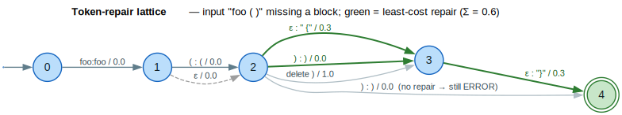

# Syntax Repair

**Thesis.** The `programming` module repairs broken source code by treating
repair as a **least-cost edit over a token lattice**: a `ParserBackend` locates
the errors, a `SyntaxRepairTransducer` proposes weighted edits (insert, delete,
substitute) as arcs of a weighted transducer, and the lowest-total-cost
non-overlapping set of edits is applied to recover compilable text.

This document covers parser-backend abstraction and the syntax-repair transducer.
The complementary [`api-migration.md`](api-migration.md) covers version-driven
API migration (`ApiMigrationTransducer`); the two share the token machinery
documented here. Sources: [`src/programming/traits.rs`](../../src/programming/traits.rs),
[`src/programming/token.rs`](../../src/programming/token.rs),
[`src/programming/repair.rs`](../../src/programming/repair.rs).

---

## Terms & symbols

| Term | Meaning |
|---|---|
| **WFST** | Weighted Finite-State Transducer (input + output + weight per arc). ([NOTATION](../NOTATION.md)) |
| **token lattice** | A weighted DAG whose start→end paths enumerate candidate token sequences. |
| **edit cost** | The weight of a repair arc; lower = more preferred. A tropical weight under $`W`$. |
| $`\oplus`$ | Semiring *plus*. Over the tropical semiring $`\oplus = \min`$ — picks the cheapest repair. |
| $`\otimes`$ | Semiring *times*. Over the tropical semiring $`\otimes = +`$ — sums edit costs along a path. |
| $`\varepsilon`$ | Empty label — an arc that inserts/deletes without consuming input. |
| **MISSING node** | A node a parser's error recovery inserts to mark something absent (e.g. a bracket). |
| **ERROR node** | A parse-tree node covering text the parser could not fit the grammar. |
| $`\lvert E\rvert`$ | Number of edges (arcs) in a lattice; typeset `\lvert E\rvert`, not a bare `|`. |
| $`W`$ | A semiring weight type, e.g. `TropicalWeight`. |

CFG = Context-Free Grammar; PDA = Pushdown Automaton (see
[`architecture/parsing`](../algorithms/parsing.md),
[`transducers/pushdown.md`](../transducers/pushdown.md)).

---

## Formal model

Repair operates on a token stream $`t = t_1 \ldots t_n`$ together with a set of
error ranges from the parser. Each repair rule $`r`$ contributes one or more
**candidate edits**, modeled as arcs of a transducer over the token alphabet
$`\Sigma`$:

| Edit | Arc | Cost source |
|---|---|---|
| identity (keep) | $`t : t / \bar{1}`$ | $`0.0`$ |
| substitute | $`a : b / c`$ | `typo_fix` $`0.2`$ or `substitute` $`1.0`$ |
| insert | $`\varepsilon : b / c`$ | `missing_punctuation` $`0.3`$ or `insert` $`1.0`$ |
| delete | $`a : \varepsilon / c`$ | `delete` $`1.0`$ |

A *repair* is a start→end path through the resulting lattice; its total cost is
the $`\otimes`$ (tropical $`+`$) of its arc costs, and the chosen repair is the
$`\oplus`$ (tropical $`\min`$) over all paths — the **least-cost edit**. The
key relation, with $`c(e)`$ the cost of edit $`e`$ from
`SyntaxRepairCosts`, is:

```math
\begin{aligned}
\operatorname{cost}(\text{repair}) &= \bigotimes_{e \in \text{repair}} c(e) = \sum c(e) && \text{(tropical } \otimes = +) \\
\text{best} &= \bigoplus \text{ over all repair paths} && \text{(tropical } \oplus = \min)
\end{aligned}
```

Because a real fix may need several edits at different offsets, the transducer
then selects a **non-overlapping cover**: greedily take candidates in increasing
cost, skipping any whose byte range intersects one already chosen
(`select_non_overlapping`). This keeps the applied edits mutually consistent
while still favoring the cheapest repairs.

| Component | Type | Role |
|---|---|---|
| $`t`$ | `&[Token]` | The lexed input stream. |
| rules | `Vec<SyntaxRepairRule>` | Weighted edit rules. |
| $`c`$ | `SyntaxRepairCosts` | Per-operation cost table. |
| result | `(String, Vec<RepairCandidate>)` | Repaired text + applied edits. |

---

## Intuition — fixing a typo'd keyword

The smallest repair is a single substitution. Given `funciton foo() {}` and a
rule $`\text{funciton} : \text{function} / 0.2`$, the lattice has one cheap substitution
arc; every other token copies through at cost $`0.0`$:

```text
funciton ──(funciton : function / 0.2)──▶ function
 foo ()  {}                copied unchanged (cost 0.0)
best repair total cost = 0.2   →   "function foo() {}"
```

This is `test_repair_source` in [`repair.rs`](../../src/programming/repair.rs):
`transducer.repair(source, &tokens)` returns `("function foo() {}", …)` with
exactly one applied repair.

---

## Architecture & API

### `ParserBackend` — one interface, many parsers

`ParserBackend` lets the repairer work with any parsing technology
(tree-sitter, LALRPOP, pest, or a custom parser). It returns a
`ParseResult<NodeRef>` carrying both a (possibly partial) tree and a
`Vec<ParserError>`, so error-tolerant parsers surface exactly the ranges
repair needs.

```rust
pub trait ParserBackend: Send + Sync {
    type NodeRef<'a>: SyntaxNodeRef<'a> where Self: 'a;
    fn parse<'a>(&'a self, input: &'a str) -> ParseResult<Self::NodeRef<'a>>;
    fn root<'a>(&'a self) -> Option<Self::NodeRef<'a>>;
    fn language(&self) -> &str;
    fn supports_incremental(&self) -> bool { false }
    fn supports_error_recovery(&self) -> bool { true }
    // …
}
```

| Type | Role |
|---|---|
| `Position` / `Range` | Zero-indexed `(line, column, byte_offset)` and a half-open span. |
| `NodeKind` | A node label; `is_error()` flags `ERROR`, `is_missing()` flags `MISSING`. |
| `SyntaxNode` | Owned parse tree; `find_errors()`, `error_count()`, `has_error()` locate repair sites. |
| `SyntaxNodeRef<'a>` | Borrowed view over a backend's native tree (zero-copy). |
| `ParserError` | `message`, `range`, `severity`, `expected`, `found`. |
| `SimpleParserBackend` | A test/fallback backend wrapping an owned `SyntaxNode`. |

The error and missing-node markers are the bridge between parsing and repair:
`SyntaxNode::find_errors()` yields the `ERROR` subtrees, and a `MISSING` node of
kind `"block"` is what triggers a "insert closing brace" rule
(`RepairPattern::MissingNode`).

### Tokens, predicates, and patterns

[`token.rs`](../../src/programming/token.rs) supplies the lexical layer the
transducer matches against:

- **`Token`** — `{ kind: TokenKind, text: String, range: Range }`. `TokenKind`
  distinguishes `Keyword`, `Identifier`, `Operator`, `Punctuation`, `String`,
  `Number`, etc.; `is_significant()` skips whitespace/comments.
- **`TokenPredicate`** — a matcher: `Text`, `TextCaseInsensitive`, `Kind`,
  `StartsWith`/`EndsWith`/`Contains`, `Regex`, plus the combinators `Any_`,
  `All`, `Not`. This is how a rule says "after a `}` token"
  (`TokenPredicate::text("}")`).
- **`TokenPattern` / `PatternMatcher`** — multi-token patterns with
  `Single`/`Optional`/`ZeroOrMore`/`OneOrMore`, `Capture`, `Alternative`, and
  `LookAhead`/`NegativeLookAhead`. `LookAhead` matches without consuming — the
  module's lookahead primitive for context-sensitive repairs.

### `SyntaxRepairTransducer` and its builder

`SyntaxRepairTransducer<W>` holds the rule set, the cost table, and an optional
language filter. Build it fluently:

```rust
use lling_llang::programming::{SyntaxRepairBuilder, SyntaxRepairTransducer, SyntaxRepairRule};
use lling_llang::semiring::TropicalWeight;

let transducer: SyntaxRepairTransducer<TropicalWeight> = SyntaxRepairBuilder::new()
    .language("javascript")
    .with_common_typos()            // funciton→function, retrun→return, …
    .with_punctuation_repairs()     // missing ; after }, missing braces, …
    .build();
assert!(transducer.num_rules() > 0);
```

| Item | Role |
|---|---|
| `SyntaxRepairRule` | A `(RepairPattern, RepairActionTemplate, cost, description, languages)`. |
| `RepairPattern` | Where to fire: `ExactText`, `AfterToken`, `BeforeToken`, `TokenPattern`, `InErrorNode`, `MissingNode`. |
| `RepairActionTemplate` | What to do: `Insert`, `Delete`, `Replace`, capture variants. |
| `RepairAction` | A concrete edit at a position: `Insert`/`Delete`/`Replace`/`Multiple`/`NoOp`; `apply(source)` rewrites text. |
| `RepairCandidate` | A scored action + position + originating rule description. |
| `SyntaxRepairCosts` | `insert`, `delete`, `substitute`, `typo_fix`, `missing_punctuation`; presets `typo_focused()`, `punctuation_focused()`. |

Rule constructors encode the common fixes: `typo_substitute(from, to, cost)`,
`missing_semicolon_after_brace(cost)`, `missing_opening_brace_after_paren(cost)`,
`missing_closing_brace(cost)`. The library bundles `common_keyword_typos()` and
`common_punctuation_repairs()`. A rule's `applies_to(language)` gates it to the
languages it was registered for, so a JavaScript semicolon rule never fires on
Python.

### From rules to a composable WFST

`build_token_wfst(alphabet)` lifts the rules into a single-state
`VectorWfst<String, W>`: identity arcs copy every alphabet token unchanged, and
each substitution rule adds a `from : to` arc. The resulting transducer can
be **composed** with downstream transducers (lexical normalizers, syntax
checkers) using the standard composition algorithm.

---

## Algorithms

### ⟨ least-cost repair selection ⟩

The intent is to *return the cheapest set of mutually consistent edits that fix
the located errors*. The invariant maintained by the selection loop is: **every
candidate already selected occupies a byte range disjoint from all others**, so
applying them in any order is well-defined.

```text
⟨ least-cost repair selection ⟩ ≡
  find_repairs(t):
    candidates ← []
    for rule in rules:
        if language filter rejects rule: continue
        ⟨ fire rule over the token stream ⟩      // ExactText / AfterToken / …
    sort candidates by cost ascending             // ⊕ = min prefers cheapest
  select_non_overlapping(candidates):
    chosen ← [] ;  used ← []
    for cand in candidates (cheapest first):
        (s, e) ← byte range of cand.action
        if (s, e) overlaps any range in used: skip
        else: push cand to chosen ; push (s, e) to used
  repair(source, t):
    apply chosen edits to source in descending byte order  ⟨ offset-stable apply ⟩
```

Firing all rules is $`O(\lvert\text{rules}\rvert \cdot \lvert t\rvert)`$ in the simple text/after-token
cases; the greedy non-overlap pass is $`O(\lvert\text{candidates}\rvert^2)`$ in the worst
case (each candidate compared against the accepted set). Applying edits in
descending byte order keeps earlier offsets valid as later text changes —
the same trick `RepairAction::Multiple` uses internally.

**Worked trace** (`test_non_overlapping_selection`): three replacements at byte
ranges $`[0,5)`$, $`[3,8)`$, $`[10,15)`$ with costs $`0.1, 0.2, 0.15`$.
Sorted, candidate 1 ($`0.1`$, $`[0,5)`$) is taken; candidate 3 ($`0.15`$, $`[10,15)`$)
is disjoint and taken; candidate 2 ($`0.2`$, $`[3,8)`$) overlaps candidate 1 and is
skipped — 2 of 3 selected.


*Blue = the parsing tier (`ParserBackend` and its implementations); teal/amber = the repair tier (`SyntaxRepairTransducer`); grey = source text IO; green = repaired output.*

<details><summary>Text view</summary>

```text
source text ──parse──▶ ParserBackend ┄(impl)┄ tree-sitter / LALRPOP / pest
                          │
                          ▼
                 ParseResult { tree, errors: Vec<ParserError> }
                          │ error ranges / MISSING nodes
source text ──lex──▶ Vec<Token> ─────────────┐
                                              ▼
            SyntaxRepairTransducer<W> { rules, costs }
                          │ apply weighted rules
                          ▼
            find_repairs → Vec<RepairCandidate>
                          │ sort by cost (⊕ = min)
                          ▼
            select_non_overlapping (least-cost cover)
                          │ apply edits (reverse byte order)
                          ▼
            repaired text + applied repairs
```

</details>

### A missing-bracket repair as a token lattice

When a block brace is missing, the cheapest accepting path inserts the
punctuation rather than deleting tokens. The lattice below scores candidate edits
for `foo ( )` that lacks its block: the green path keeps the observed tokens
(cost $`0.0`$) and inserts `" {"` then `"}"` at
`missing_punctuation` cost $`0.3`$ each, for total $`0.6`$ — strictly
cheaper than any path that deletes the parenthesis (`delete` $`1.0`$) or
leaves the error unrepaired.



*Blue = lattice states; green/bold = the least-cost repair path ($`\Sigma = 0.6`$); grey = dominated alternatives; grey dashed = an $`\varepsilon`$ no-op identity arc; double ring = accepting state.*

<details><summary>Text view</summary>

```text
[start] → (0) ──foo:foo/0.0──▶ (1) ──( : ( /0.0──▶ (2) ══ε : " {" /0.3══▶ (3) ══ε : "}" /0.3══▶ ((4)) final
                                                    (2) ══) : ) /0.0════════▶ (3)            [green path, Σ=0.6]
                                                    (2) ──) : ) /0.0──▶ ((4))   (no repair → still ERROR)
                                                    (2) ──delete ) /1.0──▶ (3)  (dominated)
```

</details>

---

## Examples

Both snippets are from `#[cfg(test)]` in
[`src/programming/repair.rs`](../../src/programming/repair.rs).

### Repair a typo over a token stream

```rust
use lling_llang::programming::{SyntaxRepairBuilder, SyntaxRepairRule, Token, TokenKind};
use lling_llang::programming::{Position, Range};
use lling_llang::semiring::TropicalWeight;

let transducer = SyntaxRepairBuilder::new()
    .add_rule(SyntaxRepairRule::typo_substitute("funciton", "function", 0.1))
    .build::<TropicalWeight>();

let source = "funciton foo() {}";
let tokens = vec![
    Token::new(TokenKind::Keyword, "funciton",
        Range::new(Position::start(), Position::new(0, 8, 8))),
    Token::new(TokenKind::Identifier, "foo",
        Range::new(Position::new(0, 9, 9), Position::new(0, 12, 12))),
    // … remaining punctuation tokens …
];

let (repaired, repairs) = transducer.repair(source, &tokens);
assert_eq!(repaired, "function foo() {}");
assert_eq!(repairs.len(), 1);
```

### Lift repair rules into a composable WFST

```rust
use lling_llang::programming::{SyntaxRepairBuilder, SyntaxRepairRule};
use lling_llang::semiring::TropicalWeight;
use lling_llang::wfst::Wfst;

let transducer = SyntaxRepairBuilder::new()
    .add_rule(SyntaxRepairRule::typo_substitute("if", "IF", 0.1))
    .build::<TropicalWeight>();

let alphabet = vec!["if".to_string(), "IF".to_string(), "then".to_string()];
let fst = transducer.build_token_wfst(&alphabet);

assert!(fst.num_states() > 0);
assert!(fst.total_transitions() >= alphabet.len());   // identity + repair arcs
```

---

## Relation to the library

- **Composition.** `build_token_wfst` produces a `VectorWfst` ready for
  [`algorithms/composition.md`](../algorithms/composition.md), so repair can be
  staged with normalizers and checkers.
- **Edit-distance algebra.** The insert/delete/substitute cost model is the
  edit-distance error model of
  [`correction/error-models.md`](../correction/error-models.md), specialized to
  programming tokens.
- **Path extraction.** Selecting the least-cost repair is shortest-path over the
  lattice — [`algorithms/path-extraction.md`](../algorithms/path-extraction.md).
- **API migration.** The sibling transducer in
  [`api-migration.md`](api-migration.md) reuses the same `Token` layer for
  version-driven rewrites.
- **Pushdown parsing.** `RepairPattern::MissingNode` / `InErrorNode` consume the
  recovery output of grammar-aware parsers
  ([`transducers/pushdown.md`](../transducers/pushdown.md)).

---

## References

- [Mohri 2009](../BIBLIOGRAPHY.md#ref-mohri2009) — *Weighted Automata Algorithms.*
  The shortest-path / least-cost-path machinery that selects a repair, and the
  composition that stages repair transducers.
- [Mohri 2002](../BIBLIOGRAPHY.md#ref-mohri2002) — *Weighted Finite-State
  Transducers in Speech Recognition.* The transducer-composition framework reused
  here for token rewriting.
