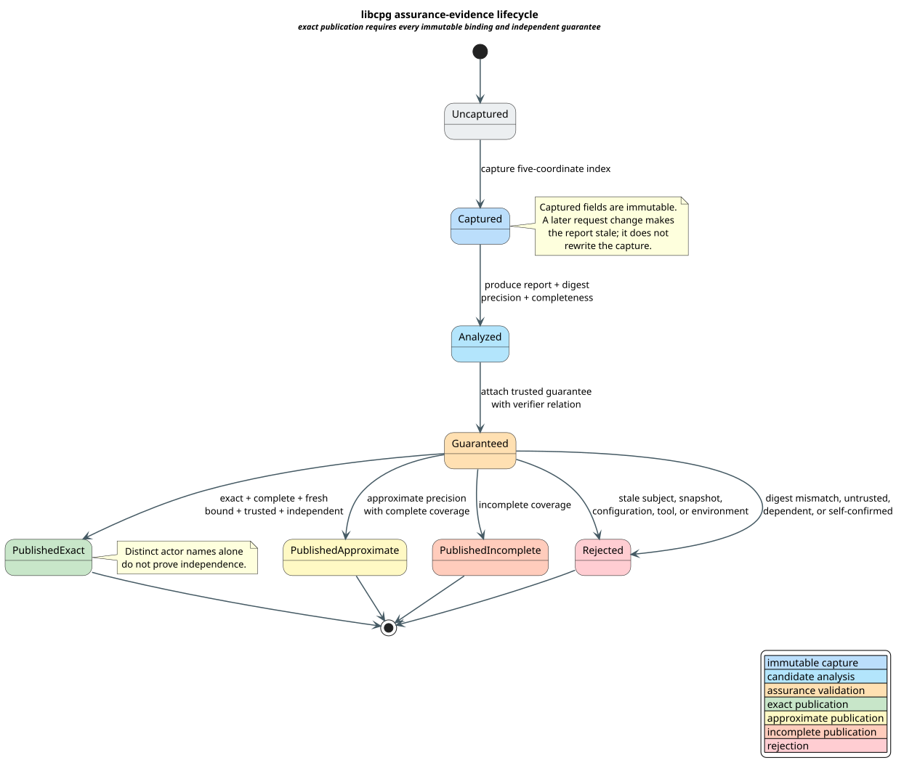

# libcpg Evidence Trust Model

This document defines the security boundary for turning libcpg analysis output
into a Vinary assurance claim. libcpg is an analysis producer. Its output is
candidate evidence until a separately trusted and independent guarantee
validates the exact bytes under the exact requested context.

## Terms and protected assets

| Term | Definition |
|---|---|
| **subject** | Stable identity of the program, graph, package, or artifact being analyzed. |
| **snapshot** | Immutable revision of every source input used by the analysis. |
| **configuration** | Complete semantic configuration, including analysis kind, limits, feature choices, and normalization rules. |
| **tool identity** | Exact libcpg and adapter revision, including behavior-affecting dependencies. |
| **environment identity** | Execution context whose variation can affect semantics or reproducibility. |
| **result digest** | Collision-resistant digest over the canonical report bytes and their framing. |
| **producer** | Actor or process that emitted the candidate report. |
| **verifier** | Actor or process that emitted the guarantee. |
| **trust policy** | Authority that decides whether a guarantee is trusted and whether producer and verifier are independent. |

The protected assets are:

- correctness of `CompleteExact` publication;
- freshness and immutability of evidence bindings;
- distinction among exact, approximate, and incomplete results;
- provenance linking every guarantee to its report bytes;
- deterministic reproducibility of the classified result; and
- bounded memory, work, and storage use during validation.

## Trust boundaries



[PlantUML source](../diagrams/optimization/libcpg-evidence-lifecycle.puml)

*Blue is immutable capture, cyan is candidate analysis, orange is assurance
validation, green is exact publication, yellow is approximate publication,
peach is incomplete publication, and red is rejection.*

<details><summary>Text view</summary>

<!-- vdl-disable-next-line ASCII001 -->
```text
request ─► immutable capture ─► candidate report ─► guarantee validation
                                                    ├─ complete exact
                                                    ├─ complete approximate
                                                    ├─ incomplete
                                                    └─ rejected
```

</details>

There are four distinct boundaries:

1. the caller supplies a request;
2. libcpg captures it and analyzes one immutable snapshot;
3. the companion adapter frames and digests the candidate report; and
4. the assurance validator evaluates trust, independence, freshness, and
   result binding.

The validator does not repair stale evidence. It rejects it. Recapturing and
reanalyzing is a new lifecycle with a new digest.

## Exact-publication policy

Let the requested evidence index be:

```math
\beta=(s,r,c,t,e),
```

where the five coordinates are subject, snapshot, configuration, tool, and
environment. Let $`d`$ be the result digest. Exact publication requires:

```math
\begin{aligned}
\beta_R &= \beta, &
\beta_G &= \beta, &
d_R &= d_G,\\
\mathrm{precision}(R) &= \mathrm{Exact}, &
\mathrm{coverage}(R) &= \mathrm{Complete},\\
\mathrm{trusted}(G) &\land&
\mathrm{independent}(\mathrm{producer}(R),
                     \mathrm{verifier}(G)).
\end{aligned}
```

The trust policy's `independent` relation is normative. Different strings,
process identifiers, signing keys, or service names do not establish
independence when both actors share an untrusted implementation, mutable state,
operator, or evidence source.

## Threats and mandatory responses

| Threat | Example | Mandatory response |
|---|---|---|
| stale subject | guarantee describes another package | reject exact publication |
| stale snapshot | source changes after capture | reject; never rewrite the captured revision |
| configuration confusion | same graph analyzed under different limits | reject even if result bytes happen to match |
| tool-version confusion | guarantee came from another algorithm revision | reject |
| environment confusion | locale, target, or semantic provider differs | reject |
| result substitution | valid guarantee attached to different report bytes | reject digest mismatch |
| self-confirmation | producer validates its own approximation | reject |
| nominal independence | actors have different names but one depends on the other | reject under trust policy |
| precision promotion | approximate report happens to equal one exact sample | retain approximate classification |
| completeness promotion | capped run found no additional work | retain incomplete classification |
| parser ambiguity | multiple byte encodings digest to the same semantic object | digest one canonical framing with domain separation |
| resource exhaustion | oversized report or adversarial graph | enforce caps before allocation and preserve incomplete/rejected outcome |

## Digest framing

A digest must cover a canonical, domain-separated byte sequence containing:

1. schema identifier and version;
2. all five evidence-index coordinates;
3. precision and completeness classifications;
4. canonical finding order and complete finding payloads;
5. producer identity and declared provenance; and
6. explicit lengths for every variable-size field.

Concatenating unframed strings is forbidden because distinct tuples can share
the same concatenation. Canonical JSON may be used at the provider boundary
only if the chosen canonicalization profile, character encoding, numeric
encoding, and duplicate-key rejection are part of the configuration identity.
Native libcpg and libvgraph hot paths remain typed and do not serialize through
JSON.

## Validation control and stack safety

Evidence validation is a finite sequence:

```text
CHECK-PRECISION
CHECK-COMPLETENESS
CHECK-INDEX-BINDING
CHECK-DIGEST-BINDING
CHECK-TRUST
CHECK-INDEPENDENCE
ACCEPT or REJECT
```

The implementation uses a flat state machine. No input-depth-dependent native
recursion is permitted. Large finding sequences are validated iteratively with
checked lengths and bounded allocation. A pushdown automaton is neither
necessary nor desirable for this flat protocol.

## Failure semantics

Failure is structured and non-promoting:

| Condition | Outcome |
|---|---|
| exact, complete, fresh, bound, trusted, independent | `CompleteExact` |
| approximate and complete, otherwise valid | `CompleteApproximate` |
| incomplete coverage | `Incomplete` |
| stale, mismatched, untrusted, dependent, self-confirmed, or malformed | `Rejected` |

An incomplete result remains incomplete even if another field says exact.
Malformed evidence never becomes approximate evidence; it is rejected.

## Audit and verification requirements

Every accepted exact artifact must retain:

- the requested and captured evidence indices;
- report and guarantee digests;
- producer and verifier identities;
- the trust-policy identifier and revision;
- the independence decision and its authority;
- precision and completeness;
- resource-limit configuration;
- canonical tool/environment identity; and
- verification timestamp as metadata, never as a freshness substitute.

The TLA+ positive model explores all modeled lifecycle branches. The required
mutant removes the independence predicate while retaining different actor
names; TLC must detect `DependentGuaranteeBlocksExact`. Rocq proves that a
certificate yields exact accepted/reference equality and that each stale
coordinate, digest mismatch, untrusted guarantee, approximation, incomplete
coverage, and self-confirmation prevents a certificate.

## Security acceptance checklist

- [ ] No exact outcome can be constructed without the certificate type.
- [ ] Each evidence-index field participates in equality, digest framing, and property tests.
- [ ] Trust and independence are separate decisions.
- [ ] Actor inequality is tested as insufficient.
- [ ] Approximate and incomplete axes cannot promote through composition.
- [ ] All lengths and resource limits are checked before allocation.
- [ ] Validation is iterative and passes the small-native-stack gate.
- [ ] Rejection errors identify the failed class without exposing sensitive report contents.
- [ ] Canonical encoding has an explicit version and duplicate-key policy.
- [ ] Independent trusted verification reproduces the final exact classification.

## References

- [Lamport 2002](../BIBLIOGRAPHY.md)
- [Cousot & Cousot 1977](../BIBLIOGRAPHY.md)
